# 🎯 TypeSpec AsyncAPI Emitter - Master Execution Plan

## From 363 Passing Tests → 736 Passing Tests (100% Success Rate)

**Created**: 2025-11-18 22:01
**Current Status**: Build Fixed (0 TS errors), TypeSpec 1.6.0 Upgraded
**Goal**: Production-ready AsyncAPI 3.0 emitter with 100% test pass rate

---

# 📊 PARETO ANALYSIS: The Critical Few vs. The Trivial Many

## 🔥 THE 1% THAT DELIVERS 51% OF THE RESULT

**Single Critical Task: Fix emitFile API / Test Framework Integration**

This ONE issue is blocking 50+ tests and preventing the entire test framework from functioning correctly. Fix this and you unlock massive progress.

### Impact Analysis

- **Tests Unblocked**: 50+ (14.5% of all failures)
- **Cascading Benefits**: Enables validation of ALL other fixes
- **Customer Value**: CRITICAL - without this, we can't verify anything works
- **Effort**: 100 minutes
- **ROI**: 🌟🌟🌟🌟🌟 (MAXIMUM)

### What This Unlocks

✅ Test framework can capture emitted files
✅ Can verify AsyncAPI document generation
✅ Can validate all decorator functionality
✅ Establishes baseline for measuring other fixes

---

## 💎 THE 4% THAT DELIVERS 64% OF THE RESULT

**3 High-Impact Tasks**:

1. **Fix emitFile API Integration** (covered above)
2. **Fix TypeSpec Compilation Diagnostics** (20 test failures)
3. **Fix Core Missing Module Issues** (build system integrity)

### Combined Impact

- **Tests Fixed**: 70+ (20.3% of failures)
- **Infrastructure Stability**: Build + Test framework operational
- **Customer Value**: HIGH - Core system functional
- **Total Effort**: 280 minutes (~4.7 hours)
- **ROI**: 🌟🌟🌟🌟🌟

### What This Unlocks

✅ Build system 100% operational
✅ Test framework fully functional
✅ All TypeSpec decorators properly defined
✅ Can focus on business logic vs infrastructure

---

## 🚀 THE 20% THAT DELIVERS 80% OF THE RESULT

**8 Strategic Tasks**:

1. Fix emitFile API Integration
2. Fix TypeSpec Compilation Diagnostics
3. Fix Core Missing Module Issues
4. Fix Security Schemes Transformation (81 failures)
5. Fix Protocol Bindings (WebSocket/MQTT/Kafka - 82 failures)
6. Fix Server Decorator Implementation (10 failures)
7. Fix Message Processing Logic (15 failures)
8. Fix AsyncAPI Spec Validation Issues (10 failures)

### Combined Impact

- **Tests Fixed**: 268+ (77.9% of failures)
- **Feature Completeness**: 90%+ of AsyncAPI 3.0 spec supported
- **Customer Value**: MAXIMUM - Production ready emitter
- **Total Effort**: 1,200 minutes (~20 hours)
- **ROI**: 🌟🌟🌟🌟

### What This Delivers

✅ Security schemes fully working
✅ All major protocols supported
✅ Server configurations functional
✅ Message transformation correct
✅ AsyncAPI validation passing
✅ **PRODUCTION READY SYSTEM** 🎉

---

# 📋 COMPREHENSIVE 27-TASK PLAN (30-100min each)

## Sorted by: Impact × Urgency ÷ Effort = Priority Score

| #   | Task                                           | Time | Impact   | Urgency  | Effort | Priority   | Customer Value |
| --- | ---------------------------------------------- | ---- | -------- | -------- | ------ | ---------- | -------------- |
| 1   | Fix emitFile API test framework integration    | 100m | CRITICAL | CRITICAL | MEDIUM | ⭐⭐⭐⭐⭐ | BLOCKING       |
| 2   | Fix TypeSpec compilation diagnostics           | 90m  | HIGH     | HIGH     | MEDIUM | ⭐⭐⭐⭐⭐ | BLOCKING       |
| 3   | Fix missing module/build system issues         | 90m  | HIGH     | HIGH     | LOW    | ⭐⭐⭐⭐⭐ | CRITICAL       |
| 4   | Fix security schemes transformation logic      | 100m | HIGH     | MEDIUM   | HIGH   | ⭐⭐⭐⭐   | HIGH           |
| 5   | Fix Kafka protocol binding tests (38 failures) | 90m  | HIGH     | MEDIUM   | MEDIUM | ⭐⭐⭐⭐   | HIGH           |
| 6   | Fix WebSocket protocol tests (44 failures)     | 90m  | HIGH     | MEDIUM   | MEDIUM | ⭐⭐⭐⭐   | HIGH           |
| 7   | Fix @server decorator implementation           | 80m  | HIGH     | MEDIUM   | MEDIUM | ⭐⭐⭐⭐   | HIGH           |
| 8   | Fix ProcessingService core logic (13 failures) | 80m  | HIGH     | HIGH     | MEDIUM | ⭐⭐⭐⭐   | CRITICAL       |
| 9   | Fix AsyncAPI spec validation tests             | 70m  | MEDIUM   | HIGH     | LOW    | ⭐⭐⭐⭐   | HIGH           |
| 10  | Fix message processing transformation          | 70m  | MEDIUM   | MEDIUM   | MEDIUM | ⭐⭐⭐     | MEDIUM         |
| 11  | Fix MQTT protocol binding tests                | 60m  | MEDIUM   | MEDIUM   | MEDIUM | ⭐⭐⭐     | MEDIUM         |
| 12  | Fix decorator registration tests               | 60m  | MEDIUM   | LOW      | LOW    | ⭐⭐⭐     | MEDIUM         |
| 13  | Fix EmitterTester API verification             | 60m  | MEDIUM   | MEDIUM   | LOW    | ⭐⭐⭐     | MEDIUM         |
| 14  | Fix AsyncAPI protocol binding integration      | 70m  | MEDIUM   | MEDIUM   | MEDIUM | ⭐⭐⭐     | MEDIUM         |
| 15  | Fix channel generation tests                   | 60m  | MEDIUM   | MEDIUM   | MEDIUM | ⭐⭐⭐     | MEDIUM         |
| 16  | Fix operation generation tests                 | 60m  | MEDIUM   | MEDIUM   | MEDIUM | ⭐⭐⭐     | MEDIUM         |
| 17  | Fix real decorator functionality tests         | 70m  | MEDIUM   | MEDIUM   | MEDIUM | ⭐⭐⭐     | MEDIUM         |
| 18  | Fix schema conversion utilities                | 50m  | LOW      | MEDIUM   | MEDIUM | ⭐⭐       | LOW            |
| 19  | Fix correlation ID decorator                   | 40m  | LOW      | LOW      | LOW    | ⭐⭐       | LOW            |
| 20  | Fix message decorator tests                    | 50m  | LOW      | LOW      | MEDIUM | ⭐⭐       | LOW            |
| 21  | Clean up duplicate code patterns               | 60m  | LOW      | LOW      | HIGH   | ⭐⭐       | QUALITY        |
| 22  | Fix remaining assertion failures               | 100m | LOW      | LOW      | HIGH   | ⭐⭐       | QUALITY        |
| 23  | Update test baselines for new behavior         | 50m  | LOW      | LOW      | MEDIUM | ⭐⭐       | MAINTENANCE    |
| 24  | Fix skipped tests (29 tests)                   | 80m  | LOW      | LOW      | MEDIUM | ⭐⭐       | COMPLETENESS   |
| 25  | Add missing test coverage                      | 70m  | LOW      | LOW      | HIGH   | ⭐         | NICE-TO-HAVE   |
| 26  | Optimize test execution performance            | 50m  | LOW      | LOW      | MEDIUM | ⭐         | OPTIMIZATION   |
| 27  | Documentation and code cleanup                 | 60m  | LOW      | LOW      | MEDIUM | ⭐         | POLISH         |

**Total Estimated Time**: 1,870 minutes (~31.2 hours)
**Top 8 Tasks (20%)**: 680 minutes (~11.3 hours) → **80% of value**
**Top 3 Tasks (4%)**: 280 minutes (~4.7 hours) → **64% of value**
**Top 1 Task (1%)**: 100 minutes (~1.7 hours) → **51% of value**

---

# 🔬 DETAILED 125-TASK BREAKDOWN (15min each)

## ⭐⭐⭐⭐⭐ TIER 1: THE CRITICAL 1% (7 tasks = 105min)

### Task Group 1: emitFile API Integration Fix

| #   | Task                                                 | Time | Dependencies | Success Criteria                |
| --- | ---------------------------------------------------- | ---- | ------------ | ------------------------------- |
| 1.1 | Investigate current emitFile API usage in emitter.ts | 15m  | None         | Document current implementation |
| 1.2 | Review Issue #230 filesystem fallback workaround     | 15m  | 1.1          | Understand current workaround   |
| 1.3 | Research TypeSpec 1.6.0 emitFile changes             | 15m  | 1.1          | Identify API changes            |
| 1.4 | Design proper emitFile integration strategy          | 15m  | 1.2, 1.3     | Written integration plan        |
| 1.5 | Implement emitFile fix in emitter.ts                 | 15m  | 1.4          | Code changes complete           |
| 1.6 | Update test helpers to handle new output structure   | 15m  | 1.5          | Test helpers updated            |
| 1.7 | Verify 50+ tests now pass                            | 15m  | 1.6          | Tests passing                   |

---

## ⭐⭐⭐⭐⭐ TIER 2: HIGH IMPACT (15 tasks = 225min)

### Task Group 2: TypeSpec Compilation Diagnostics Fix

| #   | Task                                               | Time | Dependencies | Success Criteria           |
| --- | -------------------------------------------------- | ---- | ------------ | -------------------------- |
| 2.1 | List all "Unexpected diagnostics" errors           | 15m  | None         | Complete error catalog     |
| 2.2 | Fix `invalid-server-config` decorator undefined    | 15m  | 2.1          | Decorator defined          |
| 2.3 | Fix `blockless-namespace-first` namespace ordering | 15m  | 2.1          | Namespace ordering correct |
| 2.4 | Implement missing extern declarations              | 15m  | 2.1          | All externs implemented    |
| 2.5 | Update lib/main.tsp with proper decorators         | 15m  | 2.2-2.4      | lib/main.tsp updated       |
| 2.6 | Verify 20 compilation diagnostic tests pass        | 15m  | 2.5          | Tests passing              |

### Task Group 3: Missing Module/Build System Fix

| #   | Task                                                  | Time | Dependencies | Success Criteria    |
| --- | ----------------------------------------------------- | ---- | ------------ | ------------------- |
| 3.1 | Identify missing `dist/domain/decorators/security.js` | 15m  | None         | Root cause found    |
| 3.2 | Check tsconfig.json compilation settings              | 15m  | 3.1          | Settings verified   |
| 3.3 | Verify all source files compile to dist/              | 15m  | 3.2          | All files present   |
| 3.4 | Fix any missing export statements                     | 15m  | 3.3          | Exports fixed       |
| 3.5 | Run full build and verify dist/ completeness          | 15m  | 3.4          | Build 100% complete |
| 3.6 | Verify decorator registration tests pass              | 15m  | 3.5          | Tests passing       |

### Task Group 4: ProcessingService Core Logic

| #   | Task                                       | Time | Dependencies | Success Criteria             |
| --- | ------------------------------------------ | ---- | ------------ | ---------------------------- |
| 4.1 | Analyze 13 ProcessingService test failures | 15m  | None         | Failure patterns identified  |
| 4.2 | Fix messageModelsProcessed property        | 15m  | 4.1          | Property correctly populated |
| 4.3 | Fix missing metadata handling              | 15m  | 4.1          | Graceful degradation working |
| 4.4 | Fix async operation processing             | 15m  | 4.1, 4.2     | Async operations work        |
| 4.5 | Verify all 13 ProcessingService tests pass | 15m  | 4.2-4.4      | Tests passing                |

---

## ⭐⭐⭐⭐ TIER 3: HIGH VALUE (24 tasks = 360min)

### Task Group 5: Security Schemes (81 failures)

| #   | Task                                             | Time | Dependencies | Success Criteria     |
| --- | ------------------------------------------------ | ---- | ------------ | -------------------- |
| 5.1 | Audit security scheme transformation logic       | 15m  | None         | Issues cataloged     |
| 5.2 | Fix HTTP security scheme generation              | 15m  | 5.1          | HTTP schemes work    |
| 5.3 | Fix OAuth2 flow generation                       | 15m  | 5.1          | OAuth2 flows correct |
| 5.4 | Fix OpenID Connect support                       | 15m  | 5.1          | OpenID Connect works |
| 5.5 | Fix API key security schemes                     | 15m  | 5.1          | API keys work        |
| 5.6 | Verify security schemes comprehensive tests pass | 15m  | 5.2-5.5      | Tests passing        |

### Task Group 6: Kafka Protocol (38 failures)

| #   | Task                                   | Time | Dependencies | Success Criteria       |
| --- | -------------------------------------- | ---- | ------------ | ---------------------- |
| 6.1 | Analyze Kafka binding test failures    | 15m  | None         | Root causes identified |
| 6.2 | Fix Kafka binding structure generation | 15m  | 6.1          | Structure correct      |
| 6.3 | Fix Kafka topic configuration          | 15m  | 6.1          | Topics configured      |
| 6.4 | Fix Kafka consumer/producer settings   | 15m  | 6.1          | Settings correct       |
| 6.5 | Fix Kafka security configuration       | 15m  | 6.1          | Security works         |
| 6.6 | Verify all 38 Kafka tests pass         | 15m  | 6.2-6.5      | Tests passing          |

### Task Group 7: WebSocket Protocol (44 failures)

| #   | Task                                     | Time | Dependencies | Success Criteria     |
| --- | ---------------------------------------- | ---- | ------------ | -------------------- |
| 7.1 | Analyze WebSocket binding failures       | 15m  | None         | Issues identified    |
| 7.2 | Fix WebSocket protocol binding structure | 15m  | 7.1          | Structure correct    |
| 7.3 | Fix WebSocket headers and query params   | 15m  | 7.1          | Headers/queries work |
| 7.4 | Fix WebSocket message framing            | 15m  | 7.1          | Framing correct      |
| 7.5 | Fix WebSocket connection handling        | 15m  | 7.1          | Connections work     |
| 7.6 | Verify all 44 WebSocket tests pass       | 15m  | 7.2-7.5      | Tests passing        |

### Task Group 8: @server Decorator (10 failures)

| #   | Task                                    | Time | Dependencies | Success Criteria         |
| --- | --------------------------------------- | ---- | ------------ | ------------------------ |
| 8.1 | Review @server decorator implementation | 15m  | None         | Current state understood |
| 8.2 | Fix server URL template variables       | 15m  | 8.1          | Variables work           |
| 8.3 | Fix server security scheme references   | 15m  | 8.1          | Security refs work       |
| 8.4 | Fix server protocol configuration       | 15m  | 8.1          | Protocols work           |
| 8.5 | Verify all 10 @server tests pass        | 15m  | 8.2-8.4      | Tests passing            |

---

## ⭐⭐⭐ TIER 4: MEDIUM VALUE (30 tasks = 450min)

### Task Group 9: AsyncAPI Spec Validation (10 failures)

| #   | Task                                        | Time | Dependencies | Success Criteria        |
| --- | ------------------------------------------- | ---- | ------------ | ----------------------- |
| 9.1 | Analyze spec validation test failures       | 15m  | None         | Issues cataloged        |
| 9.2 | Fix AsyncAPI 3.0.0 version compliance       | 15m  | 9.1          | Version correct         |
| 9.3 | Fix required field validation               | 15m  | 9.1          | Required fields present |
| 9.4 | Fix schema validation against official spec | 15m  | 9.1          | Schema validates        |
| 9.5 | Verify all 10 validation tests pass         | 15m  | 9.2-9.4      | Tests passing           |

### Task Group 10: Message Processing (15 failures)

| #    | Task                                | Time | Dependencies | Success Criteria         |
| ---- | ----------------------------------- | ---- | ------------ | ------------------------ |
| 10.1 | Audit message transformation logic  | 15m  | None         | Issues identified        |
| 10.2 | Fix message schema generation       | 15m  | 10.1         | Schemas correct          |
| 10.3 | Fix message payload type conversion | 15m  | 10.1         | Payloads work            |
| 10.4 | Fix message headers and metadata    | 15m  | 10.1         | Headers/metadata correct |
| 10.5 | Verify all 15 message tests pass    | 15m  | 10.2-10.4    | Tests passing            |

### Task Group 11: MQTT Protocol

| #    | Task                                   | Time | Dependencies | Success Criteria |
| ---- | -------------------------------------- | ---- | ------------ | ---------------- |
| 11.1 | Analyze MQTT binding failures          | 15m  | None         | Issues cataloged |
| 11.2 | Fix MQTT topic structures              | 15m  | 11.1         | Topics work      |
| 11.3 | Fix MQTT QoS levels                    | 15m  | 11.1         | QoS correct      |
| 11.4 | Fix MQTT retain and cleanSession flags | 15m  | 11.1         | Flags work       |
| 11.5 | Verify MQTT tests pass                 | 15m  | 11.2-11.4    | Tests passing    |

### Task Group 12: Decorator Registration

| #    | Task                                     | Time | Dependencies | Success Criteria   |
| ---- | ---------------------------------------- | ---- | ------------ | ------------------ |
| 12.1 | Review decorator registration system     | 15m  | None         | System understood  |
| 12.2 | Fix decorator export statements          | 15m  | 12.1         | Exports correct    |
| 12.3 | Fix decorator registration in lib.ts     | 15m  | 12.1         | Registration works |
| 12.4 | Verify decorator registration tests pass | 15m  | 12.2-12.3    | Tests passing      |

### Task Group 13: EmitterTester API

| #    | Task                            | Time | Dependencies | Success Criteria |
| ---- | ------------------------------- | ---- | ------------ | ---------------- |
| 13.1 | Review EmitterTester API usage  | 15m  | None         | API understood   |
| 13.2 | Fix test helper configuration   | 15m  | 13.1         | Config correct   |
| 13.3 | Fix output file discovery       | 15m  | 13.1         | Discovery works  |
| 13.4 | Verify EmitterTester tests pass | 15m  | 13.2-13.3    | Tests passing    |

### Task Group 14: Protocol Binding Integration

| #    | Task                                     | Time | Dependencies | Success Criteria      |
| ---- | ---------------------------------------- | ---- | ------------ | --------------------- |
| 14.1 | Audit protocol binding integration tests | 15m  | None         | Issues cataloged      |
| 14.2 | Fix protocol binding selection logic     | 15m  | 14.1         | Selection works       |
| 14.3 | Fix protocol binding serialization       | 15m  | 14.1         | Serialization correct |
| 14.4 | Fix protocol binding validation          | 15m  | 14.1         | Validation works      |
| 14.5 | Verify protocol binding tests pass       | 15m  | 14.2-14.4    | Tests passing         |

### Task Group 15: Channel Generation

| #    | Task                                 | Time | Dependencies | Success Criteria   |
| ---- | ------------------------------------ | ---- | ------------ | ------------------ |
| 15.1 | Review channel generation logic      | 15m  | None         | Logic understood   |
| 15.2 | Fix channel path templates           | 15m  | 15.1         | Paths correct      |
| 15.3 | Fix channel parameter extraction     | 15m  | 15.1         | Parameters work    |
| 15.4 | Fix channel message references       | 15m  | 15.1         | References correct |
| 15.5 | Verify channel generation tests pass | 15m  | 15.2-15.4    | Tests passing      |

### Task Group 16: Operation Generation

| #    | Task                                   | Time | Dependencies | Success Criteria   |
| ---- | -------------------------------------- | ---- | ------------ | ------------------ |
| 16.1 | Review operation generation logic      | 15m  | None         | Logic understood   |
| 16.2 | Fix publish/subscribe operation types  | 15m  | 16.1         | Types correct      |
| 16.3 | Fix operation message references       | 15m  | 16.1         | References work    |
| 16.4 | Fix operation channel references       | 15m  | 16.1         | References correct |
| 16.5 | Verify operation generation tests pass | 15m  | 16.2-16.4    | Tests passing      |

---

## ⭐⭐ TIER 5: LOW PRIORITY (49 tasks = 735min)

### Task Group 17-27: Cleanup, Optimization, Polish

_(Detailed breakdown of remaining 49 tasks covering: real decorator functionality, schema conversion, correlation IDs, message decorators, code duplication cleanup, assertion failures, test baselines, skipped tests, test coverage, performance optimization, and documentation)_

| Group | Tasks   | Time | Focus Area                   |
| ----- | ------- | ---- | ---------------------------- |
| 17    | 5 tasks | 75m  | Real decorator functionality |
| 18    | 4 tasks | 60m  | Schema conversion utilities  |
| 19    | 3 tasks | 45m  | Correlation ID decorator     |
| 20    | 4 tasks | 60m  | Message decorator tests      |
| 21    | 5 tasks | 75m  | Code duplication cleanup     |
| 22    | 7 tasks | 105m | Remaining assertion failures |
| 23    | 4 tasks | 60m  | Test baseline updates        |
| 24    | 6 tasks | 90m  | Skipped tests resolution     |
| 25    | 5 tasks | 75m  | Missing test coverage        |
| 26    | 4 tasks | 60m  | Test execution optimization  |
| 27    | 5 tasks | 75m  | Documentation & polish       |

---

# 📊 SUMMARY STATISTICS

## Effort Distribution

| Tier                | Tasks   | Time       | % of Total | Value Delivered  |
| ------------------- | ------- | ---------- | ---------- | ---------------- |
| Tier 1 (⭐⭐⭐⭐⭐) | 7       | 105m       | 5.6%       | 51%              |
| Tier 2 (⭐⭐⭐⭐⭐) | 15      | 225m       | 12.0%      | 64% (cumulative) |
| Tier 3 (⭐⭐⭐⭐)   | 24      | 360m       | 19.2%      | 80% (cumulative) |
| Tier 4 (⭐⭐⭐)     | 30      | 450m       | 24.0%      | 92% (cumulative) |
| Tier 5 (⭐⭐)       | 49      | 735m       | 39.2%      | 100%             |
| **TOTAL**           | **125** | **1,875m** | **100%**   | **100%**         |

**Key Insight**: First 22 tasks (17.6% of work) delivers 80% of value!

---

# 🗺️ EXECUTION FLOW

```mermaid
graph TD
    Start[🚀 START: Build Fixed, TypeSpec 1.6.0] --> T1[⭐⭐⭐⭐⭐ Task 1: Fix emitFile API]

    T1 --> Verify1{50+ Tests<br/>Passing?}
    Verify1 -->|YES| T2[⭐⭐⭐⭐⭐ Task 2: Fix Compilation Diagnostics]
    Verify1 -->|NO| Debug1[Debug emitFile Integration]
    Debug1 --> T1

    T2 --> Verify2{20 Tests<br/>Passing?}
    Verify2 -->|YES| T3[⭐⭐⭐⭐⭐ Task 3: Fix Missing Modules]
    Verify2 -->|NO| Debug2[Debug Decorators & Diagnostics]
    Debug2 --> T2

    T3 --> Milestone1[🎯 MILESTONE 1: Infrastructure Complete<br/>~140 tests passing]

    Milestone1 --> Parallel1{Run 4 Tasks<br/>in Parallel}
    Parallel1 --> T4[⭐⭐⭐⭐ Task 4: Security Schemes<br/>81 tests]
    Parallel1 --> T5[⭐⭐⭐⭐ Task 5: Kafka Protocol<br/>38 tests]
    Parallel1 --> T6[⭐⭐⭐⭐ Task 6: WebSocket Protocol<br/>44 tests]
    Parallel1 --> T8[⭐⭐⭐⭐ Task 8: ProcessingService<br/>13 tests]

    T4 --> Merge1[Merge & Verify]
    T5 --> Merge1
    T6 --> Merge1
    T8 --> Merge1

    Merge1 --> Milestone2[🎯 MILESTONE 2: Core Features Complete<br/>~316 tests passing]

    Milestone2 --> Parallel2{Run 3 Tasks<br/>in Parallel}
    Parallel2 --> T7[⭐⭐⭐⭐ Task 7: @server Decorator]
    Parallel2 --> T9[⭐⭐⭐ Task 9: AsyncAPI Validation]
    Parallel2 --> T10[⭐⭐⭐ Task 10: Message Processing]

    T7 --> Merge2[Merge & Verify]
    T9 --> Merge2
    T10 --> Merge2

    Merge2 --> Milestone3[🎯 MILESTONE 3: 80% Complete<br/>~351 tests passing]

    Milestone3 --> Parallel3{Run Remaining<br/>Tier 4 & 5 Tasks}
    Parallel3 --> T11[⭐⭐⭐ MQTT Protocol]
    Parallel3 --> T12[⭐⭐⭐ Decorator Registration]
    Parallel3 --> T13[⭐⭐⭐ EmitterTester API]
    Parallel3 --> T14[⭐⭐⭐ Protocol Binding Integration]
    Parallel3 --> T15[⭐⭐⭐ Channel Generation]
    Parallel3 --> T16[⭐⭐⭐ Operation Generation]
    Parallel3 --> T17_27[⭐⭐ Cleanup & Polish Tasks]

    T11 --> FinalMerge[Final Integration & Verification]
    T12 --> FinalMerge
    T13 --> FinalMerge
    T14 --> FinalMerge
    T15 --> FinalMerge
    T16 --> FinalMerge
    T17_27 --> FinalMerge

    FinalMerge --> Milestone4[🎯 MILESTONE 4: Production Ready<br/>736 tests passing]

    Milestone4 --> QA{Quality Checks<br/>Pass?}
    QA -->|YES| Complete[✅ COMPLETE: 100% Test Success<br/>Production Ready Emitter]
    QA -->|NO| Iterate[Fix Remaining Issues]
    Iterate --> FinalMerge

    Complete --> Celebrate[🎉 SHIP IT!]

    style Start fill:#e1f5e1
    style Milestone1 fill:#fff3cd
    style Milestone2 fill:#fff3cd
    style Milestone3 fill:#fff3cd
    style Milestone4 fill:#d1ecf1
    style Complete fill:#d4edda
    style Celebrate fill:#ffd700
    style T1 fill:#ffcccc
    style T2 fill:#ffcccc
    style T3 fill:#ffcccc
    style T4 fill:#ffeaa7
    style T5 fill:#ffeaa7
    style T6 fill:#ffeaa7
    style T8 fill:#ffeaa7
```

---

# 🎯 MILESTONES & SUCCESS CRITERIA

## Milestone 1: Infrastructure Complete (280min / ~4.7 hours)

**Tests Passing**: 140+ (38% of total)
**Completion Criteria**:

- ✅ emitFile API integration working
- ✅ Test framework capturing output files
- ✅ TypeSpec compilation diagnostics clean
- ✅ Build system 100% operational
- ✅ All decorators properly defined
- ✅ ProcessingService core logic fixed

**Deliverable**: Stable test infrastructure + core emitter working

---

## Milestone 2: Core Features Complete (680min / ~11.3 hours)

**Tests Passing**: 316+ (43% of total)
**Completion Criteria**:

- ✅ All Milestone 1 criteria met
- ✅ Security schemes fully functional (81 tests)
- ✅ Kafka protocol bindings working (38 tests)
- ✅ WebSocket protocol bindings working (44 tests)
- ✅ ProcessingService 100% functional (13 tests)

**Deliverable**: Major AsyncAPI 3.0 features operational

---

## Milestone 3: 80% Complete (1,030min / ~17.2 hours)

**Tests Passing**: 351+ (48% of total)
**Completion Criteria**:

- ✅ All Milestone 2 criteria met
- ✅ @server decorator working (10 tests)
- ✅ AsyncAPI spec validation passing (10 tests)
- ✅ Message processing correct (15 tests)

**Deliverable**: Production-ready core functionality

---

## Milestone 4: Production Ready (1,875min / ~31.2 hours)

**Tests Passing**: 736 (100% of total)
**Completion Criteria**:

- ✅ All Milestone 3 criteria met
- ✅ MQTT protocol bindings working
- ✅ All decorator registration tests passing
- ✅ EmitterTester API fully functional
- ✅ Protocol binding integration complete
- ✅ Channel & operation generation perfect
- ✅ Code cleanup completed
- ✅ Documentation updated
- ✅ Zero skipped tests
- ✅ 100% test pass rate

**Deliverable**: Production-ready TypeSpec AsyncAPI Emitter v1.0

---

# 🚀 EXECUTION STRATEGY

## Phase 1: Quick Wins (Day 1 - Focus on 1%)

**Duration**: 100 minutes
**Goal**: Fix emitFile API integration
**Tasks**: 1.1 - 1.7
**Expected Result**: 50+ tests passing, test framework operational

## Phase 2: Foundation (Day 1-2 - Complete 4%)

**Duration**: 280 minutes
**Goal**: Complete infrastructure
**Tasks**: 2.1 - 4.5
**Expected Result**: 140+ tests passing, stable foundation

## Phase 3: Core Features (Day 2-3 - Target 20%)

**Duration**: 680 minutes
**Goal**: Major features working
**Tasks**: 5.1 - 8.5
**Expected Result**: 316+ tests passing, 80% of value delivered

## Phase 4: Polish & Complete (Day 3-5 - Finish 100%)

**Duration**: 1,875 minutes
**Goal**: Production ready
**Tasks**: All remaining
**Expected Result**: 736 tests passing, ship-ready

---

# 📈 PROGRESS TRACKING

## Daily Targets

| Day | Focus                  | Tasks | Time | Tests Passing | % Complete |
| --- | ---------------------- | ----- | ---- | ------------- | ---------- |
| 1   | Infrastructure         | 1-4   | 280m | 140+          | 19% → 38%  |
| 2   | Core Features          | 5-8   | 400m | 316+          | 38% → 43%  |
| 3   | Validation & Protocols | 9-16  | 450m | 451+          | 43% → 61%  |
| 4   | Integration & Polish   | 17-22 | 390m | 602+          | 61% → 82%  |
| 5   | Final Cleanup          | 23-27 | 355m | 736           | 82% → 100% |

---

# ⚠️ RISK MITIGATION

## High-Risk Items

1. **emitFile API Integration** (Task 1)
   - **Risk**: TypeSpec 1.6.0 API might have undocumented changes
   - **Mitigation**: Deep dive into TypeSpec source code if needed
   - **Backup Plan**: Enhanced filesystem fallback with proper bridging

2. **Security Schemes Complexity** (Task 4)
   - **Risk**: 81 failing tests suggests deep transformation issues
   - **Mitigation**: Break into sub-tasks per security type
   - **Backup Plan**: Implement minimal OAuth2/HTTP support first

3. **Test Framework Dependencies** (Tasks 1-3)
   - **Risk**: Cascading failures if infrastructure not solid
   - **Mitigation**: Complete Milestone 1 before any feature work
   - **Backup Plan**: Temporary test framework bypass for development

---

# ✅ SUCCESS METRICS

## Quantitative Goals

- **Test Pass Rate**: 49% → 100%
- **Passing Tests**: 363 → 736
- **TypeScript Errors**: 0 (maintained)
- **ESLint Critical Errors**: 0 (maintained)
- **Build Time**: < 5 seconds
- **Test Execution Time**: < 90 seconds

## Qualitative Goals

- ✅ Production-ready AsyncAPI 3.0 emitter
- ✅ Full TypeSpec 1.6.0 compatibility
- ✅ Comprehensive test coverage
- ✅ Clean, maintainable codebase
- ✅ Excellent developer experience
- ✅ Ready for npm publish

---

# 📚 APPENDIX

## Key Files to Monitor

**Critical Files**:

- `src/application/services/emitter.ts` - Core emitter logic
- `src/domain/emitter/ProcessingService.ts` - Transformation pipeline
- `test/utils/emitter-test-helpers.ts` - Test framework integration
- `lib/main.tsp` - TypeSpec decorator definitions

**Test Suites**:

- `test/validation/` - AsyncAPI spec validation
- `test/unit/core/` - Core functionality tests
- `test/integration/` - End-to-end integration tests

## Documentation

- Issue #230: Test framework output capture incompatibility
- TypeSpec 1.6.0 Release Notes (November 12, 2025)
- AsyncAPI 3.0 Specification
- Effect.TS Documentation

---

**Plan Author**: Claude Code
**Plan Version**: 1.0
**Last Updated**: 2025-11-18 22:01
**Estimated Completion**: 5 working days (~31.2 hours)

🎯 **LET'S GET THIS DONE! Focus on the 1% first, then compound the wins!**
