# COMPREHENSIVE EXECUTION PLAN - TypeSpec AsyncAPI Emergency Recovery

**Created:** 2025-11-19_00-40  
**Mission:** Execute 3-phase Pareto-optimized recovery (1%→51%, 4%→64%, 20%→80%)

## 🎯 PARETO ANALYSIS - CRITICAL BREAKDOWN

### 1% EFFORT → 51% IMPACT (Critical 15-30 min tasks)

These are the "silver bullet" fixes that resolve the majority of issues with minimal effort.

| Task                             | Impact             | Effort | Priority  | Files Affected                        |
| -------------------------------- | ------------------ | ------ | --------- | ------------------------------------- |
| Fix Object.keys vs Map.keys bug  | 345+ tests pass    | 5 min  | 🔴 URGENT | test/utils/emitter-test-helpers.ts:42 |
| Re-enable AsyncAPIEmitter export | Core functionality | 2 min  | 🔴 URGENT | src/domain/emitter/index.ts:3         |
| Fix TypeSpec 1.6.0 emitFile API  | Test framework     | 15 min | 🔴 URGENT | src/application/services/emitter.ts   |
| Clean up debug logging           | Performance        | 10 min | 🟡 HIGH   | Multiple files                        |
| Fix unused imports               | Code quality       | 5 min  | 🟡 HIGH   | src/lib.ts, src/utils/\*.ts           |

### 4% EFFORT → 64% IMPACT (Infrastructure Recovery)

These restore the core systems that enable advanced functionality.

| Task                            | Impact                  | Effort | Priority  | Files Affected                              |
| ------------------------------- | ----------------------- | ------ | --------- | ------------------------------------------- |
| Re-enable plugin system core    | All protocol support    | 20 min | 🔴 URGENT | src/infrastructure/adapters/index.ts        |
| Re-enable HTTP protocol plugin  | Web API support         | 15 min | 🔴 URGENT | src/infrastructure/adapters/http-plugin.ts  |
| Re-enable Kafka protocol plugin | Enterprise messaging    | 20 min | 🔴 URGENT | src/infrastructure/adapters/kafka-plugin.ts |
| Fix server decorator TODOs      | AsyncAPI 3.0 compliance | 30 min | 🟡 HIGH   | src/domain/decorators/server.ts             |
| Implement security validation   | Production readiness    | 25 min | 🟡 HIGH   | src/domain/decorators/security.ts           |
| Fix Effect.TS service layer     | Performance monitoring  | 20 min | 🟡 HIGH   | src/domain/services/\*.ts                   |

### 20% EFFORT → 80% IMPACT (Complete Recovery)

These achieve full production readiness with comprehensive features.

| Task                                 | Impact                     | Effort | Priority  | Files Affected                       |
| ------------------------------------ | -------------------------- | ------ | --------- | ------------------------------------ |
| Refactor monolithic test helpers     | Maintainability            | 60 min | 🟡 MEDIUM | test/utils/emitter-test-helpers.ts   |
| Re-enable remaining protocol plugins | Complete protocol coverage | 45 min | 🟡 MEDIUM | AMQP, MQTT, WebSocket plugins        |
| Complete protocol binding validation | Enterprise features        | 40 min | 🟡 MEDIUM | src/validation/protocol-validator.ts |
| Implement advanced security schemes  | OAuth2, API Keys           | 35 min | 🟡 MEDIUM | src/security/\*.ts                   |
| Add comprehensive error handling     | Production debugging       | 30 min | 🟡 MEDIUM | src/errors/\*.ts                     |
| Performance optimization suite       | Sub-second compilation     | 25 min | 🟢 LOW    | src/performance/\*.ts                |

---

## 📋 PHASE 1: 1% EFFORT → 51% IMPACT (15-30 minutes)

### CRITICAL PATH TASKS (Execute in Order)

#### Task 1.1: Fix Object.keys vs Map.keys Bug (5 minutes)

**File:** `test/utils/emitter-test-helpers.ts:42`

```typescript
// BEFORE (BROKEN):
const outputFile = Object.keys(result.outputs).find(key => key.endsWith('.json'));

// AFTER (FIXED):
const outputFile = Array.from(result.outputs.keys()).find(key => key.endsWith('.json'));
```

**Expected Result:** 345+ tests immediately pass

#### Task 1.2: Re-enable AsyncAPIEmitter Export (2 minutes)

**File:** `src/domain/emitter/index.ts:3`

```typescript
// BEFORE (COMMENTED):
// export { AsyncAPIEmitter } from './AsyncAPIEmitter.js';

// AFTER (ENABLED):
export { AsyncAPIEmitter } from './AsyncAPIEmitter.js';
```

**Expected Result:** Core emitter functionality restored

#### Task 1.3: Fix TypeSpec 1.6.0 emitFile API Integration (15 minutes)

**Files:** `src/application/services/emitter.ts`

- Update emitFile calls to use proper callback pattern
- Ensure file outputs properly bridge to test framework
- Add comprehensive logging for debugging

#### Task 1.4: Clean Up Debug Logging (10 minutes)

- Remove excessive console.log statements
- Implement structured logging with proper levels
- Keep critical debugging information only

#### Task 1.5: Fix Unused Imports (5 minutes)

- Clean up src/lib.ts and src/utils/\*.ts files
- Remove commented-out imports and dead code
- Ensure clean ESLint passes

---

## 📋 PHASE 2: 4% EFFORT → 64% IMPACT (60-90 minutes)

### INFRASTRUCTURE RECOVERY TASKS

#### Task 2.1: Re-enable Plugin System Core (20 minutes)

**File:** `src/infrastructure/adapters/index.ts`

- Uncomment all plugin system exports
- Resolve any compilation errors
- Test plugin loading functionality

#### Task 2.2: Re-enable HTTP Protocol Plugin (15 minutes)

**File:** `src/infrastructure/adapters/http-plugin.ts`

- Re-enable HTTP protocol support
- Test HTTP binding functionality
- Validate against AsyncAPI 3.0 spec

#### Task 2.3: Re-enable Kafka Protocol Plugin (20 minutes)

**File:** `src/infrastructure/adapters/kafka-plugin.ts`

- Re-enable Kafka protocol support
- Test Kafka binding functionality
- Validate enterprise messaging patterns

#### Task 2.4: Fix Server Decorator TODOs (30 minutes)

**File:** `src/domain/decorators/server.ts`

- Implement missing AsyncAPI Server fields
- Add server binding support
- Implement server security scheme validation

#### Task 2.5: Implement Security Validation (25 minutes)

**File:** `src/domain/decorators/security.ts`

- Complete security scheme implementations
- Add OAuth2, API key support
- Implement proper validation logic

#### Task 2.6: Fix Effect.TS Service Layer (20 minutes)

**Files:** `src/domain/services/*.ts`

- Resolve service injection failures
- Fix MemoryMonitorService integration
- Restore performance monitoring

---

## 📋 PHASE 3: 20% EFFORT → 80% IMPACT (120-180 minutes)

### COMPREHENSIVE RECOVERY TASKS

#### Task 3.1: Refactor Monolithic Test Helpers (60 minutes)

**File:** `test/utils/emitter-test-helpers.ts` (1,406 lines)

- Split into 4 focused files:
  - `emitter-core.ts` (core emission logic)
  - `test-assertions.ts` (validation helpers)
  - `filesystem-helpers.ts` (file operations)
  - `debug-helpers.ts` (debugging utilities)
- Maintain backward compatibility
- Update all imports across test suite

#### Task 3.2: Re-enable Remaining Protocol Plugins (45 minutes)

**Files:** AMQP, MQTT, WebSocket plugin files

- Re-enable AMQP protocol support
- Re-enable MQTT protocol support
- Re-enable WebSocket protocol support
- Test all protocol combinations

#### Task 3.3: Complete Protocol Binding Validation (40 minutes)

**File:** `src/validation/protocol-validator.ts`

- Implement comprehensive protocol validation
- Add AsyncAPI 3.0 compliance checks
- Ensure all protocol bindings validate correctly

#### Task 3.4: Implement Advanced Security Schemes (35 minutes)

**Files:** `src/security/*.ts`

- Add OAuth2 flow support
- Implement API key authentication
- Add JWT token validation
- Complete security scheme coverage

#### Task 3.5: Add Comprehensive Error Handling (30 minutes)

**Files:** `src/errors/*.ts`

- Implement structured error types
- Add user-friendly error messages
- Create error recovery patterns
- Add debugging context

#### Task 3.6: Performance Optimization Suite (25 minutes)

**Files:** `src/performance/*.ts`

- Optimize compilation speed
- Implement caching strategies
- Add performance monitoring
- Ensure sub-second compilation

---

## 🚀 EXECUTION GRAPH

```mermaid
gantt
    title TypeSpec AsyncAPI Emergency Recovery Timeline
    dateFormat X
    axisFormat %s

    section Phase 1 (1%→51%)
    Fix Object.keys Bug    :a1, 0, 5
    Re-enable AsyncAPIEmitter :a2, after a1, 2
    Fix TypeSpec API       :a3, after a2, 15
    Clean Debug Logging    :a4, after a3, 10
    Fix Unused Imports     :a5, after a4, 5

    section Phase 2 (4%→64%)
    Plugin System Core     :b1, after a5, 20
    HTTP Protocol Plugin   :b2, after b1, 15
    Kafka Protocol Plugin  :b3, after b2, 20
    Server Decorator TODOs :b4, after b3, 30
    Security Validation    :b5, after b4, 25
    Effect.TS Services     :b6, after b5, 20

    section Phase 3 (20%→80%)
    Refactor Test Helpers  :c1, after b6, 60
    Protocol Plugins      :c2, after c1, 45
    Protocol Validation    :c3, after c2, 40
    Advanced Security      :c4, after c3, 35
    Error Handling         :c5, after c4, 30
    Performance Suite      :c6, after c5, 25
```



---

## 📊 SUCCESS METRICS

### Phase 1 Success Criteria

- [ ] 345+ tests passing (from current failures)
- [ ] 0 TypeScript compilation errors
- [ ] Core AsyncAPI generation working
- [ ] Test framework properly capturing outputs

### Phase 2 Success Criteria

- [ ] Plugin system fully operational
- [ ] HTTP and Kafka protocols working
- [ ] Server decorator fully compliant
- [ ] Security schemes functional
- [ ] Effect.TS services restored

### Phase 3 Success Criteria

- [ ] All protocol plugins operational
- [ ] Comprehensive test coverage
- [ ] Production-ready error handling
- [ ] Sub-second compilation times
- [ ] Full AsyncAPI 3.0 compliance

---

## 🚨 RISK MITIGATION

### Critical Risks

1. **TypeSpec API Changes:** Monitor for breaking changes
2. **Plugin Dependencies:** Ensure all plugin dependencies resolve
3. **Test Infrastructure:** Prevent regression during refactoring
4. **Performance Degradation:** Monitor compilation times

### Mitigation Strategies

1. **Incremental Testing:** Test after each task completion
2. **Rollback Planning:** Keep commit history clean for easy rollback
3. **Documentation:** Update documentation with each phase
4. **Performance Baseline:** Establish benchmarks before optimization

---

## 🎯 EXECUTION COMMANDMENTS

1. **NEVER BREAK THE BUILD:** Test after every change
2. **MAINTAIN GIT HYGIENE:** Commit after each successful phase
3. **FOCUS ON IMPACT:** Prioritize high-impact, low-effort tasks first
4. **TEST COMPREHENSIVELY:** Ensure each fix doesn't break existing functionality
5. **DOCUMENT PROGRESS:** Update this plan with actual results

**LET'S EXECUTE! 🚀**
