```mermaid
gantt
    title TypeSpec AsyncAPI Emitter Recovery Timeline
    dateFormat X
    axisFormat %s

    section Phase 1: Critical Path
    ESLint Type Safety Recovery   :crit, 1, 15
    TypeSpec Decorator Implementation :crit, 2, 20
    Schema Conversion Type Safety :crit, 3, 15
    Diagnostic System Implementation :crit, 4, 20

    section Phase 2: Quality Excellence
    Emitter Service Refactoring :5, 25
    Security Validation System :6, 20
    Protocol Adapter Standardization :7, 20
    Message Processing Enhancement :8, 15

    section Phase 3: Feature Completeness
    Advanced Decorator Support :9, 30
    Complete Protocol Implementations :10, 45
    Plugin Architecture Completion :11, 35
    Performance Optimization :12, 25
    Documentation Excellence :13, 20
```

# 🎯 COMPREHENSIVE EXECUTION PLAN: TypeSpec AsyncAPI Emitter

**Date**: 2025-11-19_02_15  
**Status**: CRITICAL QUALITY RECOVERY PHASE  
**Target**: Zero ESLint errors, 95%+ test pass rate, enterprise-grade type safety

---

## 🎯 EXECUTION STRATEGY: PARETO-BASED PRIORITIZATION

### 📊 CURRENT STATE METRICS

- **Build Status**: ✅ 0 TypeScript errors (foundation solid)
- **Code Quality**: 🔴 53 ESLint errors (critical type safety violations)
- **Test Coverage**: 🔴 338 failures, 370 passing (33% failure rate)
- **Code Duplication**: ✅ 0.36% (industry-best standard)

---

## 🏆 PHASE 1: CRITICAL PATH (1% → 51% Impact)

### **Task 1.1: ESLint Type Safety Recovery (15 min)**

**Priority**: 🔴 CRITICAL - Blocks all quality measures
**Files**: `src/application/services/emitter.ts`, `src/utils/schema-conversion.ts`
**Impact**: Eliminates 53 type safety violations, enables strict TypeScript
**TODOs**:

- [ ] Replace all `any` types with proper branded types
- [ ] Remove try/catch blocks, implement Effect.TS patterns
- [ ] Fix unsafe return types and function signatures
- [ ] Eliminate console statements, use structured logging
- [ ] Fix require() imports, use ES modules

### **Task 1.2: TypeSpec Decorator Implementation (20 min)**

**Priority**: 🔴 CRITICAL - Major test blocker
**Files**: `lib/main.tsp`, `src/domain/decorators/`
**Impact**: Resolves 100+ test failures, enables core functionality
**TODOs**:

- [ ] Implement missing extern declarations in JS files
- [ ] Fix undefined decorator diagnostics
- [ ] Resolve duplicate namespace issues
- [ ] Complete server decorator implementation
- [ ] Add proper error reporting for invalid configs

### **Task 1.3: Schema Conversion Type Safety (15 min)**

**Priority**: 🔴 CRITICAL - Core type safety foundation
**Files**: `src/utils/schema-conversion.ts`
**Impact**: Eliminates `any` types in schema processing
**TODOs**:

- [ ] Replace `any` with proper TypeSpec model types
- [ ] Fix unsafe property access operations
- [ ] Implement proper optional property handling
- [ ] Add type guards for model validation
- [ ] Remove unused variables with proper naming

### **Task 1.4: Diagnostic System Implementation (20 min)**

**Priority**: 🔴 CRITICAL - Test framework foundation
**Files**: `src/domain/diagnostics/`, test infrastructure
**Impact**: Enables proper test error reporting and validation
**TODOs**:

- [ ] Create centralized diagnostic system
- [ ] Implement proper error message formatting
- [ ] Add validation for all decorator configs
- [ ] Create test utilities for diagnostic verification
- [ ] Fix missing implementation error reporting

---

## 🚀 PHASE 2: QUALITY EXCELLENCE (4% → 64% Impact)

### **Task 2.1: Emitter Service Refactoring (25 min)**

**Priority**: 🟡 HIGH - Service architecture consistency
**Files**: `src/application/services/emitter.ts`
**Impact**: Proper Effect.TS patterns, error handling, maintainability
**TODOs**:

- [ ] Convert try/catch to Effect.gen() with proper error boundaries
- [ ] Implement proper service injection patterns
- [ ] Add structured logging with Effect.TS
- [ ] Fix filesystem operations with proper error handling
- [ ] Implement proper async/await patterns with Effect

### **Task 2.2: Security Validation System (20 min)**

**Priority**: 🟡 HIGH - Security vulnerability prevention
**Files**: Security validation tests, schema enforcement
**Impact**: Prevents security issues, validates all inputs
**TODOs**:

- [ ] Fix all security validation test failures
- [ ] Implement strict schema validation
- [ ] Add input sanitization for all user inputs
- [ ] Create security test suite with 100% coverage
- [ ] Implement security reporting and monitoring

### **Task 2.3: Protocol Adapter Standardization (20 min)**

**Priority**: 🟡 HIGH - Eliminate code duplication
**Files**: `src/infrastructure/adapters/` protocol adapters
**Impact**: Consistent patterns, reduced maintenance burden
**TODOs**:

- [ ] Extract common protocol patterns into shared utilities
- [ ] Create protocol adapter interface with branded types
- [ ] Eliminate 9 identified code clones in protocol adapters
- [ ] Implement proper error handling for all protocol operations
- [ ] Add protocol-specific validation rules

### **Task 2.4: Message Processing Enhancement (15 min)**

**Priority**: 🟡 HIGH - Core functionality completeness
**Files**: `src/domain/emitter/MessageProcessingService.ts`
**Impact**: Proper message handling, no unused variables, clean patterns
**TODOs**:

- [ ] Fix unused `messageResults` variable or implement proper usage
- [ ] Add proper message validation with Effect.TS
- [ ] Implement message caching strategies
- [ ] Add proper error handling for message processing failures
- [ ] Create comprehensive message processing tests

---

## 🎯 PHASE 3: FEATURE COMPLETENESS (20% → 80% Impact)

### **Task 3.1: Advanced Decorator Support (30 min)**

**Priority**: 🟠 MEDIUM - Feature completeness
**Files**: Advanced decorator implementations
**Impact**: Full AsyncAPI 3.0 feature support
**TODOs**:

- [ ] Implement @correlationId decorator with proper validation
- [ ] Implement @bindings decorator for protocol-specific bindings
- [ ] Implement @header decorator for message headers
- [ ] Add @tags decorator for metadata tagging
- [ ] Create comprehensive decorator test suite

### **Task 3.2: Complete Protocol Implementations (45 min)**

**Priority**: 🟠 MEDIUM - Protocol support completeness
**Files**: WebSocket, MQTT, Kafka protocol implementations
**Impact**: Production-ready protocol support
**TODOs**:

- [ ] Complete WebSocket protocol implementation with all features
- [ ] Complete MQTT protocol implementation (QoS, retained messages, etc.)
- [ ] Complete Kafka protocol implementation (partitions, consumer groups, etc.)
- [ ] Add protocol-specific validation rules
- [ ] Create protocol integration tests

### **Task 3.3: Plugin Architecture Completion (35 min)**

**Priority**: 🟠 MEDIUM - System extensibility
**Files**: Plugin system, registry, loading mechanisms
**Impact**: Extensible architecture for custom protocols
**TODOs**:

- [ ] Complete plugin registry with proper type safety
- [ ] Implement plugin loading and validation mechanisms
- [ ] Create plugin development framework
- [ ] Add plugin configuration and validation
- [ ] Create plugin documentation and examples

### **Task 3.4: Performance Optimization (25 min)**

**Priority**: 🟠 MEDIUM - Production readiness
**Files**: Performance-critical paths, caching strategies
**Impact**: Sub-second compilation, enterprise-grade performance
**TODOs**:

- [ ] Implement compilation caching strategies
- [ ] Optimize large TypeSpec file processing
- [ ] Add performance monitoring and metrics
- [ ] Implement memory usage optimization
- [ ] Create performance regression tests

### **Task 3.5: Documentation Excellence (20 min)**

**Priority**: 🟠 MEDIUM - Developer experience
**Files**: Documentation, examples, guides
**Impact**: Excellent developer onboarding and usage
**TODOs**:

- [ ] Complete comprehensive API documentation
- [ ] Create real-world example projects
- [ ] Add quick start guides and tutorials
- [ ] Create troubleshooting documentation
- [ ] Add migration guides from other systems

---

## 📈 SUCCESS METRICS & VALIDATION

### **Phase 1 Success Criteria**

- [ ] 0 ESLint errors (from 53)
- [ ] < 50 test failures (from 338)
- [ ] 0 TypeScript `any` types in core files
- [ ] All TypeSpec decorators properly implemented

### **Phase 2 Success Criteria**

- [ ] 100% Effect.TS pattern consistency
- [ ] All security validation tests passing
- [ ] Code duplication < 0.3% (from 0.36%)
- [ ] All services under 300 lines with clear responsibilities

### **Phase 3 Success Criteria**

- [ ] 95%+ test pass rate (from current 52%)
- [ ] Complete AsyncAPI 3.0 feature support
- [ ] Sub-second compilation for complex TypeSpec files
- [ ] Production-ready documentation and examples

---

## 🔧 EXECUTION PRINCIPLES

### **Development Standards**

- **Type Safety First**: Zero `any` types, strict TypeScript throughout
- **Effect.TS Patterns**: Consistent functional programming, proper error handling
- **Domain-Driven Design**: Clear service boundaries, single responsibility
- **Test-Driven**: Comprehensive test coverage, integration validation

### **Quality Gates**

- **Build Must Pass**: Zero TypeScript compilation errors
- **Lint Must Pass**: Zero ESLint errors, warnings addressed
- **Tests Must Pass**: 95%+ pass rate before feature completion
- **Documentation**: All public APIs documented with examples

### **Architecture Excellence**

- **Small Files**: All files under 300 lines (generated excluded)
- **Clear Naming**: Descriptive names, no abbreviations
- **Type-Safe**: Branded types, impossible states unrepresentable
- **Extensible**: Plugin architecture, clean interfaces

---

## ⚡ EXECUTION TIMELINE

---

## 🎯 IMMEDIATE NEXT ACTIONS

1. **Start with ESLint fixes** - Critical blocker for all quality measures
2. **Implement TypeSpec decorators** - Unlock core functionality
3. **Fix schema conversion** - Establish type safety foundation
4. **Build diagnostic system** - Enable proper testing and validation

---

## 🏆 END STATE VISION

**Enterprise-Grade TypeSpec AsyncAPI Emitter:**

- ✅ Zero type safety violations
- ✅ 95%+ test pass rate
- ✅ Complete AsyncAPI 3.0 support
- ✅ Production-ready performance
- ✅ Excellent developer experience
- ✅ Extensible plugin architecture
- ✅ Comprehensive documentation

**The execution starts now - with uncompromising commitment to excellence.**
