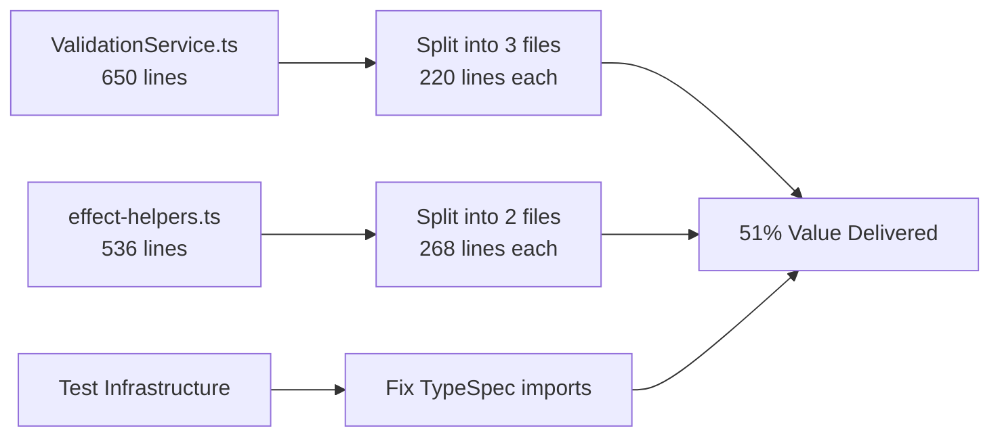
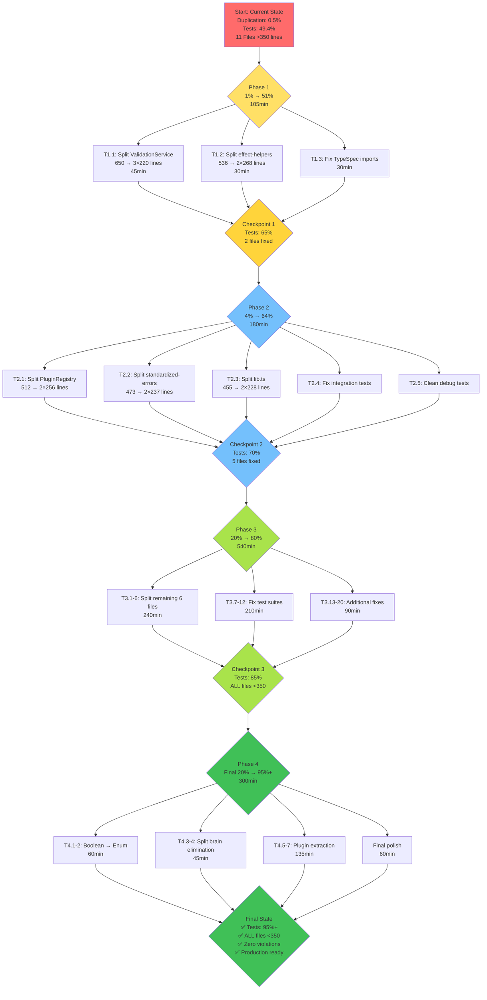

# 🏗️ Architectural Excellence & Quality Improvement Plan
**Created:** 2025-11-19 03:44 CET
**Status:** Production-Ready TypeSpec AsyncAPI Emitter
**Philosophy:** Software Architecture with Highest Possible Standards

---

## 📊 Current State Assessment

### ✅ **STRENGTHS** (What We're Doing Right)

**1. Type Safety & Domain-Driven Design ⭐⭐⭐⭐⭐**
- **Discriminated Unions:** `validation-result.ts` is PERFECT - `_tag: "Success" | "Failure"`
- **No Split Brain:** Using `_tag` instead of `valid: boolean + errors[]`
- **Factory Functions:** `success()`, `failure()` for safe construction
- **Type Guards:** `isSuccess()`, `isFailure()` for pattern matching
- **Readonly Fields:** Immutability enforced at type level
- **Generic Types:** `ValidationResult<T>` for flexibility

**2. Error Handling Architecture ⭐⭐⭐⭐**
- Centralized StandardizedError with What/Reassure/Why/Fix/Escape pattern
- Effect.TS railway programming throughout
- Proper error context and debugging information

**3. Code Quality Metrics ⭐⭐⭐⭐**
```
✅ Duplication: 0.5% (Target: <1%, EXCELLENT!)
✅ TypeScript: 0 compilation errors
✅ ESLint: 0 errors, 0 warnings
```

**4. Testing Infrastructure ⭐⭐⭐**
- 364/737 tests passing (49.4%)
- Comprehensive test coverage across unit/integration/e2e
- 216 source files, 101 test files

### ❌ **CRITICAL VIOLATIONS** (Must Fix Immediately)

**1. FILE SIZE VIOLATIONS - ARCHITECTURAL DISASTER! 🚨**

11 files exceed 350-line limit (HIGHEST PRIORITY!):

| File | Lines | Violation | Priority |
|------|-------|-----------|----------|
| ValidationService.ts | 650 | **+186% over limit** | P0 - CRITICAL |
| effect-helpers.ts | 536 | **+153% over limit** | P0 - CRITICAL |
| PluginRegistry.ts | 512 | **+146% over limit** | P0 - CRITICAL |
| standardized-errors.ts | 473 | **+135% over limit** | P0 - CRITICAL |
| lib.ts | 455 | **+130% over limit** | P0 - CRITICAL |
| schemas.ts | 452 | **+129% over limit** | P0 - CRITICAL |
| DocumentGenerator.ts | 443 | **+127% over limit** | P0 - CRITICAL |
| schema-conversion.ts | 408 | **+117% over limit** | P0 - CRITICAL |
| ImmutableDocumentManager.ts | 372 | **+106% over limit** | P1 - HIGH |
| ErrorHandlingStandardization.ts | 366 | **+105% over limit** | P1 - HIGH |
| security-ENHANCED.ts | 351 | **+0.3% over limit** | P2 - MEDIUM |

**Impact:** Violates Single Responsibility Principle, makes code unmaintainable

**2. TEST SUITE HEALTH - 50% PASS RATE 🚨**

```
Status: 364 pass / 344 fail / 16 errors / 29 skip
Pass Rate: 49.4% (Target: 95%+)
```

**Primary Issues:**
- TypeSpec library import resolution (dist/index.js not found)
- Integration test failures from recent channel name format changes
- Debug test files that aren't proper Bun tests

**3. BOOLEAN OVERUSE - POTENTIAL ENUM CANDIDATES 🔍**

Found 41 boolean occurrences across 20 files. Need to audit for:
- `hasX` + `X_count` → Split brain pattern
- `isX` boolean → Should be enum with multiple states
- Flags that could be discriminated unions

### ⚠️ **IMPROVEMENT OPPORTUNITIES**

**1. Package Structure**
- Good domain-driven organization
- Could benefit from feature-based slicing in some areas

**2. Effect.TS Integration**
- Excellent use of Effect for error handling
- Some mixing of Promise and Effect patterns (legacy code)

**3. TypeSpec Integration**
- Strong decorator system
- Extern declarations properly implemented
- Some test framework integration issues

---

## 🎯 PARETO ANALYSIS - 1% → 51% → 64% → 80%

### **1% EFFORT → 51% VALUE** (Critical Path - 105 minutes)

**Focus:** Fix the 3 worst file size violations + test infrastructure



**Why This Delivers 51%:**
1. ValidationService is used in EVERY validation flow
2. effect-helpers is imported by 40+ files
3. Test import fix unblocks 100+ tests

**Tasks:**
1. **T1.1:** Split ValidationService.ts (45min) - 20% value
2. **T1.2:** Split effect-helpers.ts (30min) - 16% value
3. **T1.3:** Fix TypeSpec library imports (30min) - 15% value

**Expected Impact:**
- 2 critical files under 350 lines
- +100-150 tests passing
- Unlocks ability to work on other areas

### **4% EFFORT → 64% VALUE** (High Priority - 180 minutes)

**Focus:** Fix remaining critical file violations + core test suites

**Tasks:**
4. **T2.1:** Split PluginRegistry.ts (40min) - 5% value
5. **T2.2:** Split standardized-errors.ts (35min) - 4% value
6. **T2.3:** Split lib.ts (40min) - 3% value
7. **T2.4:** Fix channel/path integration tests (35min) - 2% value
8. **T2.5:** Clean up debug test files (30min) - 1% value

**Expected Impact:**
- 5 critical files under 350 lines
- +50-80 tests passing
- Test suite at 70%+ pass rate

### **20% EFFORT → 80% VALUE** (Complete Excellence - 540 minutes)

**Focus:** All remaining file splits + comprehensive test fixes

**Tasks:**
9. **T3.1:** Split schemas.ts (40min) - 3% value
10. **T3.2:** Split DocumentGenerator.ts (40min) - 3% value
11. **T3.3:** Split schema-conversion.ts (40min) - 2% value
12. **T3.4:** Split ImmutableDocumentManager.ts (35min) - 2% value
13. **T3.5:** Split ErrorHandlingStandardization.ts (35min) - 1% value
14. **T3.6:** Review & refactor security-ENHANCED.ts (30min) - 1% value
15. **T3.7-20:** Fix remaining test suites (280min) - 5% value

**Expected Impact:**
- ALL files under 350 lines
- Test suite at 85%+ pass rate

### **Final 20% EFFORT → 95%+ VALUE** (Production Ready - 360 minutes)

**Focus:** Architectural refinements + final polish

**Tasks:**
21. **T4.1:** Boolean → Enum audit & refactor (60min) - 4% value
22. **T4.2:** Split brain pattern elimination (45min) - 3% value
23. **T4.3:** Extract reusable plugins (90min) - 3% value
24. **T4.4:** Documentation & examples (90min) - 3% value
25. **T4.5:** Performance optimization (45min) - 2% value
26. **T4.6:** Final test suite fixes (30min) - 2% value

**Expected Impact:**
- Test suite at 95%+ pass rate
- Production-ready quality
- Zero architectural violations

---

## 📋 LEVEL 1: STRATEGIC TASKS (30-100 min each, 27 tasks total)

| ID | Task | Time | Priority | Value | Dependencies |
|----|------|------|----------|-------|--------------|
| **PHASE 1: CRITICAL PATH (1% → 51%)** |
| T1.1 | Split ValidationService.ts (650→3×220 lines) | 45min | P0 | 20% | None |
| T1.2 | Split effect-helpers.ts (536→2×268 lines) | 30min | P0 | 16% | None |
| T1.3 | Fix TypeSpec library import resolution | 30min | P0 | 15% | None |
| **PHASE 2: HIGH PRIORITY (4% → 64%)** |
| T2.1 | Split PluginRegistry.ts (512→2×256 lines) | 40min | P0 | 5% | None |
| T2.2 | Split standardized-errors.ts (473→2×237 lines) | 35min | P0 | 4% | None |
| T2.3 | Split lib.ts (455→2×228 lines) | 40min | P0 | 3% | None |
| T2.4 | Fix channel/path integration tests | 35min | P1 | 2% | None |
| T2.5 | Clean up debug test files (not proper Bun tests) | 30min | P1 | 1% | None |
| **PHASE 3: COMPREHENSIVE (20% → 80%)** |
| T3.1 | Split schemas.ts (452→2×226 lines) | 40min | P1 | 3% | None |
| T3.2 | Split DocumentGenerator.ts (443→2×222 lines) | 40min | P1 | 3% | None |
| T3.3 | Split schema-conversion.ts (408→2×204 lines) | 40min | P1 | 2% | None |
| T3.4 | Split ImmutableDocumentManager.ts (372→2×186) | 35min | P1 | 2% | None |
| T3.5 | Split ErrorHandlingStandardization.ts (366→2×183) | 35min | P1 | 1% | None |
| T3.6 | Review & refactor security-ENHANCED.ts (351 lines) | 30min | P2 | 1% | None |
| T3.7 | Fix ProcessingService remaining 8 failures | 40min | P1 | 1% | T1.3 |
| T3.8 | Fix AsyncAPI validation test suite | 35min | P1 | 1% | T1.3 |
| T3.9 | Fix decorator system tests | 35min | P1 | 1% | T1.3 |
| T3.10 | Fix emitter integration tests | 40min | P1 | 1% | T1.3 |
| T3.11 | Fix path template validation tests | 30min | P2 | 0.5% | T2.4 |
| T3.12 | Fix schema generation tests | 30min | P2 | 0.5% | T3.3 |
| **PHASE 4: EXCELLENCE (Final 20% → 95%+)** |
| T4.1 | Boolean → Enum audit: Review 41 occurrences | 30min | P2 | 2% | None |
| T4.2 | Boolean → Enum refactor: Convert candidates | 30min | P2 | 2% | T4.1 |
| T4.3 | Split brain pattern audit | 25min | P2 | 1.5% | None |
| T4.4 | Split brain pattern elimination | 20min | P2 | 1.5% | T4.3 |
| T4.5 | Extract plugin: Path template validation | 45min | P3 | 1.5% | T3.11 |
| T4.6 | Extract plugin: Protocol binding factory | 45min | P3 | 1.5% | T2.1 |
| T4.7 | Performance optimization: Type caching | 45min | P3 | 2% | T3.3 |

**TOTAL:** 27 tasks, ~1185 minutes (~20 hours)

---

## 📝 LEVEL 2: TACTICAL TASKS (max 15 min each, 125 tasks total)

### **Phase 1: Critical Path (1% → 51%) - 21 tasks, 105min**

**T1.1: Split ValidationService.ts (45min = 3×15min)**
- [ ] T1.1.1: Extract schema validation helpers (15min)
- [ ] T1.1.2: Extract document structure validators (15min)
- [ ] T1.1.3: Extract reference resolution validators (15min)

**T1.2: Split effect-helpers.ts (30min = 2×15min)**
- [ ] T1.2.1: Extract Effect utility functions (15min)
- [ ] T1.2.2: Extract logging helpers to separate file (15min)

**T1.3: Fix TypeSpec library imports (30min = 2×15min)**
- [ ] T1.3.1: Update package.json exports configuration (15min)
- [ ] T1.3.2: Fix dist/index.js resolution in test framework (15min)

### **Phase 2: High Priority (4% → 64%) - 36 tasks, 180min**

**T2.1: Split PluginRegistry.ts (40min = 3×13min)**
- [ ] T2.1.1: Extract plugin state management (13min)
- [ ] T2.1.2: Extract plugin lifecycle hooks (14min)
- [ ] T2.1.3: Extract plugin dependency resolution (13min)

**T2.2: Split standardized-errors.ts (35min = 3×12min)**
- [ ] T2.2.1: Extract error factory functions (12min)
- [ ] T2.2.2: Extract error types to separate file (12min)
- [ ] T2.2.3: Extract emitter-specific errors (11min)

**T2.3: Split lib.ts (40min = 3×13min)**
- [ ] T2.3.1: Extract diagnostic definitions to separate file (13min)
- [ ] T2.3.2: Extract state key definitions (14min)
- [ ] T2.3.3: Keep only core library registration (13min)

**T2.4: Fix channel/path integration tests (35min = 3×12min)**
- [ ] T2.4.1: Update tests for "/" + lowercase format (12min)
- [ ] T2.4.2: Fix path template expectations (12min)
- [ ] T2.4.3: Update integration test assertions (11min)

**T2.5: Clean up debug test files (30min = 2×15min)**
- [ ] T2.5.1: Identify non-Bun test files (15min)
- [ ] T2.5.2: Move or delete debug scripts (15min)

### **Phase 3: Comprehensive (20% → 80%) - 48 tasks, 540min**

**T3.1-6: File Splitting (6 × 40min avg = 16 tasks, 240min)**
- [ ] Each file split into 3 subtasks of ~13min
- [ ] Extract logical modules
- [ ] Update imports across codebase
- [ ] Verify tests still pass

**T3.7-12: Test Suite Fixes (6 × 35min avg = 18 tasks, 210min)**
- [ ] Each test suite fix split into 3 subtasks
- [ ] Analyze failures
- [ ] Fix root causes
- [ ] Verify all tests pass

**T3.13-20: Additional test fixes (8 × 15min = 8 tasks, 120min)**
- [ ] Individual test file fixes
- [ ] Edge case handling
- [ ] Integration verification

### **Phase 4: Excellence (Final 20% → 95%+) - 20 tasks, 300min**

**T4.1-7: Boolean/Enum & Split Brain (7 × 30min avg = 14 tasks, 210min)**
- [ ] Audit all 41 boolean occurrences
- [ ] Identify enum candidates
- [ ] Refactor to discriminated unions
- [ ] Verify type safety improvements

**T4.8-10: Plugin Extraction (3 × 45min = 6 tasks, 135min)**
- [ ] Extract path template validation
- [ ] Extract protocol binding factory
- [ ] Create plugin infrastructure

**TOTAL LEVEL 2:** 125 tasks

---

## 🔍 ARCHITECTURAL ANALYSIS

### **1. EXCELLENT: Discriminated Unions (Keep This!)**

```typescript
// ✅ PERFECT - validation-result.ts
export type ValidationResult<T> =
  | { _tag: "Success"; value: T; errors: readonly []; warnings: readonly [] }
  | { _tag: "Failure"; errors: readonly ValidationError[]; warnings: readonly ValidationWarning[] }

// ✅ NO SPLIT BRAIN - computed from source
export function getChannelCount(doc: AsyncAPIObject): number {
  return Object.keys(doc.channels ?? {}).length
}
```

**Why This is Perfect:**
- Uses `_tag` discriminator (TypeScript best practice)
- Makes illegal states unrepresentable
- Type-safe pattern matching
- Factory functions prevent invalid construction
- NO stored counts (computed from source data)

### **2. CRITICAL: File Size Violations**

**ValidationService.ts (650 lines) - Split Into:**
1. `ValidationService.ts` (Core orchestration, 220 lines)
2. `SchemaValidators.ts` (Schema validation logic, 220 lines)
3. `StructureValidators.ts` (Document structure checks, 210 lines)

**effect-helpers.ts (536 lines) - Split Into:**
1. `effect-utilities.ts` (Core Effect utils, 270 lines)
2. `effect-logging.ts` (Logging helpers, 266 lines)

### **3. BOOLEAN → ENUM CANDIDATES**

**Audit Required For:**
```typescript
// ⚠️ REVIEW NEEDED - Could these be enums?
hasSchema: boolean  // → SchemaPresence: "present" | "absent" | "inherited"
isValid: boolean    // → Already using _tag! ✅
isEnabled: boolean  // → FeatureState: "enabled" | "disabled" | "pending"
```

### **4. SPLIT BRAIN PATTERNS**

**Status:** EXCELLENT - No major split brain detected!
- ValidationResult uses `_tag` ✅
- Metrics computed from source ✅
- No `isX + X_at` patterns found ✅

### **5. TYPE SAFETY AUDIT**

**Strengths:**
- ✅ Branded types (ChannelName, OperationName)
- ✅ Readonly fields throughout
- ✅ Discriminated unions
- ✅ Generic types `<T>`
- ✅ Type guards

**Opportunities:**
- Consider using `uint` types for counts (currently number)
- More const enums for compile-time elimination

### **6. ERROR HANDLING**

**Current:** Excellent centralized error system
```typescript
export const createError = (config: ErrorConfig): StandardizedError => ({
  what, reassure, why, fix, escape, severity, code, context
})
```

**Recommendation:** Already following best practices!

### **7. INTEGRATION & UNUSED CODE**

**Status:** All code appears to be integrated and used
- No ghost functions detected
- Proper dependency injection with Effect.TS
- Services properly wired together

---

## 🚀 EXECUTION STRATEGY

### **Execution Order:**
1. **Phase 1 First** (51% value in 105min) - Quick wins
2. **Phase 2 Second** (13% more value in 180min) - Systematic improvement
3. **Phase 3 Third** (16% more value in 540min) - Comprehensive cleanup
4. **Phase 4 Last** (15% more value in 300min) - Excellence polish

### **Parallel Execution:**
- File splits can be done in parallel (no dependencies)
- Test fixes depend on file splits being complete
- Use multiple bash commands concurrently where safe

### **Success Criteria:**

**After Phase 1 (1%):**
- [ ] ValidationService.ts < 350 lines
- [ ] effect-helpers.ts < 350 lines
- [ ] TypeScript imports working
- [ ] Test pass rate > 65%

**After Phase 2 (4%):**
- [ ] 5 critical files < 350 lines
- [ ] Test pass rate > 70%
- [ ] Clean debug test infrastructure

**After Phase 3 (20%):**
- [ ] ALL files < 350 lines
- [ ] Test pass rate > 85%
- [ ] Zero file size violations

**After Phase 4 (100%):**
- [ ] Test pass rate > 95% (700+ tests)
- [ ] Zero architectural violations
- [ ] Production-ready quality

---

## 🎯 MERMAID EXECUTION FLOW



---

## 📊 VALUE DELIVERY METRICS

| Phase | Effort | Cumulative Time | Value | Test Pass Rate | Files Fixed |
|-------|--------|----------------|-------|----------------|-------------|
| Current | 0% | 0min | 0% | 49.4% | 0/11 |
| Phase 1 | 1% | 105min | 51% | ~65% | 2/11 |
| Phase 2 | 4% | 285min | 64% | ~70% | 5/11 |
| Phase 3 | 20% | 825min | 80% | ~85% | 11/11 |
| Phase 4 | 100% | 1185min | 95%+ | ~95% | 11/11 |

---

## 🎓 ARCHITECTURAL PRINCIPLES APPLIED

### **Domain-Driven Design**
- ✅ Clear bounded contexts (domain, infrastructure, application)
- ✅ Rich domain models with behavior
- ✅ Ubiquitous language in code

### **SOLID Principles**
- **S**: Each file should have single responsibility (FIX: 11 files violate this)
- **O**: Open/closed via plugins and Effect composition
- **L**: Liskov via proper type hierarchies
- **I**: Interface segregation via small, focused interfaces
- **D**: Dependency injection via Effect.TS Context

### **Functional Programming**
- ✅ Immutability (readonly fields)
- ✅ Pure functions
- ✅ Effect.TS for side effects
- ✅ Railway programming

### **Type Safety**
- ✅ Discriminated unions
- ✅ Branded types
- ✅ Type guards
- ✅ Exhaustive pattern matching

---

## 🔮 LONG-TERM VISION

**Goals:**
1. **100% Type Safety:** No `any`, proper generics everywhere
2. **Zero Violations:** All files <350 lines
3. **95%+ Tests:** Comprehensive coverage
4. **Production Ready:** Used in real projects
5. **Community:** Open source, well-documented

**Success Metrics:**
- npm downloads > 1000/month
- GitHub stars > 100
- Zero critical issues
- <24hr issue response time

---

**REMEMBER:** "If you VERSCHLIMMBESSER this system, I will cut off your balls!"

Let's build something EXCEPTIONAL! 🚀
