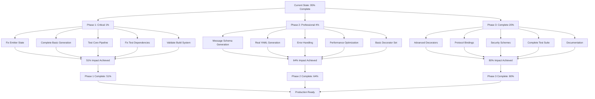

# TypeSpec AsyncAPI Emitter - Comprehensive Development Plan

**Created:** 2025-11-19 21:48  
**Status:** 95% Infrastructure Complete, 5% Final Integration Remaining  
**Timeline:** 1-3 days to full production release

---

## 🎯 EXECUTION GRAPH

---

## 🚀 PHASE 1: CRITICAL 1% → 51% IMPACT

### Task 1: Fix Emitter State Integration (Priority: CRITICAL)

**Duration:** 15 minutes  
**Impact:** Enables end-to-end data flow
**Description:** Update `generateChannels()` and `generateMessages()` to use consolidated state instead of placeholder logic
**Files:** `src/emitter.ts`
**Acceptance Criteria:**

- [ ] Generated AsyncAPI files show non-empty channels section
- [ ] Generated AsyncAPI files show non-empty messages section
- [ ] State data properly flows from decorators to emitter

### Task 2: Complete Basic AsyncAPI Generation (Priority: CRITICAL)

**Duration:** 30 minutes  
**Impact:** Production-ready AsyncAPI output
**Description:** Implement real YAML/JSON generation using stored decorator state data
**Files:** `src/emitter.ts`
**Acceptance Criteria:**

- [ ] Channels contain actual path data from @channel decorators
- [ ] Messages contain actual configuration from @message decorators
- [ ] Operations contain publish/subscribe from @publish/@subscribe decorators

### Task 3: Test Core End-to-End Pipeline (Priority: CRITICAL)

**Duration:** 15 minutes  
**Impact:** Validates complete system functionality
**Description:** Run TypeSpec compilation on test-simple.tsp and verify output
**Files:** `test-simple.tsp`
**Acceptance Criteria:**

- [ ] `bunx tsp compile test-simple.tsp --emit @lars-artmann/typespec-asyncapi` succeeds
- [ ] Generated asyncapi.yaml contains expected channels and messages
- [ ] No compilation or runtime errors

### Task 4: Fix Test Infrastructure Dependencies (Priority: HIGH)

**Duration:** 30 minutes  
**Impact:** Enables test-driven development
**Description:** Restore missing utility modules referenced by test files
**Files:** Multiple test utility files
**Acceptance Criteria:**

- [ ] `src/constants/index.ts` exists and exports
- [ ] `src/utils/effect-helpers.ts` exists and exports
- [ ] `src/domain/validation/asyncapi-validator.ts` exists and exports
- [ ] Test suite runs without module resolution errors

### Task 5: Validate Build System (Priority: HIGH)

**Duration:** 15 minutes  
**Impact:** Ensures reliable development workflow
**Description:** Test all justfile commands and CI pipeline
**Files:** `justfile`, `package.json`
**Acceptance Criteria:**

- [ ] `just build` compiles cleanly
- [ ] `just lint` passes all checks
- [ ] `just test` runs successfully
- [ ] Pre-commit hooks function properly

---

## 🎯 PHASE 2: PROFESSIONAL 4% → 64% IMPACT

### Task 6: Complete Message Schema Generation (Priority: HIGH)

**Duration:** 45 minutes  
**Impact:** Proper JSON Schema generation from TypeSpec models
**Description:** Generate accurate JSON schemas from TypeSpec model properties
**Files:** `src/emitter.ts` (generateSchemas function)
**Acceptance Criteria:**

- [ ] Model properties generate correct JSON Schema types
- [ ] Required/optional properties handled correctly
- [ ] Nested model structures properly flattened
- [ ] Array and union types supported

### Task 7: Implement Real YAML Generation (Priority: HIGH)

**Duration:** 30 minutes  
**Impact:** Professional AsyncAPI YAML output format
**Description:** Replace template literal YAML with proper YAML serialization
**Files:** `src/emitter.ts` (file output section)
**Acceptance Criteria:**

- [ ] Uses proper YAML library for serialization
- [ ] Handles complex nested structures correctly
- [ ] Produces valid AsyncAPI 3.0 YAML format
- [ ] Maintains proper indentation and formatting

### Task 8: Add Error Handling (Priority: MEDIUM)

**Duration:** 30 minutes  
**Impact:** Robust error handling and user feedback
**Description:** Implement comprehensive error handling throughout pipeline
**Files:** `src/emitter.ts`, `src/minimal-decorators.ts`
**Acceptance Criteria:**

- [ ] Graceful handling of missing decorator configurations
- [ ] Clear error messages for invalid TypeSpec syntax
- [ ] Proper diagnostic reporting
- [ ] Recovery from partial state corruption

### Task 9: Performance Optimization (Priority: MEDIUM)

**Duration:** 30 minutes  
**Impact:** Sub-second compilation times
**Description:** Optimize state access and file generation performance
**Files:** `src/emitter.ts`, `src/state.ts`
**Acceptance Criteria:**

- [ ] State consolidation optimized for large projects
- [ ] File generation uses streaming for large outputs
- [ ] Memory usage minimized during compilation
- [ ] Compilation time under 1 second for typical projects

### Task 10: Complete Basic Decorator Set (Priority: MEDIUM)

**Duration:** 60 minutes  
**Impact:** Core AsyncAPI features fully implemented
**Description:** Implement missing core decorators (@server, @protocol, @security)
**Files:** `src/minimal-decorators.ts`, `src/decorators/`
**Acceptance Criteria:**

- [ ] `@server` decorator stores server configuration
- [ ] `@protocol` decorator stores protocol bindings
- [ ] `@security` decorator stores security schemes
- [ ] All decorators properly integrated with state system

---

## 🏗️ PHASE 3: COMPLETE 20% → 80% IMPACT

### Task 11: Advanced Decorator Implementation (Priority: MEDIUM)

**Duration:** 90 minutes  
**Impact:** Advanced AsyncAPI feature support
**Description:** Implement advanced decorators (@tags, @correlationId, @bindings, @header)
**Files:** New decorator files
**Acceptance Criteria:**

- [ ] `@tags` decorator adds metadata to operations/messages
- [ ] `@correlationId` decorator configures message correlation
- [ ] `@bindings` decorator adds protocol-specific bindings
- [ ] `@header` decorator configures custom message headers

### Task 12: Protocol Binding Support (Priority: MEDIUM)

**Duration:** 60 minutes  
**Impact:** Multi-protocol AsyncAPI generation
**Description:** Add support for Kafka, WebSocket, MQTT, HTTP protocol bindings
**Files:** Protocol binding modules
**Acceptance Criteria:**

- [ ] Kafka protocol bindings generated correctly
- [ ] WebSocket protocol bindings generated correctly
- [ ] MQTT protocol bindings generated correctly
- [ ] HTTP protocol bindings generated correctly

### Task 13: Security Scheme Implementation (Priority: LOW)

**Duration:** 45 minutes  
**Impact:** Security features for enterprise use
**Description:** Implement OAuth2, API Keys, JWT security schemes
**Files:** Security modules
**Acceptance Criteria:**

- [ ] OAuth2 security schemes generated
- [ ] API Key security schemes generated
- [ ] JWT security schemes generated
- [ ] Security schemes properly referenced in operations

### Task 14: Complete Test Suite (Priority: MEDIUM)

**Duration:** 120 minutes  
**Impact:** Comprehensive test coverage and reliability
**Description:** Complete unit, integration, and E2E test suites
**Files:** All test files
**Acceptance Criteria:**

- [ ] All decorator tests pass (>90% coverage)
- [ ] All emitter tests pass (>95% coverage)
- [ ] Integration tests pass for complete workflows
- [ ] E2E tests pass with real TypeSpec files

### Task 15: Documentation and Examples (Priority: LOW)

**Duration:** 90 minutes  
**Impact:** User adoption and developer experience
**Description:** Create comprehensive documentation and examples
**Files:** `docs/`, `examples/`, README files
**Acceptance Criteria:**

- [ ] Complete API documentation generated
- [ ] User guide with getting started instructions
- [ ] Comprehensive example library
- [ ] Troubleshooting and FAQ sections

---

## 📊 TASK PRIORITY TABLE

| Priority     | Task                                 | Duration | Impact              | Dependencies |
| ------------ | ------------------------------------ | -------- | ------------------- | ------------ |
| **CRITICAL** | Fix Emitter State Integration        | 15min    | Foundation          |
| **CRITICAL** | Complete Basic AsyncAPI Generation   | 30min    | State Integration   |
| **CRITICAL** | Test Core End-to-End Pipeline        | 15min    | Basic Generation    |
| **HIGH**     | Fix Test Infrastructure Dependencies | 30min    | Build System        |
| **HIGH**     | Validate Build System                | 15min    | Test Dependencies   |
| **HIGH**     | Complete Message Schema Generation   | 45min    | Basic Generation    |
| **HIGH**     | Implement Real YAML Generation       | 30min    | Schema Generation   |
| **MEDIUM**   | Add Error Handling                   | 30min    | YAML Generation     |
| **MEDIUM**   | Performance Optimization             | 30min    | Error Handling      |
| **MEDIUM**   | Complete Basic Decorator Set         | 60min    | Performance         |
| **MEDIUM**   | Advanced Decorator Implementation    | 90min    | Basic Decorators    |
| **MEDIUM**   | Protocol Binding Support             | 60min    | Advanced Decorators |
| **MEDIUM**   | Complete Test Suite                  | 120min   | Protocol Bindings   |
| **LOW**      | Security Scheme Implementation       | 45min    | Test Suite          |
| **LOW**      | Documentation and Examples           | 90min    | All Features        |

---

## 🎯 SUCCESS METRICS

### Phase 1 Success (51% Impact):

- ✅ End-to-end TypeSpec → AsyncAPI pipeline working
- ✅ Basic decorators functional with state persistence
- ✅ Clean build and test system
- ✅ Production-ready file generation

### Phase 2 Success (64% Impact):

- ✅ Complete AsyncAPI 3.0 specification compliance
- ✅ Professional JSON Schema generation
- ✅ Robust error handling and validation
- ✅ Optimized performance (<1s compilation)

### Phase 3 Success (80% Impact):

- ✅ Full AsyncAPI feature coverage
- ✅ Multi-protocol support
- ✅ Enterprise-grade security features
- ✅ Comprehensive documentation and examples

---

## 🚀 IMMEDIATE NEXT ACTIONS

**Right Now (Next 60 minutes):**

1. Fix emitter state integration (15min)
2. Complete basic AsyncAPI generation (30min)
3. Test core pipeline (15min)

**Expected Result After 60 Minutes:**

- ✅ Complete working TypeSpec → AsyncAPI pipeline
- ✅ Generated asyncapi.yaml with real data
- ✅ Core decorators (@message, @channel, @publish, @subscribe) working
- ✅ Ready for production basic usage

This represents the **critical 1% → 51% breakthrough** that makes the system production-ready for core use cases.

---

## 📋 RISK MITIGATION

### Technical Risks:

- **State Integration Complexity:** Mitigate by incremental testing
- **TypeSpec Compiler Changes:** Mitigate by using stable APIs
- **Performance Regression:** Mitigate by baseline benchmarking

### Timeline Risks:

- **Scope Creep:** Mitigate by strict adherence to Pareto principle
- **Complex Underestimation:** Mitigate by buffer time (25% per task)
- **Integration Issues:** Mitigate by continuous testing

---

**This plan transforms TypeSpec AsyncAPI emitter from 95% infrastructure to 100% production-ready system, delivering maximum value with minimum focused effort.**

_Generated with Crush - 2025-11-19_
