# 🏗️ COMPREHENSIVE ARCHITECTURAL RECOVERY PLAN

**Generated:** 2025-11-20_05_05  
**Status:** 🚨 CRITICAL INFRASTRUCTURE FAILURE  
**Grade:** F- (System Requires Complete Rebuild)

---

## 🎯 EXECUTIVE SUMMARY

### **Current Crisis Assessment**
- **Build System:** ✅ Working (0 TS errors)
- **Test Infrastructure:** 🚨 77/222 tests failing (35% failure rate)
- **Type Safety:** 🚨 Fundamental violations with representable invalid states
- **File Architecture:** 🚨 Multiple >300 line monoliths
- **Import Resolution:** 🚨 Tests can't find compiled modules
- **TypeSpec Integration:** 🚨 Library registration failing

### **Recovery Timeline**
- **Phase 1 (24h):** Critical infrastructure (1% → 51% impact)
- **Phase 2 (72h):** Core architecture (4% → 64% impact)  
- **Phase 3 (2 weeks):** Production rebuild (20% → 80% impact)

---

## 📊 PHASE 1: CRITICAL INFRASTRUCTURE (1% → 51% IMPACT)

### **30-MINUTE TASKS (MAX 27)**

| Priority | Task | Impact | Effort | Dependencies |
|----------|------|--------|--------|---------------|
| 1 | 🔍 Diagnose Import Resolution Mystery | 51% | 30min | None |
| 2 | 🔧 Fix TypeScript Module Resolution | 51% | 30min | Task 1 |
| 3 | 🧪 Validate Test Infrastructure Fix | 51% | 30min | Task 2 |
| 4 | 🚨 Fix TypeSpec Library Registration | 25% | 30min | Task 3 |
| 5 | 📝 Document Import Resolution Solution | 15% | 30min | Task 4 |
| 6 | 🔍 Analyze Test Failure Patterns | 20% | 30min | Task 5 |
| 7 | 🏗️ Create Missing Test Modules | 25% | 30min | Task 6 |
| 8 | ✅ Validate Core Test Suite | 30% | 30min | Task 7 |
| 9 | 📊 Import Resolution Performance Testing | 10% | 30min | Task 8 |
| 10 | 🔧 Fix Critical Path Dependencies | 20% | 30min | Task 9 |

---

## 📋 PHASE 2: CORE ARCHITECTURE (4% → 64% IMPACT)

### **30-MINUTE TASKS (CONTINUED)**

| Priority | Task | Impact | Effort | Dependencies |
|----------|------|--------|--------|---------------|
| 11 | 🔄 Replace Effect.TS Anti-Patterns | 30% | 30min | Task 10 |
| 12 | 🏛️ Implement Strong Type Foundation | 25% | 30min | Task 11 |
| 13 | 🧠 Create Centralized Error Architecture | 20% | 30min | Task 12 |
| 14 | 📦 Design Domain-Driven Structure | 25% | 30min | Task 13 |
| 15 | 🔧 Refactor lib.ts Monolith (507→300 lines) | 20% | 30min | Task 14 |
| 16 | 🔧 Refactor emitter.ts Monolith (354→300 lines) | 20% | 30min | Task 15 |
| 17 | 🧪 Validate Architecture Improvements | 25% | 30min | Task 16 |
| 18 | 📊 Architecture Performance Testing | 15% | 30min | Task 17 |
| 19 | 🎯 Generic Programming Foundation | 20% | 30min | Task 18 |
| 20 | ✅ End-to-End Architecture Validation | 30% | 30min | Task 19 |

---

## 🏗️ PHASE 3: PRODUCTION REBUILD (20% → 80% IMPACT)

### **30-MINUTE TASKS (COMPLETION)**

| Priority | Task | Impact | Effort | Dependencies |
|----------|------|--------|--------|---------------|
| 21 | 🎨 Value Object Implementation | 15% | 30min | Task 20 |
| 22 | 🔄 Boolean→Enum Migration | 15% | 30min | Task 21 |
| 23 | 🔢 Unsigned Integer Implementation | 10% | 30min | Task 22 |
| 24 | 🧪 Property-Based Testing Foundation | 15% | 30min | Task 23 |
| 25 | 📚 Comprehensive Documentation | 10% | 30min | Task 24 |
| 26 | 🚀 Performance Optimization | 15% | 30min | Task 25 |
| 27 | ✅ Production Readiness Validation | 20% | 30min | Task 26 |

---

## 🔍 DETAILED 15-MINUTE TASK BREAKDOWN (MAX 125)

### **PHASE 1: CRITICAL INFRASTRUCTURE (TASKS 1.1-1.20)**

#### **Task 1: 🔍 Diagnose Import Resolution Mystery**
| Subtask | Description | Effort |
|---------|-------------|--------|
| 1.1 | Analyze TypeScript module resolution config | 15min |
| 1.2 | Test import patterns in development vs production | 15min |
| 1.3 | Document current import resolution behavior | 15min |
| 1.4 | Identify root cause of .js import failures | 15min |

#### **Task 2: 🔧 Fix TypeScript Module Resolution**
| Subtask | Description | Effort |
|---------|-------------|--------|
| 2.1 | Update tsconfig.json module resolution settings | 15min |
| 2.2 | Configure proper source/dist mapping | 15min |
| 2.3 | Test module resolution fix with simple imports | 15min |
| 2.4 | Validate complex import scenarios | 15min |

#### **Task 3: 🧪 Validate Test Infrastructure Fix**
| Subtask | Description | Effort |
|---------|-------------|--------|
| 3.1 | Run key test files to verify import fix | 15min |
| 3.2 | Check test helper module resolution | 15min |
| 3.3 | Validate test configuration files | 15min |
| 3.4 | Run documentation test suite (should pass) | 15min |

#### **Task 4: 🚨 Fix TypeSpec Library Registration**
| Subtask | Description | Effort |
|---------|-------------|--------|
| 4.1 | Analyze TypeSpec compiler library discovery | 15min |
| 4.2 | Fix package.json library registration | 15min |
| 4.3 | Update TypeSpec library export structure | 15min |
| 4.4 | Test TypeSpec compilation with library | 15min |

#### **Task 5: 📝 Document Import Resolution Solution**
| Subtask | Description | Effort |
|---------|-------------|--------|
| 5.1 | Document solution in CLAUDE.md | 15min |
| 5.2 | Update README with import patterns | 15min |
| 5.3 | Create import resolution troubleshooting guide | 15min |
| 5.4 | Update development workflow documentation | 15min |

#### **Task 6: 🔍 Analyze Test Failure Patterns**
| Subtask | Description | Effort |
|---------|-------------|--------|
| 6.1 | Categorize test failures by error type | 15min |
| 6.2 | Map missing modules to required implementations | 15min |
| 6.3 | Prioritize critical missing test infrastructure | 15min |
| 6.4 | Create test failure resolution plan | 15min |

#### **Task 7: 🏗️ Create Missing Test Modules**
| Subtask | Description | Effort |
|---------|-------------|--------|
| 7.1 | Create test utilities and helpers | 15min |
| 7.2 | Implement missing validation modules | 15min |
| 7.3 | Create mock test fixtures | 15min |
| 7.4 | Validate test module imports | 15min |

#### **Task 8: ✅ Validate Core Test Suite**
| Subtask | Description | Effort |
|---------|-------------|--------|
| 8.1 | Run documentation test suite validation | 15min |
| 8.2 | Test core decorator functionality | 15min |
| 8.3 | Validate basic emitter functionality | 15min |
| 8.4 | Check test coverage of core features | 15min |

#### **Task 9: 📊 Import Resolution Performance Testing**
| Subtask | Description | Effort |
|---------|-------------|--------|
| 9.1 | Measure compilation time improvements | 15min |
| 9.2 | Test import resolution with large codebases | 15min |
| 9.3 | Validate development workflow performance | 15min |
| 9.4 | Document performance improvements | 15min |

#### **Task 10: 🔧 Fix Critical Path Dependencies**
| Subtask | Description | Effort |
|---------|-------------|--------|
| 10.1 | Resolve circular dependency issues | 15min |
| 10.2 | Fix module import order problems | 15min |
| 10.3 | Validate dependency chain integrity | 15min |
| 10.4 | Test all import resolution scenarios | 15min |

### **PHASE 2: CORE ARCHITECTURE (TASKS 11.1-11.20)**

#### **Task 11: 🔄 Replace Effect.TS Anti-Patterns**
| Subtask | Description | Effort |
|---------|-------------|--------|
| 11.1 | Remove EffectResult<T> type (creates invalid states) | 15min |
| 11.2 | Replace with proper Effect<T, Error> patterns | 15min |
| 11.3 | Update executeEffect to use Effect.tryPromise | 15min |
| 11.4 | Validate Effect.TS pattern compliance | 15min |

#### **Task 12: 🏛️ Implement Strong Type Foundation**
| Subtask | Description | Effort |
|---------|-------------|--------|
| 12.1 | Eliminate Record<string, unknown> usage | 15min |
| 12.2 | Replace with discriminated unions | 15min |
| 12.3 | Add exhaustive type checking | 15min |
| 12.4 | Implement branded types for critical values | 15min |

#### **Task 13: 🧠 Create Centralized Error Architecture**
| Subtask | Description | Effort |
|---------|-------------|--------|
| 13.1 | Design domain-specific error hierarchy | 15min |
| 13.2 | Create error factories and utilities | 15min |
| 13.3 | Implement error recovery strategies | 15min |
| 13.4 | Add comprehensive error logging | 15min |

#### **Task 14: 📦 Design Domain-Driven Structure**
| Subtask | Description | Effort |
|---------|-------------|--------|
| 14.1 | Define domain entities and value objects | 15min |
| 14.2 | Create domain service interfaces | 15min |
| 14.3 | Design repository patterns | 15min |
| 14.4 | Plan domain event structure | 15min |

#### **Task 15: 🔧 Refactor lib.ts Monolith (507→300 lines)**
| Subtask | Description | Effort |
|---------|-------------|--------|
| 15.1 | Extract TypeSpec library definitions | 15min |
| 15.2 | Separate diagnostic messages | 15min |
| 15.3 | Extract state management schema | 15min |
| 15.4 | Create focused library modules | 15min |

#### **Task 16: 🔧 Refactor emitter.ts Monolith (354→300 lines)**
| Subtask | Description | Effort |
|---------|-------------|--------|
| 16.1 | Extract core emitter logic | 15min |
| 16.2 | Separate file generation logic | 15min |
| 16.3 | Extract configuration handling | 15min |
| 16.4 | Create emitter service modules | 15min |

#### **Task 17: 🧪 Validate Architecture Improvements**
| Subtask | Description | Effort |
|---------|-------------|--------|
| 17.1 | Test refactored module functionality | 15min |
| 17.2 | Validate type safety improvements | 15min |
| 17.3 | Check performance of refactored code | 15min |
| 17.4 | Run full test suite validation | 15min |

#### **Task 18: 📊 Architecture Performance Testing**
| Subtask | Description | Effort |
|---------|-------------|--------|
| 18.1 | Measure compilation time improvements | 15min |
| 18.2 | Test runtime performance impact | 15min |
| 18.3 | Validate memory usage optimization | 15min |
| 18.4 | Document performance benchmarks | 15min |

#### **Task 19: 🎯 Generic Programming Foundation**
| Subtask | Description | Effort |
|---------|-------------|--------|
| 19.1 | Identify generic programming opportunities | 15min |
| 19.2 | Implement generic utility types | 15min |
| 19.3 | Create generic service interfaces | 15min |
| 19.4 | Validate generic type safety | 15min |

#### **Task 20: ✅ End-to-End Architecture Validation**
| Subtask | Description | Effort |
|---------|-------------|--------|
| 20.1 | Test complete AsyncAPI generation pipeline | 15min |
| 20.2 | Validate all decorator functionality | 15min |
| 20.3 | Test error handling end-to-end | 15min |
| 20.4 | Verify type safety throughout system | 15min |

### **PHASE 3: PRODUCTION REBUILD (TASKS 21.1-21.20)**

#### **Task 21: 🎨 Value Object Implementation**
| Subtask | Description | Effort |
|---------|-------------|--------|
| 21.1 | Identify value object opportunities | 15min |
| 21.2 | Implement immutable value objects | 15min |
| 21.3 | Add validation to value objects | 15min |
| 21.4 | Test value object behavior | 15min |

#### **Task 22: 🔄 Boolean→Enum Migration**
| Subtask | Description | Effort |
|---------|-------------|--------|
| 22.1 | Identify boolean flag abuse | 15min |
| 22.2 | Create proper enum types | 15min |
| 22.3 | Replace boolean flags with enums | 15min |
| 22.4 | Validate enum type safety | 15min |

#### **Task 23: 🔢 Unsigned Integer Implementation**
| Subtask | Description | Effort |
|---------|-------------|--------|
| 23.1 | Identify numeric type safety needs | 15min |
| 23.2 | Implement unsigned integer types | 15min |
| 23.3 | Add numeric validation | 15min |
| 23.4 | Test numeric type safety | 15min |

#### **Task 24: 🧪 Property-Based Testing Foundation**
| Subtask | Description | Effort |
|---------|-------------|--------|
| 24.1 | Install fast-check testing library | 15min |
| 24.2 | Create property test utilities | 15min |
| 24.3 | Implement property tests for core logic | 15min |
| 24.4 | Validate property test coverage | 15min |

#### **Task 25: 📚 Comprehensive Documentation**
| Subtask | Description | Effort |
|---------|-------------|--------|
| 25.1 | Document all architectural decisions | 15min |
| 25.2 | Create API documentation from types | 15min |
| 25.3 | Update examples and tutorials | 15min |
| 25.4 | Create troubleshooting guides | 15min |

#### **Task 26: 🚀 Performance Optimization**
| Subtask | Description | Effort |
|---------|-------------|--------|
| 26.1 | Optimize compilation performance | 15min |
| 26.2 | Improve runtime performance | 15min |
| 26.3 | Optimize memory usage | 15min |
| 26.4 | Benchmark all optimizations | 15min |

#### **Task 27: ✅ Production Readiness Validation**
| Subtask | Description | Effort |
|---------|-------------|--------|
| 27.1 | Run complete test suite validation | 15min |
| 27.2 | Validate production build process | 15min |
| 27.3 | Test all user workflows | 15min |
| 27.4 | Final production readiness assessment | 15min |

---

## 🎯 EXECUTION GRAPH

```mermaid
graph TD
    A[Phase 1: Critical Infrastructure] --> B[Phase 2: Core Architecture]
    B --> C[Phase 3: Production Rebuild]
    
    A --> A1[Import Resolution Fix]
    A --> A2[TypeSpec Library Registration]
    A --> A3[Test Infrastructure Recovery]
    
    A1 --> A1a[Diagnose Import Mystery]
    A1 --> A1b[Fix Module Resolution]
    A1 --> A1c[Validate Test Infrastructure]
    
    A2 --> A2a[Library Discovery Analysis]
    A2 --> A2b[Package.json Configuration]
    A2 --> A2b[TypeSpec Integration Test]
    
    A3 --> A3a[Test Failure Analysis]
    A3 --> A3b[Missing Module Creation]
    A3 --> A3c[Core Test Validation]
    
    B --> B1[Effect.TS Pattern Fix]
    B --> B2[Strong Type Foundation]
    B --> B3[Domain Architecture]
    
    B1 --> B1a[Remove Anti-Patterns]
    B1 --> B1b[Proper Railway Programming]
    B1 --> B1c[Effect.TS Validation]
    
    B2 --> B2a[Eliminate Record<string, unknown>]
    B2 --> B2b[Discriminated Unions]
    B2 --> B2c[Exhaustive Type Checking]
    
    B3 --> B3a[Entity Design]
    B3 --> B3b[Service Architecture]
    B3 --> B3c[Event-Driven Patterns]
    
    C --> C1[File Architecture Cleanup]
    C --> C2[Advanced Type System]
    C --> C3[Production Optimization]
    
    C1 --> C1a[lib.ts Refactor]
    C1 --> C1b[emitter.ts Refactor]
    C1 --> C1c[Module Size Validation]
    
    C2 --> C2a[Value Objects]
    C2 --> C2b[Boolean→Enum Migration]
    C2 --> C2c[Generic Programming]
    
    C3 --> C3a[Performance Optimization]
    C3 --> C3b[Property Testing]
    C3 --> C3c[Documentation]
    
    style A fill:#ff6b6b
    style B fill:#feca57
    style C fill:#48dbfb
    
    classDef critical fill:#ff6b6b,color:#fff
    classDef important fill:#feca57,color:#000
    classDef complete fill:#48dbfb,color:#fff
    
    class A1,A1a,A1b,A1c critical
    class B1,B2,B3 important
    class C1,C2,C3 complete
```

---

## 📊 SUCCESS METRICS

### **Phase 1 Success Criteria**
- [ ] 0 TypeScript compilation errors
- [ ] Import resolution working for development
- [ ] TypeSpec library registration successful
- [ ] Test infrastructure imports working
- [ ] Core test suite (>80%) passing

### **Phase 2 Success Criteria**
- [ ] No Effect.TS anti-patterns
- [ ] Strong type system (no Record<string, unknown>)
- [ ] All files <300 lines
- [ ] Domain-driven structure implemented
- [ ] Error architecture centralized

### **Phase 3 Success Criteria**
- [ ] Production-ready codebase
- [ ] Comprehensive test coverage (>90%)
- [ ] Performance benchmarks met
- [ ] Documentation complete
- [ ] Zero architectural violations

---

## 🚨 RISK MITIGATION

### **High-Risk Areas**
1. **Import Resolution**: May require TypeScript configuration overhaul
2. **TypeSpec Integration**: Unknown external dependencies
3. **Test Infrastructure**: May need complete rebuild
4. **File Refactoring**: Risk of breaking functionality

### **Mitigation Strategies**
1. **Incremental Validation**: Test after each 15min subtask
2. **Rollback Planning**: Keep working versions at each phase
3. **External Research**: Leverage TypeSpec documentation and community
4. **Parallel Development**: Work on independent tasks simultaneously

---

## 🎯 IMMEDIATE NEXT STEPS

### **RIGHT NOW (NEXT 60 MINUTES)**
1. **Execute Task 1.1**: Analyze TypeScript module resolution config
2. **Execute Task 1.2**: Test import patterns in development vs production  
3. **Execute Task 2.1**: Update tsconfig.json module resolution settings
4. **Execute Task 2.2**: Configure proper source/dist mapping

### **TODAY (NEXT 8 HOURS)**
1. **Complete Phase 1**: All critical infrastructure tasks
2. **Validate Core Functionality**: Ensure basic tests pass
3. **Begin Phase 2**: Start architectural improvements
4. **Document Progress**: Update all documentation

### **THIS WEEK (NEXT 5 DAYS)**
1. **Complete Phase 2**: Core architecture rebuild
2. **Begin Phase 3**: Production optimization
3. **Full Test Coverage**: Achieve >90% test pass rate
4. **Production Readiness**: Complete all criteria

---

## 📋 QUALITY GATES

### **Exit Criteria for Each Phase**
- **Phase 1**: Core functionality working, basic tests passing
- **Phase 2**: Strong typing implemented, architecture clean
- **Phase 3**: Production ready, all tests passing

### **Definition of Done**
- ✅ Zero TypeScript compilation errors
- ✅ Zero ESLint violations
- ✅ >90% tests passing
- ✅ All files <300 lines
- ✅ Strong type system implemented
- ✅ Documentation complete
- ✅ Performance benchmarks met

---

*Generated with Crush - Comprehensive Architectural Planning*
*Status: Ready for Execution - CRITICAL PRIORITY*