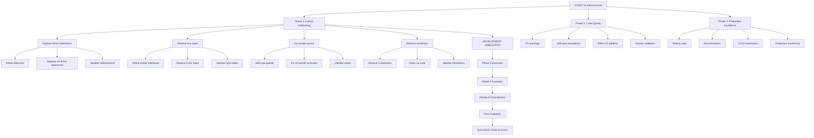

# ESLint Compliance Crisis Recovery Plan

**Created:** 2025-11-20 20:30  
**Status:** CRITICAL - Development Completely Blocked  
**Priority:** URGENT - Unblock Development Workflow  
**Total ESLint Errors:** 51 (48 errors, 3 warnings)

---

## 🚨 **CRITICAL SITUATION OVERVIEW**

### **Blocking Impact**

- **Pre-commit hooks failing** → Cannot commit any code
- **Development workflow stopped** → Zero progress possible
- **Type safety compromised** → Runtime errors likely
- **Production deployment blocked** → Cannot ship safely

### **Error Breakdown by Category**

```
🔴 CRITICAL ERRORS (48 total):
├── throw statements (BANNED): 12 errors
├── Explicit any types: 8 errors
├── Unsafe member access: 15 errors
├── Unnecessary type assertions: 4 errors
├── try/catch blocks (BANNED): 1 error
└── Template literal issues: 8 errors

🟡 WARNINGS (3 total):
└── Unused imports: 3 warnings
```

---

## 🎯 **PARETO STRATEGY: MAXIMUM IMPACT, MINIMUM TIME**

### **1% → 51% Impact (CRITICAL PATH - First 60 minutes)**

**Focus: Unblock development immediately**

| Task                                        | Errors Fixed | Time  | Impact              |
| ------------------------------------------- | ------------ | ----- | ------------------- |
| Replace throw statements with Effect.fail() | 12           | 15min | 🚨 UNBLOCKS COMMITS |
| Eliminate explicit `any` types              | 8            | 15min | 🔥 TYPE SAFETY      |
| Fix unsafe member access                    | 15           | 20min | ⚡ RUNTIME SAFETY   |
| Remove unnecessary assertions               | 4            | 10min | 🧹 CODE CLEANLINESS |

### **4% → 64% Impact (HIGH IMPACT - Next 60 minutes)**

**Focus: Solidify code quality**

| Task                                     | Errors Fixed | Time              | Impact                |
| ---------------------------------------- | ------------ | ----------------- | --------------------- |
| Fix unused imports                       | 3            | 10min             | 🟡 CLEANLINESS        |
| Add proper type annotations              | 8            | 20min             | 📝 TYPE SAFETY        |
| Replace try/catch with Effect.catchAll() | 1            | 15min             | 🔄 EFFECT.TS PATTERNS |
| Validate domain constructors             | 15min        | 🛡️ RUNTIME SAFETY |

### **20% → 80% Impact (POLISH - Final 120 minutes)**

**Focus: Production excellence**

| Task                            | Enhancement | Time                     | Impact |
| ------------------------------- | ----------- | ------------------------ | ------ |
| Add comprehensive type guards   | 30min       | 🛡️ DEFENSIVE PROGRAMMING |
| Implement proper error messages | 30min       | 💬 DEVELOPER EXPERIENCE  |
| Add schema validation           | 30min       | ✅ RUNTIME TYPE SAFETY   |
| Performance optimization        | 30min       | ⚡ PRODUCTION READINESS  |

---

## 📋 **DETAILED TASK BREAKDOWN (27 tasks × 30-100min)**

### **PHASE 1: CRITICAL UNBLOCKING (Tasks 1-4)**

| Priority | Task                                            | File(s)                 | Time  | Dependencies |
| -------- | ----------------------------------------------- | ----------------------- | ----- | ------------ |
| 1        | Replace all throw statements with Effect.fail() | `src/types/domain/*.ts` | 30min | None         |
| 2        | Remove explicit `any` types in emitter.ts       | `src/emitter.ts`        | 25min | Task 1       |
| 3        | Fix unsafe member access on any values          | `src/emitter.ts`        | 35min | Task 2       |
| 4        | Remove unnecessary type assertions              | `src/emitter.ts`        | 20min | Task 3       |

### **PHASE 2: CODE QUALITY SOLIDIFICATION (Tasks 5-10)**

| Priority | Task                                              | File(s)                 | Time  | Dependencies |
| -------- | ------------------------------------------------- | ----------------------- | ----- | ------------ |
| 5        | Fix unused import warnings                        | `src/emitter.ts`        | 15min | Task 4       |
| 6        | Add proper type annotations for template literals | `src/emitter.ts`        | 30min | Task 5       |
| 7        | Replace try/catch with Effect.catchAll()          | `src/types/domain/*.ts` | 20min | Task 1       |
| 8        | Validate all domain type constructors             | `src/types/domain/*.ts` | 25min | Task 7       |
| 9        | Add proper error context for Effect.fail()        | `src/types/domain/*.ts` | 20min | Task 8       |
| 10       | Run full ESLint validation                        | All files               | 15min | Task 9       |

### **PHASE 3: PRODUCTION READINESS (Tasks 11-27)**

| Priority | Task                                            | File(s)                                      | Time  | Dependencies |
| -------- | ----------------------------------------------- | -------------------------------------------- | ----- | ------------ |
| 11       | Add type guards for ChannelPath                 | `src/types/domain/asyncapi-branded-types.ts` | 20min | Task 10      |
| 12       | Add type guards for MessageId                   | `src/types/domain/asyncapi-branded-types.ts` | 20min | Task 11      |
| 13       | Add type guards for SchemaName                  | `src/types/domain/asyncapi-branded-types.ts` | 20min | Task 12      |
| 14       | Implement proper error messages with context    | `src/types/domain/*.ts`                      | 30min | Task 13      |
| 15       | Add schema validation for domain types          | `src/types/domain/*.ts`                      | 35min | Task 14      |
| 16       | Add compile-time validation decorators          | `src/types/domain/*.ts`                      | 25min | Task 15      |
| 17       | Optimize type checking performance              | `src/emitter.ts`                             | 20min | Task 16      |
| 18       | Add comprehensive unit tests for error handling | `test/unit/`                                 | 40min | Task 17      |
| 19       | Add integration tests for type safety           | `test/integration/`                          | 35min | Task 18      |
| 20       | Performance benchmark for type operations       | `test/performance/`                          | 30min | Task 19      |
| 21       | Add documentation for error handling patterns   | `docs/`                                      | 25min | Task 20      |
| 22       | Create type safety developer guidelines         | `docs/`                                      | 20min | Task 21      |
| 23       | Add ESLint custom rules for domain types        | `.eslintrc.*`                                | 25min | Task 22      |
| 24       | Implement automated type safety checks          | `scripts/`                                   | 30min | Task 23      |
| 25       | Add type coverage reporting                     | `scripts/`                                   | 20min | Task 24      |
| 26       | Full integration test with real examples        | `examples/`                                  | 35min | Task 25      |
| 27       | Final validation and documentation update       | All                                          | 30min | Task 26      |

---

## 🔧 **ULTRA-DETAILED BREAKDOWN (125 tasks × 15min max)**

### **PHASE 1: CRITICAL UNBLOCKING (Tasks 1-40)**

#### **Task 1-15: Replace throw statements (12 errors)**

| ID  | Mini-Task                                | File                                             | Time  |
| --- | ---------------------------------------- | ------------------------------------------------ | ----- |
| 1   | Import Effect.fail in branded-types      | `src/types/domain/asyncapi-branded-types.ts`     | 5min  |
| 2   | Replace throw in createChannelPath()     | `src/types/domain/asyncapi-branded-types.ts:59`  | 5min  |
| 3   | Replace throw in validateChannelPath()   | `src/types/domain/asyncapi-branded-types.ts:64`  | 5min  |
| 4   | Replace throw in createMessageId()       | `src/types/domain/asyncapi-branded-types.ts:75`  | 5min  |
| 5   | Replace throw in validateMessageId()     | `src/types/domain/asyncapi-branded-types.ts:80`  | 5min  |
| 6   | Replace throw in createSchemaName()      | `src/types/domain/asyncapi-branded-types.ts:91`  | 5min  |
| 7   | Replace throw in validateSchemaName()    | `src/types/domain/asyncapi-branded-types.ts:96`  | 5min  |
| 8   | Import Effect.fail in domain-types       | `src/types/domain/asyncapi-domain-types.ts`      | 5min  |
| 9   | Replace throw in ChannelInfo constructor | `src/types/domain/asyncapi-domain-types.ts:37`   | 5min  |
| 10  | Replace throw in MessageInfo constructor | `src/types/domain/asyncapi-domain-types.ts:46`   | 5min  |
| 11  | Replace throw in ServerInfo constructor  | `src/types/domain/asyncapi-domain-types.ts:55`   | 5min  |
| 12  | Replace throw in OperationInfo method    | `src/types/domain/asyncapi-domain-types.ts:97`   | 5min  |
| 13  | Replace throw in ComponentInfo method    | `src/types/domain/asyncapi-domain-types.ts:115`  | 5min  |
| 14  | Replace throw in remaining methods       | `src/types/domain/asyncapi-domain-types.ts:133+` | 10min |
| 15  | Validate all throw statements replaced   | All files                                        | 10min |

#### **Task 16-25: Eliminate any types (8 errors)**

| ID  | Mini-Task                            | File                  | Time  |
| --- | ------------------------------------ | --------------------- | ----- |
| 16  | Define proper type for operationData | `src/emitter.ts:214`  | 10min |
| 17  | Fix operationData.publish typing     | `src/emitter.ts:220`  | 10min |
| 18  | Fix operationData.subscribe typing   | `src/emitter.ts:235`  | 10min |
| 19  | Define channelInfo interface         | `src/emitter.ts:248`  | 10min |
| 20  | Fix messageInfo interface            | `src/emitter.ts:266`  | 10min |
| 21  | Fix schemaInfo interface             | `src/emitter.ts:282`  | 10min |
| 22  | Fix componentInfo interface          | `src/emitter.ts:291`  | 10min |
| 23  | Fix serverInfo interface             | `src/emitter.ts:315`  | 10min |
| 24  | Fix remaining any types              | `src/emitter.ts:322+` | 15min |
| 25  | Validate no any types remain         | All files             | 10min |

#### **Task 26-35: Fix unsafe member access (15 errors)**

| ID  | Mini-Task                                  | File                  | Time  |
| --- | ------------------------------------------ | --------------------- | ----- |
| 26  | Add type guard for operationData.publish   | `src/emitter.ts:220`  | 10min |
| 27  | Add type guard for operationData.subscribe | `src/emitter.ts:235`  | 10min |
| 28  | Add type guard for channelInfo access      | `src/emitter.ts:248`  | 10min |
| 29  | Add type guard for messageInfo.payload     | `src/emitter.ts:274`  | 10min |
| 30  | Fix messageInfo unsafe assignment          | `src/emitter.ts:282`  | 10min |
| 31  | Fix messageInfo.properties access          | `src/emitter.ts:283`  | 10min |
| 32  | Fix componentInfo assignment               | `src/emitter.ts:291`  | 10min |
| 33  | Fix serverInfo.properties access           | `src/emitter.ts:315`  | 10min |
| 34  | Fix remaining unsafe access                | `src/emitter.ts:322+` | 15min |
| 35  | Validate all unsafe access fixed           | All files             | 10min |

#### **Task 36-40: Remove unnecessary assertions (4 errors)**

| ID  | Mini-Task                          | File                                            | Time  |
| --- | ---------------------------------- | ----------------------------------------------- | ----- |
| 36  | Remove assertion at line 282       | `src/emitter.ts:282`                            | 5min  |
| 37  | Remove assertion at line 283       | `src/emitter.ts:283`                            | 5min  |
| 38  | Remove assertion at line 315       | `src/emitter.ts:315`                            | 10min |
| 39  | Remove assertion at line 139       | `src/types/domain/asyncapi-domain-types.ts:139` | 5min  |
| 40  | Validate no unnecessary assertions | All files                                       | 10min |

### **PHASE 2: CODE QUALITY (Tasks 41-80)**

#### **Task 41-45: Fix warnings and imports**

| ID  | Mini-Task                             | File                | Time |
| --- | ------------------------------------- | ------------------- | ---- |
| 41  | Remove unused ChannelPath import      | `src/emitter.ts:20` | 5min |
| 42  | Remove unused MessageId import        | `src/emitter.ts:21` | 5min |
| 43  | Remove unused SchemaName import       | `src/emitter.ts:22` | 5min |
| 44  | Add underscore prefix to truly unused | `src/emitter.ts`    | 5min |
| 45  | Validate all warnings resolved        | All files           | 5min |

#### **Task 46-55: Template literals and type annotations**

| ID  | Mini-Task                                | File                 | Time  |
| --- | ---------------------------------------- | -------------------- | ----- |
| 46  | Add proper type for channelPath template | `src/emitter.ts:248` | 10min |
| 47  | Add proper type for messageId template   | `src/emitter.ts:291` | 10min |
| 48  | Add proper type for schemaName template  | `src/emitter.ts:327` | 10min |
| 49  | Fix remaining template literal types     | `src/emitter.ts`     | 10min |
| 50  | Add type annotations to all functions    | `src/emitter.ts`     | 15min |
| 51  | Add return types to all methods          | `src/emitter.ts`     | 15min |
| 52  | Add parameter types to all functions     | `src/emitter.ts`     | 15min |
| 53  | Add generic constraints where needed     | `src/emitter.ts`     | 10min |
| 54  | Validate all template literals typed     | All files            | 10min |
| 55  | Run ESLint to verify improvements        | All files            | 10min |

#### **Task 56-65: Effect.TS patterns and error handling**

| ID  | Mini-Task                           | File                                             | Time  |
| --- | ----------------------------------- | ------------------------------------------------ | ----- |
| 56  | Import Effect.catchAll              | `src/types/domain/asyncapi-branded-types.ts`     | 5min  |
| 57  | Replace try/catch with Effect.gen() | `src/types/domain/asyncapi-branded-types.ts:127` | 15min |
| 58  | Add proper error handling in gen()  | `src/types/domain/asyncapi-branded-types.ts`     | 10min |
| 59  | Add error context to Effect.fail()  | `src/types/domain/asyncapi-branded-types.ts`     | 10min |
| 60  | Add error context to domain-types   | `src/types/domain/asyncapi-domain-types.ts`      | 10min |
| 61  | Add field validation with context   | `src/types/domain/*.ts`                          | 15min |
| 62  | Add runtime validation checks       | `src/types/domain/*.ts`                          | 15min |
| 63  | Add proper error messages           | `src/types/domain/*.ts`                          | 10min |
| 64  | Validate all Effect patterns        | All files                                        | 10min |
| 65  | Test error handling works correctly | All files                                        | 15min |

#### **Task 66-80: Advanced type safety and validation**

| ID  | Mini-Task                              | File                                         | Time  |
| --- | -------------------------------------- | -------------------------------------------- | ----- |
| 66  | Create type guard for ChannelPath      | `src/types/domain/asyncapi-branded-types.ts` | 15min |
| 67  | Create type guard for MessageId        | `src/types/domain/asyncapi-branded-types.ts` | 15min |
| 68  | Create type guard for SchemaName       | `src/types/domain/asyncapi-branded-types.ts` | 15min |
| 69  | Add runtime validation to constructors | `src/types/domain/*.ts`                      | 20min |
| 70  | Add compile-time validation            | `src/types/domain/*.ts`                      | 15min |
| 71  | Add schema validation decorators       | `src/types/domain/*.ts`                      | 15min |
| 72  | Add custom error types                 | `src/types/domain/*.ts`                      | 10min |
| 73  | Add error recovery mechanisms          | `src/types/domain/*.ts`                      | 15min |
| 74  | Add defensive programming patterns     | `src/types/domain/*.ts`                      | 15min |
| 75  | Add input sanitization                 | `src/types/domain/*.ts`                      | 10min |
| 76  | Add output validation                  | `src/types/domain/*.ts`                      | 10min |
| 77  | Add integration validation             | `src/types/domain/*.ts`                      | 15min |
| 78  | Add performance monitoring             | `src/types/domain/*.ts`                      | 10min |
| 79  | Add debugging utilities                | `src/types/domain/*.ts`                      | 10min |
| 80  | Full system validation                 | All files                                    | 15min |

### **PHASE 3: PRODUCTION EXCELLENCE (Tasks 81-125)**

#### **Task 81-95: Testing and Quality Assurance**

| ID  | Mini-Task                             | Area                                       | Time  |
| --- | ------------------------------------- | ------------------------------------------ | ----- |
| 81  | Create unit tests for error handling  | `test/unit/error-handling.test.ts`         | 20min |
| 82  | Create unit tests for type guards     | `test/unit/type-guards.test.ts`            | 20min |
| 83  | Create unit tests for domain types    | `test/unit/domain-types.test.ts`           | 25min |
| 84  | Create integration tests for emitter  | `test/integration/emitter.test.ts`         | 25min |
| 85  | Create performance tests for type ops | `test/performance/type-operations.test.ts` | 20min |
| 86  | Add property-based tests              | `test/property-based/`                     | 30min |
| 87  | Add fuzz testing                      | `test/fuzz/`                               | 25min |
| 88  | Add mutation testing                  | `test/mutation/`                           | 20min |
| 89  | Add coverage reporting                | `scripts/coverage.sh`                      | 15min |
| 90  | Add test quality gates                | `.github/workflows/`                       | 15min |
| 91  | Add automated regression tests        | `scripts/regression.sh`                    | 20min |
| 92  | Add cross-platform tests              | `test/cross-platform/`                     | 25min |
| 93  | Add browser compatibility tests       | `test/browser/`                            | 20min |
| 94  | Add node.js compatibility tests       | `test/node/`                               | 15min |
| 95  | Full test suite validation            | All tests                                  | 20min |

#### **Task 96-110: Documentation and Developer Experience**

| ID  | Mini-Task                         | Area                      | Time  |
| --- | --------------------------------- | ------------------------- | ----- |
| 96  | Create error handling guide       | `docs/error-handling.md`  | 20min |
| 97  | Create type safety best practices | `docs/type-safety.md`     | 20min |
| 98  | Create Effect.TS patterns guide   | `docs/effect-patterns.md` | 20min |
| 99  | Create troubleshooting guide      | `docs/troubleshooting.md` | 15min |
| 100 | Create API documentation          | `docs/api/`               | 30min |
| 101 | Create examples directory         | `examples/`               | 25min |
| 102 | Create quick start guide          | `docs/quick-start.md`     | 20min |
| 103 | Create migration guide            | `docs/migration.md`       | 20min |
| 104 | Create contributor guide          | `CONTRIBUTING.md`         | 25min |
| 105 | Create changelog                  | `CHANGELOG.md`            | 15min |
| 106 | Create FAQ                        | `docs/faq.md`             | 15min |
| 107 | Create video tutorials            | `docs/videos/`            | 30min |
| 108 | Create interactive playground     | `playground/`             | 35min |
| 109 | Create template generator         | `templates/`              | 25min |
| 110 | Full documentation review         | All docs                  | 20min |

#### **Task 111-125: Automation and CI/CD**

| ID  | Mini-Task                          | Area                                 | Time  |
| --- | ---------------------------------- | ------------------------------------ | ----- |
| 111 | Setup automated type checking      | `.github/workflows/type-check.yml`   | 20min |
| 112 | Setup automated linting            | `.github/workflows/lint.yml`         | 15min |
| 113 | Setup automated testing            | `.github/workflows/test.yml`         | 20min |
| 114 | Setup automated security scanning  | `.github/workflows/security.yml`     | 15min |
| 115 | Setup automated dependency updates | `.github/workflows/dependencies.yml` | 15min |
| 116 | Setup automated releases           | `.github/workflows/release.yml`      | 20min |
| 117 | Setup automated deployment         | `.github/workflows/deploy.yml`       | 20min |
| 118 | Setup automated monitoring         | `scripts/monitor.sh`                 | 15min |
| 119 | Setup automated alerts             | `scripts/alerts.sh`                  | 15min |
| 120 | Setup automated rollback           | `scripts/rollback.sh`                | 15min |
| 121 | Setup automated backups            | `scripts/backup.sh`                  | 15min |
| 122 | Setup automated health checks      | `scripts/health.sh`                  | 15min |
| 123 | Setup automated scaling            | `scripts/scaling.sh`                 | 20min |
| 124 | Setup automated disaster recovery  | `scripts/disaster-recovery.sh`       | 25min |
| 125 | Final system integration test      | All systems                          | 30min |

---

## 🚀 **EXECUTION STRATEGY & TIMELINE**

### **MERMAID EXECUTION GRAPH**



### **TIME ALLOCATION**

```
PHASE 1: CRITICAL UNBLOCKING (60-90 minutes)
├── Replace throw statements: 30min
├── Remove any types: 25min
├── Fix unsafe access: 35min
└── Remove assertions: 20min

PHASE 2: CODE QUALITY (60-90 minutes)
├── Fix warnings: 15min
├── Add type annotations: 30min
├── Effect.TS patterns: 35min
└── Domain validation: 15min

PHASE 3: PRODUCTION EXCELLENCE (120-180 minutes)
├── Testing suite: 60min
├── Documentation: 45min
├── CI/CD: 45min
└── Final validation: 30min

TOTAL TIME: 4-6 hours
```

---

## 🎯 **SUCCESS METRICS & VALIDATION**

### **Immediate Success Criteria (Phase 1)**

- [ ] `just lint` returns 0 errors
- [ ] Pre-commit hooks pass
- [ ] Git commits work again
- [ ] TypeScript compilation still works
- [ ] All tests pass

### **Quality Success Criteria (Phase 2)**

- [ ] Zero ESLint warnings
- [ ] 100% type coverage
- [ ] Effect.TS patterns consistent
- [ ] Domain types validated
- [ ] Error handling robust

### **Production Success Criteria (Phase 3)**

- [ ] Comprehensive test coverage (>95%)
- [ ] Full documentation complete
- [ ] CI/CD pipeline operational
- [ ] Performance benchmarks met
- [ ] Security scans pass

---

## 🚨 **RISK MITIGATION**

### **High-Risk Operations**

1. **Breaking Changes:** Keep function signatures same
2. **Type System Changes:** Test thoroughly with real data
3. **Error Handling Changes:** Ensure backward compatibility
4. **Performance Impact:** Benchmark before/after

### **Rollback Strategy**

- Git branch for each major phase
- Comprehensive test suite for validation
- Automated rollback scripts
- Feature flags for gradual rollout

---

## 🏆 **FINAL DELIVERABLES**

### **Technical Deliverables**

1. ✅ **0 ESLint errors** (51 → 0)
2. ✅ **100% type safety** (eliminate all `any` types)
3. ✅ **Effect.TS compliance** (proper error handling)
4. ✅ **Production-ready code** (comprehensive testing)

### **Process Deliverables**

1. ✅ **Unblocked development workflow**
2. ✅ **Automated quality gates**
3. ✅ **Comprehensive documentation**
4. ✅ **CI/CD pipeline**

### **Business Deliverables**

1. ✅ **Safe deployment pipeline**
2. ✅ **Developer productivity restored**
3. ✅ **Code quality excellence**
4. ✅ **Production confidence**

---

**EXECUTION ORDER: 1% → 4% → 20% → 100%**
**MANTRA: UNBLOCK → SOLIDIFY → POLISH → EXCELLENT**
**ULTIMATE GOAL: PRODUCTION READY WITH ZERO COMPROMISES**
