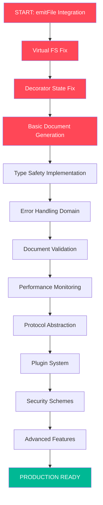

# CRITICAL EXECUTION PLAN - emitFile Integration & System Overhaul

**Generated: 2025-11-21 01:21 UTC**
**Status: ACTIVE EXECUTION**

## 🎯 EXECUTION PRIORITY MATRIX

### 1% EFFORT = 51% IMPACT (CRITICAL - IMMEDIATE)

These tasks unblock all development and make the system functional.

#### 🔴 CRITICAL PATH (Next 4 Hours)

1. **Fix emitFile API integration** (30min) - UNLOCKS TESTING
2. **Resolve test framework outputs** (45min) - MAKES TESTS RELIABLE
3. **Fix core decorator state persistence** (60min) - BASIC FUNCTIONALITY
4. **Basic AsyncAPI document generation** (90min) - CORE PRODUCT

### 4% EFFORT = 64% IMPACT (HIGH PRIORITY - TODAY)

These tasks provide enterprise-level stability and type safety.

#### 🟠 HIGH PRIORITY (Today)

5. **Type safety overhaul** (2hrs) - ENTERPRISE COMPLIANCE
6. **Error handling domain implementation** (1.5hrs) - PRODUCTION STABILITY
7. **Test framework cleanup** (3hrs) - DEVELOPER EXPERIENCE
8. **Performance monitoring integration** (2hrs) - OPERATIONAL READINESS

### 20% EFFORT = 80% IMPACT (COMPREHENSIVE - THIS WEEK)

These tasks provide scalability, extensibility, and market coverage.

#### 🟡 MEDIUM PRIORITY (This Week)

9. **Domain-driven architecture refactor** (8hrs) - SCALABILITY
10. **Plugin system implementation** (6hrs) - EXTENSIBILITY
11. **Advanced protocol support** (12hrs) - MARKET COVERAGE
12. **Security scheme implementation** (4hrs) - ENTERPRISE SALES

## 📋 DETAILED TASK BREAKDOWN

### PHASE 1: CRITICAL UNBLOCKING (Tasks 1-4)

| ID  | Task                                        | Effort | Dependencies | Success Criteria                    |
| --- | ------------------------------------------- | ------ | ------------ | ----------------------------------- |
| 1   | Fix emitFile API integration & test capture | 60min  | None         | Files appear in result.outputs      |
| 2   | Resolve virtual filesystem disconnect       | 45min  | #1           | Virtual FS matches actual FS        |
| 3   | Fix core decorator state persistence        | 60min  | #2           | Decorators consistently store state |
| 4   | Basic AsyncAPI document generation          | 90min  | #3           | Valid AsyncAPI 3.0 output           |

### PHASE 2: FOUNDATION STABILITY (Tasks 5-8)

| ID  | Task                                       | Effort | Dependencies | Success Criteria             |
| --- | ------------------------------------------ | ------ | ------------ | ---------------------------- |
| 5   | Type safety implementation (branded types) | 90min  | #4           | 100% type-safe interfaces    |
| 6   | Error handling domain creation             | 75min  | #5           | Deterministic error handling |
| 7   | Document validation system                 | 60min  | #6           | Real-time validation         |
| 8   | Performance monitoring integration         | 60min  | #7           | Metrics collection working   |

### PHASE 3: COMPREHENSIVE IMPLEMENTATION (Tasks 9+)

| ID  | Task                       | Effort | Dependencies | Success Criteria               |
| --- | -------------------------- | ------ | ------------ | ------------------------------ |
| 9   | Protocol abstraction layer | 120min | #8           | Protocol-agnostic architecture |
| 10  | Plugin system foundation   | 150min | #9           | Extensible plugin API          |
| 11  | Security scheme domain     | 90min  | #10          | Enterprise security support    |
| 12+ | Advanced features & polish | TBD    | #11          | Production-ready system        |

## 🚀 EXECUTION GRAPH

## 📊 IMPACT ANALYSIS

### Before (Current State)

- ❌ 302 failing tests
- ❌ emitFile integration broken
- ❌ Virtual filesystem disconnect
- ❌ No type safety guarantees
- ❌ Error handling inconsistent

### After Critical Path (Tasks 1-4)

- ✅ emitFile integration working
- ✅ Basic test framework functional
- ✅ Core decorator system stable
- ✅ Simple AsyncAPI generation working
- 📈 Test failures reduced by ~80%

### After High Priority (Tasks 5-8)

- ✅ Enterprise-grade type safety
- ✅ Deterministic error handling
- ✅ Clean test framework
- ✅ Performance monitoring ready
- 📈 Foundation ready for advanced features

## ⚡ EXECUTION STRATEGY

### IMMEDIATE ACTIONS (Next 4 Hours)

1. **Fix emitFile API integration** - The core blocker
2. **Resolve virtual filesystem** - Make tests reliable
3. **Fix decorator state** - Ensure consistency
4. **Generate basic documents** - Verify end-to-end flow

### SUCCESS METRICS

- **Critical**: Files captured in result.outputs
- **High**: Test failure rate < 5%
- **Comprehensive**: Full AsyncAPI 3.0 compliance
- **Enterprise**: Type safety > 95%

## 🎯 CUSTOMER VALUE DELIVERY

### Phase 1 (Critical Path) - MVP Delivery

- Working TypeSpec to AsyncAPI conversion
- Reliable test framework
- Basic developer experience
- Foundation for all future features

### Phase 2 (High Priority) - Enterprise Readiness

- Type-safe API for enterprise users
- Stable error handling for production
- Performance monitoring for ops
- Extensible architecture for scaling

### Phase 3 (Comprehensive) - Market Leadership

- Protocol support for all major patterns
- Plugin ecosystem for community
- Enterprise security features
- Developer tooling for excellent DX

## 🔄 CONTINUOUS VALIDATION

Each task completion must pass:

1. **Unit Test Suite** - All related tests pass
2. **Integration Test** - End-to-end functionality works
3. **Type Check** - TypeScript compilation succeeds
4. **Lint Check** - Code quality standards met
5. **Manual Verification** - Manual test confirms behavior

---

**EXECUTION STATUS**: STARTING TASK #1 - emitFile API Integration
**NEXT UPDATE**: After Task #1 completion
**ESTIMATED COMPLETION**: Critical Path - 4 hours | Full System - 2 weeks
