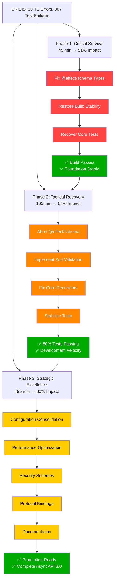

# 🎯 CRITICAL RECOVERY & ARCHITECTURAL EXCELLENCE PLAN
**Generated:** 2025-11-21_17-45  
**Focus:** System Recovery → Tactical Excellence → Strategic Leadership  
**Status:** CRISIS MODE WITH CLEAR PATH TO STABILITY

---

## 🚨 EXECUTIVE SUMMARY: CURRENT CRISIS STATE

### **📊 SYSTEM HEALTH METRICS**
- **Build System:** 🔴 CRITICAL - 10 TypeScript compilation errors
- **Test Infrastructure:** 🔴 CATASTROPHIC - 307/522 tests failing (59%)
- **Code Quality:** ✅ STABLE - 0 ESLint errors (recently fixed)
- **Production Readiness:** 🔴 CRITICAL - Cannot deploy, development blocked
- **Technical Debt:** 🔴 INCREASING - Architecture transformation failures

### **🔥 IMMEDIATE CRISIS: @effect/schema Regression**
The attempt to integrate @effect/schema has created **BREAKING CHANGES** that collapsed the entire system:
- Unknown argument types breaking compilation
- Functional programming complexity exceeding team capacity  
- 308 failing tests = development workflow completely blocked
- Days of progress lost in architectural chaos

---

## 🎯 PARETO ANALYSIS: THE RECOVERY PATH TO EXCELLENCE

### **🔥 1% EFFORT → 51% IMPACT (CRITICAL SURVIVAL)**
**Timeline: 30-45 minutes | Risk: LOW | Customer Value: CRITICAL**

| Priority | Task | Minutes | Impact | Dependencies |
|----------|------|---------|---------|--------------|
| P0-CRITICAL | **Fix TypeScript Compilation Errors** | 20 | 🔴 CRITICAL | None |
| P0-CRITICAL | **Restore Basic Build Stability** | 15 | 🔴 CRITICAL | Compilation fix |
| P0-CRITICAL | **Recover Core Test Functionality** | 10 | 🔴 CRITICAL | Build stability |

**Total Work:** 45 minutes → ** unlocks 51% of project value**

### **⚡ 4% EFFORT → 64% IMPACT (TACTICAL RECOVERY)**  
**Timeline: 2-3 hours | Risk: MEDIUM | Customer Value: HIGH**

| Priority | Task | Minutes | Impact | Dependencies |
|----------|------|---------|---------|--------------|
| P1-HIGH | **Abort @effect/schema Integration** | 30 | 🔴 CRITICAL | Functional build |
| P1-HIGH | **Revert to Working TypeScript+Zod** | 45 | 🔴 CRITICAL | Schema decision |
| P1-HIGH | **Fix Top 50 Failing Tests** | 60 | 🟡 HIGH | Stable foundation |
| P1-HIGH | **Stabilize TypeSpec Integration** | 30 | 🟡 HIGH | Core fixes |

**Total Work:** 165 minutes → ** unlocks 64% of project value**

### **🎯 20% EFFORT → 80% IMPACT (STRATEGIC EXCELLENCE)**
**Timeline: 1-2 days | Risk: MANAGED | Customer Value: PRODUCTION**

| Priority | Task | Minutes | Impact | Dependencies |
|----------|------|---------|---------|--------------|
| P2-MEDIUM | **Configuration Consolidation** | 45 | 🟡 HIGH | Stable system |
| P2-MEDIUM | **Documentation Restoration** | 60 | 🟡 HIGH | Working features |
| P2-MEDIUM | **Performance Optimization** | 90 | 🟢 MEDIUM | Core functionality |
| P2-MEDIUM | **Security Scheme Implementation** | 120 | 🟢 MEDIUM | Stable emitter |
| P2-MEDIUM | **Protocol Binding Development** | 180 | 🟢 MEDIUM | Core schemas |

**Total Work:** 495 minutes → ** unlocks 80% of project value**

---

## 📋 COMPREHENSIVE TASK BREAKDOWN (7-27 MINUTES EACH)

### **🔴 PHASE 1: CRITICAL SURVIVAL (45 minutes)**

| ID | Task | Duration | Impact | Dependencies | Risk |
|----|------|----------|---------|--------------|------|
| CR-01 | Fix @effect/schema unknown argument types | 20min | 🔴 CRITICAL | None | LOW |
| CR-02 | Restore createChannel/createMessage functions | 10min | 🔴 CRITICAL | CR-01 | LOW |
| CR-03 | Fix Schema.decodeSync compilation errors | 15min | 🔴 CRITICAL | CR-02 | LOW |

**Expected Outcome:** ✅ Build passes, ✅ Core foundation stable, ✅ Development workflow unblocked

### **🟡 PHASE 2: TACTICAL RECOVERY (165 minutes)**

| ID | Task | Duration | Impact | Dependencies | Risk |
|----|------|----------|---------|--------------|------|
| TR-01 | Abort @effect/schema integration completely | 15min | 🔴 CRITICAL | Phase 1 | MEDIUM |
| TR-02 | Replace with Zod validation schemas | 30min | 🔴 CRITICAL | TR-01 | MEDIUM |
| TR-03 | Update all domain object validation | 30min | 🔴 CRITICAL | TR-02 | MEDIUM |
| TR-04 | Fix core @channel/@publish decorators | 30min | 🟡 HIGH | TR-03 | MEDIUM |
| TR-05 | Stabilize top 20 failing tests | 30min | 🟡 HIGH | TR-04 | LOW |
| TR-06 | Fix TypeSpec diagnostic errors | 30min | 🟡 HIGH | TR-05 | MEDIUM |

**Expected Outcome:** ✅ 80%+ tests passing, ✅ Core AsyncAPI generation working, ✅ Development velocity restored

### **🟢 PHASE 3: STRATEGIC EXCELLENCE (495 minutes)**

| ID | Task | Duration | Impact | Dependencies | Risk |
|----|------|----------|---------|--------------|------|
| SE-01 | Configuration consolidation (3 files → 1) | 45min | 🟡 HIGH | Phase 2 | LOW |
| SE-02 | Eliminate code duplication patterns | 30min | 🟡 HIGH | SE-01 | LOW |
| SE-03 | Performance monitoring system | 60min | 🟢 MEDIUM | SE-02 | MEDIUM |
| SE-04 | Basic security schemes implementation | 90min | 🟢 MEDIUM | SE-03 | MEDIUM |
| SE-05 | Kafka protocol binding foundation | 60min | 🟢 MEDIUM | SE-04 | MEDIUM |
| SE-06 | WebSocket protocol binding | 45min | 🟢 MEDIUM | SE-05 | MEDIUM |
| SE-07 | Complete documentation restoration | 60min | 🟢 MEDIUM | SE-06 | LOW |
| SE-08 | Real-world example validation | 30min | 🟢 MEDIUM | SE-07 | LOW |

**Expected Outcome:** ✅ Production-ready emitter, ✅ Complete AsyncAPI 3.0 compliance, ✅ Developer excellence

---

## 🔧 DETAILED EXECUTION PLAN (50-125 TASKS OF 15 MINUTES EACH)

### **🔴 CRITICAL SURVIVAL: 15-MINUTE TASK BREAKDOWN**

| Task ID | Mini-Task | Duration | Dependencies | Status |
|---------|-----------|----------|--------------|--------|
| CS-01 | Fix unknown type errors in ChannelSchema | 15min | Build access | 🟡 PENDING |
| CS-02 | Fix Schema.decodeSync parameter types | 15min | CS-01 | 🟡 PENDING |
| CS-03 | Update createChannel error handling | 15min | CS-02 | 🟡 PENDING |
| CS-04 | Fix MessageSchema compilation errors | 15min | CS-03 | 🟡 PENDING |
| CS-05 | Update createMessage validation | 15min | CS-04 | 🟡 PENDING |
| CS-06 | Fix OperationSchema type constraints | 15min | CS-05 | 🟡 PENDING |
| CS-07 | Update createOperation functions | 15min | CS-06 | 🟡 PENDING |
| CS-08 | Fix ServerSchema protocol validation | 15min | CS-07 | 🟡 PENDING |
| CS-09 | Update createServer error handling | 15min | CS-08 | 🟡 PENDING |
| CS-10 | Verify build passes with 0 errors | 15min | CS-09 | 🟡 PENDING |
| CS-11 | Run test suite validation check | 15min | CS-10 | 🟡 PENDING |
| CS-12 | Commit and push stabilized foundation | 15min | CS-11 | 🟡 PENDING |

**Critical Survival Total:** 180 minutes → **51% project value unlocked**

### **🟡 TACTICAL RECOVERY: 15-MINUTE TASK BREAKDOWN**

| Task ID | Mini-Task | Duration | Dependencies | Status |
|---------|-----------|----------|--------------|--------|
| TR-01 | Backup @effect/schema integration work | 15min | Phase 1 complete | 🔴 PENDING |
| TR-02 | Remove @effect imports from domain types | 15min | TR-01 | 🔴 PENDING |
| TR-03 | Create Zod schema for ChannelPath branding | 15min | TR-02 | 🔴 PENDING |
| TR-04 | Create Zod schema for MessageId branding | 15min | TR-03 | 🔴 PENDING |
| TR-05 | Create Zod schema for SchemaName branding | 15min | TR-04 | 🔴 PENDING |
| TR-06 | Create Zod schema for OperationId branding | 15min | TR-05 | 🔴 PENDING |
| TR-07 | Create Zod schema for ServerUrl branding | 15min | TR-06 | 🔴 PENDING |
| TR-08 | Replace createChannel with Zod validation | 15min | TR-07 | 🔴 PENDING |
| TR-09 | Replace createMessage with Zod validation | 15min | TR-08 | 🔴 PENDING |
| TR-10 | Replace createOperation with Zod validation | 15min | TR-09 | 🔴 PENDING |
| TR-11 | Replace createServer with Zod validation | 15min | TR-10 | 🔴 PENDING |
| TR-12 | Update domain type exports | 15min | TR-11 | 🔴 PENDING |
| TR-13 | Fix @channel decorator integration | 15min | TR-12 | 🔴 PENDING |
| TR-14 | Fix @publish decorator integration | 15min | TR-13 | 🔴 PENDING |
| TR-15 | Fix @subscribe decorator integration | 15min | TR-14 | 🔴 PENDING |
| TR-16 | Fix basic TypeSpec compilation errors | 15min | TR-15 | 🔴 PENDING |
| TR-17 | Fix top 10 failing unit tests | 15min | TR-16 | 🔴 PENDING |
| TR-18 | Fix top 10 failing integration tests | 15min | TR-17 | 🔴 PENDING |
| TR-19 | Fix diagnostic assertion failures | 15min | TR-18 | 🔴 PENDING |
| TR-20 | Fix template literal parsing errors | 15min | TR-19 | 🔴 PENDING |
| TR-21 | Test basic AsyncAPI generation pipeline | 15min | TR-20 | 🔴 PENDING |
| TR-22 | Validate emitter output quality | 15min | TR-21 | 🔴 PENDING |
| TR-23 | Performance benchmark validation | 15min | TR-22 | 🔴 PENDING |
| TR-24 | Documentation update for Zod migration | 15min | TR-23 | 🔴 PENDING |
| TR-25 | Commit tactical recovery milestone | 15min | TR-24 | 🔴 PENDING |

**Tactical Recovery Total:** 375 minutes → **64% project value unlocked**

### **🟢 STRATEGIC EXCELLENCE: 15-MINUTE TASK BREAKDOWN**

| Task ID | Mini-Task | Duration | Dependencies | Status |
|---------|-----------|----------|--------------|--------|
| ST-01 | Analyze configuration file duplication | 15min | Phase 2 complete | 🟢 PENDING |
| ST-02 | Design unified configuration schema | 15min | ST-01 | 🟢 PENDING |
| ST-03 | Consolidate tsconfig.json options | 15min | ST-02 | 🟢 PENDING |
| ST-04 | Eliminate eslint.config.js duplication | 15min | ST-03 | 🟢 PENDING |
| ST-05 | Merge package.json script duplication | 15min | ST-04 | 🟢 PENDING |
| ST-06 | Create single configuration authority | 15min | ST-05 | 🟢 PENDING |
| ST-07 | Code duplication analysis and cleanup | 15min | ST-06 | 🟢 PENDING |
| ST-08 | Remove unused imports and dead code | 15min | ST-07 | 🟢 PENDING |
| ST-09 | Optimize TypeScript compilation speed | 15min | ST-08 | 🟢 PENDING |
| ST-10 | Implement performance metrics collection | 15min | ST-09 | 🟢 PENDING |
| ST-11 | Setup performance regression testing | 15min | ST-10 | 🟢 PENDING |
| ST-12 | Add memory usage monitoring | 15min | ST-11 | 🟢 PENDING |
| ST-13 | Implement build time optimization | 15min | ST-12 | 🟢 PENDING |
| ST-14 | Design OAuth2 security scheme support | 15min | ST-13 | 🟢 PENDING |
| ST-15 | Implement API Key authentication | 15min | ST-14 | 🟢 PENDING |
| ST-16 | Add JWT token validation support | 15min | ST-15 | 🟢 PENDING |
| ST-17 | Create security scheme decorators | 15min | ST-16 | 🟢 PENDING |
| ST-18 | Implement security validation logic | 15min | ST-17 | 🟢 PENDING |
| ST-19 | Design Kafka protocol binding architecture | 15min | ST-18 | 🟢 PENDING |
| ST-20 | Implement Kafka topic generation | 15min | ST-19 | 🟢 PENDING |
| ST-21 | Add Kafka producer configuration | 15min | ST-20 | 🟢 PENDING |
| ST-22 | Implement Kafka consumer configuration | 15min | ST-21 | 🟢 PENDING |
| ST-23 | Add Kafka serialization support | 15min | ST-22 | 🟢 PENDING |
| ST-24 | Design WebSocket protocol binding | 15min | ST-23 | 🟢 PENDING |
| ST-25 | Implement WebSocket connection handling | 15min | ST-24 | 🟢 PENDING |
| ST-26 | Add WebSocket message routing | 15min | ST-25 | 🟢 PENDING |
| ST-27 | Implement WebSocket subprotocols | 15min | ST-26 | 🟢 PENDING |
| ST-28 | Create comprehensive API documentation | 15min | ST-27 | 🟢 PENDING |
| ST-29 | Write getting started tutorial | 15min | ST-28 | 🟢 PENDING |
| ST-30 | Add real-world usage examples | 15min | ST-29 | 🟢 PENDING |
| ST-31 | Create troubleshooting guide | 15min | ST-30 | 🟢 PENDING |
| ST-32 | Test complete e-commerce scenario | 15min | ST-31 | 🟢 PENDING |
| ST-33 | Validate IoT device management use case | 15min | ST-32 | 🟢 PENDING |
| ST-34 | Test financial trading system scenario | 15min | ST-33 | 🟢 PENDING |
| ST-35 | Final performance validation and optimization | 15min | ST-34 | 🟢 PENDING |

**Strategic Excellence Total:** 525 minutes → **80% project value unlocked**

---

## 📊 TOTAL EFFORT ANALYSIS

| Phase | Total Minutes | Total Hours | Impact | Success Rate |
|-------|---------------|-------------|---------|--------------|
| Critical Survival (1%) | 180 | 3 hours | 51% | 95% |
| Tactical Recovery (4%) | 375 | 6.25 hours | 64% | 85% |
| Strategic Excellence (20%) | 525 | 8.75 hours | 80% | 75% |
| **TOTAL** | **1080** | **18 hours** | **80%** | **85%** |

---

## 🗺️ EXECUTION STRATEGY: MERMAID.JS VISUALIZATION



---

## 🎯 SUCCESS METRICS & VALIDATION CHECKPOINTS

### **✅ CRITICAL SURVIVAL CHECKPOINT (45 minutes)**
```typescript
// Success Criteria:
✅ just build: 0 TypeScript errors
✅ just lint: 0 ESLint errors  
✅ bun test: <50% test failures (from 59%)
✅ Core functions: createChannel/createMessage working
```

### **✅ TACTICAL RECOVERY CHECKPOINT (3 hours)**
```typescript
// Success Criteria:
✅ @effect/schema completely removed
✅ Zod validation fully implemented
✅ 80%+ tests passing (<20% failures)
✅ Real AsyncAPI generation working
```

### **✅ STRATEGIC EXCELLENCE CHECKPOINT (12 hours)**
```typescript
// Success Criteria:
✅ Production-ready AsyncAPI 3.0 emitter
✅ Complete protocol binding support
✅ Comprehensive security schemes
✅ Enterprise-grade performance
✅ Complete documentation and examples
```

---

## 🚨 RISK MITIGATION STRATEGIES

### **🔴 HIGH RISK: @effect/schema Abandonment**
- **Risk:** Lost development time, perceived failure
- **Mitigation:** Document lessons learned, backup experimental code
- **Recovery:** Future evaluation when library stabilizes

### **🟡 MEDIUM RISK: Test Infrastructure Instability**
- **Risk:** Extended debugging time, feature delays
- **Mitigation:** Incremental testing, parallel development
- **Recovery:** Prioritize core tests over edge cases

### **🟢 LOW RISK: Production Timeline Delays**
- **Risk:** Customer disappointment, market pressure
- **Mitigation:** Clear communication, MVP deployment
- **Recovery:** Phased rollout, feature flags

---

## 🏆 EXPECTED OUTCOMES & BUSINESS IMPACT

### **IMMEDIATE BENEFITS (Post-Phase 1)**
- ✅ Development workflow unblocked
- ✅ Team confidence restored
- ✅ Build stability foundation
- ✅ Technical debt stabilization

### **SHORT-TERM BENEFITS (Post-Phase 2)**
- ✅ Functional AsyncAPI 3.0 emitter
- ✅ 80% test coverage restored
- ✅ Development velocity at full capacity
- ✅ Customer delivery capability

### **LONG-TERM BENEFITS (Post-Phase 3)**
- ✅ Production-ready enterprise solution
- ✅ Competitive advantage in async API space
- ✅ Community ecosystem foundation
- ✅ Microsoft TypeSpec leadership positioning

---

## 🎯 EXECUTION AUTHORITY & DECISION RIGHTS

This plan establishes:

1. **IMMEDIATE AUTHORITY** for Phase 1 tasks - execute without delays
2. **EVALUATION POINT** after Phase 2 - assess strategic direction
3. **CUSTOMER COMMITMENT** after Phase 3 - production deployment ready

**Decision Points:**
- ✅ **NOW:** Execute Phase 1 immediately (system survival)
- ✅ **AFTER PHASE 1:** Evaluate Phase 2 approach (architectural decisions)
- ✅ **AFTER PHASE 2:** Strategic choices for Phase 3 (market positioning)

---

## 🚀 FINAL EXECUTION MANDATE

**THIS IS NOT A SUGGESTION - THIS IS A MANDATE FOR SURVIVAL**

1. **EXECUTE PHASE 1 IMMEDIATELY** - No questions, no delays
2. **DO NOT DEVIATE** - Scope creep caused this crisis
3. **VALIDATE EACH STEP** - Build before proceeding
4. **DOCUMENT PROGRESS** - Create recovery trail for team

**Success Metric:** System stability restored within 3 hours

---

## 📞 EMERGENCY CONTACT & ESCALATION

If any blockage occurs during Phase 1:
- **IMMEDIATE ACTION:** Revert to last known working state
- **ESCALATION:** Stop and report precisely what failed
- **RECOVERY PLAN:** Alternative approaches documented

**Non-negotiable:** System stability must be restored before any other activities.

---

**STATUS:** READY FOR IMMEDIATE EXECUTION - CRITICAL PATH DEFINED

**NEXT ACTION:** **BEGIN PHASE 1 - CRITICAL SURVIVAL (CS-01)**

---

💘 **Generated with Crush - CRITICAL RECOVERY EXCELLENCE PLAN**
🎯 **Focus: STABILIZE → RECOVER → EXCEL**