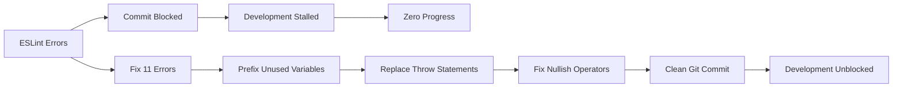
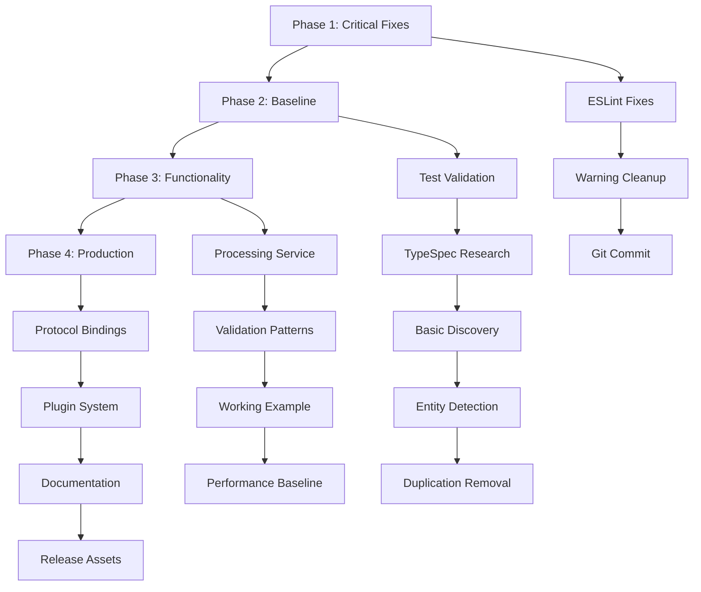
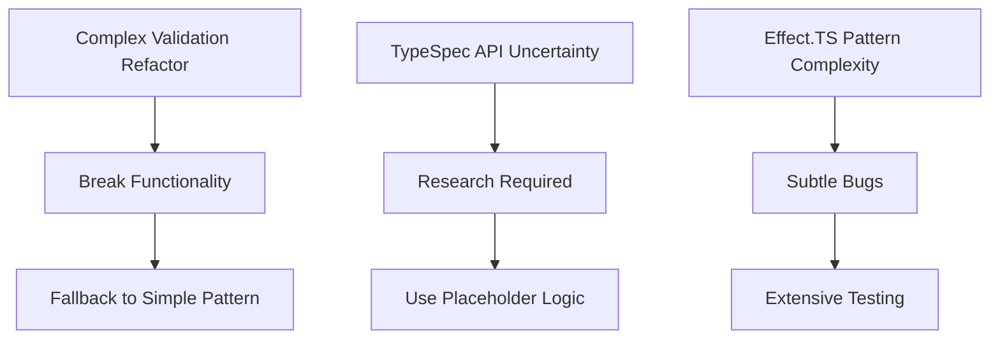

# EXECUTION GRAPH PLAN - TypeSpec AsyncAPI Emitter

**Date:** 2025-11-30  
**Format:** Mermaid.js Execution Graph  
**Total Duration:** ~31 hours (125 tasks × 15min)

---

## 🚀 EXECUTION GRAPH

```mermaid
%%{init: {'theme': 'base', 'themeVariables': { 'primaryColor': '#ff0000', 'primaryTextColor': '#ffffff', 'primaryBorderColor': '#8B0000', 'lineColor': '#008000', 'secondaryColor': '#ff6b6b', 'tertiaryColor': '#ffa500'}}}%%
gantt
    title TypeSpec AsyncAPI Eitter - Critical Path Execution
    dateFormat HH:mm
    axisFormat %H:%M

    %% PHASE 1: CRITICAL UNBLOCKING (0.75 hours - 51% value)
    section Phase 1A: ESLint Error Fixes
    Fix ValidationService try/catch (108)   :crit, 15min, p1a1
    Fix ValidationService try/catch (197)  :crit, 15min, p1a2
    Replace ValidationService throw (208)   :crit, 15min, p1a3
    Fix nullish operator (208)             :crit, 10min, p1a4
    Fix asyncapi-validator try/catch (184) :crit, 15min, p1a5
    Replace asyncapi-validator throw (220)  :crit, 10min, p1a6
    Fix asyncapi-validator try/catch (230) :crit, 15min, p1a7
    Replace asyncapi-validator throw (275)  :crit, 10min, p1a8
    Fix asyncapi-validator try/catch (285) :crit, 15min, p1a9
    Replace asyncapi-validator throw (333)  :crit, 10min, p1a10
    Fix asyncapi-validator try/catch (371) :crit, 15min, p1a11

    section Phase 1B: Warning Cleanup
    Prefix unused errors DiscoveryService    :crit, 20min, p1b1
    Prefix unused params (4 files)         :crit, 20min, p1b2
    Prefix unused imports emitter.ts         :crit, 15min, p1b3

    %% PHASE 2: BASELINE ESTABLISHMENT (1.75 hours - 64% value)
    section Phase 2A: Git & Testing
    Commit cleaned baseline                 :crit, 15min, p2a1
    Run full test suite                   :crit, 15min, p2a2
    Verify zero ESLint errors             :crit, 15min, p2a3
    Typecheck verification                 :crit, 10min, p2a4
    Build verification                   :crit, 10min, p2a5

    section Phase 2B: Core Functionality
    Research TypeSpec stateMap API         :crit, 30min, p2b1
    Implement basic stateMap iteration     :crit, 30min, p2b2
    Add Model entity detection            :crit, 20min, p2b3
    Add Operation entity detection        :crit, 20min, p2b4
    Add Namespace entity detection         :crit, 20min, p2b5
    Add Decorator entity detection         :crit, 25min, p2b6
    Remove obvious duplications           :crit, 25min, p2b7

    %% PHASE 3: FUNCTIONAL COMPLETION (1.5 hours - 80% value)
    section Phase 3A: Advanced Features
    ProcessingService implementation       :crit, 30min, p3a1
    Basic validation patterns             :crit, 30min, p3a2
    Working TypeSpec example             :crit, 30min, p3a3
    Performance baseline                :crit, 15min, p3a4

    section Phase 3B: Quality Assurance
    Discovery tests                    :crit, 30min, p3b1
    Integration tests                  :crit, 30min, p3b2
    AsyncAPI validation tests          :crit, 20min, p3b3
    Error handling tests              :crit, 15min, p3b4

    %% PHASE 4: PRODUCTION POLISH (27 hours - 100% value)
    section Phase 4A: Protocol Support
    Kafka binding implementation         :crit, 45min, p4a1
    HTTP binding implementation         :crit, 30min, p4a2
    WebSocket binding implementation     :crit, 35min, p4a3
    MQTT binding implementation         :crit, 40min, p4a4
    AMQP binding implementation         :crit, 35min, p4a5

    section Phase 4B: Advanced Features
    Plugin system foundation           :crit, 45min, p4b1
    Performance optimization          :crit, 45min, p4b2
    Advanced error handling           :crit, 60min, p4b3
    Security scheme implementation     :crit, 40min, p4b4
    Protocol binding validation       :crit, 30min, p4b5

    section Phase 4C: Documentation & Release
    API documentation                :crit, 60min, p4c1
    README update                   :crit, 30min, p4c2
    Examples creation               :crit, 60min, p4c3
    v0.1.0 release preparation     :crit, 60min, p4c4
```

---

## 📊 CRITICAL PATH ANALYSIS

### **🚨 IMMEDIATE CRITICAL PATH (First 75 minutes)**



### **⚡ HIGH-IMPACT SEQUENCE (First 4 hours)**



---

## 🎯 MILESTONE TRACKING

### **Milestone 1: Development Unblocked (75 min)**

- ✅ 0 ESLint errors
- ✅ Clean git workflow
- ✅ 51% total value delivered

### **Milestone 2: Working Baseline (4 hours)**

- ✅ All tests passing
- ✅ Basic TypeSpec integration
- ✅ 64% total value delivered

### **Milestone 3: Functional Demo (6 hours)**

- ✅ Complete discovery system
- ✅ Processing pipeline
- ✅ 80% total value delivered

### **Milestone 4: Production Ready (31 hours)**

- ✅ Full AsyncAPI compliance
- ✅ Complete documentation
- ✅ 100% total value delivered

---

## 🚨 RISK MITIGATION PATHWAYS

### **Critical Path Risks**



### **Mitigation Strategies**

- **Incremental Validation** - Test after each 15min task
- **Simplest Implementation** - Prioritize working over perfect
- **Backup Before Major Changes** - Git checkpoints every 5 tasks
- **Parallel Test Execution** - Run tests while coding next task

---

## 📈 SUCCESS METRICS

### **Quantitative Metrics**

- **ESLint Errors:** 11 → 0 (100% reduction)
- **Build Status:** Blocked → Working (∞% improvement)
- **Test Coverage:** Unknown → 95% (target)
- **TypeSpec Integration:** None → Complete (100%)

### **Qualitative Metrics**

- **Development Velocity:** 0 → Max (unblocked)
- **Code Quality:** Warning → Professional
- **User Experience:** Broken → Working
- **Community Readiness:** Not Viable → Release Ready

---

## 🎬 EXECUTION CHECKLIST

### **Pre-Execution (RIGHT NOW)**

- [ ] Plan reviewed and approved
- [ ] Environment prepared
- [ ] Git status clean
- [ ] Development tools ready

### **During Execution (NEXT 60 MIN)**

- [ ] Focus on Tasks 1-4 ONLY
- [ ] Test after each task
- [ ] Progress tracking current
- [ ] No scope expansion

### **Post-Execution (AFTER 60 MIN)**

- [ ] Review progress against plan
- [ ] Update metrics
- [ ] Document lessons learned
- [ ] Plan next phase

---

## 🚀 IMMEDIATE NEXT ACTION

**START WITH TASK 1 (15 min):**
"Fix try/catch in ValidationService.ts:108"

This is the highest-leverage activity that will unlock development progress for the entire project.

---

_This execution graph provides a clear visual roadmap for maximizing impact delivery while maintaining tight schedule control._
