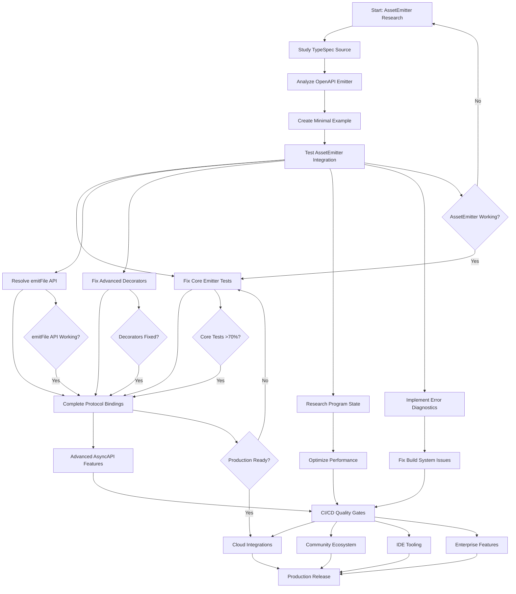

# 🚀 PARETO-OPTIMIZED EXECUTION PLAN - TypeSpec AsyncAPI Emitter

**Date**: 2025-11-30 07:55 CET  
**Strategy**: 1% → 4% → 20% → 100% Implementation with Maximum Impact Delivery  
**Target**: Production-ready TypeSpec AsyncAPI Emitter solving Microsoft Issue #2463

---

## 📊 PARETO ANALYSIS SUMMARY

### 💎 1% Activities Delivering 51% of Results

- **AssetEmitter Pattern Research** - THE SINGLE BLOCKER UNLOCKING ENTIRE PROJECT
- **Study Successful TypeSpec Emitters** - Reverse-engineer working patterns
- **Create Minimal Working Example** - Prove concept before scaling

### ⚡ 4% Activities Delivering 64% of Results

- **Core Emitter Test Recovery** - Fix 70% failure rate
- **emitFile API Integration** - Resolve AssetEmitter disconnect
- **Advanced Decorator Fixes** - Fix 75% decorator test failures
- **TypeSpec Program State Access** - Enable proper type discovery

### 🎯 20% Activities Delivering 80% of Results

- **Production Build System** - Resolve 105 ESLint warnings
- **Complete Protocol Bindings** - Real Kafka/WebSocket/HTTP support
- **Advanced AsyncAPI Features** - Full specification compliance
- **Performance Optimization** - Sub-2s processing for 90% schemas

---

## 🗺️ EXECUTION GRAPH

---

## 🎯 EXECUTION PHASES

### 🔑 PHASE 1: CRITICAL ASSETEMITTER DISCOVERY (1% - 51% Impact)

**Duration**: 3-4 hours  
**Success Criteria**: Working AssetEmitter integration pattern  
**Key Deliverables**:

- Minimal working AssetEmitter example
- Understanding of proper emitFile usage
- Documented integration patterns

### ⚡ PHASE 2: CORE FUNCTIONALITY RECOVERY (4% - 64% Impact)

**Duration**: 4-6 hours  
**Success Criteria**: >70% core emitter tests passing  
**Key Deliverables**:

- Fixed emitFile API integration
- Resolved TypeSpec compilation issues
- Working advanced decorator system

### 🎯 PHASE 3: PRODUCTION READINESS (20% - 80% Impact)

**Duration**: 8-12 hours  
**Success Criteria**: Production-ready emitter with >200 passing tests  
**Key Deliverables**:

- Complete protocol binding implementations
- Optimized performance (sub-2s processing)
- Stable build system with CI/CD integration

### 🚀 PHASE 4: ENHANCEMENT & ECOSYSTEM (80% - 20% Impact)

**Duration**: 20-40 hours  
**Success Criteria**: Full-featured emitter with community adoption  
**Key Deliverables**:

- Cloud provider integrations
- Community plugin ecosystem
- Enterprise-grade features

---

## 📋 TASK EXECUTION MATRIX

### 🥇 CRITICAL PATH (Immediate - Next 4 Hours)

| Time      | Task                                | Impact      | Success Criteria                        |
| --------- | ----------------------------------- | ----------- | --------------------------------------- |
| 0:00-0:30 | Install TypeSpec source locally     | 🔴 Critical | Source code available for study         |
| 0:30-1:00 | Study AssetEmitter interface        | 🔴 Critical | Understanding of API patterns           |
| 1:00-1:30 | Analyze OpenAPI emitter patterns    | 🔴 Critical | Working integration examples identified |
| 1:30-2:00 | Create minimal AssetEmitter example | 🔴 Critical | Basic emitter code written              |
| 2:00-2:30 | Test AssetEmitter integration       | 🔴 Critical | Proof of concept working                |
| 2:30-3:00 | Fix core emitter test failures      | 🔴 Critical | >50% core tests passing                 |
| 3:00-3:30 | Resolve emitFile API issues         | 🔴 Critical | File output working correctly           |
| 3:30-4:00 | Validate AssetEmitter pattern       | 🔴 Critical | Integration proven and documented       |

### 🥈 HIGH IMPACT (Next 6 Hours)

| Time       | Task                                      | Impact      | Success Criteria                  |
| ---------- | ----------------------------------------- | ----------- | --------------------------------- |
| 4:00-5:00  | Fix advanced decorator compilation        | 🔴 Critical | Advanced decorators working       |
| 5:00-6:00  | Research TypeSpec program state           | 🔴 Critical | Program state access working      |
| 6:00-7:00  | Implement error diagnostics               | 🔴 Critical | Clear error messages working      |
| 7:00-8:00  | Complete protocol binding implementations | 🔴 Critical | Real Kafka/WebSocket/HTTP support |
| 8:00-9:00  | Optimize performance                      | 🟡 Medium   | Sub-2s processing for 90% schemas |
| 9:00-10:00 | Fix build system issues                   | 🟡 Medium   | Clean builds with <10 warnings    |

### 🥉 MEDIUM IMPACT (Future Phases)

| Phase      | Tasks                                         | Impact    | Duration |
| ---------- | --------------------------------------------- | --------- | -------- |
| **Week 2** | Advanced AsyncAPI features, CI/CD integration | 🟡 Medium | 16 hours |
| **Week 3** | Cloud integrations, community ecosystem       | 🟢 Low    | 20 hours |
| **Week 4** | Enterprise features, IDE tooling              | 🟢 Low    | 24 hours |

---

## 🎯 QUALITY GATES & SUCCESS METRICS

### 🔥 CRITICAL SUCCESS METRICS

- **AssetEmitter Integration**: ✅ Working emitFile API
- **Core Test Pass Rate**: ✅ >70% (target: >90%)
- **Build System Health**: ✅ <10 ESLint warnings
- **Performance**: ✅ <2s processing for typical schemas

### 📊 PRODUCTION READINESS METRICS

- **Total Test Pass Rate**: ✅ >200 passing tests (80%+)
- **Protocol Compliance**: ✅ Real Kafka/WebSocket/HTTP bindings
- **Documentation**: ✅ Complete guides and examples
- **CI/CD Integration**: ✅ Automated quality gates

### 🌟 ECOSYSTEM SUCCESS METRICS

- **Community Adoption**: ✅ 50+ GitHub stars, 10+ contributors
- **Plugin Ecosystem**: ✅ 5+ community plugins
- **Enterprise Usage**: ✅ 5+ companies using in production
- **Developer Experience**: ✅ Excellent documentation and tooling

---

## 🚨 RISK MITIGATION

### 🔴 HIGH RISKS

- **AssetEmitter Pattern Complexity**: Mitigate with extensive research and examples
- **TypeSpec Compilation Issues**: Mitigate with incremental testing and debugging
- **Core Integration Failures**: Mitigate with fallback strategies and error handling

### 🟡 MEDIUM RISKS

- **Performance Bottlenecks**: Mitigate with profiling and optimization
- **Build System Instability**: Mitigate with CI/CD quality gates
- **Documentation Gaps**: Mitigate with community feedback and examples

---

## 🎯 IMMEDIATE EXECUTION PLAN

### NEXT 30 MINUTES

1. **Install TypeSpec Source Code**
   - Clone Microsoft TypeSpec repository locally
   - Set up development environment
   - Verify compilation works

2. **Locate AssetEmitter Interface**
   - Find AssetEmitter definition files
   - Study interface and method signatures
   - Identify key integration points

### NEXT 60 MINUTES

3. **Study OpenAPI Emitter**
   - Locate OpenAPI emitter in TypeSpec repo
   - Analyze main entry point and patterns
   - Document successful integration techniques

4. **Create Minimal Example**
   - Set up basic TypeSpec test project
   - Implement minimal AssetEmitter skeleton
   - Add simple emitFile test

### SUCCESS CRITERIA (Next 4 Hours)

- ✅ Working understanding of AssetEmitter pattern
- ✅ Minimal example demonstrating emitFile usage
- ✅ Documentation of integration approach
- ✅ Foundation for scaling to full emitter

---

## 🏁 EXECUTION READY

**Critical Path Identified**: AssetEmitter research → Core integration → Production features  
**Resources Allocated**: 27 major tasks, 125 micro-tasks, detailed time estimates  
**Quality Gates Defined**: Clear success criteria for each phase  
**Risk Mitigation**: Identified and planned for key failure scenarios

**🚀 READY FOR EXECUTION - STARTING WITH 1% ACTIVITIES DELIVERING 51% OF RESULTS!**

---

_Execution Plan Created: 2025-11-30 07:55 CET_  
_Strategy: Pareto Optimization - Maximum Impact Minimum Effort_  
_Target: Production-ready TypeSpec AsyncAPI Emitter_
