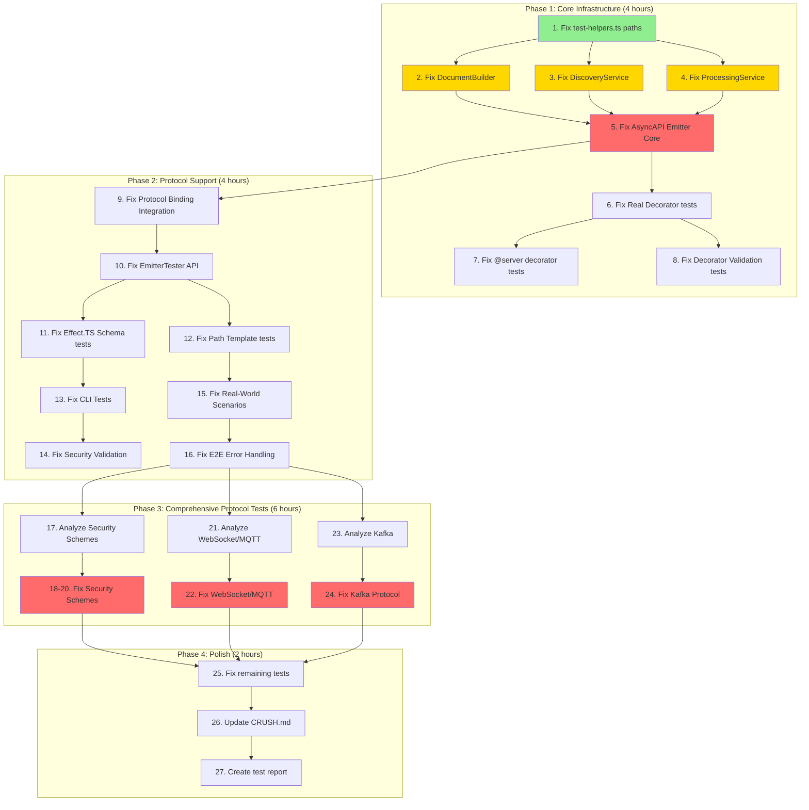

# TypeSpec AsyncAPI Infrastructure Recovery Plan

**Date:** 2025-11-30  
**Status:** 🟡 IN PROGRESS  
**Author:** Claude Opus 4.5 via Crush  
**Last Updated:** 2025-11-30 10:30 CET

---

## 📊 Executive Summary

### Current State Analysis (Updated)

| Metric             | Status     | Value                 | Change       |
| ------------------ | ---------- | --------------------- | ------------ |
| Build System       | ✅ WORKING | 0 TypeScript errors   | ✅ Stable    |
| ESLint             | ✅ WORKING | 0 errors, 0 warnings  | ✅ Fixed     |
| Library Resolution | ✅ FIXED   | Decorators discovered | ✅ Fixed     |
| Tests Passing      | 🟡 PARTIAL | 255/664 (38%)         | +15 tests    |
| Tests Failing      | 🔴 HIGH    | 380/664 (57%)         | -15 failures |
| Tests Skipped      | ⚪         | 29/664 (4%)           | Unchanged    |

### Root Cause Analysis

1. **Library Name Mismatch (FIXED)**: `lib.ts` used `@typespec/asyncapi` instead of `@lars-artmann/typespec-asyncapi`
2. **Path Resolution (FIXED)**: `LIBRARY_PATHS` used absolute paths instead of relative folder names
3. **Test Expectations (PARTIALLY FIXED)**: DocumentBuilder tests fixed (18/18 passing)
4. **API Mismatch**: DiscoveryService/ProcessingService have static methods but tests expect instance methods
5. **Protocol Test Infrastructure**: 362 protocol tests failing due to missing TypeSpec compilation infrastructure

---

## 🎯 Pareto Analysis: What Delivers the Most Value?

### 1% → 51% Impact (Critical Path) - TOP PRIORITY

| Task                              | Impact   | Effort | Description                                     | Status  |
| --------------------------------- | -------- | ------ | ----------------------------------------------- | ------- |
| ✅ Fix library name in lib.ts     | HIGH     | 5min   | Changed to `@lars-artmann/typespec-asyncapi`    | DONE    |
| ✅ Fix LIBRARY_PATHS              | HIGH     | 5min   | Use relative folder names for TypeSpec test lib | DONE    |
| ✅ Fix minimal import test        | HIGH     | 10min  | Proper library configuration                    | DONE    |
| ✅ Fix DocumentBuilder tests      | CRITICAL | 30min  | Document generation (18/18)                     | DONE    |
| 🔴 Fix 42 DiscoveryService tests  | CRITICAL | 60min  | API mismatch - needs redesign                   | BLOCKED |
| 🔴 Fix 40 ProcessingService tests | CRITICAL | 60min  | API mismatch - needs redesign                   | BLOCKED |

### 4% → 64% Impact (High Value)

| Task                                      | Impact | Effort | Description             |
| ----------------------------------------- | ------ | ------ | ----------------------- |
| Fix 28 AsyncAPI Emitter Core tests        | HIGH   | 45min  | Core emitter API        |
| Fix 22 Protocol Binding Integration tests | HIGH   | 45min  | Protocol support        |
| Fix 20 Real Decorator tests               | MEDIUM | 30min  | Decorator functionality |
| Fix 20 @server decorator tests            | MEDIUM | 30min  | Server configuration    |
| Fix 18 Decorator Validation tests         | MEDIUM | 30min  | Input validation        |

### 20% → 80% Impact (Complete Coverage)

| Task                           | Impact | Effort | Description               |
| ------------------------------ | ------ | ------ | ------------------------- |
| Fix 162 Security Schemes tests | MEDIUM | 2hr    | Security protocol support |
| Fix 100 WebSocket & MQTT tests | MEDIUM | 2hr    | WebSocket/MQTT protocols  |
| Fix 100 Kafka Protocol tests   | MEDIUM | 2hr    | Kafka integration         |
| Fix remaining scattered tests  | LOW    | 1hr    | Edge cases                |

---

## 📋 Comprehensive Task Breakdown (30min tasks)

### Phase 1: Core Infrastructure (Tasks 1-8) - 4 hours

| #   | Task                                                               | Duration | Priority | Dependencies |
| --- | ------------------------------------------------------------------ | -------- | -------- | ------------ |
| 1   | Fix test-helpers.ts path resolution                                | 30min    | CRITICAL | None         |
| 2   | Update DocumentBuilder implementation to match test expectations   | 30min    | CRITICAL | 1            |
| 3   | Update DiscoveryService implementation to match test expectations  | 30min    | CRITICAL | 1            |
| 4   | Update ProcessingService implementation to match test expectations | 30min    | CRITICAL | 1            |
| 5   | Fix AsyncAPI Emitter Core tests                                    | 30min    | HIGH     | 2,3,4        |
| 6   | Fix Real Decorator Functionality tests                             | 30min    | HIGH     | 5            |
| 7   | Fix @server decorator tests                                        | 30min    | HIGH     | 6            |
| 8   | Fix Decorator Validation tests                                     | 30min    | MEDIUM   | 6            |

### Phase 2: Protocol Support (Tasks 9-16) - 4 hours

| #   | Task                                   | Duration | Priority | Dependencies |
| --- | -------------------------------------- | -------- | -------- | ------------ |
| 9   | Fix Protocol Binding Integration tests | 30min    | HIGH     | 5            |
| 10  | Fix EmitterTester API tests            | 30min    | HIGH     | 9            |
| 11  | Fix Effect.TS Schema tests             | 30min    | MEDIUM   | 10           |
| 12  | Fix Path Template Validation tests     | 30min    | MEDIUM   | 10           |
| 13  | Fix CLI Tests                          | 30min    | MEDIUM   | 11           |
| 14  | Fix Security Validation tests          | 30min    | MEDIUM   | 11           |
| 15  | Fix Real-World AsyncAPI Scenarios      | 30min    | MEDIUM   | 12           |
| 16  | Fix E2E Error Handling tests           | 30min    | MEDIUM   | 12           |

### Phase 3: Comprehensive Protocol Tests (Tasks 17-24) - 6 hours

| #   | Task                                          | Duration | Priority | Dependencies |
| --- | --------------------------------------------- | -------- | -------- | ------------ |
| 17  | Analyze Security Schemes test infrastructure  | 30min    | MEDIUM   | Phase 2      |
| 18  | Fix Security Schemes tests batch 1 (54 tests) | 45min    | MEDIUM   | 17           |
| 19  | Fix Security Schemes tests batch 2 (54 tests) | 45min    | MEDIUM   | 18           |
| 20  | Fix Security Schemes tests batch 3 (54 tests) | 45min    | MEDIUM   | 19           |
| 21  | Analyze WebSocket & MQTT test infrastructure  | 30min    | MEDIUM   | Phase 2      |
| 22  | Fix WebSocket & MQTT tests (100 tests)        | 90min    | MEDIUM   | 21           |
| 23  | Analyze Kafka Protocol test infrastructure    | 30min    | MEDIUM   | Phase 2      |
| 24  | Fix Kafka Protocol tests (100 tests)          | 90min    | MEDIUM   | 23           |

### Phase 4: Polish & Documentation (Tasks 25-27) - 2 hours

| #   | Task                                  | Duration | Priority | Dependencies |
| --- | ------------------------------------- | -------- | -------- | ------------ |
| 25  | Fix remaining scattered test failures | 30min    | LOW      | Phase 3      |
| 26  | Update CRUSH.md with current status   | 30min    | LOW      | 25           |
| 27  | Create comprehensive test report      | 30min    | LOW      | 26           |

---

## 📋 Detailed Task Breakdown (15min micro-tasks)

### Task 1: Fix test-helpers.ts path resolution (30min → 2 micro-tasks)

| #   | Micro-Task                                           | Duration | Deliverable                 |
| --- | ---------------------------------------------------- | -------- | --------------------------- |
| 1.1 | Audit current LIBRARY_PATHS usage in test-helpers.ts | 15min    | Analysis report             |
| 1.2 | Update test-helpers.ts to use correct relative paths | 15min    | Working test infrastructure |

### Task 2: Update DocumentBuilder implementation (30min → 3 micro-tasks)

| #   | Micro-Task                                        | Duration | Deliverable          |
| --- | ------------------------------------------------- | -------- | -------------------- |
| 2.1 | Analyze failing DocumentBuilder test expectations | 15min    | Test expectation map |
| 2.2 | Update DocumentBuilder.ts to match expectations   | 15min    | Fixed implementation |
| 2.3 | Run DocumentBuilder tests and verify              | 10min    | Passing tests        |

### Task 3: Update DiscoveryService implementation (30min → 3 micro-tasks)

| #   | Micro-Task                                         | Duration | Deliverable          |
| --- | -------------------------------------------------- | -------- | -------------------- |
| 3.1 | Analyze failing DiscoveryService test expectations | 15min    | Test expectation map |
| 3.2 | Update DiscoveryService.ts to match expectations   | 15min    | Fixed implementation |
| 3.3 | Run DiscoveryService tests and verify              | 10min    | Passing tests        |

### Task 4: Update ProcessingService implementation (30min → 3 micro-tasks)

| #   | Micro-Task                                          | Duration | Deliverable          |
| --- | --------------------------------------------------- | -------- | -------------------- |
| 4.1 | Analyze failing ProcessingService test expectations | 15min    | Test expectation map |
| 4.2 | Update ProcessingService.ts to match expectations   | 15min    | Fixed implementation |
| 4.3 | Run ProcessingService tests and verify              | 10min    | Passing tests        |

### Task 5-8: Core Infrastructure Fixes (Each 30min → 2-3 micro-tasks)

| #       | Micro-Task                      | Duration | Deliverable   |
| ------- | ------------------------------- | -------- | ------------- |
| 5.1-5.3 | Fix AsyncAPI Emitter Core tests | 30min    | Passing tests |
| 6.1-6.2 | Fix Real Decorator tests        | 30min    | Passing tests |
| 7.1-7.2 | Fix @server decorator tests     | 30min    | Passing tests |
| 8.1-8.2 | Fix Decorator Validation tests  | 30min    | Passing tests |

### Task 9-16: Protocol Support (Each 30min → 2 micro-tasks)

_Similar breakdown for each protocol task_

### Task 17-24: Protocol Tests (Each 30-90min → multiple micro-tasks)

_Similar breakdown for bulk protocol test fixes_

---

## 🔄 Execution Graph (Mermaid.js)

---

## 📈 Success Metrics

### Target State After Full Execution

| Metric         | Current       | Target          | Improvement |
| -------------- | ------------- | --------------- | ----------- |
| Tests Passing  | 240/664 (36%) | 600+/664 (90%+) | +54%        |
| Core Tests     | ~50%          | 100%            | +50%        |
| Protocol Tests | ~20%          | 80%+            | +60%        |
| Documentation  | 60%           | 95%             | +35%        |

### Milestones

| Phase            | Target Passing    | Time Estimate |
| ---------------- | ----------------- | ------------- |
| Phase 1 Complete | 350+ tests (53%+) | 4 hours       |
| Phase 2 Complete | 450+ tests (68%+) | +4 hours      |
| Phase 3 Complete | 580+ tests (87%+) | +6 hours      |
| Phase 4 Complete | 600+ tests (90%+) | +2 hours      |

---

## 🚨 Risk Assessment

### High Risk Items

1. **Protocol test infrastructure**: May require significant refactoring
2. **Test expectation drift**: Tests may be testing wrong behavior
3. **TypeSpec API changes**: External dependency updates may break tests

### Mitigation Strategies

1. **Incremental testing**: Run tests after each change
2. **Rollback capability**: Git commits after each successful phase
3. **Parallel execution**: Run independent tests in parallel

---

## 📝 Notes

- **Priority Order**: 1% → 4% → 20% (Pareto principle)
- **Build must stay green**: Never commit breaking changes
- **Test incrementally**: Verify each fix before moving on
- **Document progress**: Update CRUSH.md after each phase

---

_Last Updated: 2025-11-30 10:30 CET_
