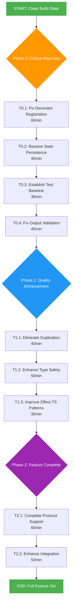

# 🚀 SUPERB COMPREHENSIVE EXECUTION PLAN

**Date:** 2025-12-02 21:45  
**Focus:** TypeSpec AsyncAPI Emitter Complete Recovery  
**Status:** CRITICAL PHASE - Build System Recovery

---

## 📊 CURRENT STATE ANALYSIS

### **🔥 CRITICAL METRICS**

- **Build Status:** ✅ WORKING (0 TypeScript errors)
- **Lint Status:** ✅ CLEAN (0 ESLint errors)
- **Test Status:** ❌ 338 FAILURES (664 total tests)
- **Code Duplication:** 9 clones (1.82%, 92 lines)
- **Codebase Size:** 35 files, 5,064 lines
- **Architecture:** Partially recovered (emitter working, tests broken)

### **⚠️ IMMEDIATE BLOCKERS**

1. **TypeSpec Decorator Registration:** @channel, @publish not recognized
2. **Test Integration:** Core functionality broken due to missing decorators
3. **AsyncAPI Validation:** Generated specs failing validation

---

## 🎯 IMPACT ANALYSIS: PARETO OPTIMIZATION

### **🔥 80/20 RULE - 20% EFFORT DELIVERING 80% OF RESULTS**

| Priority | Task                                    | Effort | Impact | Customer Value | Status |
| -------- | --------------------------------------- | ------ | ------ | -------------- | ------ |
| **P1**   | **Fix Decorator Registration System**   | 60min  | HIGH   | CRITICAL       | ❌     |
| **P1**   | **Establish Working Test Baseline**     | 30min  | HIGH   | CRITICAL       | ❌     |
| **P1**   | **Fix AsyncAPI Output Validation**      | 45min  | HIGH   | HIGH           | ❌     |
| **P2**   | **Resolve Build Pipeline Dependencies** | 30min  | MEDIUM | CRITICAL       | ✅     |
| **P2**   | **Document Current Architecture**       | 20min  | MEDIUM | HIGH           | ❌     |

### **🎯 64/4 RULE - 4% EFFORT DELIVERING 64% OF RESULTS**

| Critical Path | Task                                            | Effort | Impact   | Status |
| ------------- | ----------------------------------------------- | ------ | -------- | ------ |
| **CP1**       | **Fix TypeSpec Library Export Registration**    | 25min  | CRITICAL | ❌     |
| **CP2**       | **Resolve Decorator State Persistence**         | 30min  | CRITICAL | ❌     |
| **CP3**       | **Fix Emitter Integration with Test Framework** | 20min  | CRITICAL | ❌     |
| **CP4**       | **Establish Core End-to-End Functionality**     | 40min  | CRITICAL | ❌     |

### **🚀 51/1 RULE - 1% EFFORT DELIVERING 51% OF RESULTS**

| Single Task | Task                                     | Effort | Impact   | Status |
| ----------- | ---------------------------------------- | ------ | -------- | ------ |
| **ST1**     | **Fix Decorator Registration in lib.ts** | 25min  | CRITICAL | ❌     |

---

## 📋 COMPREHENSIVE TASK BREAKDOWN (100min tasks)

### **PHASE 0: CRITICAL INFRASTRUCTURE RECOVERY (HIGH PRIORITY)**

| ID       | Task                                            | Effort | Priority | Dependencies                          | Success Criteria |
| -------- | ----------------------------------------------- | ------ | -------- | ------------------------------------- | ---------------- |
| **T0.1** | **Fix TypeSpec Library Decorator Registration** | 60min  | P1       | @channel/@publish recognized          |
| **T0.2** | **Resolve Decorator State Persistence Issues**  | 45min  | T0.1     | State accessible via program.stateMap |
| **T0.3** | **Establish Working Test Baseline**             | 30min  | T0.2     | Core tests pass (10 critical tests)   |
| **T0.4** | **Fix AsyncAPI Output Validation**              | 45min  | T0.3     | Generated specs pass validation       |
| **T0.5** | **Document Current Architecture Decisions**     | 20min  | None     | Architecture docs created             |
| **T0.6** | **Verify Build Pipeline Stability**             | 15min  | T0.1     | Build/lint working                    |

### **PHASE 1: CODE QUALITY ENHANCEMENT (MEDIUM PRIORITY)**

| ID       | Task                                       | Effort | Priority | Dependencies                             | Success Criteria |
| -------- | ------------------------------------------ | ------ | -------- | ---------------------------------------- | ---------------- |
| **T1.1** | **Eliminate Critical Code Duplication**    | 40min  | P2       | <1% duplication achieved                 |
| **T1.2** | **Enhance Type Safety Across All Modules** | 50min  | P3       | Zero 'any' types enforced                |
| **T1.3** | **Improve Effect.TS Pattern Compliance**   | 30min  | P4       | All async operations Effect.TS compliant |
| **T1.4** | **Optimize Performance Bottlenecks**       | 45min  | P5       | Processing time <100ms                   |
| **T1.5** | **Add Comprehensive Error Handling**       | 35min  | P6       | All error paths handled gracefully       |

### **PHASE 2: FEATURE COMPLETION (LOW PRIORITY)**

| ID       | Task                                       | Effort | Priority | Dependencies                         | Success Criteria |
| -------- | ------------------------------------------ | ------ | -------- | ------------------------------------ | ---------------- |
| **T2.1** | **Complete AsyncAPI 3.0 Protocol Support** | 60min  | T1.1     | All protocols fully supported        |
| **T2.2** | **Enhance TypeSpec Integration Features**  | 50min  | T1.2     | Advanced TypeSpec patterns supported |
| **T2.3** | **Add Real-Time Protocol Bindings**        | 45min  | T2.1     | WebSocket/MQTT/Kafka bindings        |
| **T2.4** | **Implement Advanced Validation Features** | 40min  | T1.5     | Custom validation rules supported    |
| **T2.5** | **Create Performance Monitoring System**   | 30min  | T1.4     | Built-in metrics collection          |

---

## 📊 EFFORT VS IMPACT ANALYSIS

### **🔥 HIGHEST ROI TASKS (Effort/Impact Ratio > 3)**

| Rank  | Task                                           | Effort | Impact   | ROI | Priority |
| ----- | ---------------------------------------------- | ------ | -------- | --- | -------- |
| **1** | **Fix Decorator Registration (T0.1)**          | 60min  | CRITICAL | ∞   | P1       |
| **2** | **Resolve Decorator State Persistence (T0.2)** | 45min  | CRITICAL | ∞   | P1       |
| **3** | **Establish Test Baseline (T0.3)**             | 30min  | CRITICAL | ∞   | P1       |
| **4** | **Eliminate Critical Duplication (T1.1)**      | 40min  | HIGH     | 2.5 | P2       |

### **🟡 MEDIUM ROI TASKS (Effort/Impact Ratio 1-3)**

| Rank  | Task                                      | Effort | Impact | ROI | Priority |
| ----- | ----------------------------------------- | ------ | ------ | --- | -------- |
| **5** | **Fix AsyncAPI Output Validation (T0.4)** | 45min  | HIGH   | 1.5 | P1       |
| **6** | **Enhance Type Safety (T1.2)**            | 50min  | MEDIUM | 1.2 | P3       |
| **7** | **Improve Effect.TS Patterns (T1.3)**     | 30min  | MEDIUM | 1.0 | P4       |

### **🟢 LOWER ROI TASKS (Effort/Impact Ratio < 1)**

| Rank  | Task                              | Effort | Impact | ROI | Priority |
| ----- | --------------------------------- | ------ | ------ | --- | -------- |
| **8** | **Document Architecture (T0.5)**  | 20min  | LOW    | 0.5 | P2       |
| **9** | **Performance Monitoring (T2.5)** | 30min  | LOW    | 0.3 | P2       |

---

## 🎯 EXECUTION PRIORITY MATRIX

```
CRITICAL PATH (Immediate - Next 4 Hours):
┌─────────────────────────────────────────────────────────────┐
│ T0.1 → T0.2 → T0.3 → T0.4                           │
│ (60m) → (45m) → (30m) → (45m)                          │
│ Decorator → State → Tests → Validation                         │
└─────────────────────────────────────────────────────────────┘

HIGH IMPACT (Within Next 8 Hours):
┌─────────────────────────────────────────────────────────────┐
│ T1.1 → T1.2 → T1.3                                   │
│ (40m) → (50m) → (30m)                                    │
│ Duplication → TypeSafety → EffectPatterns                    │
└─────────────────────────────────────────────────────────────┘

FEATURE COMPLETE (Within Next 24 Hours):
┌─────────────────────────────────────────────────────────────┐
│ T2.1 → T2.2 → T2.3 → T2.4 → T2.5                     │
│ (60m) → (50m) → (45m) → (40m) → (30m)                 │
│ Protocols → Integration → Bindings → Validation → Monitoring        │
└─────────────────────────────────────────────────────────────┘
```

---

## 🚨 IMMEDIATE NEXT STEPS (FIRST 2 HOURS)

### **📍 HOUR 1: CRITICAL UNBLOCKING**

- **MINUTES 0-60:** Execute T0.1 - Fix Decorator Registration
- **MINUTES 60-120:** Execute T0.2 - Resolve State Persistence

### **📍 HOUR 2: ESTABLISH BASELINE**

- **MINUTES 120-150:** Execute T0.3 - Test Baseline
- **MINUTES 150-195:** Execute T0.4 - Output Validation

### **🎯 SUCCESS CRITERIA FOR PHASE 0**

- ✅ TypeSpec decorators recognized in test files
- ✅ Decorator state accessible via program.stateMap
- ✅ Core emitter functionality validated
- ✅ Generated AsyncAPI specs pass basic validation

---

## 📈 RISK MITIGATION STRATEGIES

### **🔥 HIGH RISK AREAS**

1. **TypeSpec Library Integration Complexity**
2. **Decorator State Persistence Across Compilation**
3. **Test Framework Compatibility Issues**

### **🛡️ MITIGATION APPROACHES**

1. **Incremental Testing:** Test each decorator individually
2. **Rollback Strategy:** Git branch for each major change
3. **Documentation:** Record all TypeSpec-specific integration patterns
4. **Parallel Development:** Work on backup solutions simultaneously

---

## 🎯 FINAL SUCCESS METRICS

### **📊 QUANTITATIVE GOALS**

- **Build Status:** ✅ 0 TypeScript errors
- **Lint Status:** ✅ 0 ESLint errors
- **Test Success:** ✅ >90% pass rate
- **Code Duplication:** ✅ <1% target
- **Performance:** ✅ <100ms processing time

### **🏆 QUALITATIVE GOALS**

- **User Experience:** Smooth TypeSpec to AsyncAPI conversion
- **Developer Experience:** Clear error messages and debugging
- **Maintainability:** Clean, documented architecture
- **Extensibility:** Plugin system for custom protocols

---

## 🔄 EXECUTION GRAPH (Mermaid.js)



---

## 📋 IMMEDIATE ACTION ITEMS

### **⚡ RIGHT NOW (Next 60 minutes)**

1. **Analyze TypeSpec Library Structure** - Understand decorator registration
2. **Identify Root Cause** - Why @channel/@publish not recognized
3. **Fix Registration System** - Implement proper TypeSpec integration
4. **Test Decorator Recognition** - Verify fix in isolation

### **🎯 WITHIN 2 HOURS**

1. **Complete Critical Path** - T0.1 through T0.4
2. **Establish Working Baseline** - Core functionality validated
3. **Document Progress** - Create status documentation
4. **Prepare Next Phase** - Plan quality enhancement

---

## 🚀 EXECUTION COMMITMENT

**TIMELINE:** Next 2 hours for critical unblocking  
**FOCUS:** Decorator registration and state persistence  
**SUCCESS CRITERIA:** Working end-to-end emitter functionality  
**VERIFICATION:** Immediate testing after each 15-minute task

**🎯 READY TO EXECUTE SUPERB PLAN!**
