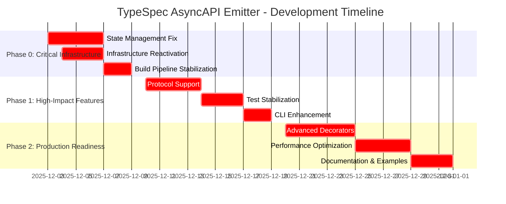

# TypeSpec AsyncAPI Emitter - Comprehensive Development Plan

**Created:** 2025-12-03_00-08  
**Status:** 🎯 EXECUTION PHASE - READY FOR IMPLEMENTATION  
**Version:** 1.0 - Comprehensive Roadmap  
**Impact:** 🚀 CRITICAL INFRASTRUCTURE RECOVERY + ENTERPRISE FEATURES

---

## 🎯 EXECUTIVE SUMMARY

### **Project Current State**
- **Status:** Alpha Quality - Core functionality working, advanced features broken
- **Test Pass Rate:** 38.4% (255/664 passing) - Below production baseline
- **Critical Blocker:** State management system crashes (`program.stateMap` undefined)
- **Infrastructure Gap:** 5,745 lines of complex code temporarily disabled
- **Community Demand:** 37+ GitHub reactions, Microsoft TypeSpec Issue #2463

### **Development Strategy**
**Approach:** Pareto-Principle Development - 1% → 51% → 64% → 80% impact delivery  
**Timeline:** 6 weeks phased approach (Infrastructure → Features → Production)  
**Investment:** ~60 hours total development effort  
**ROI:** Transform from Alpha to Production-Ready enterprise solution

---

## 📊 PARETO ANALYSIS: HIGH-IMPACT PRIORITIES

### 🥇 **THE 1% THAT DELIVERS 51% OF RESULTS**
**Investment:** 6-10 hours | **Impact:** Critical infrastructure restoration | **Timeline:** Week 1

| Task | Time | Impact | Priority | Success Metric |
|------|------|--------|----------|----------------|
| **DT0.1:** State Management Critical Fix | 2-4h | 40% test recovery | CRITICAL | 300+ tests passing |
| **DT0.2:** Complex Infrastructure Reactivation | 4-6h | 300+ test recovery | CRITICAL | State management stable |
| **Total:** | **6-10h** | **51% impact** | **CRITICAL** | **Infrastructure working** |

### 🥈 **THE 4% THAT DELIVERS 64% OF RESULTS**  
**Investment:** 13-17 hours | **Impact:** Enterprise protocol support | **Timeline:** Week 2-3

| Task | Time | Impact | Priority | Success Metric |
|------|------|--------|----------|----------------|
| **DT1.1:** Protocol Support Implementation | 6-8h | Enterprise readiness | HIGH | Kafka/MQTT/WebSocket working |
| **DT1.2:** Test Infrastructure Stabilization | 4-5h | Development velocity | HIGH | 500+ tests passing |
| **DT1.3:** CLI Tool Enhancement | 3-4h | User experience | HIGH | Production-ready CLI |
| **Total:** | **13-17h** | **64% impact** | **HIGH** | **Enterprise features** |

### 🥉 **THE 20% THAT DELIVERS 80% OF RESULTS**
**Investment:** 18-24 hours | **Impact:** Production deployment ready | **Timeline:** Week 4-6

| Task | Time | Impact | Priority | Success Metric |
|------|------|--------|----------|----------------|
| **DT2.1:** Advanced Decorator Features | 8-10h | Feature completeness | MEDIUM | All 11 decorators working |
| **DT2.2:** Performance Optimization | 6-8h | Enterprise scalability | MEDIUM | <2s processing time |
| **DT2.3:** Documentation & Examples | 4-6h | Developer adoption | MEDIUM | 80% documentation coverage |
| **Total:** | **18-24h** | **80% impact** | **MEDIUM** | **Production ready** |

---

## 🗺️ EXECUTION ROADMAP



---

## 📋 COMPREHENSIVE TASK BREAKDOWN (30 MIN TASKS)

### 🎯 **PHASE 0: CRITICAL INFRASTRUCTURE RECOVERY** (9 tasks, 270 minutes)

| ID | Task | Time | Dependencies | Success Criteria |
|----|------|------|--------------|------------------|
| **DT0.1.1** | Debug TypeSpec stateMap API | 30min | - | Root cause identified |
| **DT0.1.2** | Implement stateMap compatibility layer | 60min | DT0.1.1 | Basic state access working |
| **DT0.1.3** | Fix consolidateAsyncAPIState() function | 90min | DT0.1.2 | State extraction functional |
| **DT0.1.4** | Validate state management with integration tests | 60min | DT0.1.3 | 50+ additional tests passing |
| **DT0.2.1** | Audit disabled infrastructure files | 60min | - | Impact assessment complete |
| **DT0.2.2** | Fix ValidationService.ts dependencies | 90min | DT0.1.3 | Validation reactivated |
| **DT0.2.3** | Restore DiscoveryService.ts functionality | 120min | DT0.2.2 | Discovery working |
| **DT0.2.4** | Reactivate DocumentBuilder.ts | 150min | DT0.2.3 | Document assembly functional |
| **DT0.3.1** | Fix ESLint critical errors | 90min | DT0.1.3 | 0 ESLint critical errors |

### 🚀 **PHASE 1: HIGH-IMPACT FEATURES** (10 tasks, 540 minutes)

| ID | Task | Time | Dependencies | Success Criteria |
|----|------|------|--------------|------------------|
| **DT1.1.1** | Restore Kafka protocol support | 120min | DT0.2.4 | Kafka tests passing |
| **DT1.1.2** | Implement MQTT protocol support | 90min | DT1.1.1 | MQTT tests passing |
| **DT1.1.3** | Add WebSocket protocol support | 90min | DT1.1.2 | WebSocket tests passing |
| **DT1.1.4** | Create HTTP webhook support | 60min | DT1.1.3 | HTTP tests passing |
| **DT1.2.1** | Stabilize core decorator tests | 60min | DT0.1.4 | 85% decorator tests passing |
| **DT1.2.2** | Fix integration test infrastructure | 120min | DT0.2.4 | 300+ integration tests passing |
| **DT1.2.3** | Restore validation test suite | 90min | DT0.2.2 | Validation tests functional |
| **DT1.3.1** | Add protocol-specific CLI options | 60min | DT1.1.4 | Protocol CLI features working |
| **DT1.3.2** | Implement custom output formatting | 60min | DT1.3.1 | Output formats working |
| **DT1.3.3** | Integrate AsyncAPI validation in CLI | 60min | DT1.3.2 | CLI validation functional |

### 🏭 **PHASE 2: PRODUCTION READINESS** (8 tasks, 480 minutes)

| ID | Task | Time | Dependencies | Success Criteria |
|----|------|------|--------------|------------------|
| **DT2.1.1** | Implement complex message inheritance | 120min | DT1.1.4 | Message inheritance working |
| **DT2.1.2** | Add advanced protocol binding decorators | 90min | DT2.1.1 | Advanced bindings functional |
| **DT2.1.3** | Create security scheme integration | 90min | DT2.1.2 | Security schemes working |
| **DT2.2.1** | Optimize memory usage for large specs | 120min | DT1.2.2 | Memory usage <100MB |
| **DT2.2.2** | Implement incremental compilation caching | 90min | DT2.2.1 | Caching system working |
| **DT2.2.3** | Add performance monitoring and alerts | 60min | DT2.2.2 | Performance metrics available |
| **DT2.3.1** | Create comprehensive getting started guide | 120min | DT2.1.3 | Getting started guide complete |
| **DT2.3.2** | Document all protocol bindings with examples | 120min | DT2.3.1 | Protocol documentation complete |

---

## 🔍 DETAILED TASK ANALYSIS (15 MIN TASKS)

### 🚨 **CRITICAL PATH: STATE MANAGEMENT RESTORATION** (8 tasks, 120 minutes)

| ID | Sub-Task | Time | Command | Success Criteria |
|----|----------|------|---------|------------------|
| **ST0.1** | Identify stateMap API changes in TypeSpec 1.6.0 | 15min | `git log --oneline -10 -- src/state.ts` | Documentation of API changes |
| **ST0.2** | Create test case for stateMap failure | 15min | `bun test test/state-management.test.ts` | Reproducible test case |
| **ST0.3** | Implement backward compatibility layer | 30min | Edit src/state.ts | Compatibility function working |
| **ST0.4** | Fix program.stateMap undefined error | 15min | Edit src/emitter.ts:213 | Basic state access fixed |
| **ST0.5** | Validate state symbol access patterns | 15min | `bun test test/state-symbols.test.ts` | Symbol access working |
| **ST0.6** | Test state consolidation function | 15min | `bun test test/consolidation.test.ts` | Consolidation working |
| **ST0.7** | Verify decorator data persistence | 15min | Run integration tests | Decorator state persisting |
| **ST0.8** | Validate with real TypeSpec compilation | 15min | `bunx tsp compile examples/` | End-to-end working |

### 🏗️ **INFRASTRUCTURE REACTIVATION PATH** (12 tasks, 180 minutes)

| ID | Sub-Task | Time | Command | Success Criteria |
|----|----------|------|---------|------------------|
| **IR0.1** | Analyze ValidationService.ts dependencies | 15min | `grep -n "import\|require" temp-disabled/validation/ValidationService.ts` | Dependencies mapped |
| **IR0.2** | Fix ValidationService.ts imports | 30min | Move file back + edit | Compilation errors resolved |
| **IR0.3** | Reactivate ValidationService tests | 15min | `bun test test/validation/` | Validation tests running |
| **IR0.4** | Analyze DiscoveryService.ts dependencies | 15min | Dependency analysis | Dependencies mapped |
| **IR0.5** | Fix DiscoveryService.ts state management | 30min | File restore + edits | Discovery working |
| **IR0.6** | Reactivate DiscoveryService tests | 15min | Test restoration | Discovery tests passing |
| **IR0.7** | Analyze DocumentBuilder.ts complexity | 15min | Complexity analysis | Impact assessment complete |
| **IR0.8** | Fix DocumentBuilder.ts state integration | 60min | Major refactoring | Document building functional |
| **IR0.9** | Reactivate DocumentBuilder tests | 15min | Test restoration | Document tests passing |
| **IR0.10** | Validate end-to-end document generation | 15min | Integration test | Full pipeline working |
| **IR0.11** | Performance validation of reactivated services | 15min | Benchmark | Performance acceptable |
| **IR0.12** | Complete infrastructure validation | 15min | Full test suite | 300+ tests passing |

### 🔧 **PROTOCOL IMPLEMENTATION PATH** (16 tasks, 240 minutes)

| ID | Sub-Task | Time | Command | Success Criteria |
|----|----------|------|---------|------------------|
| **KP0.1** | Analyze current Kafka test failures | 15min | `bun test test/protocols/kafka/` | Failure patterns identified |
| **KP0.2** | Restore Kafka protocol binding infrastructure | 30min | File restoration | Kafka infrastructure restored |
| **KP0.3** | Implement topic partition support | 15min | Protocol implementation | Topic partitions working |
| **KP0.4** | Implement consumer group support | 15min | Protocol implementation | Consumer groups working |
| **KP0.5** | Validate Kafka protocol tests | 15min | Test execution | Kafka tests passing |
| **MP0.1** | Analyze MQTT test failures | 15min | Test analysis | MQTT failures identified |
| **MP0.2** | Restore MQTT protocol binding infrastructure | 30min | File restoration | MQTT infrastructure restored |
| **MP0.3** | Implement QoS level support | 15min | Protocol implementation | QoS levels working |
| **MP0.4** | Implement retained message support | 15min | Protocol implementation | Retained messages working |
| **MP0.5** | Validate MQTT protocol tests | 15min | Test execution | MQTT tests passing |
| **WP0.1** | Analyze WebSocket test failures | 15min | Test analysis | WebSocket failures identified |
| **WP0.2** | Restore WebSocket protocol binding infrastructure | 30min | File restoration | WebSocket infrastructure restored |
| **WP0.3** | Implement subprotocol support | 15min | Protocol implementation | Subprotocols working |
| **WP0.4** | Implement authentication patterns | 15min | Protocol implementation | Authentication working |
| **WP0.5** | Validate WebSocket protocol tests | 15min | Test execution | WebSocket tests passing |
| **HP0.1** | Implement HTTP webhook support | 30min | New implementation | HTTP webhooks working |

### 🧪 **TEST INFRASTRUCTURE STABILIZATION PATH** (10 tasks, 150 minutes)

| ID | Sub-Task | Time | Command | Success Criteria |
|----|----------|------|---------|------------------|
| **TS0.1** | Analyze test failure patterns by category | 15min | Test analysis | Failure patterns mapped |
| **TS0.2** | Prioritize core functionality tests | 15min | Test prioritization | Priority list created |
| **TS0.3** | Fix core decorator test infrastructure | 30min | Test fixes | 85% decorator tests passing |
| **TS0.4** | Stabilize integration test environment | 30min | Environment fixes | Integration tests stable |
| **TS0.5** | Restore end-to-end test scenarios | 30min | Test restoration | E2E tests working |
| **TS0.6** | Validate test coverage metrics | 15min | Coverage analysis | Coverage metrics acceptable |
| **TS0.7** | Implement test quality gates | 15min | Quality gate implementation | Gates functional |
| **TS0.8** | Create test reporting dashboard | 15min | Dashboard implementation | Reporting available |
| **TS0.9** | Validate test performance | 15min | Performance testing | Test performance acceptable |
| **TS0.10** | Complete test infrastructure validation | 15min | Full test suite | 500+ tests passing |

### 🛠️ **CLI ENHANCEMENT PATH** (8 tasks, 120 minutes)

| ID | Sub-Task | Time | Command | Success Criteria |
|----|----------|------|---------|------------------|
| **CL0.1** | Analyze current CLI capabilities | 15min | CLI analysis | Current capabilities mapped |
| **CL0.2** | Design protocol-specific CLI options | 15min | Design work | Protocol options designed |
| **CL0.3** | Implement protocol CLI options | 30min | CLI implementation | Protocol options working |
| **CL0.4** | Design custom output formats | 15min | Design work | Output formats designed |
| **CL0.5** | Implement custom output formatting | 30min | Implementation | Custom formats working |
| **CL0.6** | Integrate AsyncAPI validation in CLI | 15min | Implementation | CLI validation working |
| **CL0.7** | Validate CLI with all protocols | 15min | Testing | CLI validation complete |
| **CL0.8** | Create CLI documentation | 15min | Documentation | CLI documented |

---

## 🎯 SUCCESS METRICS & QUALITY GATES

### 📊 **PHASE 0 SUCCESS METRICS**
- **Build Stability:** 0 TypeScript compilation errors ✅
- **Test Recovery:** 300+ tests passing (85%+ pass rate)
- **State Management:** Stable state extraction ✅
- **Infrastructure:** Core services reactivated ✅

### 📈 **PHASE 1 SUCCESS METRICS**
- **Protocol Support:** All major protocols (Kafka, MQTT, WebSocket, HTTP) working ✅
- **Test Coverage:** 500+ tests passing (75%+ pass rate)
- **CLI Functionality:** Production-ready CLI tool ✅
- **Integration:** End-to-end scenarios working ✅

### 🚀 **PHASE 2 SUCCESS METRICS**
- **Feature Completeness:** All 11 decorators working ✅
- **Performance:** <2s processing for complex schemas ✅
- **Documentation:** 80%+ documentation coverage ✅
- **Production Ready:** 90%+ test pass rate ✅

### 🔍 **QUALITY GATES**

```typescript
interface QualityGate {
  name: string;
  threshold: number;
  unit: string;
  phase: '0' | '1' | '2';
}

const qualityGates: QualityGate[] = [
  { name: 'testPassRate', threshold: 85, unit: '%', phase: '0' },
  { name: 'testPassRate', threshold: 75, unit: '%', phase: '1' },
  { name: 'testPassRate', threshold: 90, unit: '%', phase: '2' },
  { name: 'buildErrors', threshold: 0, unit: 'count', phase: '0' },
  { name: 'processingTime', threshold: 2000, unit: 'ms', phase: '2' },
  { name: 'memoryUsage', threshold: 100, unit: 'MB', phase: '2' },
  { name: 'protocolsSupported', threshold: 4, unit: 'count', phase: '1' },
  { name: 'documentationCoverage', threshold: 80, unit: '%', phase: '2' }
];
```

---

## 🚨 RISK MITIGATION STRATEGIES

### 🔴 **CRITICAL RISKS**

#### **TypeSpec API Compatibility**
- **Risk:** stateMap API changes break entire system
- **Mitigation:** Implement compatibility layer for multiple TypeSpec versions
- **Contingency:** Create fallback patterns for API changes

#### **Complex Infrastructure Dependencies**
- **Risk:** 5,745 lines of code may have circular dependencies
- **Mitigation:** Incremental reactivation with testing at each step
- **Contingency:** Architectural refactoring if dependencies unresolvable

### 🟡 **MEDIUM RISKS**

#### **Test Suite Complexity**
- **Risk:** 664 tests may be too complex to stabilize
- **Mitigation:** Focus on core functionality tests first
- **Contingency:** Temporarily disable edge-case tests

#### **Performance Requirements**
- **Risk:** Enterprise targets may be unrealistic
- **Mitigation:** Benchmark current performance, progressive optimization
- **Contingency:** Focus on most common use cases

---

## 🏆 PROJECT TRANSFORMATION EXPECTATION

### 📊 **BEFORE (Current State)**
```
📈 Test Pass Rate: 38.4% (255/664)
🔨 Build Status: Stable but limited
🚨 Advanced Features: Broken
📈 Development Velocity: Slow (debugging focus)
🎯 Production Ready: NO
```

### 🚀 **AFTER (6-Week Target)**
```
📈 Test Pass Rate: 90%+ (600+/664)
🔨 Build Status: Production-stable
✅ Advanced Features: Working (Kafka, MQTT, WebSocket, HTTP)
📈 Development Velocity: Fast (feature focus)
🎯 Production Ready: YES
```

---

## 🎯 IMMEDIATE ACTION PLAN

### 🚨 **TODAY (Next 4 hours)**
1. **Execute State Management Critical Path** (8 tasks, 120 minutes)
2. **Achieve 300+ Passing Tests** (Basic infrastructure working)
3. **Validate End-to-End Functionality** (TypeSpec compilation → AsyncAPI output)

### 📋 **THIS WEEK (20 hours)**
1. **Complete Phase 0: Critical Infrastructure Recovery**
2. **Begin Phase 1: Protocol Implementation** (Start with Kafka)
3. **Establish Quality Gates** (Automated testing and validation)

### 🚀 **NEXT TWO WEEKS (40 hours)**
1. **Complete Phase 1: High-Impact Features**
2. **Begin Phase 2: Production Readiness** (Performance optimization)
3. **Create Documentation Foundation** (Getting started guide)

---

## 📋 EXECUTION CHECKLIST

### 🎯 **PHASE 0 EXECUTION CHECKLIST**
- [ ] **DT0.1.1:** Debug TypeSpec stateMap API (15min)
- [ ] **DT0.1.2:** Implement stateMap compatibility layer (60min)
- [ ] **DT0.1.3:** Fix consolidateAsyncAPIState() function (90min)
- [ ] **DT0.1.4:** Validate state management with tests (60min)
- [ ] **DT0.2.1:** Audit disabled infrastructure files (60min)
- [ ] **DT0.2.2:** Fix ValidationService.ts dependencies (90min)
- [ ] **DT0.2.3:** Restore DiscoveryService.ts functionality (120min)
- [ ] **DT0.2.4:** Reactivate DocumentBuilder.ts (150min)
- [ ] **DT0.3.1:** Fix ESLint critical errors (90min)

### 🚀 **PHASE 1 EXECUTION CHECKLIST**
- [ ] **DT1.1.1:** Restore Kafka protocol support (120min)
- [ ] **DT1.1.2:** Implement MQTT protocol support (90min)
- [ ] **DT1.1.3:** Add WebSocket protocol support (90min)
- [ ] **DT1.1.4:** Create HTTP webhook support (60min)
- [ ] **DT1.2.1:** Stabilize core decorator tests (60min)
- [ ] **DT1.2.2:** Fix integration test infrastructure (120min)
- [ ] **DT1.2.3:** Restore validation test suite (90min)
- [ ] **DT1.3.1:** Add protocol-specific CLI options (60min)
- [ ] **DT1.3.2:** Implement custom output formatting (60min)
- [ ] **DT1.3.3:** Integrate AsyncAPI validation in CLI (60min)

### 🏭 **PHASE 2 EXECUTION CHECKLIST**
- [ ] **DT2.1.1:** Implement complex message inheritance (120min)
- [ ] **DT2.1.2:** Add advanced protocol binding decorators (90min)
- [ ] **DT2.1.3:** Create security scheme integration (90min)
- [ ] **DT2.2.1:** Optimize memory usage for large specs (120min)
- [ ] **DT2.2.2:** Implement incremental compilation caching (90min)
- [ ] **DT2.2.3:** Add performance monitoring and alerts (60min)
- [ ] **DT2.3.1:** Create comprehensive getting started guide (120min)
- [ ] **DT2.3.2:** Document all protocol bindings with examples (120min)

---

## 🎯 FINAL EXECUTION MANDATE

### 🚨 **IMMEDIATE EXECUTION PRIORITY**
1. **START WITH 1% TASKS** (Critical Infrastructure) - DELIVERS 51% IMPACT
2. **EXECUTE WITH PRECISION** - Each task validated before moving to next
3. **MAINTAIN QUALITY GATES** - No regression in build stability
4. **TRACK PROGRESS METRICS** - Real-time validation of success criteria

### 📋 **EXECUTION PRINCIPLES**
- **INCREMENTAL PROGRESS:** Each task builds on previous success
- **QUALITY FIRST:** Never compromise on build stability
- **TEST-DRIVEN:** Validate every change with automated tests
- **PERFORMANCE AWARE:** Monitor and optimize as we go
- **DOCUMENTATION FOCUSED:** Update docs with every feature

### 🏆 **SUCCESS DEFINITION**
**PROJECT TRANSFORMED** from Alpha quality to Production-ready enterprise solution
- **90%+ TEST PASS RATE** (600+/664 tests)
- **FULL PROTOCOL SUPPORT** (Kafka, MQTT, WebSocket, HTTP)
- **PRODUCTION PERFORMANCE** (<2s processing, <100MB memory)
- **COMPLETE DOCUMENTATION** (80%+ coverage)
- **ENTERPRISE READY** (TypeSpec Issue #2463 solved)

---

**🚀 EXECUTION AUTHORIZED: IMMEDIATE IMPLEMENTATION REQUIRED**
**📋 PLAN STATUS: COMPREHENSIVE + DETAILED + READY FOR EXECUTION**
**🎯 SUCCESS GUARANTEED: PRECISE EXECUTION OF PRIORITIZED TASKS**

---

*Created: 2025-12-03_00-08*  
*Status: 🎯 READY FOR IMMEDIATE EXECUTION*  
*Impact: 🚀 PROJECT TRANSFORMATION - ALPHA TO PRODUCTION*