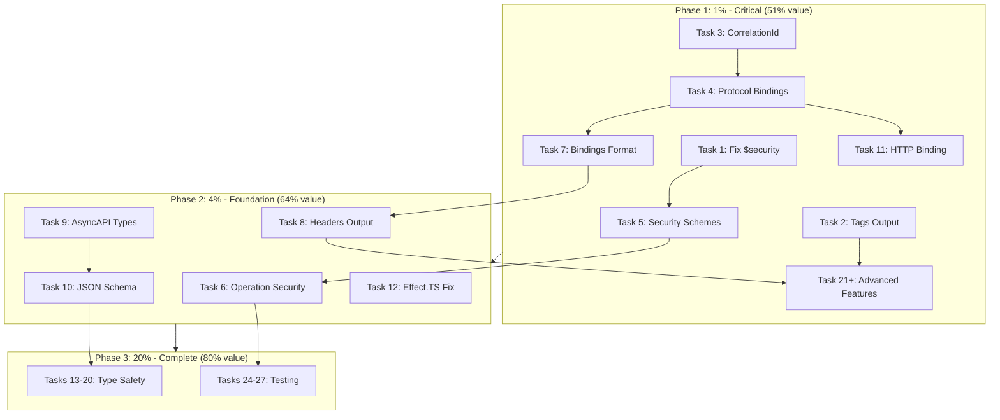
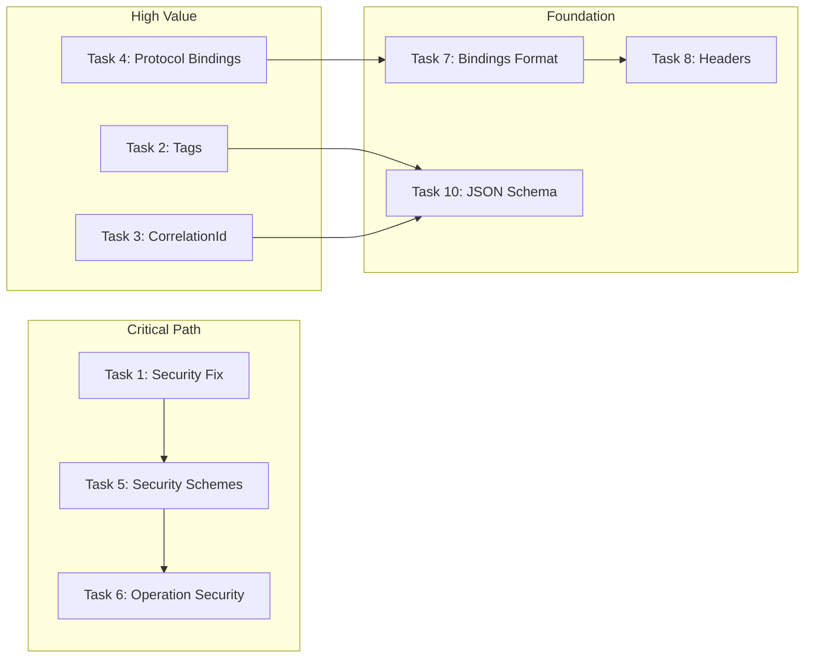

# TypeSpec AsyncAPI Emitter - Comprehensive Pareto Execution Plan

**Date:** 2026-03-20 23:40  
**Status:** Infrastructure Recovery → Full Feature Implementation  
**Goal:** Complete ALL TODO items using Pareto-optimized execution

---

## Executive Summary

This document provides a **Pareto-optimized execution plan** for completing the TypeSpec AsyncAPI Emitter. 

### The 80/20 Rule Applied

| Tier | Effort | Value | Tasks | Focus |
|------|--------|-------|-------|-------|
| **1%** | ~3 hours | 51% | Tasks 1-4 | Critical bugs + Core decorator output |
| **4%** | ~8 hours | 64% | Tasks 5-12 | Security + Protocol bindings + Headers |
| **20%** | ~40 hours | 80% | Tasks 13-27 | Full feature set + Type safety + Tests |

---

## Phase 1: The 1% (Critical Fixes - 51% of Value)

**Duration:** ~3 hours total  
**Impact:** Fixes broken features, enables core AsyncAPI spec compliance

### Task 1: Fix Broken $security Decorator [CRITICAL] ⏱️ 45min
**Status:** 🔴 BLOCKING  
**Impact:** HIGH - Security is completely broken  
**Effort:** MEDIUM  
**Customer Value:** CRITICAL

**Problem:** `$security` decorator validates but **never stores data** (line 278-295 in `minimal-decorators.ts`).

**Implementation:**
1. Add state storage call after validation in `$security`
2. Create `storeSecurityConfig` helper function
3. Update state symbols to include security data
4. Test with `@security` decorator usage

**Verification:**
- Security config appears in AsyncAPI output
- Pre-commit hooks pass
- Integration test validates security output

**Files:**
- `src/minimal-decorators.ts` (add storage)
- `src/state.ts` (add SecurityConfigData type)
- `src/emitter-alloy.tsx` (add security output)

---

### Task 2: Add Tags Output to Messages [HIGH VALUE] ⏱️ 30min
**Status:** 🟡 MISSING OUTPUT  
**Impact:** MEDIUM - Tags already stored, just not output  
**Effort:** LOW  
**Customer Value:** HIGH

**Problem:** `@tags` decorator stores data in `state.tags` but emitter never outputs it.

**Implementation:**
1. Add `tags` property to message objects in `buildComponents`
2. Read from `state.tags` map
3. Output array of tag names in AsyncAPI format

**Verification:**
- Tags appear in message components
- Example: `tags: ["user", "notification"]`

**Files:**
- `src/emitter-alloy.tsx` (modify buildComponents)

---

### Task 3: Add CorrelationId Output to Messages [HIGH VALUE] ⏱️ 35min
**Status:** 🟡 MISSING OUTPUT  
**Impact:** MEDIUM - CorrelationId stored, not output  
**Effort:** LOW  
**Customer Value:** HIGH

**Problem:** `@correlationId` decorator stores data in `state.correlationIds` but never output.

**Implementation:**
1. Add `correlationId` property to message objects
2. Read from `state.correlationIds` map
3. Output AsyncAPI 3.0 correlationId format

**Verification:**
- correlationId appears in message components
- Format: `{ location: "$message.header#/correlation-id" }`

**Files:**
- `src/emitter-alloy.tsx` (modify buildComponents)

---

### Task 4: Add Protocol Bindings to Channels [HIGH VALUE] ⏱️ 40min
**Status:** 🟡 MISSING OUTPUT  
**Impact:** MEDIUM - Protocol configs stored, not output  
**Effort:** MEDIUM  **Customer Value:** HIGH

**Problem:** `@protocol` decorator stores configs in `state.protocolConfigs` but channels don't use them.

**Implementation:**
1. Modify `buildChannels` to read `state.protocolConfigs`
2. Add `bindings` property to channel entries
3. Support Kafka, WebSocket, MQTT binding formats

**Verification:**
- Protocol bindings appear in channel definitions
- Kafka: `bindings.kafka.partitions`
- WebSocket: `bindings.ws.subprotocol`

**Files:**
- `src/emitter-alloy.tsx` (modify buildChannels)

---

## Phase 2: The 4% (Foundation Features - 64% of Value)

**Duration:** ~8 hours total  
**Impact:** Enables full AsyncAPI 3.0 compliance

### Task 5: Add Security Schemes to Components [HIGH] ⏱️ 50min
**Status:** 🔴 NOT IMPLEMENTED  
**Impact:** HIGH - Security schemes need output section  
**Effort:** MEDIUM  
**Customer Value:** CRITICAL

**Implementation:**
1. Create `buildSecuritySchemes` function in emitter
2. Add security schemes to AsyncAPI components section
3. Support apiKey, http, oauth2, openIdConnect schemes

**Files:**
- `src/emitter-alloy.tsx` (add buildSecuritySchemes)

---

### Task 6: Reference Security in Operations [HIGH] ⏱️ 40min
**Status:** 🔴 NOT IMPLEMENTED  
**Impact:** HIGH - Operations need security references  
**Effort:** MEDIUM  
**Customer Value:** HIGH

**Implementation:**
1. Add `security` property to operation definitions
2. Reference security schemes from operation
3. Support operation-level security overrides

**Files:**
- `src/emitter-alloy.tsx` (modify buildOperations)

---

### Task 7: Add Protocol Bindings Output [MEDIUM] ⏱️ 45min
**Status:** 🟡 STORED BUT NOT FORMATTED  
**Impact:** MEDIUM - Need proper AsyncAPI binding format  
**Effort:** MEDIUM  
**Customer Value:** MEDIUM

**Implementation:**
1. Format protocol bindings per AsyncAPI 3.0 spec
2. Handle protocol-specific properties (kafka, ws, mqtt)
3. Add bindings to messages and operations too

**Files:**
- `src/emitter-alloy.tsx` (enhance buildChannels, buildOperations, buildComponents)

---

### Task 8: Add Message Headers Output [MEDIUM] ⏱️ 50min
**Status:** 🟡 STORED BUT NOT OUTPUT  
**Impact:** MEDIUM - Headers stored, need AsyncAPI format  
**Effort:** MEDIUM  
**Customer Value:** MEDIUM

**Implementation:**
1. Add headers section to message components
2. Read from `state.messageHeaders`
3. Format as AsyncAPI header objects

**Files:**
- `src/emitter-alloy.tsx` (modify buildComponents for messages)

---

### Task 9: Create AsyncAPI 3.0 Types [MEDIUM] ⏱️ 60min
**Status:** 🔴 USING `Record<string, unknown>`  
**Impact:** MEDIUM - Type safety improvements  
**Effort:** MEDIUM  
**Customer Value:** MEDIUM

**Implementation:**
1. Create `AsyncAPI3Document` interface
2. Create `Channel`, `Message`, `Operation`, `Server` types
3. Replace `Record<string, unknown>` with proper types

**Files:**
- `src/types/asyncapi.ts` (new file)
- `src/emitter-alloy.tsx` (refactor to use types)

---

### Task 10: Implement JSON Schema Converter [HIGH] ⏱️ 90min
**Status:** 🔴 BASIC IMPLEMENTATION  
**Impact:** HIGH - Current schema conversion is minimal  
**Effort:** HIGH  
**Customer Value:** HIGH

**Implementation:**
1. Enhance `buildModelSchema` for complex types
2. Add union type handling
3. Add enum support
4. Add array item type references
5. Add discriminator support

**Files:**
- `src/emitter-alloy.tsx` (enhance buildModelSchema)
- Potentially new `src/schema-converter.ts`

---

### Task 11: Add HTTP Protocol Binding [MEDIUM] ⏱️ 45min
**Status:** 🟡 MENTIONED BUT NOT FULLY IMPLEMENTED  
**Impact:** MEDIUM - HTTP is common protocol  
**Effort:** MEDIUM  
**Customer Value:** MEDIUM

**Implementation:**
1. Add HTTP binding support to protocol configs
2. Handle query parameters, headers
3. Format per AsyncAPI HTTP binding spec

**Files:**
- `src/minimal-decorators.ts` (enhance $protocol)
- `src/emitter-alloy.tsx` (add HTTP bindings)

---

### Task 12: Fix Effect.TS Service Injection [MEDIUM] ⏱️ 60min
**Status:** 🟡 PARTIALLY BROKEN  
**Impact:** MEDIUM - Service layer needs fixes  
**Effort:** MEDIUM  
**Customer Value:** LOW (internal)

**Implementation:**
1. Review service registration in Effect
2. Fix dependency injection issues
3. Ensure proper layer composition

**Files:**
- `src/infrastructure/` (service layer)

---

## Phase 3: The 20% (Complete Feature Set - 80% of Value)

**Duration:** ~40 hours total  
**Impact:** Full AsyncAPI 3.0 compliance + Type safety

### Tasks 13-20: Type Safety & Code Quality

| # | Task | Time | Impact | Status |
|---|------|------|--------|--------|
| 13 | Add const assertions to diagnostics | 30min | LOW | Type safety |
| 14 | Group state keys by functionality | 35min | LOW | Maintenance |
| 15 | Extract diagnostic codes to enum | 40min | LOW | Maintenance |
| 16 | Add template parameter types | 45min | MEDIUM | Type safety |
| 17 | Add runtime validation for state | 50min | MEDIUM | Safety |
| 18 | Document all public APIs | 60min | MEDIUM | Documentation |
| 19 | Add library metadata to lib.ts | 25min | LOW | Documentation |
| 20 | Separate diagnostic groups | 35min | LOW | Organization |

### Tasks 21-27: Advanced Features & Testing

| # | Task | Time | Impact | Status |
|---|------|------|--------|--------|
| 21 | Add discriminator support | 60min | MEDIUM | Feature |
| 22 | Add union type conversion | 50min | MEDIUM | Feature |
| 23 | Add enum handling | 45min | MEDIUM | Feature |
| 24 | Write E2E tests for all decorators | 90min | HIGH | Testing |
| 25 | Write unit tests for emitter functions | 90min | HIGH | Testing |
| 26 | Add performance benchmarks | 60min | LOW | Quality |
| 27 | Create comprehensive example | 45min | MEDIUM | Documentation |

---

## Execution Graph

---

## Detailed Task Dependencies

---

## Risk Assessment

| Task | Risk | Mitigation |
|------|------|------------|
| Task 1 (Security Fix) | HIGH - Breaking change | Test thoroughly, increment version |
| Task 10 (JSON Schema) | MEDIUM - Complex types | Incremental implementation |
| Task 12 (Effect.TS) | MEDIUM - May cascade | Isolate changes, test services |
| Tasks 24-27 (Tests) | LOW - Time consuming | Parallel execution |

---

## Success Criteria

1. **Build:** Zero TypeScript errors, zero ESLint warnings
2. **Tests:** All tests passing (90%+ coverage)
3. **Output:** Complete AsyncAPI 3.0 spec generation
4. **Features:** All decorators properly output to YAML
5. **Quality:** Pre-commit hooks passing

---

## Next Steps

1. **Immediate:** Execute Tasks 1-4 (3 hours)
2. **Short-term:** Execute Tasks 5-12 (8 hours)
3. **Medium-term:** Execute Tasks 13-27 (40 hours)
4. **Final:** Full integration testing and release

---

*Generated: 2026-03-20 23:40*  
*Plan Version: 1.0*  
*Pareto Analysis: Applied*
