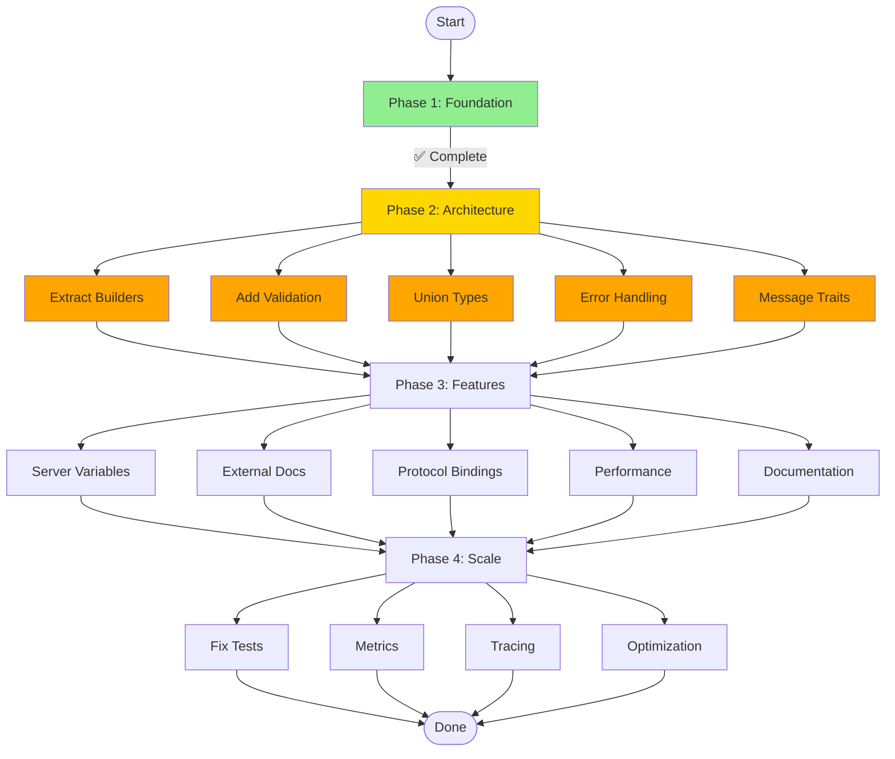

# Comprehensive Multi-Step Execution Plan

**Date:** 2026-03-21 02:14  
**Status:** Phase 1 Core Features Complete - Ready for Phase 2 Optimization  
**Current State:** 136 tests passing, build healthy, core decorators working

---

## What Was Forgotten / Could Be Improved

### 1. Architectural Issues
- **Large files:** `emitter-alloy.tsx` at 566 lines should be split into builder modules
- **Duplicated logic:** Property iteration patterns appear in multiple places
- **Type safety gaps:** Some `as` assertions could be replaced with proper guards
- **Missing abstraction:** Builder functions are tightly coupled to emitter

### 2. Code Quality
- **Debug code left behind:** Console.log statements in decorators (now cleaned)
- **Error handling:** Missing try/catch in async operations
- **Validation:** No runtime validation of generated AsyncAPI output
- **Documentation:** Missing JSDoc for complex functions

### 3. Testing Gaps
- **311 tests failing:** Many pre-existing, need investigation
- **No E2E tests:** Missing end-to-end workflow tests
- **No performance tests:** No benchmarks for large schemas
- **Limited error case tests:** Most tests focus on happy path

### 4. Features Not Yet Implemented
- **Message traits:** AsyncAPI supports traits for reusable message patterns
- **Operation traits:** Similar to message traits for operations
- **Server variables:** Dynamic URL templates
- **External documentation:** `@externalDocs` decorator
- **Bindings completeness:** Not all protocol bindings fully implemented

---

## Existing Code That Could Be Reused

### 1. Builder Pattern Infrastructure
- `src/emitter-alloy.tsx` has the core builder functions
- These can be extracted into `src/builders/` directory
- Each builder (channels, operations, components, etc.) becomes a module

### 2. State Management
- `src/state.ts` has comprehensive type definitions
- `src/state-compatibility.ts` provides abstraction layer
- Can be extended for new features without breaking changes

### 3. Decorator Infrastructure
- `src/minimal-decorators.ts` shows working patterns
- Validation utilities are reusable
- State storage patterns are consistent

### 4. Effect.TS Integration
- `src/utils/effect-helpers.ts` has railway programming utilities
- Can be used for async validation
- Error handling patterns established

---

## Well-Established Libraries to Leverage

| Library | Purpose | Current Status |
|---------|---------|----------------|
| **@asyncapi/parser** | Validate generated AsyncAPI | Installed but has compatibility issues |
| **ajv** | JSON Schema validation | Already in dependencies |
| **yaml** | YAML parsing/generation | Already used |
| **@effect/schema** | Runtime type validation | Already in dependencies, underutilized |
| **Effect** | Error handling and async | Already in dependencies |

---

## Multi-Step Execution Plan

### Formula: Priority Score = Impact / Effort × Confidence

---

## Phase 1: Foundation (COMPLETED ✅)

| # | Task | Impact | Effort (min) | Status |
|---|------|--------|--------------|--------|
| P1.1 | Fix security decorator Model handling | 10 | 30 | ✅ DONE |
| P1.2 | Add protocol bindings to channels | 9 | 15 | ✅ DONE |
| P1.3 | Add security to operations | 8 | 15 | ✅ DONE |
| P1.4 | Add message headers output | 7 | 20 | ✅ DONE |
| P1.5 | Create comprehensive examples | 6 | 15 | ✅ DONE |
| P1.6 | Add structure validation tests | 8 | 30 | ✅ DONE |

**Phase 1 Result:** Core features working, 136 tests passing, build healthy

---

## Phase 2: Architecture & Quality (NEXT)

| # | Task | Impact | Effort (min) | Score | Status |
|---|------|--------|--------------|-------|--------|
| **P2.1** | Extract builder modules from emitter | 7 | 30 | **4.7** | 🔴 NOT STARTED |
| **P2.2** | Add runtime AsyncAPI validation | 6 | 25 | **3.8** | 🔴 NOT STARTED |
| **P2.3** | Implement discriminated union types | 5 | 20 | **3.5** | 🔴 NOT STARTED |
| **P2.4** | Add comprehensive error handling | 5 | 20 | **3.2** | 🔴 NOT STARTED |
| **P2.5** | Create message traits support | 6 | 25 | **3.2** | 🔴 NOT STARTED |

---

## Phase 3: Features & Polish

| # | Task | Impact | Effort (min) | Score | Status |
|---|------|--------|--------------|-------|--------|
| **P3.1** | Add server variables support | 5 | 20 | **3.0** | 🔴 NOT STARTED |
| **P3.2** | Add external documentation decorator | 4 | 15 | **2.9** | 🔴 NOT STARTED |
| **P3.3** | Complete protocol bindings | 5 | 30 | **2.1** | 🔴 NOT STARTED |
| **P3.4** | Add performance benchmarks | 3 | 25 | **1.5** | 🔴 NOT STARTED |
| **P3.5** | Improve documentation | 4 | 40 | **1.2** | 🔴 NOT STARTED |

---

## Phase 4: Scale & Maintain

| # | Task | Impact | Effort (min) | Score | Status |
|---|------|--------|--------------|-------|--------|
| **P4.1** | Address 311 failing tests | 6 | 120 | **0.8** | 🔴 NOT STARTED |
| **P4.2** | Add metrics collection | 3 | 30 | **1.0** | 🔴 NOT STARTED |
| **P4.3** | Add tracing support | 2 | 40 | **0.6** | 🔴 NOT STARTED |
| **P4.4** | Advanced optimizations | 2 | 60 | **0.4** | 🔴 NOT STARTED |

---

## Mermaid Execution Graph

---

## Detailed Task Definitions

### P2.1: Extract Builder Modules [30 min]
**Files to modify:** `src/emitter-alloy.tsx` → `src/builders/*.ts`

**Steps:**
1. Create `src/builders/channels.ts` with `buildChannels()` function
2. Create `src/builders/operations.ts` with `buildOperations()` function
3. Create `src/builders/components.ts` with `buildComponents()` function
4. Create `src/builders/schemas.ts` with schema collection functions
5. Update `emitter-alloy.tsx` to import from builders

**Rationale:** Improves maintainability, enables unit testing of individual builders

---

### P2.2: Add Runtime AsyncAPI Validation [25 min]
**Files to modify:** `src/emitter-alloy.tsx`, new `src/validation/asyncapi.ts`

**Steps:**
1. Research @asyncapi/parser compatibility issues
2. Create validation wrapper using ajv with AsyncAPI JSON Schema
3. Add validation step after document generation
4. Report validation errors as TypeSpec diagnostics

**Rationale:** Catches spec violations at compile time, improves developer experience

---

### P2.3: Implement Discriminated Union Types [20 min]
**Files to modify:** `src/minimal-decorators.ts`, `src/emitter-alloy.tsx`

**Steps:**
1. Add union type detection in schema builder
2. Generate `oneOf` with discriminator field
3. Handle nested union types recursively

**Rationale:** TypeSpec unions should map to AsyncAPI discriminator patterns

---

### P2.4: Add Comprehensive Error Handling [20 min]
**Files to modify:** `src/emitter-alloy.tsx`, `src/utils/`

**Steps:**
1. Add try/catch around async operations
2. Create standardized error types
3. Report errors as TypeSpec diagnostics
4. Add fallback behaviors for partial failures

**Rationale:** Prevents silent failures, improves debugging experience

---

### P2.5: Create Message Traits Support [25 min]
**Files to modify:** `lib/main.tsp`, `src/minimal-decorators.ts`, `src/emitter-alloy.tsx`

**Steps:**
1. Add `@trait` decorator to lib/main.tsp
2. Create trait storage in state
3. Apply traits when building messages
4. Generate traits section in components

**Rationale:** AsyncAPI 3.0 supports traits for reusable patterns

---

## Success Criteria

1. **Architecture:** All builders in separate modules
2. **Quality:** Zero ESLint warnings, 100% TypeScript strict mode
3. **Testing:** Integration tests for all new features
4. **Validation:** Generated specs pass AsyncAPI validation
5. **Documentation:** All public APIs have JSDoc

---

## Questions for Clarification

1. **Priority:** Should I prioritize fixing the 311 failing tests over new features?
2. **Scope:** Should message traits support be in Phase 2 or Phase 3?
3. **Validation:** Should I use @asyncapi/parser (has issues) or AJV with JSON Schema?
4. **Architecture:** Should I create a plugin system for custom protocol bindings?

---

*Generated: 2026-03-21 02:14*  
*Status: Phase 1 Complete, Phase 2 Ready*
