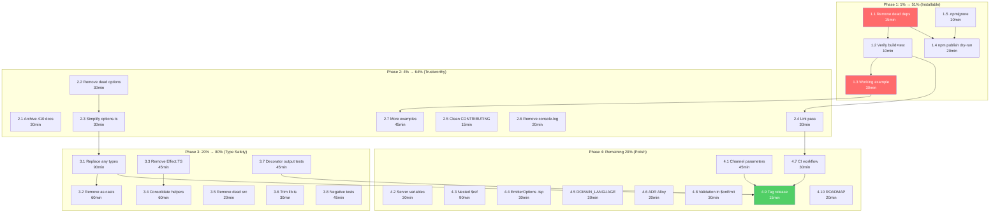

# SUPERB Comprehensive Pareto Execution Plan

**Created:** 2026-07-14 14:14
**Project:** `@lars-artmann/typespec-asyncapi`
**Current State:** 348 tests pass, 0 fail, 0 build errors, spec-compliant output

---

## Pareto Breakdown

### The 1% that delivers 51%: MAKE IT INSTALLABLE AND USABLE

A library nobody can install is worthless. Right now the package has never been published, examples don't compile, and dead dependencies bloat the install. This is THE blocker.

### The 4% that delivers 64%: MAKE THE REPO TRUSTWORTHY

410 stale docs, dead options that lie to consumers, no CI, no lint verification. A consumer who clones this repo will flee.

### The 20% that delivers 80%: TYPE SAFETY + TEST QUALITY

38 `any` types, 88 `as` casts, 12 Effect.TS test imports, 7 overlapping test helpers. This makes the code unmaintainable.

### The remaining 20%: SPEC COMPLETENESS + POLISH

Channel parameters, server variables, nested `$ref`, domain language docs, ADRs.

---

## PHASE 1: The 1% → 51% (Make it installable and usable)

| ID  | Task                                                                                                                                    | Impact   | Effort | Dependencies |
| --- | --------------------------------------------------------------------------------------------------------------------------------------- | -------- | ------ | ------------ |
| 1.1 | Remove dead dependencies from package.json (`@alloy-js/core`, `@effect/schema`, `@effect/eslint-plugin`, `@typespec/emitter-framework`) | CRITICAL | 15 min | None         |
| 1.2 | Verify `bun install && bun run build && bun test` passes after dep removal                                                              | CRITICAL | 10 min | 1.1          |
| 1.3 | Create one working example with `tspconfig.yaml` that compiles and produces correct output                                              | CRITICAL | 30 min | 1.2          |
| 1.4 | Verify `npm publish --dry-run` works and package size is reasonable                                                                     | HIGH     | 20 min | 1.1          |
| 1.5 | Add `.npmignore` to exclude test/docs/scripts from published package                                                                    | HIGH     | 10 min | None         |

**Phase 1 total: ~85 min**

---

## PHASE 2: The 4% → 64% (Make the repo trustworthy)

| ID  | Task                                                                                             | Impact | Effort | Dependencies |
| --- | ------------------------------------------------------------------------------------------------ | ------ | ------ | ------------ |
| 2.1 | Archive 410 stale docs into `docs/_archive/` (keep only current docs)                            | HIGH   | 30 min | None         |
| 2.2 | Remove dead emitter options from `asyncAPIEmitterOptions.ts` and `options.ts`                    | HIGH   | 30 min | None         |
| 2.3 | Simplify `options.ts` — remove 150-line AJV schema validation never used at runtime              | HIGH   | 30 min | 2.2          |
| 2.4 | Run `bun run lint` and fix all linting errors in `src/`                                          | HIGH   | 30 min | None         |
| 2.5 | Clean CONTRIBUTING.md — remove dead "plugin development" and "performance optimization" sections | MEDIUM | 15 min | None         |
| 2.6 | Remove debug `console.log` spam from test files                                                  | MEDIUM | 20 min | None         |
| 2.7 | Create 2 more working examples (kafka, multi-channel) with `tspconfig.yaml` and expected output  | HIGH   | 45 min | 1.3          |

**Phase 2 total: ~200 min**

---

## PHASE 3: The 20% → 80% (Type safety + test quality)

| ID  | Task                                                                                                       | Impact | Effort | Dependencies |
| --- | ---------------------------------------------------------------------------------------------------------- | ------ | ------ | ------------ |
| 3.1 | Replace `any` types in `AsyncAPISchemaEmitter` with proper TypeSpec types (`Model`, `Union`, `Enum`, etc.) | HIGH   | 90 min | None         |
| 3.2 | Remove unsafe `as` casts from emitter.ts where possible (88 casts, target: reduce to <20)                  | HIGH   | 60 min | 3.1          |
| 3.3 | Remove `Effect.TS` imports from 12 test files (replace `Effect.log` with nothing)                          | MEDIUM | 45 min | None         |
| 3.4 | Consolidate 7 test helper files into 2: `test-helpers.ts` (compilation) + `type-guards.ts` (assertions)    | MEDIUM | 60 min | 3.3          |
| 3.5 | Remove dead source files: `path-templates.ts`, `serialization-format-option.ts` (not used by emitter)      | MEDIUM | 20 min | None         |
| 3.6 | Trim `lib.ts` from 273 lines (remove excessive JSDoc, keep essential state + diagnostics)                  | LOW    | 30 min | None         |
| 3.7 | Add tests for `@tags`, `@correlationId`, `@header`, `@bindings` in output                                  | HIGH   | 45 min | None         |
| 3.8 | Add negative tests: invalid decorator usage, missing channel, conflicting pub/sub                          | MEDIUM | 45 min | None         |

**Phase 3 total: ~395 min**

---

## PHASE 4: The remaining 20% (Spec completeness + polish)

| ID   | Task                                                                         | Impact | Effort | Dependencies |
| ---- | ---------------------------------------------------------------------------- | ------ | ------ | ------------ |
| 4.1  | Emit channel `parameters` when address contains `{var}` expressions          | HIGH   | 45 min | None         |
| 4.2  | Add `variables` support to `@server` decorator and `ServerConfigData`        | MEDIUM | 30 min | None         |
| 4.3  | Use `$ref` for nested model references instead of full inlining              | HIGH   | 90 min | None         |
| 4.4  | Add `EmitterOptions` model to `lib/main.tsp` for IDE autocomplete            | MEDIUM | 30 min | None         |
| 4.5  | Write `docs/DOMAIN_LANGUAGE.md` (channel, operation, message, binding, etc.) | LOW    | 30 min | None         |
| 4.6  | Write ADR for Alloy rejection decision                                       | LOW    | 20 min | None         |
| 4.7  | Add GitHub Actions CI workflow (build + test + lint on every PR)             | HIGH   | 30 min | 2.4          |
| 4.8  | Wire AJV validation in `$onEmit` (emit diagnostics on invalid output)        | MEDIUM | 30 min | None         |
| 4.9  | Tag `v0.1.0-alpha` release                                                   | HIGH   | 15 min | All above    |
| 4.10 | Create `ROADMAP.md` with long-term vision                                    | LOW    | 20 min | None         |

**Phase 4 total: ~340 min**

---

## GRAND TOTAL: ~1020 min (~17 hours)

---

## Execution Order (sorted by impact/effort ratio)

| Order | ID   | Task                                | Impact   | Effort | Ratio |
| ----- | ---- | ----------------------------------- | -------- | ------ | ----- |
| 1     | 1.1  | Remove dead deps                    | CRITICAL | 15     | 10.0  |
| 2     | 1.2  | Verify build+test after dep removal | CRITICAL | 10     | 10.0  |
| 3     | 1.5  | Add `.npmignore`                    | HIGH     | 10     | 8.0   |
| 4     | 2.5  | Clean CONTRIBUTING.md               | MEDIUM   | 15     | 5.3   |
| 5     | 2.1  | Archive 410 docs                    | HIGH     | 30     | 5.0   |
| 6     | 3.5  | Remove dead source files            | MEDIUM   | 20     | 4.0   |
| 7     | 1.4  | Verify npm publish dry-run          | HIGH     | 20     | 4.0   |
| 8     | 2.6  | Remove console.log spam from tests  | MEDIUM   | 20     | 3.5   |
| 9     | 1.3  | Create working example              | CRITICAL | 30     | 3.3   |
| 10    | 4.1  | Channel parameters                  | HIGH     | 45     | 3.1   |
| 11    | 2.2  | Remove dead options                 | HIGH     | 30     | 3.0   |
| 12    | 2.4  | Run lint + fix errors               | HIGH     | 30     | 3.0   |
| 13    | 4.6  | ADR for Alloy rejection             | LOW      | 20     | 2.5   |
| 14    | 2.3  | Simplify options.ts                 | HIGH     | 30     | 2.3   |
| 15    | 3.3  | Remove Effect.TS from tests         | MEDIUM   | 45     | 2.2   |
| 16    | 4.7  | GitHub Actions CI                   | HIGH     | 30     | 2.2   |
| 17    | 4.9  | Tag alpha release                   | HIGH     | 15     | 2.0   |
| 18    | 4.8  | Wire validation in $onEmit          | MEDIUM   | 30     | 2.0   |
| 19    | 4.4  | EmitterOptions in lib/main.tsp      | MEDIUM   | 30     | 2.0   |
| 20    | 4.2  | Server variables                    | MEDIUM   | 30     | 2.0   |
| 21    | 3.7  | Tests for decorators in output      | HIGH     | 45     | 1.9   |
| 22    | 4.10 | Create ROADMAP.md                   | LOW      | 20     | 1.5   |
| 23    | 4.5  | DOMAIN_LANGUAGE.md                  | LOW      | 30     | 1.3   |
| 24    | 2.7  | More working examples               | HIGH     | 45     | 1.3   |
| 25    | 3.8  | Negative tests                      | MEDIUM   | 45     | 1.2   |
| 26    | 3.6  | Trim lib.ts JSDoc                   | LOW      | 30     | 1.0   |
| 27    | 3.4  | Consolidate test helpers            | MEDIUM   | 60     | 1.0   |
| 28    | 3.1  | Replace `any` types                 | HIGH     | 90     | 1.0   |
| 29    | 3.2  | Remove `as` casts                   | HIGH     | 60     | 0.9   |
| 30    | 4.3  | Nested model `$ref`                 | HIGH     | 90     | 0.9   |

---

## Mermaid Execution Graph

---

## Micro-Task Breakdown (max 12 min each)

### Phase 1 Micro-Tasks

| ID    | Micro-Task                                                                                | Parent | Est    |
| ----- | ----------------------------------------------------------------------------------------- | ------ | ------ |
| M1.1a | Remove `@alloy-js/core` from package.json dependencies                                    | 1.1    | 2 min  |
| M1.1b | Remove `@effect/schema` from package.json dependencies                                    | 1.1    | 2 min  |
| M1.1c | Remove `@effect/eslint-plugin` from package.json devDependencies                          | 1.1    | 2 min  |
| M1.1d | Remove `@typespec/emitter-framework` from package.json dependencies (verify not imported) | 1.1    | 5 min  |
| M1.1e | Run `bun install` and verify lock file updated                                            | 1.1    | 2 min  |
| M1.2a | Run `bunx tsc -p tsconfig.json` — verify 0 errors                                         | 1.2    | 3 min  |
| M1.2b | Run `bun test` — verify 348 pass, 0 fail                                                  | 1.2    | 5 min  |
| M1.3a | Create `examples/simple/main.tsp` with namespace, model, @channel, op                     | 1.3    | 5 min  |
| M1.3b | Create `examples/simple/tspconfig.yaml` pointing to emitter                               | 1.3    | 5 min  |
| M1.3c | Run `bunx tsp compile examples/simple/main.tsp --emit .` and verify output                | 1.3    | 10 min |
| M1.3d | Commit expected output alongside example                                                  | 1.3    | 5 min  |
| M1.4a | Run `npm publish --dry-run` and check output size                                         | 1.4    | 10 min |
| M1.4b | Fix any issues (missing files, wrong paths in package.json)                               | 1.4    | 10 min |
| M1.5a | Create `.npmignore` excluding test/, docs/, scripts/, examples/                           | 1.5    | 5 min  |
| M1.5b | Verify `npm pack` output only includes dist/, lib/, README, LICENSE                       | 1.5    | 5 min  |

### Phase 2 Micro-Tasks

| ID    | Micro-Task                                                                                                                                                                              | Parent | Est    |
| ----- | --------------------------------------------------------------------------------------------------------------------------------------------------------------------------------------- | ------ | ------ |
| M2.1a | Create `docs/_archive/` directory                                                                                                                                                       | 2.1    | 1 min  |
| M2.1b | Move `docs/planning/` → `docs/_archive/planning/`                                                                                                                                       | 2.1    | 2 min  |
| M2.1c | Move `docs/status/` → `docs/_archive/status/` (keep current report)                                                                                                                     | 2.1    | 2 min  |
| M2.1d | Move `docs/sessions/`, `docs/architecture/`, `docs/adr/` → `docs/_archive/`                                                                                                             | 2.1    | 5 min  |
| M2.1e | Move `docs/analysis/`, `docs/github-issues/`, `docs/github-updates/` → `docs/_archive/`                                                                                                 | 2.1    | 5 min  |
| M2.1f | Move `docs/recovery/`, `docs/releases/`, `docs/reports/` → `docs/_archive/`                                                                                                             | 2.1    | 5 min  |
| M2.1g | Move `docs/architecture-understanding/`, `docs/testing/`, `docs/learnings/` → `docs/_archive/`                                                                                          | 2.1    | 5 min  |
| M2.1h | Move `docs/issues/`, `docs/prompts/` → `docs/_archive/`                                                                                                                                 | 2.1    | 3 min  |
| M2.1i | Move `archive/` → `docs/_archive/legacy/`                                                                                                                                               | 2.1    | 2 min  |
| M2.2a | Identify dead options from FEATURES.md: `protocol-bindings`, `versioning`, `security-schemes`, `validate-spec`, `omit-unreachable-types`, `include-source-info`, `source-maps`, `debug` | 2.2    | 5 min  |
| M2.2b | Remove dead options from `asyncAPIEmitterOptions.ts` type                                                                                                                               | 2.2    | 5 min  |
| M2.2c | Remove dead options from `options.ts` DEFAULT_OPTIONS                                                                                                                                   | 2.2    | 5 min  |
| M2.2d | Remove dead options from `options.ts` SCHEMA_PROPERTIES                                                                                                                                 | 2.2    | 10 min |
| M2.2e | Remove dead option validation functions from `options.ts`                                                                                                                               | 2.2    | 5 min  |
| M2.3a | Delete `ASYNC_API_EMITTER_OPTIONS_SCHEMA` constant (never used at runtime)                                                                                                              | 2.3    | 5 min  |
| M2.3b | Delete `parseAsyncAPIEmitterOptions` function (never called)                                                                                                                            | 2.3    | 3 min  |
| M2.3c | Delete `isAsyncAPIEmitterOptions` function (never called)                                                                                                                               | 2.3    | 3 min  |
| M2.3d | Delete `validateAsyncAPIEmitterOptions` function (never called)                                                                                                                         | 2.3    | 3 min  |
| M2.3e | Verify build + tests pass after options cleanup                                                                                                                                         | 2.3    | 5 min  |
| M2.4a | Run `bun run lint` and capture all errors                                                                                                                                               | 2.4    | 3 min  |
| M2.4b | Fix lint errors one file at a time                                                                                                                                                      | 2.4    | 12 min |
| M2.4c | Fix remaining lint errors                                                                                                                                                               | 2.4    | 12 min |
| M2.5a | Remove "Plugin development" section from CONTRIBUTING.md                                                                                                                                | 2.5    | 3 min  |
| M2.5b | Remove "Performance optimization" section from CONTRIBUTING.md                                                                                                                          | 2.5    | 3 min  |
| M2.5c | Remove any other references to deleted systems                                                                                                                                          | 2.5    | 5 min  |
| M2.6a | Find all `console.log` in test files                                                                                                                                                    | 2.6    | 3 min  |
| M2.6b | Remove console.log from test/integration/ files                                                                                                                                         | 2.6    | 8 min  |
| M2.6c | Remove console.log from test/e2e/ files                                                                                                                                                 | 2.6    | 8 min  |
| M2.7a | Create `examples/kafka/main.tsp` with @protocol kafka                                                                                                                                   | 2.7    | 10 min |
| M2.7b | Create `examples/kafka/tspconfig.yaml`                                                                                                                                                  | 2.7    | 3 min  |
| M2.7c | Verify kafka example compiles and check output                                                                                                                                          | 2.7    | 10 min |
| M2.7d | Create `examples/multi-channel/main.tsp`                                                                                                                                                | 2.7    | 10 min |
| M2.7e | Create `examples/multi-channel/tspconfig.yaml`                                                                                                                                          | 2.7    | 3 min  |
| M2.7f | Verify multi-channel example compiles                                                                                                                                                   | 2.7    | 10 min |

### Phase 3 Micro-Tasks

| ID    | Micro-Task                                                                                              | Parent | Est    |
| ----- | ------------------------------------------------------------------------------------------------------- | ------ | ------ |
| M3.1a | Replace `modelDeclaration(model: any)` → `modelDeclaration(model: Model)`                               | 3.1    | 5 min  |
| M3.1b | Replace `collectProperties(m: any)` → `collectProperties(m: Model)`                                     | 3.1    | 5 min  |
| M3.1c | Replace `modelLiteral(model: any)` → `modelLiteral(model: Model)`                                       | 3.1    | 3 min  |
| M3.1d | Replace `modelProperties(model: any)` → `modelProperties(model: Model)`                                 | 3.1    | 3 min  |
| M3.1e | Replace `modelProperty(prop: any)` → `modelProperty(prop: ModelProperty)`                               | 3.1    | 3 min  |
| M3.1f | Replace `union(union: any)` → `union(union: Union)`                                                     | 3.1    | 5 min  |
| M3.1g | Replace `enum(en: any)` → `enum(en: Enum)`                                                              | 3.1    | 3 min  |
| M3.1h | Replace `scalar(scalar: any)` → `scalar(scalar: Scalar)`                                                | 3.1    | 3 min  |
| M3.1i | Replace remaining `any` in tuple/array/stringLiteral/etc methods                                        | 3.1    | 10 min |
| M3.1j | Replace `typeToSchema(t: any)` → `typeToSchema(t: Type)`                                                | 3.1    | 5 min  |
| M3.1k | Replace `program: any` → `program: Program` in helper functions                                         | 3.1    | 5 min  |
| M3.1l | Replace `collectFrom(ns: any)` → `collectFrom(ns: Namespace)`                                           | 3.1    | 3 min  |
| M3.1m | Verify build + tests pass after type fixes                                                              | 3.1    | 5 min  |
| M3.2a | Audit `as` casts — categorize which are necessary vs unnecessary                                        | 3.2    | 12 min |
| M3.2b | Remove unnecessary `as` casts in emitter.ts buildAsyncAPIDocument                                       | 3.2    | 12 min |
| M3.2c | Remove unnecessary `as` casts in state consolidation                                                    | 3.2    | 12 min |
| M3.2d | Remove unnecessary `as` casts in state-writers.ts                                                       | 3.2    | 12 min |
| M3.2e | Verify build + tests pass                                                                               | 3.2    | 5 min  |
| M3.3a | List all 12 test files importing `effect`                                                               | 3.3    | 3 min  |
| M3.3b | Remove `import { Effect } from "effect"` from each file                                                 | 3.3    | 10 min |
| M3.3c | Remove `Effect.log()` calls from each file                                                              | 3.3    | 10 min |
| M3.3d | Verify tests still pass                                                                                 | 3.3    | 5 min  |
| M3.4a | Identify which test helper files are actually imported                                                  | 3.4    | 5 min  |
| M3.4b | Merge `clean-test-helper.ts`, `simple-test-helper.ts`, `emitter-test-helpers.ts` into `test-helpers.ts` | 3.4    | 12 min |
| M3.4c | Merge `library-test-helper.ts` into `test-helpers.ts`                                                   | 3.4    | 12 min |
| M3.4d | Update all imports across test files                                                                    | 3.4    | 12 min |
| M3.4e | Delete merged helper files                                                                              | 3.4    | 3 min  |
| M3.4f | Verify tests still pass                                                                                 | 3.4    | 5 min  |
| M3.5a | Verify `path-templates.ts` is not imported by any src/ file                                             | 3.5    | 3 min  |
| M3.5b | Verify `serialization-format-option.ts` is not imported by any src/ file                                | 3.5    | 3 min  |
| M3.5c | If only test-imported, keep in test/ or delete if tests also unused                                     | 3.5    | 10 min |
| M3.6a | Remove verbose JSDoc blocks from `lib.ts` (keep 1-line comments)                                        | 3.6    | 12 min |
| M3.6b | Remove verbose JSDoc blocks from `minimal-decorators.ts`                                                | 3.6    | 12 min |
| M3.7a | Write test: `@tags(["a","b"])` appears as tags on operation                                             | 3.7    | 10 min |
| M3.7b | Write test: `@correlationId(...)` appears on message                                                    | 3.7    | 10 min |
| M3.7c | Write test: `@header(...)` appears as headers schema on message                                         | 3.7    | 10 min |
| M3.7d | Write test: `@bindings(...)` appears on operation and message                                           | 3.7    | 10 min |
| M3.8a | Write test: @channel with empty path → diagnostic error                                                 | 3.8    | 10 min |
| M3.8b | Write test: @server with missing url → diagnostic error                                                 | 3.8    | 10 min |
| M3.8c | Write test: op with no @channel → still works (auto-discovered)                                         | 3.8    | 10 min |

### Phase 4 Micro-Tasks

| ID     | Micro-Task                                                                          | Parent | Est    |
| ------ | ----------------------------------------------------------------------------------- | ------ | ------ |
| M4.1a  | Read spec on channel parameters format                                              | 4.1    | 5 min  |
| M4.1b  | Add `parameters` field to `ChannelObject` type                                      | 4.1    | 3 min  |
| M4.1c  | Wire `state.channels` parameters data into channel output                           | 4.1    | 12 min |
| M4.1d  | Write test for channel with `{orderId}` parameter                                   | 4.1    | 10 min |
| M4.2a  | Add `variables` field to `ServerConfigData` and `ServerObject`                      | 4.2    | 5 min  |
| M4.2b  | Wire server variables into emitter output                                           | 4.2    | 10 min |
| M4.2c  | Write test for server with variables                                                | 4.2    | 10 min |
| M4.3a  | Research how `@typespec/openapi3` handles nested `$ref`                             | 4.3    | 12 min |
| M4.3b  | Modify `modelDeclaration` to emit `$ref` for model-typed properties                 | 4.3    | 12 min |
| M4.3c  | Ensure nested model schemas appear in `components.schemas`                          | 4.3    | 12 min |
| M4.3d  | Write test for nested model `$ref`                                                  | 4.3    | 10 min |
| M4.3e  | Update golden file if output changes                                                | 4.3    | 5 min  |
| M4.4a  | Define `EmitterOptions` model in `lib/main.tsp` matching TypeScript type            | 4.4    | 12 min |
| M4.4b  | Verify IDE autocomplete works in `tspconfig.yaml`                                   | 4.4    | 5 min  |
| M4.5a  | Create `docs/DOMAIN_LANGUAGE.md` with AsyncAPI terms                                | 4.5    | 12 min |
| M4.5b  | Add TypeSpec-specific terms (decorator mapping)                                     | 4.5    | 10 min |
| M4.6a  | Write ADR: context (Alloy vs asset-emitter), decision (asset-emitter), consequences | 4.6    | 12 min |
| M4.7a  | Create `.github/workflows/ci.yml` with build + test + lint                          | 4.7    | 12 min |
| M4.7b  | Verify CI passes locally with `act` or manual run                                   | 4.7    | 5 min  |
| M4.8a  | Import AJV + asyncapi schema in emitter.ts                                          | 4.8    | 5 min  |
| M4.8b  | Add validation step after building document, before emitFile                        | 4.8    | 12 min |
| M4.8c  | Emit diagnostics on validation failure                                              | 4.8    | 10 min |
| M4.9a  | Update package.json version to `0.1.0-alpha`                                        | 4.9    | 2 min  |
| M4.9b  | Git tag `v0.1.0-alpha`                                                              | 4.9    | 2 min  |
| M4.9c  | Create GitHub release                                                               | 4.9    | 10 min |
| M4.10a | Create `ROADMAP.md` with long-term vision sections                                  | 4.10   | 12 min |

---

## Micro-Task Grand Total

| Phase     | Tasks               | Total Time           |
| --------- | ------------------- | -------------------- |
| Phase 1   | 16 micro-tasks      | ~85 min              |
| Phase 2   | 35 micro-tasks      | ~200 min             |
| Phase 3   | 38 micro-tasks      | ~395 min             |
| Phase 4   | 27 micro-tasks      | ~340 min             |
| **TOTAL** | **116 micro-tasks** | **~1020 min (~17h)** |
