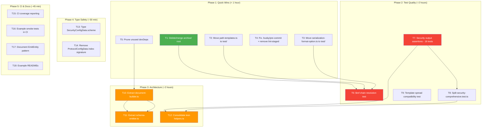

# TypeSpec 1.13 Alignment & Quality Overhaul

**Date:** 2026-07-14 16:47
**Goal:** Transform the project from "compiles and passes" to "tests prove correctness, code is maintainable, deps are lean"

---

## Context

### TypeSpec 1.13.0 Assessment

The project is **already on TypeSpec 1.13.0** (`@typespec/compiler: ^1.13.0` in package.json).

Key 1.13.0 changes and their impact on this project:

| Change                                                           | Impact on Us                                                                                         |
| ---------------------------------------------------------------- | ---------------------------------------------------------------------------------------------------- |
| `deepClone` deprecated → `structuredClone`                       | **None** — we don't use `deepClone` anywhere                                                         |
| Project config (`kind: project`, `entrypoint` in tspconfig.yaml) | **Low** — could clean up example tspconfig.yaml files but not critical                               |
| Late-bound member resolution (template spreads, `is` bases)      | **Medium** — could fix edge cases in schema generation for complex template patterns. Worth testing. |
| `internal` modifier no longer experimental                       | **Low** — not currently used but could be useful for internal-only models in the future              |
| Circular reference detection fixes                               | **Medium** — may fix edge cases in recursive model generation                                        |
| `@tagMetadata` summary/kind/array form                           | **None** — we have our own `@tags` decorator, not TypeSpec's `@tagMetadata`                          |
| Function argument validation                                     | **Low** — stricter validation is good for us                                                         |

**Conclusion:** No urgent migration work needed. The project is already aligned with 1.13.0. One opportunity: test complex template spread patterns against the new late-bound member resolution to verify schema generation handles them correctly.

### Current Quality State

```
Build:  0 TypeScript errors
Lint:   0 errors, 0 warnings
Tests:  283 pass, 0 fail, 0 skip, 0 todo (974 expect() calls)
LOC:    2,452 src / 11,512 test / 13,964 total
Deps:   3 runtime, 15 dev
```

### Critical Gap: Tests Don't Prove Correctness

The 283 passing tests create a **false sense of security**:

- **81 security tests** assert only `spec.asyncapi === "3.0.0"` — they would all pass if the emitter silently dropped every security scheme
- **No test** verifies the full `$ref` chain (operation -> channel -> message -> schema)
- **3 different test compilation APIs** coexist in `test-helpers.ts` — nobody knows which to use
- **emitter.ts is 831 lines** — schema generation, document assembly, and file emission are all in one function

---

## Pareto Breakdown

### The 1% That Delivers 51% of the Result

| #   | Task                                                                                    | Why                                                                                                |
| --- | --------------------------------------------------------------------------------------- | -------------------------------------------------------------------------------------------------- |
| 1   | Make 16 representative security tests assert actual `components.securitySchemes` output | Transforms 81 false-green tests into real regression protection. The other 65 stay as smoke tests. |

### The 4% That Delivers 64% of the Result

| #   | Task                                                                                       | Why                                                    |
| --- | ------------------------------------------------------------------------------------------ | ------------------------------------------------------ |
| 1   | (above)                                                                                    |                                                        |
| 2   | Move `path-templates.ts` and `serialization-format-option.ts` from `src/` to `test/utils/` | Test-only code ships in npm package for no reason.     |
| 3   | Consolidate `archive/` root directory (46 files) into `docs/_archive/` or delete           | Repo root clutter makes the project look unmaintained. |

### The 20% That Delivers 80% of the Result

| #   | Task                                                                                   | Why                                                              |
| --- | -------------------------------------------------------------------------------------- | ---------------------------------------------------------------- |
| 1-3 | (above)                                                                                |                                                                  |
| 4   | Split `emitter.ts` (831 lines) into schema emitter + document builder + entry point    | Monolith is the #1 maintainability blocker.                      |
| 5   | Consolidate `test-helpers.ts` (649 lines, 3 APIs) into a single clean API              | Every new test author hits this confusion.                       |
| 6   | Fix `.husky/pre-commit` (uses `just`, broken on NixOS) and remove dead `lint-staged`   | Pre-commit hook is currently unusable.                           |
| 7   | Verify and prune unused devDeps (`@typespec/http`, `@typespec/openapi3`, `glob`, etc.) | 7 devDeps may be dead weight.                                    |
| 8   | Add `$ref` chain resolution test (operation -> channel -> message -> schema)           | No test currently proves the core output chain works end-to-end. |

### The Other 20% to Get to 100%

| #   | Task                                                                            | Why                                                             |
| --- | ------------------------------------------------------------------------------- | --------------------------------------------------------------- |
| 9   | Type `SecurityConfigData.scheme` properly (currently `Record<string, unknown>`) | Stringly-typed security schemes.                                |
| 10  | Remove `[key: string]: unknown` index signature from `ProtocolConfigData`       | Allows arbitrary keys, defeats type safety.                     |
| 11  | Split `security-comprehensive.test.ts` (2,784 lines) into focused files         | Navigation nightmare.                                           |
| 12  | Add CI coverage reporting                                                       | No visibility into actual coverage.                             |
| 13  | Add `tsp compile` smoke test to CI for examples/                                | Examples could break silently.                                  |
| 14  | Document `EmitEntity<T>` narrowing pattern in AGENTS.md                         | Non-obvious pattern, hard for contributors.                     |
| 15  | Add READMEs to example directories without them                                 | Examples are incomplete without context.                        |
| 16  | Test complex template spread patterns (TypeSpec 1.13 late-bound members)        | Verify our schema generation handles new compiler capabilities. |

---

## Execution Plan (100-30 min tasks)

Sorted by: Impact (descending) > Effort (ascending) > Dependencies

| Phase                | Task # | Task                                                                         | Impact | Effort | Depends On |
| -------------------- | ------ | ---------------------------------------------------------------------------- | ------ | ------ | ---------- |
| **P1: Quick Wins**   | T1     | Delete or merge `archive/` root directory (46 files)                         | HIGH   | 10 min | -          |
|                      | T2     | Move `path-templates.ts` to `test/utils/`                                    | MEDIUM | 10 min | -          |
|                      | T3     | Move `serialization-format-option.ts` to `test/utils/`                       | MEDIUM | 10 min | -          |
|                      | T4     | Remove dead `lint-staged` dep + fix `.husky/pre-commit` to use `bun`         | HIGH   | 15 min | -          |
|                      | T5     | Verify and remove unused devDeps                                             | MEDIUM | 15 min | -          |
| **P2: Test Quality** | T6     | Add `$ref` chain resolution test (operation -> channel -> message -> schema) | HIGH   | 30 min | -          |
|                      | T7     | Make 16 representative security tests assert actual `securitySchemes` output | HIGH   | 30 min | -          |
|                      | T8     | Split `security-comprehensive.test.ts` into focused files                    | MEDIUM | 30 min | T7         |
|                      | T9     | Test complex template spread patterns (1.13 compatibility)                   | LOW    | 20 min | -          |
| **P3: Architecture** | T10    | Extract `buildAsyncAPIDocument` into `src/document-builder.ts`               | HIGH   | 45 min | -          |
|                      | T11    | Extract `AsyncAPISchemaEmitter` class into `src/schema-emitter.ts`           | HIGH   | 30 min | T10        |
|                      | T12    | Consolidate `test-helpers.ts` to single compilation API                      | HIGH   | 45 min | -          |
| **P4: Type Safety**  | T13    | Type `SecurityConfigData.scheme` properly                                    | MEDIUM | 15 min | -          |
|                      | T14    | Remove `[key: string]: unknown` from `ProtocolConfigData`                    | MEDIUM | 20 min | -          |
| **P5: CI & Docs**    | T15    | Add coverage reporting to CI                                                 | LOW    | 15 min | -          |
|                      | T16    | Add `tsp compile` smoke test to CI for examples/                             | MEDIUM | 20 min | -          |
|                      | T17    | Document `EmitEntity<T>` pattern in AGENTS.md                                | MEDIUM | 10 min | -          |
|                      | T18    | Add READMEs to example directories                                           | LOW    | 15 min | -          |

---

## Micro-Tasks (max 12 min each)

### Phase 1: Quick Wins (T1-T5)

| Task                                        | Sub-Task                                                                                                                       | Effort |
| ------------------------------------------- | ------------------------------------------------------------------------------------------------------------------------------ | ------ |
| **T1: archive/ cleanup**                    | T1.1: Read 3 sample files from archive/ to assess content type                                                                 | 3 min  |
|                                             | T1.2: Move archive/ contents to docs/\_archive/root-archive/                                                                   | 3 min  |
|                                             | T1.3: Verify no source/test file references archive/ path                                                                      | 2 min  |
|                                             | T1.4: Build + test + commit                                                                                                    | 4 min  |
| **T2: Move path-templates.ts**              | T2.1: `git mv src/domain/models/path-templates.ts test/utils/`                                                                 | 2 min  |
|                                             | T2.2: Update all imports in test files                                                                                         | 5 min  |
|                                             | T2.3: Build + test + commit                                                                                                    | 5 min  |
| **T3: Move serialization-format-option.ts** | T3.1: `git mv src/domain/models/serialization-format-option.ts test/utils/`                                                    | 2 min  |
|                                             | T3.2: Update all imports in test files                                                                                         | 5 min  |
|                                             | T3.3: Build + test + commit                                                                                                    | 5 min  |
| **T4: Fix pre-commit + lint-staged**        | T4.1: Remove `lint-staged` from devDeps                                                                                        | 2 min  |
|                                             | T4.2: Rewrite `.husky/pre-commit` to use `bun run build && bun run lint && bun test test/integration/real-compilation.test.ts` | 3 min  |
|                                             | T4.3: Build + test + commit                                                                                                    | 5 min  |
| **T5: Prune unused devDeps**                | T5.1: grep src/ and test/ for `@typespec/http` imports                                                                         | 2 min  |
|                                             | T5.2: grep src/ and test/ for `@typespec/openapi3` imports                                                                     | 2 min  |
|                                             | T5.3: grep src/ and test/ for `glob` imports                                                                                   | 2 min  |
|                                             | T5.4: grep src/ and test/ for `@asyncapi/cli` and `@asyncapi/parser` imports                                                   | 2 min  |
|                                             | T5.5: Remove confirmed-unused deps, run `bun install`                                                                          | 2 min  |
|                                             | T5.6: Build + test + commit                                                                                                    | 2 min  |

### Phase 2: Test Quality (T6-T9)

| Task                               | Sub-Task                                                                         | Effort |
| ---------------------------------- | -------------------------------------------------------------------------------- | ------ |
| **T6: $ref chain test**            | T6.1: Write test that compiles a simple channel + message + model                | 8 min  |
|                                    | T6.2: Assert operation.messages[0].$ref points to channel path                   | 3 min  |
|                                    | T6.3: Assert channel.messages[ref].$ref points to components/messages            | 3 min  |
|                                    | T6.4: Assert components.messages[ref].payload.$ref points to components/schemas  | 3 min  |
|                                    | T6.5: Assert the final schema has correct properties                             | 3 min  |
|                                    | T6.6: Build + test + commit                                                      | 5 min  |
| **T7: Security output assertions** | T7.1: Write helper function `assertSecurityScheme(spec, name, expected)`         | 5 min  |
|                                    | T7.2: Add assertions to 2 HTTP auth tests (basic, bearer)                        | 5 min  |
|                                    | T7.3: Add assertions to 2 API key tests (header, query)                          | 5 min  |
|                                    | T7.4: Add assertions to 2 OAuth2 tests (auth code, client creds)                 | 5 min  |
|                                    | T7.5: Add assertions to 2 SASL tests (plain, SCRAM)                              | 5 min  |
|                                    | T7.6: Add assertions to 2 mutual TLS tests                                       | 3 min  |
|                                    | T7.7: Add assertions to 2 OpenID Connect tests                                   | 3 min  |
|                                    | T7.8: Add assertions to 2 combined security tests                                | 3 min  |
|                                    | T7.9: Add assertions to 2 certificate/X509 tests                                 | 3 min  |
|                                    | T7.10: Build + test + commit                                                     | 5 min  |
| **T8: Split security tests**       | T8.1: Create `test/domain/security-http.test.ts` with HTTP auth tests            | 8 min  |
|                                    | T8.2: Create `test/domain/security-apikey.test.ts` with API key tests            | 8 min  |
|                                    | T8.3: Create `test/domain/security-oauth.test.ts` with OAuth2/OpenID tests       | 8 min  |
|                                    | T8.4: Create `test/domain/security-sasl-mtls.test.ts` with SASL/MTLS tests       | 8 min  |
|                                    | T8.5: Create `test/domain/security-combined.test.ts` with combined feature tests | 8 min  |
|                                    | T8.6: Delete original `security-comprehensive.test.ts`                           | 2 min  |
|                                    | T8.7: Build + test + commit                                                      | 5 min  |
| **T9: Template spread test**       | T9.1: Write TypeSpec with template spread pattern                                | 5 min  |
|                                    | T9.2: Compile and verify schema output is correct                                | 5 min  |
|                                    | T9.3: Build + test + commit                                                      | 2 min  |

### Phase 3: Architecture (T10-T12)

| Task                                 | Sub-Task                                                                                                 | Effort |
| ------------------------------------ | -------------------------------------------------------------------------------------------------------- | ------ |
| **T10: Extract document-builder.ts** | T10.1: Create `src/document-builder.ts`                                                                  | 2 min  |
|                                      | T10.2: Move `buildAsyncAPIDocument` + helpers (`inferActionFromName`, `extractChannelParameters`)        | 8 min  |
|                                      | T10.3: Move `generateSchemas`, `isStdlibType`, `collectAllStdlibNames`                                   | 5 min  |
|                                      | T10.4: Update emitter.ts imports                                                                         | 3 min  |
|                                      | T10.5: Build + test + commit                                                                             | 5 min  |
|                                      | T10.6: Verify file sizes are under 370 lines (AGENTS.md constraint)                                      | 2 min  |
|                                      | T10.7: Adjust if any file exceeds 370 lines                                                              | 10 min |
| **T11: Extract schema-emitter.ts**   | T11.1: Create `src/schema-emitter.ts`                                                                    | 2 min  |
|                                      | T11.2: Move `AsyncAPISchemaEmitter` class + `intrinsicToSchema` + `extractValue`                         | 8 min  |
|                                      | T11.3: Update document-builder.ts imports                                                                | 3 min  |
|                                      | T11.4: Build + test + commit                                                                             | 5 min  |
|                                      | T11.5: Verify all files under 370 lines                                                                  | 2 min  |
| **T12: Consolidate test-helpers.ts** | T12.1: Choose single API (keep `compileAsyncAPISpecRaw` + `compileAsyncAPISpecWithoutErrors`)            | 3 min  |
|                                      | T12.2: Rewrite `createAsyncAPITestHost` + `compileAndGetAsyncAPI` as thin wrappers around the chosen API | 8 min  |
|                                      | T12.3: Update all test files that use legacy API                                                         | 8 min  |
|                                      | T12.4: Remove deprecated APIs from test-helpers.ts                                                       | 3 min  |
|                                      | T12.5: Build + test + commit                                                                             | 5 min  |

### Phase 4: Type Safety (T13-T14)

| Task                                               | Sub-Task                                                                                                                                                                         | Effort |
| -------------------------------------------------- | -------------------------------------------------------------------------------------------------------------------------------------------------------------------------------- | ------ |
| **T13: Type SecurityConfigData.scheme**            | T13.1: Define `SecuritySchemeType` union (`"http" \| "apiKey" \| "oauth2" \| "openIdConnect" \| "mutualTLS" \| "plain" \| "scramSha256" \| "scramSha512" \| "gssapi" \| "X509"`) | 5 min  |
|                                                    | T13.2: Define `SecurityScheme` interface with discriminated fields per type                                                                                                      | 8 min  |
|                                                    | T13.3: Update `SecurityConfigData` to use new type                                                                                                                               | 3 min  |
|                                                    | T13.4: Update emitter.ts security scheme building                                                                                                                                | 3 min  |
|                                                    | T13.5: Build + test + commit                                                                                                                                                     | 5 min  |
| **T14: Remove ProtocolConfigData index signature** | T14.1: Remove `[key: string]: unknown` from `ProtocolConfigData`                                                                                                                 | 2 min  |
|                                                    | T14.2: Fix any resulting type errors in emitter.ts and state-writers.ts                                                                                                          | 8 min  |
|                                                    | T14.3: Build + test + commit                                                                                                                                                     | 5 min  |

### Phase 5: CI & Docs (T15-T18)

| Task                         | Sub-Task                                                                                                             | Effort |
| ---------------------------- | -------------------------------------------------------------------------------------------------------------------- | ------ |
| **T15: CI coverage**         | T15.1: Add `bun test --coverage` step to `.github/workflows/ci.yml`                                                  | 8 min  |
|                              | T15.2: Build + test + commit                                                                                         | 2 min  |
| **T16: Example smoke tests** | T16.1: Add CI step that runs `tsp compile` on each example                                                           | 8 min  |
|                              | T16.2: Build + test + commit                                                                                         | 2 min  |
| **T17: AGENTS.md docs**      | T17.1: Write EmitEntity pattern documentation section                                                                | 8 min  |
|                              | T17.2: Build + test + commit                                                                                         | 2 min  |
| **T18: Example READMEs**     | T18.1: Add README.md to examples without one (kafka, basic-events, multi-channel, comprehensive-protocols, advanced) | 10 min |
|                              | T18.2: Build + test + commit                                                                                         | 2 min  |

---

## Mermaid Execution Graph



**Legend:** Green = Quick wins, Red = Highest impact (the 1% that delivers 51%), Orange = Architecture improvements

---

## Risk Assessment

| Risk                                         | Likelihood | Mitigation                                                                                      |
| -------------------------------------------- | ---------- | ----------------------------------------------------------------------------------------------- |
| Splitting emitter.ts breaks output format    | MEDIUM     | Run golden file test before/after each extraction step                                          |
| Moving test-only files breaks imports        | LOW        | Use `grep -r` to find all imports before moving                                                 |
| Removing devDeps breaks hidden usage         | LOW        | grep for ALL import patterns before removing                                                    |
| Security test assertions reveal emitter bugs | HIGH       | This is the POINT — if the emitter doesn't produce correct security output, we need to know NOW |
| Pre-commit hook still broken after fix       | LOW        | Test with `git commit --no-verify` as fallback, verify with `bash .husky/pre-commit`            |

---

## Success Criteria

After all phases:

1. **Every security test category** (HTTP, API key, OAuth2, SASL, MTLS, OpenID) has at least 2 tests asserting actual `components.securitySchemes` structure
2. **`emitter.ts` is under 200 lines** (just the `$onEmit` entry point + wiring)
3. **`test-helpers.ts` has exactly 2 exported functions** (compile with errors, compile without errors)
4. **Zero test-only code in `src/`**
5. **Zero unused dependencies**
6. **Pre-commit hook works** (uses `bun`, not `just`)
7. **`archive/` at root no longer exists**
8. **CI runs coverage** and compiles all examples
9. **All files under 370 lines** (AGENTS.md constraint)
10. **Build + lint + test all pass** after every phase

---

## Decision Log

| Decision                                             | Rationale                                                                                                                                                              |
| ---------------------------------------------------- | ---------------------------------------------------------------------------------------------------------------------------------------------------------------------- |
| Rewrite 16/81 security tests, not all 81             | 16 covers all 8 categories with 2 tests each. The other 65 are valid compilation smoke tests — they catch TypeSpec syntax errors. Diminishing returns on full rewrite. |
| Move archive/ to docs/\_archive/, don't delete       | Historical context may be valuable. Consolidating is safer than deleting.                                                                                              |
| Keep `createAsyncAPITestHost` as thin wrapper        | 81 existing tests use it. Rewriting all call sites is high-effort, low-value. Wrapper delegates to new API.                                                            |
| Split into 5 phases, commit after each               | Phases are independently shippable. If we stop after Phase 1, the project is already better.                                                                           |
| Extract document-builder.ts before schema-emitter.ts | Document builder is the largest unit and has no dependencies on the schema emitter class. Natural first cut.                                                           |
