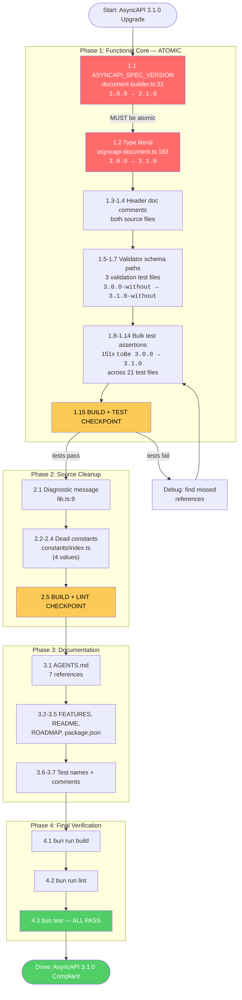

# AsyncAPI 3.1.0 Spec Upgrade Plan

**Date:** 2026-07-21
**Status:** ~~PLANNED (awaiting execution approval)~~ EXECUTED 2026-07-21 (commit `f5088c4`). All 7 tasks completed; 406 tests passed. Residual misses (examples/, CHANGELOG) caught and fixed in commit `7376d34`.
**Risk:** Near-zero (3.1.0 is purely additive: ROS 2 bindings only, no breaking changes)

---

## 1. Context & Research Findings

### Current state

The emitter targets **AsyncAPI 3.0.0** (released Dec 2023). The latest stable AsyncAPI spec is **3.1.0** (released Jan 31, 2026). The only delta is **ROS 2 bindings** — purely additive, zero breaking changes.

### Key discovery: the 3.1.0 schema is already installed

`@asyncapi/specs@6.11.1` (pinned in `package.json` as the last safe version after the Miasma RAT malware attack on 6.11.2) **already ships** `3.1.0.json` and `3.1.0-without-$id.json` in its `schemas/` directory. These files are sitting on disk, unused.

```
node_modules/@asyncapi/specs/schemas/
  3.0.0.json                  ← currently targeted
  3.0.0-without-$id.json      ← currently used by 3 validation tests
  3.1.0.json                  ← UNUSED — available right now
  3.1.0-without-$id.json      ← UNUSED — available right now
```

**No dependency change is needed.** No npm install. No lockfile change. No malware exposure. This is a pure code change.

### Key discovery: split-brain version constants

There are **two separate hardcoded version constants** in `src/`:

| Location                                     | Constant                         | Value     | Used at runtime?                                           |
| -------------------------------------------- | -------------------------------- | --------- | ---------------------------------------------------------- |
| `src/document-builder.ts:31`                 | `ASYNCAPI_SPEC_VERSION`          | `"3.0.0"` | **YES** — line 354, the actual document output             |
| `src/constants/index.ts:20`                  | `ASYNCAPI_VERSION`               | `"3.0.0"` | **NO** — never imported anywhere                           |
| `src/constants/index.ts:24`                  | `ASYNCAPI_VERSIONS.CURRENT`      | `"3.0.0"` | **NO** — never imported anywhere                           |
| `src/constants/index.ts:30`                  | `DEFAULT_CONFIG.version`         | `"3.0.0"` | **NO** — never imported anywhere                           |
| `src/domain/models/asyncapi-document.ts:183` | type literal `asyncapi: "3.0.0"` | `"3.0.0"` | **YES** — TypeScript type constraint on the document model |

Only `ASYNCAPI_SPEC_VERSION` (document-builder.ts) and the type literal (asyncapi-document.ts) are live. The constants in `constants/index.ts` are **dead code** — defined but never imported.

### Full reference inventory

| Category                     | Count   | Details                                                                                                |
| ---------------------------- | ------- | ------------------------------------------------------------------------------------------------------ |
| **Runtime version constant** | 1       | `document-builder.ts:31` — `ASYNCAPI_SPEC_VERSION = "3.0.0"`                                           |
| **Type literal**             | 1       | `asyncapi-document.ts:183` — `asyncapi: "3.0.0"` (TypeScript type)                                     |
| **Diagnostic message**       | 1       | `lib.ts:9` — `"Only 3.0.0 is supported."` (dead diagnostic, never fired)                               |
| **Dead constants**           | 4       | `constants/index.ts` — `ASYNCAPI_VERSION`, `ASYNCAPI_VERSIONS.*`, `DEFAULT_CONFIG.version`             |
| **Source doc comments**      | 4       | Headers in `asyncapi-document.ts`, `document-builder.ts`                                               |
| **Validator schema paths**   | 3       | `schema-validation.test.ts:23`, `all-examples-validation.test.ts:31`, `real-world-examples.test.ts:28` |
| **Test assertions**          | **151** | `toBe("3.0.0")` across **21 test files**                                                               |
| **Test names/comments**      | ~15     | `describe()`/`it()` names and header comments containing "3.0.0"                                       |
| **Documentation**            | 15+     | `AGENTS.md` (7), `FEATURES.md` (3), `README.md` (3), `ROADMAP.md` (4)                                  |
| **package.json**             | 1       | `"description": "TypeSpec emitter for AsyncAPI 3.0 specifications"`                                    |

### Malware context (why we stay on `@asyncapi/specs@6.11.1`)

- `@asyncapi/specs@6.11.2` was compromised with **Miasma RAT** on July 14, 2026 (GHSA-5jj9-3vg7-7785)
- npm `latest` tag was rolled back to 6.11.1; no patched successor exists
- 6.11.1 is the ceiling — **there is no newer safe version to install**
- 6.11.1 already contains the 3.1.0 schema, so we can upgrade the spec target without touching dependencies

---

## 2. Pareto Breakdown

### The 1% that delivers 51%

Change **2 lines** — the runtime constant + the type literal:

```typescript
// src/document-builder.ts:31
export const ASYNCAPI_SPEC_VERSION = "3.1.0"; // was "3.0.0"

// src/domain/models/asyncapi-document.ts:183
asyncapi: "3.1.0"; // was "3.0.0" (type literal)
```

**Result:** The emitter now produces AsyncAPI 3.1.0 documents. Every `.tsp` input immediately outputs 3.1.0. This is the single functional change that matters. BUT: the build will fail (151 test assertions expect "3.0.0").

### The 4% that delivers 64%

The above **PLUS** making the test suite pass:

- Point 3 validator schema paths at `3.1.0-without-$id.json` instead of `3.0.0-without-$id.json`
- Bulk-replace 151 `toBe("3.0.0")` → `toBe("3.1.0")` across 21 test files

**Result:** Full test suite passes AND validates output against the 3.1.0 JSON Schema. Functionally complete and verified.

### The 20% that delivers 80%

The above **PLUS** source honesty:

- Update the dead diagnostic message in `lib.ts:9`
- Update dead constants in `constants/index.ts`
- Update source file header comments

**Result:** Source code contains zero stale "3.0.0" references. No split-brain. A new developer reading the code sees 3.1.0 everywhere.

### The other 20% (polish to 100%)

- Update `AGENTS.md` (7 references)
- Update `FEATURES.md` (3 references)
- Update `README.md` (3 references, including badge)
- Update `ROADMAP.md` (4 references)
- Update `package.json` description
- Update test describe/it names and header comments

**Result:** Every artifact in the repo honestly reflects "3.1.0". Zero drift.

---

## 3. Comprehensive Plan — Tasks (30-100 min each)

Sorted by: Impact (does it break the build?) → Effort → Customer value.

| #      | Task                                                                       | Files                                                                                         | Impact                                                            | Effort | Dependencies |
| ------ | -------------------------------------------------------------------------- | --------------------------------------------------------------------------------------------- | ----------------------------------------------------------------- | ------ | ------------ |
| **T1** | **Change runtime version constant + type literal**                         | `document-builder.ts`, `asyncapi-document.ts`                                                 | **CRITICAL** — build breaks without this pair changing atomically | 30min  | None         |
| **T2** | **Update validator schema paths to 3.1.0**                                 | `schema-validation.test.ts`, `all-examples-validation.test.ts`, `real-world-examples.test.ts` | **CRITICAL** — tests validate against wrong schema without this   | 30min  | T1           |
| **T3** | **Bulk-update 151 test assertions** `toBe("3.0.0")` → `toBe("3.1.0")`      | 21 test files                                                                                 | **CRITICAL** — 151 tests fail without this                        | 60min  | T1           |
| **T4** | **Update diagnostic message + dead constants**                             | `lib.ts`, `constants/index.ts`                                                                | Medium — source honesty, prevents confusion                       | 30min  | T1           |
| **T5** | **Update documentation** (AGENTS, FEATURES, README, ROADMAP, package.json) | 5 doc/config files                                                                            | Medium — customer-facing accuracy                                 | 45min  | None         |
| **T6** | **Update test names + header comments**                                    | ~10 test files                                                                                | Low — cosmetic consistency                                        | 30min  | T3           |
| **T7** | **Full verification: build + lint + test suite**                           | N/A                                                                                           | **CRITICAL** — proves the upgrade works                           | 30min  | T1-T6        |

**Total estimated effort:** ~4 hours (255 min)

---

## 4. Detailed Subtask Breakdown (max 12 min each)

Sorted by execution order within each phase. Each subtask is independently verifiable.

### Phase 1: Functional Core (T1-T3) — must be atomic

| Subtask | Action                                                       | File(s)                                 | Est.  |
| ------- | ------------------------------------------------------------ | --------------------------------------- | ----- |
| 1.1     | Change `ASYNCAPI_SPEC_VERSION = "3.0.0"` → `"3.1.0"`         | `document-builder.ts:31`                | 2min  |
| 1.2     | Change type literal `asyncapi: "3.0.0"` → `"3.1.0"`          | `asyncapi-document.ts:183`              | 2min  |
| 1.3     | Update header doc comment (lines 4, 6)                       | `asyncapi-document.ts`                  | 2min  |
| 1.4     | Update header doc comment (lines 2, 8)                       | `document-builder.ts`                   | 2min  |
| 1.5     | Change schema path `3.0.0-without-$id` → `3.1.0-without-$id` | `schema-validation.test.ts:23`          | 2min  |
| 1.6     | Change schema path + header comment                          | `all-examples-validation.test.ts:5,31`  | 3min  |
| 1.7     | Change schema path + header comment                          | `real-world-examples.test.ts:5,28`      | 3min  |
| 1.8     | Bulk `replace_all`: `toBe("3.0.0")` → `toBe("3.1.0")`        | security-api-key (20 assertions)        | 3min  |
| 1.9     | Bulk `replace_all`: `toBe("3.0.0")` → `toBe("3.1.0")`        | security-http (20 assertions)           | 3min  |
| 1.10    | Bulk `replace_all`: `toBe("3.0.0")` → `toBe("3.1.0")`        | security-oauth2 (19 assertions)         | 3min  |
| 1.11    | Bulk `replace_all`: `toBe("3.0.0")` → `toBe("3.1.0")`        | security-sasl (12 assertions)           | 3min  |
| 1.12    | Bulk `replace_all`: `toBe("3.0.0")` → `toBe("3.1.0")`        | security-combined (8 assertions)        | 2min  |
| 1.13    | Bulk `replace_all`: `toBe("3.0.0")` → `toBe("3.1.0")`        | protocol-websocket-mqtt (50 assertions) | 5min  |
| 1.14    | Bulk `replace_all`: `toBe("3.0.0")` → `toBe("3.1.0")`        | remaining 8 test files (22 assertions)  | 8min  |
| 1.15    | Build + run tests — verify 0 failures                        | N/A                                     | 10min |

### Phase 2: Source Cleanup (T4)

| Subtask | Action                                                    | File(s)                    | Est. |
| ------- | --------------------------------------------------------- | -------------------------- | ---- |
| 2.1     | Update diagnostic message `"Only 3.0.0"` → `"Only 3.1.0"` | `lib.ts:9`                 | 2min |
| 2.2     | Update `ASYNCAPI_VERSION = "3.1.0"`                       | `constants/index.ts:20`    | 2min |
| 2.3     | Update `ASYNCAPI_VERSIONS` object (3 values)              | `constants/index.ts:24-28` | 3min |
| 2.4     | Update `DEFAULT_CONFIG.version = "3.1.0"`                 | `constants/index.ts:31`    | 2min |
| 2.5     | Build + lint — verify no regressions                      | N/A                        | 5min |

### Phase 3: Documentation (T5-T6)

| Subtask | Action                                      | File(s)          | Est. |
| ------- | ------------------------------------------- | ---------------- | ---- |
| 3.1     | Update all "3.0" references → "3.1"         | `AGENTS.md`      | 7min |
| 3.2     | Update 3 feature row descriptions           | `FEATURES.md`    | 3min |
| 3.3     | Update badge + example output + description | `README.md`      | 5min |
| 3.4     | Update 4 roadmap references                 | `ROADMAP.md`     | 5min |
| 3.5     | Update `description` field                  | `package.json:5` | 2min |
| 3.6     | Update describe/it names with "3.0.0"       | ~5 test files    | 8min |
| 3.7     | Update test header comments                 | ~4 test files    | 5min |

### Phase 4: Final Verification (T7)

| Subtask | Action                                | File(s) | Est. |
| ------- | ------------------------------------- | ------- | ---- |
| 4.1     | `bun run build` — 0 TypeScript errors | N/A     | 3min |
| 4.2     | `bun run lint` — 0 ESLint warnings    | N/A     | 3min |
| 4.3     | `bun test` — all 301+ tests pass      | N/A     | 5min |

---

## 5. Mermaid.js Execution Graph



---

## 6. Verschlimmbessern Prevention Checklist

Before declaring done, verify NONE of these happened:

- [ ] **Did NOT break the type system** — the type literal `asyncapi: "3.0.0"` and the constant `ASYNCAPI_SPEC_VERSION = "3.0.0"` changed **together**. If only one changes, TypeScript refuses to compile.
- [ ] **Did NOT change any dependency** — `@asyncapi/specs` stays at `6.11.1`. No `bun install`. No lockfile change. The 3.1.0 schema is already in `node_modules`.
- [ ] **Did NOT touch the `@asyncapi/specs` version pin** — 6.11.1 is the ceiling (6.11.2 = Miasma RAT). The pin stays.
- [ ] **Did NOT implement ROS 2 bindings** — 3.1.0 added ROS 2 protocol bindings. These are additive and optional. Adding ROS 2 to `protocols.ts` is a **separate feature request**, not part of this upgrade. The emitter simply doesn't emit ROS 2 bindings unless a user provides them via `@bindings`.
- [ ] **Did NOT change the `$ref` chain** — the reference structure (operations → channels → components) is identical in 3.0.0 and 3.1.0.
- [ ] **Did NOT change OAuth2/security structure** — `availableScopes`, security scheme types, etc. are unchanged between 3.0.0 and 3.1.0.
- [ ] **Did NOT introduce a new single-source-of-truth constant** — consolidating `ASYNCAPI_VERSION` (constants) vs `ASYNCAPI_SPEC_VERSION` (document-builder) is a refactoring concern, NOT part of this upgrade. Both get updated to "3.1.0" in place. Consolidation is a separate PR if desired.
- [ ] **Did NOT miss any `toBe("3.0.0")`** — after the bulk replace, a grep for `3.0.0` in `test/` must return zero hits in `.toBe()` calls.
- [ ] **Did NOT leave stale "3.0" in customer-facing docs** — AGENTS.md, FEATURES.md, README.md, ROADMAP.md, package.json must all say "3.1" or "3.1.0".
- [ ] **Build passes, lint passes, ALL tests pass** — no new failures introduced.

---

## 7. What This Upgrade Does NOT Include

| Concern                               | Status           | Why                                                                                                                                                                                                  |
| ------------------------------------- | ---------------- | ---------------------------------------------------------------------------------------------------------------------------------------------------------------------------------------------------- |
| ROS 2 protocol support                | **Not included** | 3.1.0 adds ROS 2 bindings schema, but the emitter doesn't need to know about them. Users can provide ROS 2 bindings via `@bindings` decorator. Adding ROS 2 to `protocols.ts` is a separate feature. |
| `@asyncapi/specs` version bump        | **Not possible** | 6.11.1 is the last safe version (6.11.2 = malware). No patched successor exists.                                                                                                                     |
| `@asyncapi/parser` version bump       | **Not needed**   | Already on 3.6.0 (latest).                                                                                                                                                                           |
| Version constant consolidation        | **Not included** | `ASYNCAPI_VERSION` (dead) vs `ASYNCAPI_SPEC_VERSION` (live) consolidation is a refactoring task, separate from the version bump.                                                                     |
| Multi-version support (3.0.0 + 3.1.0) | **Not included** | The emitter targets a single spec version. Supporting both would add complexity for no user value.                                                                                                   |

---

## 8. Verification Criteria (Definition of Done)

1. `rg '3\.0\.0' src/ test/ AGENTS.md FEATURES.md README.md ROADMAP.md package.json` returns **zero hits** (excluding `bun.lock` and `docs/_archive/`)
2. `bun run build` exits 0 with zero TypeScript errors
3. `bun run lint` exits 0 with zero ESLint warnings
4. `bun test` — all tests pass, zero failures
5. Generated output contains `asyncapi: "3.1.0"` (verified by 151 updated assertions)
6. All 11 example `.tsp` files validate against `3.1.0-without-$id.json` JSON Schema
7. `@asyncapi/specs` version in `package.json` is still `6.11.1` (unchanged)

---

## Resolution (2026-07-21)

Executed in commit `f5088c4` ("upgrade emitter from AsyncAPI 3.0.0 to 3.1.0 with stricter type safety"). All 7 tasks (T1-T7) completed, 406 tests passed. The dead constants in `constants/index.ts` noted here were later deleted entirely in commit `42ad7ac` (not just updated to 3.1.0 — the whole file was removed).

**Residual misses caught by the brutal self-review** (`docs/status/2026-07-21_15-56_ASYNCAPI-3.1-UPGRADE-BRUTAL-SELF-REVIEW.md`): the plan scoped only src/test/4-docs. Examples/ and CHANGELOG.md still had 14 "3.0" references. These were fixed in commit `7376d34` ("sync all docs and examples with AsyncAPI 3.1.0 upgrade"). The only remaining match (`bindingVersion: "0.3.0"` in `examples/advanced/advanced-decorators.tsp`) is an HTTP binding version, not a spec version — false positive.
