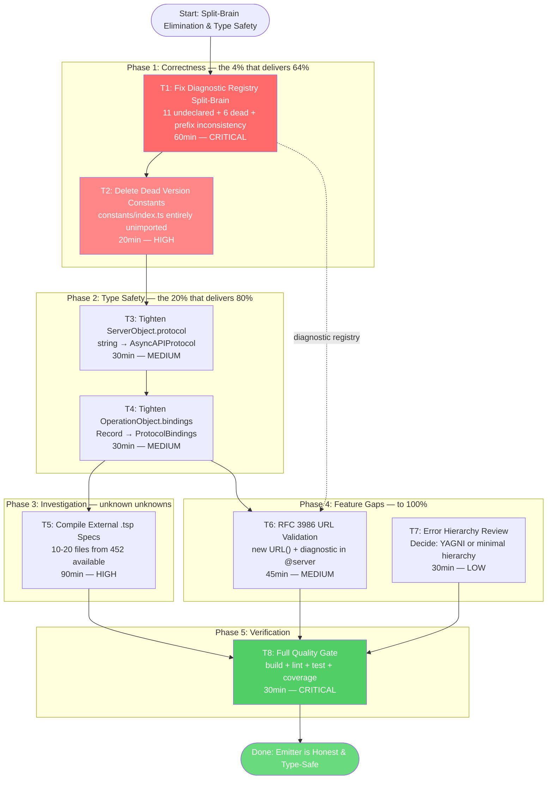

# Split-Brain Elimination & Type Safety Completion

**Date:** 2026-07-21 16:31
**Status:** PLANNED (awaiting execution approval)
**Scope:** 7 TODO items from `TODO_LIST.md`, verified against code this session
**Risk:** Low — 4 of 7 items are dead-code deletion or type tightening; 1 is investigation; only 2 touch live behavior

---

## 1. Context & Research Findings

### Current state

The emitter works: 406 tests pass, build is clean, lint is clean, output validates against AsyncAPI 3.1.0 JSON Schema. But internally the codebase is **dishonest** in several places — dead config, split-brain registries, loose types where tight ones exist. None of these cause test failures today; all of them will cause confusion or bugs tomorrow.

### Finding 1: Diagnostic registry is a 17-code split-brain

`src/lib.ts` declares 9 diagnostic codes. `src/minimal-decorators.ts` fires 14 codes. Only **3 overlap**.

| Category | Count | Codes |
|----------|-------|-------|
| **Declared AND fired (correct)** | 3 | `invalid-server-config`, `missing-channel-path`, `unsupported-protocol` |
| **Fired but NOT declared (bug)** | 11 | `invalid-bindings-config`, `invalid-correlationId-config`, `invalid-header-config`, `invalid-message-config`, `invalid-protocol-config`, `invalid-security-config`, `invalid-security-scheme-type`, `invalid-tags-config`, `server-protocol-required`, `server-target-invalid`, `server-url-required` |
| **Declared but NOT fired (dead)** | 6 | `duplicate-server-name`, `invalid-asyncapi-version`, `invalid-message-target`, `invalid-protocol-type`, `missing-protocol-type`, `missing-security-config` |

**Secondary bug — prefix inconsistency:** 5 codes in `$server` are passed WITH the full library prefix (`"@lars-artmann/typespec-asyncapi/invalid-server-config"`) while all other codes are passed bare (`"missing-channel-path"`). The `reportDecoratorDiagnostic` helper uses raw `program.reportDiagnostic` which accepts any string, so this doesn't crash — but the prefixed codes display double-wrapped in diagnostic output.

**Root cause:** `reportDecoratorDiagnostic` in `decorator-helpers.ts:9-22` uses the raw `context.program.reportDiagnostic({ code, ... })` API instead of the library-aware `$lib.reportDiagnostic()`. The raw API doesn't validate codes against the declared registry, so the split-brain was never caught at compile time.

### Finding 2: `src/constants/index.ts` is entirely dead code

The file exports `ASYNCAPI_VERSION`, `ASYNCAPI_VERSIONS` (CURRENT/SUPPORTED/LATEST), and `DEFAULT_CONFIG.version` — all set to `"3.1.0"`. **Zero imports anywhere in `src/` or `test/`.** Every file that needs a protocol or version imports from `src/constants/protocols.ts` instead. The live version constant is `ASYNCAPI_SPEC_VERSION` in `src/document-builder.ts:31`.

This split-brain is exactly what caused the 3.0→3.1 docs drift: multiple version constants in multiple files meant the upgrade had to chase them all down. Consolidating to ONE constant prevents the next upgrade from drifting.

### Finding 3: Document model types are loose where internal types are tight

The `ProtocolConfigData` discriminated union (internal state) is properly typed — `protocol: AsyncAPIProtocol`. But the **serialized** document types are still loose:

- `ServerObject.protocol` is `string` (`asyncapi-document.ts:38`) — even though `document-builder.ts:324` always passes `normalizeProtocol()` (which returns `AsyncAPIProtocol`)
- `OperationObject.bindings` is `Record<string, unknown>` (`asyncapi-document.ts:70`) — while `MessageObject.bindings` and `ChannelObject.bindings` are both `ProtocolBindings`

The runtime values are always valid; only the types lie. A consumer of the `AsyncAPIDocument` type can't rely on `server.protocol` being a valid AsyncAPI protocol.

### Finding 4: External `.tsp` testing mandate never executed

The original "test against real TypeSpec Specs" mandate only covered this project's own 11 examples. The project directory has **452 `.tsp` files across 20 external projects** (Kernovia: 105, typespec-eventsourcing: 94, SwettySwipperWeb: 40, blog: 10, ActaFlow: 7, accountability-system: 5, and 14 others). Zero have been compiled through this emitter. External specs will expose failure modes that self-authored specs share blind spots around.

### Finding 5: No URL validation anywhere in `src/`

`@server` accepts any string as `url`. Malformed URLs pass through silently and only fail downstream JSON Schema validation (which checks format, not semantics). GitHub issue #229 requests RFC 3986 validation. The TypeSpec compiler has no built-in URL validator; the emitter would need `new URL()` or a regex.

### Finding 6: Error handling is 2 `throw new Error()` calls

The entire `src/` directory has exactly 2 `throw new Error()` calls, both in `state-compatibility.ts`. GitHub issue #54 proposed an elaborate error type hierarchy when the codebase was 10x larger. Against the current ~2,100-line codebase, a full hierarchy is likely YAGNI — but the issue deserves a documented decision, not silence.

---

## 2. Pareto Breakdown

### The 1% that delivers 51%

**Fix the diagnostic registry split-brain (T1).**

11 diagnostic codes are fired but never declared. Every user who triggers a validation error in `@message`, `@protocol`, `@security`, `@tags`, `@correlationId`, `@header`, `@bindings`, or `$server` gets a misidentified or missing diagnostic. This is the single highest-impact item because it affects every error path in the emitter.

### The 4% that delivers 64%

**T1 + delete dead version constants (T2).**

The dead constants in `constants/index.ts` are a split-brain that already caused the 3.0/3.1 docs drift — the docs-health audit found stale 3.0 references precisely because there were multiple version constants. Consolidating to ONE constant (`ASYNCAPI_SPEC_VERSION` in `document-builder.ts`) prevents the next version upgrade from drifting again. The entire file is unimported; deletion is safe and surgical.

### The 20% that delivers 80%

**T1 + T2 + tighten ServerObject.protocol (T3) + tighten OperationObject.bindings (T4).**

Together these make the emitter's types match its runtime behavior, eliminate all known dead code and split-brains, and bring the document model to full type safety. After this, the codebase is **honest** — no dead config, no loose types where tight ones exist, no registry that lies about what diagnostics exist.

### The other 20% (to 100%)

**External `.tsp` compilation report (T5) + URL validation (T6) + error hierarchy review (T7).**

These are feature work and investigation — valuable but not correctness-critical. T5 surfaces unknown unknowns. T6 closes a real validation gap (#229). T7 closes an open issue (#54) with a documented decision.

---

## 3. Comprehensive Plan — Tasks (30-100 min each)

Sorted by: Impact (correctness first) → Effort → Customer value. Dependencies noted.

| #   | Task                                                   | Impact     | Effort | Value   | Deps | Phase         |
| --- | ------------------------------------------------------ | ---------- | ------ | ------- | ---- | ------------- |
| T1  | **Fix diagnostic registry split-brain**                | CRITICAL   | 60min  | Every error path works correctly | None | Correctness   |
| T2  | **Delete dead version constants**                      | HIGH       | 20min  | Prevent next version drift | None | Correctness   |
| T3  | **Tighten `ServerObject.protocol` → `AsyncAPIProtocol`** | MEDIUM     | 30min  | Document model type safety | None | Type Safety   |
| T4  | **Tighten `OperationObject.bindings` → `ProtocolBindings`** | MEDIUM     | 30min  | Document model consistency | None | Type Safety   |
| T5  | **Compile external `.tsp` specs, report failure modes** | HIGH       | 90min  | Surface unknown bugs | None | Investigation |
| T6  | **Add RFC 3986 URL validation to `@server`**           | MEDIUM     | 45min  | Catch malformed URLs at compile time | T1   | Feature Gap   |
| T7  | **Error type hierarchy review (decide: YAGNI or not)** | LOW        | 30min  | Close issue #54 with decision | None | Feature Gap   |
| T8  | **Full verification: build + lint + test + coverage**  | CRITICAL   | 30min  | Prove everything works | T1-T7 | Verification  |

**Total estimated effort:** ~5.5 hours (335 min)

---

## 4. Detailed Subtask Breakdown (max 12 min each)

Sorted by execution order within each phase. Each subtask is independently verifiable.

### Phase 1: Correctness — T1 + T2 (the 4%)

| Sub | Action                                                                  | File(s)                  | Est.  |
| --- | ----------------------------------------------------------------------- | ------------------------ | ----- |
| 1.1 | Add 11 missing diagnostic declarations to `$lib.diagnostics`            | `src/lib.ts`             | 10min |
| 1.2 | Remove 6 dead diagnostic declarations                                   | `src/lib.ts`             | 5min  |
| 1.3 | Strip `@lars-artmann/typespec-asyncapi/` prefix from 5 codes in `$server` | `src/minimal-decorators.ts` | 5min  |
| 1.4 | Type `code` param in `reportDecoratorDiagnostic` as `keyof typeof $lib.diagnostics` | `src/decorator-helpers.ts`, `src/lib.ts` | 10min |
| 1.5 | Fix any compile errors from the tightened `code` type                   | `src/minimal-decorators.ts` | 8min |
| 1.6 | Build + test — verify 0 failures                                        | N/A                      | 10min |
| 2.1 | Verify `constants/index.ts` is fully unimported (grep `src/` `test/`)   | N/A                      | 3min  |
| 2.2 | Delete dead exports (`ASYNCAPI_VERSION`, `ASYNCAPI_VERSIONS`, `DEFAULT_CONFIG`) | `src/constants/index.ts` | 5min  |
| 2.3 | Build + lint — verify no regressions                                    | N/A                      | 5min  |

### Phase 2: Type Safety — T3 + T4 (the 20%)

| Sub | Action                                                                  | File(s)                              | Est.  |
| --- | ----------------------------------------------------------------------- | ------------------------------------ | ----- |
| 3.1 | Change `ServerObject.protocol: string` → `AsyncAPIProtocol`             | `src/domain/models/asyncapi-document.ts:38` | 3min  |
| 3.2 | Add `AsyncAPIProtocol` import if not present                             | `src/domain/models/asyncapi-document.ts` | 2min  |
| 3.3 | Fix any compile errors from tightening (check document-builder.ts consumers) | `src/document-builder.ts` | 8min |
| 3.4 | Build + test                                                             | N/A                                  | 5min  |
| 4.1 | Change `OperationObject.bindings: Record<string, unknown>` → `ProtocolBindings` | `src/domain/models/asyncapi-document.ts:70` | 3min  |
| 4.2 | Fix any compile errors from tightening                                   | `src/document-builder.ts` | 8min |
| 4.3 | Build + test                                                             | N/A                                  | 5min  |

### Phase 3: Investigation — T5 (external specs)

| Sub | Action                                                                  | File(s)                  | Est.  |
| --- | ----------------------------------------------------------------------- | ------------------------ | ----- |
| 5.1 | Identify 10-20 representative `.tsp` files from external projects        | N/A                      | 10min |
| 5.2 | Create a compilation test harness (reuse `compileAsyncAPI` helper)       | `test/external/` (new)   | 10min |
| 5.3 | Compile batch 1 (Kernovia, typespec-eventsourcing), record results       | N/A                      | 12min |
| 5.4 | Compile batch 2 (blog, ActaFlow, accountability-system), record results  | N/A                      | 12min |
| 5.5 | Categorize failure modes (emitter bugs vs. unsupported features vs. non-AsyncAPI specs) | N/A | 10min |
| 5.6 | Write findings report (what broke, what's a real bug, what's expected)   | session report           | 10min |

### Phase 4: Feature Gaps — T6 + T7 (to 100%)

| Sub | Action                                                                  | File(s)                  | Est.  |
| --- | ----------------------------------------------------------------------- | ------------------------ | ----- |
| 6.1 | Add `isValidUrl(url: string): boolean` helper using `new URL()`         | `src/decorator-helpers.ts` | 8min  |
| 6.2 | Wire URL validation into `$server` decorator (after URL is extracted)   | `src/minimal-decorators.ts` | 8min |
| 6.3 | Add `"invalid-server-url"` diagnostic to `$lib.diagnostics`             | `src/lib.ts`             | 3min  |
| 6.4 | Add tests: valid URL, missing scheme, malformed host, port edge cases   | `test/integration/` | 10min |
| 6.5 | Build + test                                                             | N/A                      | 5min  |
| 7.1 | Read GitHub issue #54 body and comments                                  | N/A                      | 5min  |
| 7.2 | Survey current error surface (2 throw calls, decorator diagnostics)      | N/A                      | 7min  |
| 7.3 | Decision: document why YAGNI (or implement minimal hierarchy if needed) | issue #54 comment or ADR | 8min  |

### Phase 5: Final Verification — T8

| Sub | Action                                | File(s) | Est.  |
| --- | ------------------------------------- | ------- | ----- |
| 8.1 | `bun run build` — 0 TypeScript errors | N/A     | 3min  |
| 8.2 | `bun run lint` — 0 ESLint warnings    | N/A     | 3min  |
| 8.3 | `bun test` — all tests pass           | N/A     | 5min  |
| 8.4 | `bun run scripts/coverage-gate.ts` — 75% per-file minimum | N/A | 5min |
| 8.5 | `git status` — verify clean working tree state | N/A | 2min |

**Total: 36 subtasks, each ≤12 min. Grand total: ~335 min (~5.5 hours)**

---

## 5. Mermaid.js Execution Graph

---

## 6. Verschlimmbesserung Prevention Checklist

Before each change, verify:

- [ ] **Does the runtime value already work?** → If yes, only change the TYPE, not the logic
- [ ] **Is the dead code truly unimported?** → Grep `src/` AND `test/` before deleting
- [ ] **Are the "dead" diagnostic codes truly unreferenced?** → Check both direct calls AND `validateConfig` passthrough
- [ ] **Does the type tightening break any consumer?** → Check `document-builder.ts` construction sites
- [ ] **Am I changing behavior or just honesty?** → All Phase 1-2 tasks are honesty-only (types/dead code); Phase 4 T6 is the only behavior change
- [ ] **Did I run ALL 406 tests after each change?** → Non-negotiable
