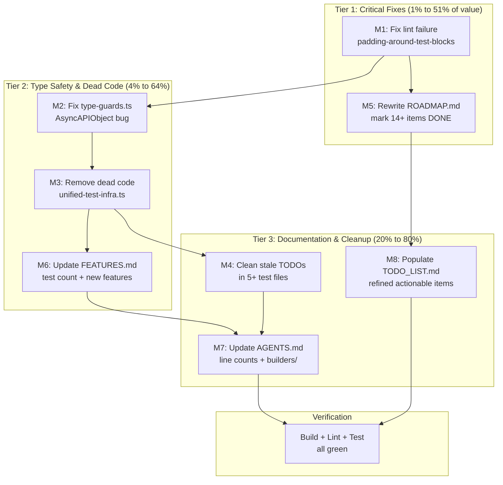

# ROADMAP Audit & Cleanup — Pareto Plan

**Date:** 2026-08-05
**Trigger:** `ROADMAP.md` review — user asked to break into actionable steps and execute
**Status:** ~~Complete~~ **Executed and superseded.** All 8 tasks (M1–M8) completed in the `17:31` session. The `18:33` and `19:01` sessions expanded test coverage to 869 tests. The `19:50`–`21:12` sessions drove duplication to 0%.

---

## Context

The user asked to review `ROADMAP.md`, break it into actionable steps, and execute them. Deep research revealed the roadmap is **massively stale** — the codebase has evolved far beyond what the roadmap describes. This plan documents the audit findings, the Pareto prioritization, and the execution tasks.

### Key Findings

| Area                      | Roadmap Says                    | Actual                                                  |
| ------------------------- | ------------------------------- | ------------------------------------------------------- |
| Version                   | `0.1.0-alpha`                   | `0.2.0-beta`                                            |
| Test count                | 553 across 48 files             | **679 across 64 files**                                 |
| Protocols                 | 5 (Kafka, AMQP, MQTT, WS, HTTP) | **19** (auto-generated from `@asyncapi/specs`)          |
| `buildAsyncAPIDocument()` | 315 lines, complexity 84        | **116 lines**, split into `builders/`                   |
| `defaultContentType`      | Not implemented                 | **DONE** (`namespace-decorators.ts`)                    |
| Operation `reply`         | Type exists, never populated    | **DONE** (`operation-builder.ts`)                       |
| Multi-message operations  | Not implemented                 | **DONE** (compliance tests exist)                       |
| `@doc` propagation        | "silently dropped"              | **DONE** (compliance tests exist)                       |
| Binding field validation  | Raw idea                        | **DONE** (`binding-field-validator.ts`, auto-generated) |
| Multi-file output         | Raw idea (#78)                  | **DONE** (`schema-splitter.ts`)                         |
| `ParsedAsyncAPIDocument`  | Raw idea                        | **DONE**                                                |
| Lint status               | "0 errors, 0 warnings"          | **FAILING** — 13 oxlint violations                      |

### Additional Issues Discovered

1. **Lint failure (broken quality gate):** 13 `padding-around-test-blocks` violations in `test/unit/binding-placement.test.ts` — oxlint `--deny-warnings` causes `bun run lint` to exit with code 1
2. **Latent type error:** `test/utils/type-guards.ts:266` references `AsyncAPIObject` type that is never imported (hidden by tsconfig excluding `test/` from type checking)
3. **Dead code:** `test/core/unified-test-infrastructure.ts` — 108 lines, **0 imports** anywhere in the codebase, abandoned migration
4. **AsyncAPIObject split-brain:** Three different definitions — `test-helpers.ts` (local alias for `ParsedAsyncAPIDocument`), `cli-test-helpers.ts` (imported from `@asyncapi/parser`), `type-guards.ts` (undefined — bug)
5. **Stale TODO comments:** 5+ test files with TODOs that don't match reality (e.g., `basic-functionality.test.ts` claims "CLI dependency disaster" but actually uses programmatic API)
6. **Documentation split-brain:** Three docs (AGENTS.md, FEATURES.md, ROADMAP.md) all claim different test counts (555, 555, 553), all wrong

---

## Pareto Breakdown

### The 1% that delivers 51% of value

| Task                   | Why                                                                                  |
| ---------------------- | ------------------------------------------------------------------------------------ |
| **Fix lint failure**   | Restores broken quality gate — blocks CI, `bun run lint`, and `alpha-release` script |
| **Rewrite ROADMAP.md** | Eliminates actively misleading information about project state                       |

### The 4% that delivers 64% of value

Everything in 1%, plus:

| Task                                           | Why                                                                                  |
| ---------------------------------------------- | ------------------------------------------------------------------------------------ |
| **Fix type-guards.ts type error**              | Eliminates latent type error that would surface if test files were ever type-checked |
| **Update FEATURES.md**                         | Eliminates split-brain between docs and reality (test count, missing features)       |
| **Remove dead unified-test-infrastructure.ts** | Eliminates 108 lines of dead code with a misleading TODO                             |

### The 20% that delivers 80% of value

Everything in 4%, plus:

| Task                          | Why                                                                                |
| ----------------------------- | ---------------------------------------------------------------------------------- |
| **Update AGENTS.md**          | Correct test count, line counts, add `builders/` directory, update to 19 protocols |
| **Clean stale TODO comments** | Eliminates misleading code comments that waste developer time                      |
| **Populate TODO_LIST.md**     | Refined actionable items from the roadmap audit                                    |

### Remaining 80% (delivers 20% of value)

| Task                                                      | Why deferred                                                                |
| --------------------------------------------------------- | --------------------------------------------------------------------------- |
| Split large test files (1518, 941 lines)                  | High risk of test breakage (verschlimmbessern), low value — tests pass fine |
| Consolidate AsyncAPIObject types beyond the bug fix       | Design decision — different type sources serve different purposes           |
| Clean Record<string, unknown> casts                       | Functional, not broken — cleanup without clear benefit                      |
| Feature development (server bindings, @operationId, etc.) | Requires design decisions and user input                                    |

---

## Comprehensive Plan — Medium Granularity (30min–2h tasks)

Sorted by impact (critical → polish). All source file references verified against actual codebase.

| #   | Task                                                                                        | Impact   | Effort | Tier | Safe? |
| --- | ------------------------------------------------------------------------------------------- | -------- | ------ | ---- | ----- |
| M1  | Fix lint failure: 13 `padding-around-test-blocks` violations in `binding-placement.test.ts` | Critical | 10min  | 1%   | Yes   |
| M2  | Fix type-guards.ts:266 — `AsyncAPIObject` → `ParsedAsyncAPIDocument` + fix JSDoc            | High     | 10min  | 4%   | Yes   |
| M3  | Remove dead `test/core/unified-test-infrastructure.ts` (0 imports)                          | Medium   | 5min   | 4%   | Yes   |
| M4  | Clean stale TODO comments in 5+ test files                                                  | Medium   | 15min  | 20%  | Yes   |
| M5  | Rewrite ROADMAP.md — audit all items, update state, mark done                               | Critical | 35min  | 1%   | Yes   |
| M6  | Update FEATURES.md — test count, new features (19 protocols, reply, etc.)                   | High     | 20min  | 4%   | Yes   |
| M7  | Update AGENTS.md — test count, line counts, builders/, 19 protocols                         | High     | 25min  | 20%  | Yes   |
| M8  | Populate TODO_LIST.md with refined actionable items                                         | High     | 15min  | 20%  | Yes   |

**Total estimated effort:** ~2h 15min

---

## Detailed Breakdown — Fine Granularity (max 12min tasks)

Sorted by execution order within each medium task.

### M1: Fix lint failure (10 min)

| #    | Sub-task                                                                     | Time |
| ---- | ---------------------------------------------------------------------------- | ---- |
| F1.1 | Read `binding-placement.test.ts` to identify all `it` blocks missing padding | 2min |
| F1.2 | Add blank lines before each `it` block (13 violations)                       | 5min |
| F1.3 | Run `bun run lint` to verify 0 warnings                                      | 1min |
| F1.4 | Run `bun run test` to verify no test breakage                                | 2min |

### M2: Fix type-guards.ts type error (10 min)

| #    | Sub-task                                                                            | Time |
| ---- | ----------------------------------------------------------------------------------- | ---- |
| F2.1 | Fix line 266: `asyncapiDoc: AsyncAPIObject` → `asyncapiDoc: ParsedAsyncAPIDocument` | 2min |
| F2.2 | Fix JSDoc comments on lines 21, 32, 41, 80, 95, 97 referencing `AsyncAPIObject`     | 5min |
| F2.3 | Run `bun run test` to verify no breakage                                            | 3min |

### M3: Remove dead code (5 min)

| #    | Sub-task                                                                 | Time |
| ---- | ------------------------------------------------------------------------ | ---- |
| F3.1 | Verify zero imports of `unified-test-infrastructure` (already confirmed) | 1min |
| F3.2 | Delete file                                                              | 1min |
| F3.3 | Run `bun run test` to verify no breakage                                 | 3min |

### M4: Clean stale TODO comments (15 min)

| #    | Sub-task                                                                                            | Time |
| ---- | --------------------------------------------------------------------------------------------------- | ---- |
| F4.1 | Remove 5 anti-pattern TODOs from `basic-functionality.test.ts` (stale — code uses programmatic API) | 3min |
| F4.2 | Clean TODOs from `asyncapi-generation.test.ts` (stale size/splitting TODOs)                         | 3min |
| F4.3 | Remove "too big" TODO from `real-world-scenarios.test.ts`                                           | 1min |
| F4.4 | Remove "too big" TODO from `decorator-functionality.test.ts`                                        | 1min |
| F4.5 | Remove "too big" TODO from `server.test.ts`                                                         | 1min |
| F4.6 | Run `bun run test` + `bun run lint`                                                                 | 6min |

### M5: Rewrite ROADMAP.md (35 min)

| #    | Sub-task                                                                     | Time |
| ---- | ---------------------------------------------------------------------------- | ---- |
| F5.1 | Write new Current State (679 tests, 64 files, 0.2.0-beta, 19 protocols)      | 5min |
| F5.2 | Rewrite Theme 1 (Spec Compliance) — mark 6 items DONE, keep 3 remaining      | 8min |
| F5.3 | Rewrite Theme 2 (Developer Experience) — mark 5 items DONE, keep 3 remaining | 6min |
| F5.4 | Rewrite Theme 3 (Architecture) — mark 2 items DONE, keep 3 remaining         | 6min |
| F5.5 | Rewrite Theme 4 (Ecosystem) — mark 1 item DONE, keep 3 remaining             | 5min |
| F5.6 | Review for consistency                                                       | 5min |

### M6: Update FEATURES.md (20 min)

| #    | Sub-task                                                                                                                                | Time |
| ---- | --------------------------------------------------------------------------------------------------------------------------------------- | ---- |
| F6.1 | Update verification header (679 pass, 64 files, date)                                                                                   | 2min |
| F6.2 | Fix vitest test count row (555 → 679, 48 → 64)                                                                                          | 2min |
| F6.3 | Update Protocol Bindings section (5 → 19 protocols)                                                                                     | 8min |
| F6.4 | Add new feature rows (operation reply, multi-message, defaultContentType, doc propagation, binding field validation, multi-file output) | 6min |
| F6.5 | Review for accuracy                                                                                                                     | 2min |

### M7: Update AGENTS.md (25 min)

| #    | Sub-task                                                                | Time |
| ---- | ----------------------------------------------------------------------- | ---- |
| F7.1 | Update Quick Start test count (555 → 679)                               | 1min |
| F7.2 | Update source file line counts (8 files changed)                        | 5min |
| F7.3 | Add `src/builders/` directory to Architecture section                   | 5min |
| F7.4 | Add `src/validation/binding-field-validator.ts` to Architecture section | 3min |
| F7.5 | Update Protocol Bindings section (5 → 19 protocols)                     | 3min |
| F7.6 | Add `src/decorators.ts` unified decorator registry                      | 3min |
| F7.7 | Review for accuracy                                                     | 5min |

### M8: Populate TODO_LIST.md (15 min)

| #    | Sub-task                                             | Time |
| ---- | ---------------------------------------------------- | ---- |
| F8.1 | Write High Impact tasks (from refined roadmap items) | 6min |
| F8.2 | Write Medium Impact tasks                            | 6min |
| F8.3 | Review for actionability                             | 3min |

---

## Execution Flow

## Risk Assessment

| Risk                                                       | Mitigation                                                          |
| ---------------------------------------------------------- | ------------------------------------------------------------------- |
| Deleting `unified-test-infrastructure.ts` breaks something | Verified 0 imports via ripgrep across entire repo                   |
| Fixing type-guards.ts changes runtime behavior             | Only changing type annotations, not logic                           |
| ROADMAP rewrite loses important future ideas               | Keeping genuinely-remaining items; marking done items with evidence |
| AGENTS.md line count updates go stale again                | Line counts are best-effort; architectural descriptions matter more |
| Cleaning TODOs removes useful context                      | Only removing TODOs that are stale/false; keeping valid ones        |

## Verschlimmbessern Checklist

- [x] NOT splitting test files (high risk, low value, tests pass)
- [x] NOT consolidating AsyncAPIObject beyond the bug fix (design decision)
- [x] NOT removing Record<string, unknown> casts (functional, not broken)
- [x] NOT implementing new features (requires design input)
- [x] Every change verified with build + lint + test
