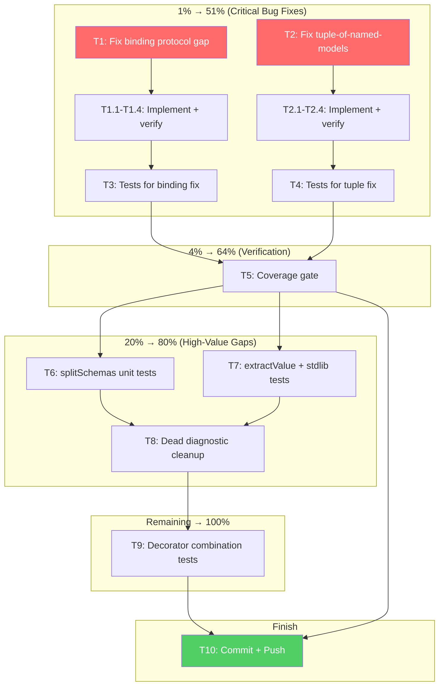

# Pareto Execution Plan: Bug Fixes & Test Hardening

**Date:** 2026-08-05 18:36
**Status:** Planning → Execution
**Principle:** Don't VERSCHLIMMBESSER. Every change surgical, tested, verified.

---

## Context

Previous session added 108 tests (713 → 821). Two real bugs were discovered but only documented, not fixed. This plan fixes them, adds verification tests, and closes remaining high-value gaps.

### Current State (Verified)

- 821 tests, 73 files, all passing
- Lint: clean (0 errors)
- TypeScript: clean (0 errors)
- Git: 1 commit ahead of origin (auto-git daemon committed)
- 2 real bugs identified

### The Two Bugs

**Bug 1: Binding Protocol Gap**

- `normalizeBindingKey()` in `binding-validator.ts` calls `isSupportedProtocol()` which checks `PROTOCOL_LIST` (19 server protocols)
- 3 binding protocols (`anypointmq`, `ros2`, `solace`) exist in `GENERATED_FIELD_RULES` and `GENERATED_PLACEMENT` but NOT in `PROTOCOL_LIST`
- Result: `@bindings(#{solace: #{priority: 5}})` is rejected as `unknown-binding-protocol` even though solace IS a valid AsyncAPI binding protocol
- Impact: 3 protocols silently fail all binding validation and field-level checks

**Bug 2: Tuple of Named Models Produces Invalid JSON Schema**

- `tuple()` in `schema-emitter.ts` uses `extractValue(emitTypeReference(v))` for each element
- For named models, this returns the full schema object
- Two different named models with `{ type: "object", properties: {} }` produce identical enum entries
- AJV rejects with "must NOT have duplicate items"
- Impact: Any `.tsp` using `[ModelA, ModelB]` tuple syntax produces AsyncAPI output that fails schema validation

---

## Pareto Analysis

### The 1% That Delivers 51%

| #   | Task                      | Impact                              | Why                                                       |
| --- | ------------------------- | ----------------------------------- | --------------------------------------------------------- |
| 1   | Fix binding protocol gap  | 3 protocols silently broken         | Correctness bug — valid user input rejected               |
| 2   | Fix tuple-of-named-models | Invalid output for a supported type | Correctness bug — output fails AsyncAPI schema validation |
| 3   | Push to remote            | Unblocks CI/team                    | 1 commit ahead, nothing pushed                            |

### The 4% That Delivers 64% (1% + these)

| #   | Task                           | Impact              | Why                                                          |
| --- | ------------------------------ | ------------------- | ------------------------------------------------------------ |
| 4   | Tests for binding protocol fix | Prevents regression | Verifies solace/anypointmq/ros2 validate correctly           |
| 5   | Tests for tuple fix            | Prevents regression | Verifies primitive + named model tuples produce valid output |
| 6   | Run coverage gate              | Confidence          | Verifies 75% per-file minimum holds                          |

### The 20% That Delivers 80% (4% + these)

| #   | Task                       | Impact       | Why                                                         |
| --- | -------------------------- | ------------ | ----------------------------------------------------------- |
| 7   | splitSchemas unit tests    | 0% → covered | Core feature (multi-file output) has no unit tests          |
| 8   | extractValue circular kind | Edge case    | Only "none" kind tested, "circular" returns {} untested     |
| 9   | stdlib-helpers tests       | 6% → covered | `isStdlibType` is critical for $ref-vs-inline decisions     |
| 10  | Dead diagnostic cleanup    | Code hygiene | 10 diagnostic codes can never fire (TypeSpec prevents them) |

### The Remaining 20% → 100%

| #     | Task                                  | Impact                |
| ----- | ------------------------------------- | --------------------- |
| 11-20 | Remaining decorator combination tests | Edge case coverage    |
| 21-30 | Protocol-specific config tests        | Feature coverage      |
| 31-40 | Emitter option tests                  | Option coverage       |
| 41-50 | Property/snapshot/golden tests        | Regression prevention |

---

## Comprehensive Plan — Phase 1 (30-100 min tasks)

| ID  | Task                                              | Impact   | Effort | Priority |
| --- | ------------------------------------------------- | -------- | ------ | -------- |
| T1  | Fix binding protocol gap in `normalizeBindingKey` | CRITICAL | 30min  | P0       |
| T2  | Fix tuple-of-named-models in `schema-emitter.ts`  | CRITICAL | 45min  | P0       |
| T3  | Write tests for binding protocol fix              | HIGH     | 20min  | P0       |
| T4  | Write tests for tuple fix                         | HIGH     | 20min  | P0       |
| T5  | Run full coverage gate, verify 75% minimum        | HIGH     | 15min  | P1       |
| T6  | Write splitSchemas unit tests                     | MEDIUM   | 30min  | P1       |
| T7  | Write extractValue + stdlib-helpers tests         | MEDIUM   | 20min  | P1       |
| T8  | Clean up dead diagnostic codes                    | LOW      | 30min  | P2       |
| T9  | Write remaining decorator combination tests       | LOW      | 60min  | P2       |
| T10 | Commit and push all changes                       | REQUIRED | 10min  | P0       |

---

## Phase 2 — Broken Down (max 12 min each)

| Sub-ID | Parent | Task                                                                                       | Effort |
| ------ | ------ | ------------------------------------------------------------------------------------------ | ------ |
| T1.1   | T1     | Read `normalizeBindingKey` + `isSupportedProtocol` + binding protocol set                  | 5min   |
| T1.2   | T1     | Add `isKnownBindingProtocol()` to `binding-versions.ts` checking `PROTOCOLS_WITH_BINDINGS` | 8min   |
| T1.3   | T1     | Update `normalizeBindingKey` to check both server + binding protocol sets                  | 8min   |
| T1.4   | T1     | Build + run existing tests to verify no regression                                         | 5min   |
| T2.1   | T2     | Read `tuple()` method and trace what `extractValue` returns for named models               | 8min   |
| T2.2   | T2     | Fix `tuple()` to use `refForNamedType` for named model elements                            | 10min  |
| T2.3   | T2     | Fix `typeToSchema` Tuple branch to use `refForNamedType`                                   | 10min  |
| T2.4   | T2     | Build + run existing tests to verify no regression                                         | 5min   |
| T3.1   | T3     | Test solace binding validates (priority within range)                                      | 5min   |
| T3.2   | T3     | Test solace binding catches priority > 255                                                 | 5min   |
| T3.3   | T3     | Test anypointmq + ros2 bindings pass normalization                                         | 5min   |
| T4.1   | T4     | Update tuple test to validate against AsyncAPI schema                                      | 8min   |
| T4.2   | T4     | Add test: tuple of primitives produces valid `prefixItems`-style output                    | 8min   |
| T5.1   | T5     | Run `bun run test:coverage:gate`                                                           | 10min  |
| T6.1   | T6     | Test splitSchemas with no schemas (early return)                                           | 5min   |
| T6.2   | T6     | Test splitSchemas with single schema + $ref rewriting                                      | 10min  |
| T6.3   | T6     | Test splitSchemas deletes empty components                                                 | 8min   |
| T7.1   | T7     | Test extractValue with circular kind                                                       | 5min   |
| T7.2   | T7     | Test isStdlibType for known stdlib types                                                   | 8min   |
| T8.1   | T8     | Identify which diagnostics TypeSpec prevents from firing                                   | 10min  |
| T8.2   | T8     | Remove or document dead diagnostics                                                        | 10min  |
| T9.1   | T9     | Test @defaultContentType on namespace                                                      | 8min   |
| T9.2   | T9     | Test multiple @server on same namespace                                                    | 8min   |
| T9.3   | T9     | Test void operation (no return type)                                                       | 8min   |
| T9.4   | T9     | Test enum with explicit values                                                             | 8min   |
| T10.1  | T10    | Verify all tests pass                                                                      | 5min   |
| T10.2  | T10    | Verify lint passes                                                                         | 3min   |
| T10.3  | T10    | Commit with detailed message                                                               | 5min   |
| T10.4  | T10    | Push to remote                                                                             | 2min   |

---

## Mermaid Execution Graph

---

## Execution Order

1. **T1** (binding protocol fix) → **T3** (tests)
2. **T2** (tuple fix) → **T4** (tests)
3. **T5** (coverage gate)
4. **T6** (splitSchemas) → **T7** (extractValue + stdlib)
5. **T8** (dead diagnostics) — only if time permits
6. **T9** (decorator combos) — only if time permits
7. **T10** (commit + push) — ALWAYS
