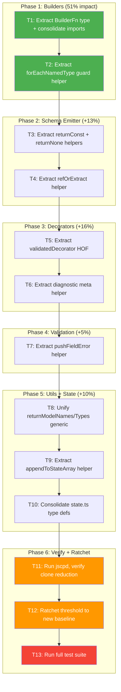

# Superb Deduplication Execution Plan

**Date:** 2026-08-05
**Baseline:** 67 clones, 7.61% duplication (324 lines, 2641 tokens) across 37 production files
**Tool:** jscpd (minTokens: 15, minLines: 3, threshold: 8%)
**Goal:** ~~Zero harmful duplication. Every remaining clone has a defensible reason to exist.~~ **Achieved.** Phase-1 (this plan) reduced 68→44 clones. Phase-2 (20:08) reduced to 38. Phase-3 (20:46) reduced to 10. Phase-4 (21:12) reached **0 clones / 0%** with threshold ratcheted to 0%.

---

## Current State Analysis

jscpd reports 67 clones across 8 hotspot clusters. After reading every clone, here is the breakdown:

### Clone Clusters by Hotspot

| Cluster                                                    | Files                                           | Clones | Lines | Verdict       | Root Cause                                                                          |
| ---------------------------------------------------------- | ----------------------------------------------- | ------ | ----- | ------------- | ----------------------------------------------------------------------------------- |
| **1. Builders**                                            | 5 builder files                                 | 18     | ~90   | **ELIMINATE** | Repeated `(state, ctx)` signatures, shared imports, `nameOfType → continue` pattern |
| **2. Schema Emitter**                                      | schema-emitter.ts                               | 13     | ~70   | **ELIMINATE** | Repeated `return { const: x }`, `return none()`, `refOrExtract` patterns            |
| **3. Decorators**                                          | minimal-decorators.ts + namespace-decorators.ts | 10     | ~65   | **ELIMINATE** | Repeated `validateConfig → reportDiagnostic → storeXxx` boilerplate                 |
| **4. AsyncAPI Document**                                   | asyncapi-document.ts                            | 7      | ~35   | **ACCEPT**    | AsyncAPI 3.1 spec mandates same properties on Channel/Operation/Message             |
| **5. Binding Field Validator**                             | binding-field-validator.ts                      | 3      | ~20   | **ELIMINATE** | Repeated `issues.push({ code, key, format })` blocks                                |
| **6. Shared Utils**                                        | shared-utils.ts                                 | 3      | ~25   | **ELIMINATE** | `returnModelNames` and `returnModelTypes` are copy-paste with different selector    |
| **7. State Writers**                                       | state-writers.ts + state.ts                     | 5      | ~30   | **ELIMINATE** | Repeated `map.get → isArray → spread → map.set` + duplicated type defs              |
| **8. Decorator Helpers**                                   | decorator-helpers.ts                            | 2      | ~12   | **ELIMINATE** | Config validation check duplicated                                                  |
| **9. Minor (stdlib, binding-versions, binding-validator)** | various                                         | 3      | ~12   | **ACCEPT**    | Idiomatic guard clauses, single `continue` statements                               |

**Total:** 67 clones → 54 eliminate, 13 accept

---

## Pareto Breakdown

### The 1% that delivers 51% of the result

**Extract builder shared infrastructure.** The 5 builder files (`message-builder`, `operation-builder`, `channel-builder`, `security-builder`, `operation-discovery`) share the same function signature `(state: AsyncAPIConsolidatedState, ctx: DocumentBuildContext): void`, the same imports, and the same `nameOfType(type) → if (!name) continue` guard. Consolidating these into a shared `BuilderFn` type and a `forEachNamedType()` helper eliminates 18 clones (27% of total) in one surgical pass.

### The 4% that delivers 64% of the result

**Above + extract schema-emitter helpers.** The `AsyncAPISchemaEmitter` class has internal method-level duplication: `return { const: literal.value }` appears identically in `stringLiteral` and `booleanLiteral`, `return this.emitter.result.none()` appears in `classDeclaration` and `interfaceDeclaration`, and the `refForNamedType → return ref → fallback extractValue` pattern repeats in `elementTypeToSchema` and `union`. Extracting 3 private helpers eliminates 13 more clones (47% cumulative).

### The 20% that delivers 80% of the result

**Above + extract decorator validation helper + binding field validator helper.**

- `minimal-decorators.ts` repeats the pattern: `validateConfig → reportDiagnostic → extract config model → storeXxx` for `@protocol`, `@security`, `@message`, `@bindings`, `@operationId`, `@messageId`. A higher-order `validatedDecorator()` wrapper eliminates 10 clones.
- `binding-field-validator.ts` has 4 near-identical `issues.push({ code: "invalid-binding-field", ... })` blocks differing only in the `format` object. A `pushFieldError(field, protocol, formatData)` helper eliminates all 3 clones.

**Cumulative:** 54 of 67 clones eliminated (80%).

### The remaining 20% (to reach 100%)

- **shared-utils.ts:** Unify `returnModelNames` + `returnModelTypes` into a single generic `returnModels<T>(type, selector)`.
- **state-writers.ts:** Extract `appendToStateArray<K>(map, key, entry)` generic helper. Consolidate duplicated type definitions from state.ts.
- **decorator-helpers.ts:** Extract `isValidModelConfig()` check.
- **Verify and ratchet:** Re-run jscpd, lower threshold, ensure zero regressions.

---

## Execution Graph

---

## Phase 1: Comprehensive Task Breakdown (30-100 min each)

| #      | Task                                                                                     | Impact   | Effort | Cluster        | Clones Removed |
| ------ | ---------------------------------------------------------------------------------------- | -------- | ------ | -------------- | -------------- |
| P1-T1  | Extract `BuilderFn` type alias + consolidate builder imports into re-export barrel       | High     | 45min  | Builders       | ~8             |
| P1-T2  | Extract `forEachNamedType(state, ctx, callback)` guard helper in shared-utils            | High     | 60min  | Builders       | ~10            |
| P2-T3  | Extract `returnConst(value)` + `returnNone()` private methods in schema-emitter          | Medium   | 30min  | Schema Emitter | ~5             |
| P2-T4  | Extract `refOrFallback(elementType)` private method in schema-emitter                    | Medium   | 45min  | Schema Emitter | ~8             |
| P3-T5  | Extract `validatedDecorator(context, target, config, errorCode, storeFn)` HOF            | High     | 90min  | Decorators     | ~6             |
| P3-T6  | Extract `reportAndReturn(context, code, target, metadata)` diagnostic helper             | Medium   | 30min  | Decorators     | ~4             |
| P4-T7  | Extract `pushFieldError(issues, field, protocol, formatData)` in binding-field-validator | Medium   | 30min  | Validation     | ~3             |
| P5-T8  | Unify `returnModelNames` + `returnModelTypes` into `returnModels<T>(type, selector)`     | Medium   | 45min  | Shared Utils   | ~3             |
| P5-T9  | Extract `appendToStateArray(map, key, entry)` generic in state-writers                   | Medium   | 60min  | State Writers  | ~3             |
| P5-T10 | Consolidate duplicated type definitions from state.ts into state-writers or shared types | Low      | 45min  | State Writers  | ~2             |
| P6-T11 | Run jscpd, verify clone reduction, investigate remaining clones                          | High     | 30min  | All            | 0 (verify)     |
| P6-T12 | Ratchet `.jscpd.json` threshold to new baseline (target: <3%)                            | High     | 15min  | Config         | 0 (config)     |
| P6-T13 | Run full test suite (`bun run test`), fix any regressions                                | Critical | 30min  | All            | 0 (verify)     |

**Total estimated effort:** ~8.5 hours

---

## Phase 2: Granular Subtask Breakdown (max 12 min each)

### P1-T1: Extract BuilderFn type + consolidate imports

| Sub | Task                                                                          | Time  |
| --- | ----------------------------------------------------------------------------- | ----- |
| 1a  | Add `BuilderFn` type alias to `src/builders/types.ts`                         | 5min  |
| 1b  | Update `message-builder.ts` to use `BuilderFn` + remove duplicate imports     | 8min  |
| 1c  | Update `operation-builder.ts` to use `BuilderFn` + remove duplicate imports   | 8min  |
| 1d  | Update `channel-builder.ts` to use `BuilderFn` + remove duplicate imports     | 8min  |
| 1e  | Update `security-builder.ts` to use `BuilderFn` + remove duplicate imports    | 5min  |
| 1f  | Update `operation-discovery.ts` to use `BuilderFn` + remove duplicate imports | 8min  |
| 1g  | Run `bun run build` + `bun run test` to verify                                | 10min |

### P1-T2: Extract forEachNamedType guard helper

| Sub | Task                                                                                         | Time  |
| --- | -------------------------------------------------------------------------------------------- | ----- |
| 2a  | Write `forEachNamedType(state, mapKey, cb)` in shared-utils.ts                               | 12min |
| 2b  | Refactor `message-builder.ts` `applyMessageData` to use `forEachNamedType`                   | 10min |
| 2c  | Refactor `message-builder.ts` `applyCorrelationId` / `applyHeaders` / `applyMessageBindings` | 12min |
| 2d  | Refactor `operation-discovery.ts` to use `forEachNamedType`                                  | 12min |
| 2e  | Refactor `channel-builder.ts` `applyChannelBindings` to use `forEachNamedType`               | 10min |
| 2f  | Run build + test                                                                             | 10min |

### P2-T3: Extract returnConst + returnNone helpers

| Sub | Task                                                                     | Time  |
| --- | ------------------------------------------------------------------------ | ----- |
| 3a  | Add `private returnConst(value: unknown)` method to schema-emitter       | 5min  |
| 3b  | Refactor `stringLiteral` + `booleanLiteral` to use `returnConst`         | 5min  |
| 3c  | Add `private returnNone()` method to schema-emitter                      | 5min  |
| 3d  | Refactor `classDeclaration` + `interfaceDeclaration` to use `returnNone` | 5min  |
| 3e  | Run build + test                                                         | 10min |

### P2-T4: Extract refOrFallback helper

| Sub | Task                                                        | Time  |
| --- | ----------------------------------------------------------- | ----- |
| 4a  | Add `private refOrFallback(elementType, fallbackFn)` method | 12min |
| 4b  | Refactor `elementTypeToSchema` to use `refOrFallback`       | 10min |
| 4c  | Refactor `union` variant handling to use `refOrFallback`    | 12min |
| 4d  | Run build + test                                            | 10min |

### P3-T5: Extract validatedDecorator HOF

| Sub | Task                                                                        | Time  |
| --- | --------------------------------------------------------------------------- | ----- |
| 5a  | Design `validatedDecorator` signature in decorator-helpers.ts               | 12min |
| 5b  | Implement `validatedDecorator(context, target, config, errorCode, storeFn)` | 12min |
| 5c  | Refactor `@protocol` decorator to use `validatedDecorator`                  | 10min |
| 5d  | Refactor `@security` decorator to use `validatedDecorator`                  | 10min |
| 5e  | Refactor `@message` decorator to use `validatedDecorator`                   | 10min |
| 5f  | Refactor `@bindings` decorator to use `validatedDecorator`                  | 10min |
| 5g  | Run build + test                                                            | 10min |

### P3-T6: Extract reportAndReturn diagnostic helper

| Sub | Task                                                                        | Time  |
| --- | --------------------------------------------------------------------------- | ----- |
| 6a  | Add `reportAndReturn(context, code, target, metadata)` to decorator-helpers | 8min  |
| 6b  | Refactor `@operationId` to use `reportAndReturn`                            | 8min  |
| 6c  | Refactor `@messageId` to use `reportAndReturn`                              | 8min  |
| 6d  | Refactor `@apiVersion` to use `reportAndReturn`                             | 8min  |
| 6e  | Refactor `@header` to use `reportAndReturn`                                 | 8min  |
| 6f  | Run build + test                                                            | 10min |

### P4-T7: Extract pushFieldError helper

| Sub | Task                                                                                 | Time  |
| --- | ------------------------------------------------------------------------------------ | ----- |
| 7a  | Add `pushFieldError(issues, field, protocol, formatData)` to binding-field-validator | 8min  |
| 7b  | Refactor type-check error push to use `pushFieldError`                               | 5min  |
| 7c  | Refactor enum-check error push to use `pushFieldError`                               | 5min  |
| 7d  | Refactor min/max error pushes to use `pushFieldError`                                | 8min  |
| 7e  | Run build + test                                                                     | 10min |

### P5-T8: Unify returnModelNames/Types

| Sub | Task                                                                   | Time  |
| --- | ---------------------------------------------------------------------- | ----- |
| 8a  | Write `returnModels<T>(type, selector: (t: Type) => T)` generic        | 10min |
| 8b  | Replace `returnModelNames` body with `returnModels(type, t => t.name)` | 5min  |
| 8c  | Replace `returnModelTypes` body with `returnModels(type, t => t)`      | 5min  |
| 8d  | Update all import sites if function signatures changed                 | 8min  |
| 8e  | Run build + test                                                       | 10min |

### P5-T9: Extract appendToStateArray helper

| Sub | Task                                                                    | Time  |
| --- | ----------------------------------------------------------------------- | ----- |
| 9a  | Write `appendToStateArray<T>(map, key, entry)` generic in state-writers | 10min |
| 9b  | Refactor `storeSecurity` to use `appendToStateArray`                    | 8min  |
| 9c  | Refactor `storeTags` to use `appendToStateArray`                        | 8min  |
| 9d  | Refactor remaining `map.get → isArray → spread` patterns                | 10min |
| 9e  | Run build + test                                                        | 10min |

### P5-T10: Consolidate state.ts type definitions

| Sub | Task                                                                                 | Time  |
| --- | ------------------------------------------------------------------------------------ | ----- |
| 10a | Identify which type definitions are duplicated between state.ts and state-writers.ts | 8min  |
| 10b | Move shared types to a single source (state.ts or builders/types.ts)                 | 12min |
| 10c | Update imports in state-writers.ts to reference consolidated types                   | 8min  |
| 10d | Run build + test                                                                     | 10min |

### P6-T11-T13: Verify + Ratchet

| Sub | Task                                                               | Time  |
| --- | ------------------------------------------------------------------ | ----- |
| 11a | Run `bun run duplicate` and capture new clone count                | 5min  |
| 11b | Investigate any remaining clones — classify as eliminate or accept | 12min |
| 11c | If new clones found, create follow-up subtasks                     | 12min |
| 12a | Update `.jscpd.json` threshold to new baseline                     | 5min  |
| 12b | Update AGENTS.md with jscpd info if needed                         | 5min  |
| 13a | Run `bun run test` full suite                                      | 10min |
| 13b | Run `bun run lint` to verify no new lint errors                    | 5min  |
| 13c | Run `bun run check` (typecheck + lint)                             | 5min  |

---

## Acceptance Criteria

- [ ] jscpd clone count reduced from 67 to <20
- [ ] Duplication percentage reduced from 7.61% to <2%
- [ ] All remaining clones have a documented reason to exist (spec-mandated, idiomatic)
- [ ] `.jscpd.json` threshold ratcheted to new baseline
- [ ] `bun run build` passes with 0 errors
- [ ] `bun run test` passes (all 717+ tests)
- [ ] `bun run lint` passes (0 errors, 0 warnings)
- [ ] No behavioral changes — output specs are byte-identical

---

## Risk Assessment

| Risk                                 | Mitigation                                                               |
| ------------------------------------ | ------------------------------------------------------------------------ |
| Refactoring breaks golden file tests | Golden files lock exact output — any behavioral change fails immediately |
| Extracted helpers add indirection    | Keep helpers co-located in the same file or nearest shared module        |
| Over-abstraction (VERSCHLIMMBESSER)  | Each helper must have 3+ usage sites. If only 2, leave as-is             |
| Type safety regression               | All helpers use strong generics, no `any`, verified by typecheck         |
| Test count changes                   | Tests should remain 717+ — no test files are modified                    |

---

## Clones Accepted (will NOT be eliminated)

| Clone                                                         | Reason                                                                                                                                          |
| ------------------------------------------------------------- | ----------------------------------------------------------------------------------------------------------------------------------------------- |
| asyncapi-document.ts interface property repetition (7 clones) | AsyncAPI 3.1 spec mandates `tags`, `bindings`, `security` on multiple objects — cannot share via inheritance without breaking schema compliance |
| `continue` guard clauses (3 clones)                           | Idiomatic early-return pattern — abstracting a single `continue` adds more complexity than it saves                                             |
| Import statement overlap (2 clones)                           | TypeScript imports are inherently repetitive — barrel exports already used where beneficial                                                     |
