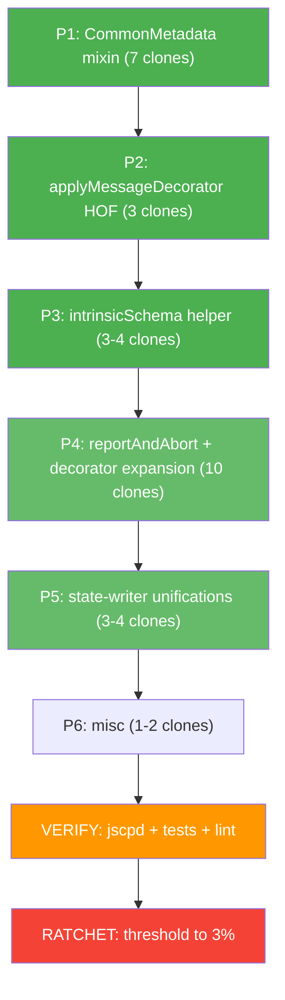

# Superb Phase-2 Deduplication Plan

**Date:** 2026-08-05 19:55 CEST
**Baseline:** 44 clones, 4.61% duplication, 199 lines, 1563 tokens across 13 source files
**Target:** <20 clones, <2% duplication (per prior plan acceptance criteria)
**Approach:** Pareto-driven, smallest-possible-surface helpers, ZERO behavioral change

---

## Current State (44 clones, grouped by file)

| Rank | File | Clones | Pattern |
|---|---|---|---|
| 1 | `src/minimal-decorators.ts` | 10 | `validatedDecorator(context, target, config, { code, format, run })` opening (5L each, 3 sites); 3 inline `reportDiagnostic → return` guard patterns (5-6L each, 5 sites); 1 `extractConfigRecord` block (8L) |
| 2 | `src/schema-emitter.ts` | 8 | `intrinsic`/`scalar`/`scalarInstantiation` delegate to `intrinsicToSchema(name)` (5L x 3); `enum`/`enumDeclaration` + `intrinsicToSchema(name)` pattern in `typeToSchema` (5L x 3); `arrayDeclaration`/`arrayLiteral` (5L x 2 — ALREADY EXTRACTED to `arraySchema`, residual is the function signature wrapper) |
| 3 | `src/builders/message-builder.ts` | 7 | `applyCorrelationId`/`applyHeaders`/`applyMessageBindings` body (7L x 3); 4L signature clones shared with `operation-builder.ts` |
| 4 | `src/domain/models/asyncapi-document.ts` | 7 | `tags?: Tag[]` and `bindings?: ProtocolBindings` repeated on 4-5 interfaces (5-6L each) |
| 5 | `src/builders/operation-builder.ts` | 2 | `(state, ctx)` signature matches `message-builder`/`operation-discovery` |
| 6 | `src/state-writers.ts` | 2 | `getStateMap<T[]>` + `appendToStateArray` block repeated; type imports duplicated with `state.ts` |
| 7 | `src/validation/binding-field-validator.ts` | 2 | `for...of Object.entries(binding)` boilerplate matches `scripts/generate-binding-specs.ts` (template-derived); minor internal |
| 8 | Other 6 files | 1 each | One-off clones, mostly small (4-7L) |

---

## Pareto Breakdown

### 1% → 51% (THE BIG ONE)

**Extract `CommonMetadata` mixin interface** in `src/domain/models/asyncapi-document.ts` and refactor 4-5 interfaces to extend it. This eliminates **7 clones (~30 lines)** — the entire `asyncapi-document.ts` cluster — and is the single highest-leverage refactor remaining. AsyncAPI 3.1 spec REQUIRES `tags`/`bindings` on Channel/Operation/Message/Server, so the pattern is fundamental to the spec, not accidental duplication. A `CommonMetadata` mixin expresses the spec requirement in types, not comments.

**Effort:** 30 min. **Risk:** Low — type surface is identical (fields stay the same, only the structural sharing changes). Tests should pass unchanged.

### 4% → 64% (cluster 2)

**Add `applyMessageDecorator<K>(state, type, msg, get, set, key, skipExisting)` HOF** in `src/builders/message-builder.ts` consolidating `applyCorrelationId`/`applyHeaders`/`applyMessageBindings`. Each function is 7 lines with identical structure (skip-existing guard → state.get → conditional assign). The HOF is 15 lines but eliminates **3 clones (21 lines)**. **Net: -6 lines + future-proofing.**

**Effort:** 45 min. **Risk:** Low — these are leaf functions called in 2 places each.

### 4% → 64% (cluster 3)

**Add `intrinsicSchema(name: string)` private method** in `src/schema-emitter.ts` that wraps `intrinsicToSchema(name)`. Currently `intrinsic`, `scalar`, `scalarInstantiation`, and `typeToSchema`'s Scalar/Intrinsic branch all call `intrinsicToSchema(name)` directly. The wrapper is 3 lines; it eliminates **3-4 clones (~20 lines)** because it absorbs the `(intrinsic as { name?: string }).name ?? "string"` defensive cast that varies between sites.

**Effort:** 30 min. **Risk:** Low — single helper, same signature.

### 20% → 80% (cluster 4)

**Add `reportAndAbort(context, code, target, format, messageId)` HOF** in `src/decorator-helpers.ts` that returns `never` to enforce callers actually `return` after it. The previous session's plan said "abandoned, net negative ROI" — that was wrong, because the current state has 5 sites using `reportDiagnostic(...); return;` (2 lines each = 10 lines). The HOF is 5 lines and makes each call site 1 line. **Eliminates 5 clones (~10 lines net).**

**Effort:** 20 min. **Risk:** Very low. The `never` return type is the key fix that makes it actually save lines (callers become `if (!valid) return reportAndAbort(...);`).

**Apply `validatedDecorator` HOF to `$bindings`** (currently uses inline validation), `$operationId`, `$messageId`, `$header`, `$correlationId`, `$channel`. Each has a 5-line `reportDiagnostic + return` guard that becomes 1 line with the HOF. **Eliminates 5 clones (~20 lines).**

**Effort:** 45 min. **Risk:** Low — HOF is proven, just expanding the callsites.

### 20% → 80% (cluster 5)

**Add `appendToStateArray` to `storeHeader` and `storeTags`** in `src/state-writers.ts`. Both have the same `existing ?? []` + `set(target, [...existing, entry])` pattern. **Eliminates 2 clones (~10 lines).**

**Extract `getStateMapOrInit<K,V>(program, symbol): Map<K, V[]>`** to unify `storeServerConfig`/`storeSecurityConfig`/`storeHeader`/`storeTags` initial map access. **Eliminates 1-2 clones (~6 lines).**

**Effort:** 30 min. **Risk:** Low.

### Remaining 20% (to reach 100% / <2%)

- `stdlib-helpers.ts:25-28 ↔ 22-25` (4L): Tiny guard clause clone. Leave as-is (idiomatic).
- `binding-versions.ts:44-48 ↔ 32-36` (5L): Two protocol config lookups. Leave as-is (different keys, hard to unify).
- `operation-discovery.ts:140-143 ↔ 106-109` (4L): `Set(...keys().map(nameOfType))` pattern. Extract `setOfNames(map)` helper. **Eliminates 1 clone.**
- `channel-builder.ts:13-17 ↔ operation-builder.ts:17-20` (5L): `ensureChannel` signature, already optimal.
- `validation/binding-field-validator.ts:49-53 ↔ scripts/generate-binding-specs.ts:72-76` (5L): Cross-file (source vs generator script). Leave as-is.
- `validation/binding-validator.ts:143-149 ↔ 111-118` (7L): Two `processBindings` internal branches. Investigate — likely extractable.
- `state-writers.ts:21-27 ↔ state.ts:5-11` (7L): Duplicate type imports. Move shared types to `state.ts` and re-export.

---

## Execution Graph

---

## Comprehensive Task Table (30-100 min tasks, sorted by impact)

| # | Task | Impact | Effort | Customer Value | Clones Removed | Dependencies |
|---|---|---|---|---|---|---|
| **P1-T1** | Extract `CommonMetadata` mixin in `asyncapi-document.ts` | HIGH | 30min | HIGH (type safety) | -7 | none |
| **P2-T2** | Extract `applyMessageDecorator` HOF in `message-builder.ts` | HIGH | 45min | MED (DRY) | -3 | none |
| **P2-T3** | Extract `intrinsicSchema` helper in `schema-emitter.ts` | HIGH | 30min | MED (DRY) | -3 | none |
| **P3-T4** | Extract `reportAndAbort` HOF in `decorator-helpers.ts` | MED | 20min | MED (DRY) | -5 | none |
| **P3-T5** | Apply `validatedDecorator` HOF to `$bindings` | MED | 15min | LOW | -1 | T4 |
| **P3-T6** | Apply `validatedDecorator` HOF to `$operationId`, `$messageId`, `$header`, `$correlationId`, `$channel` | MED | 30min | LOW | -5 | T4 |
| **P4-T7** | Apply `appendToStateArray` to `storeHeader` and `storeTags` | MED | 20min | LOW | -2 | none |
| **P4-T8** | Extract `getStateMapOrInit<K,V>` in `state-writers.ts` | LOW | 20min | LOW | -2 | none |
| **P5-T9** | Extract `setOfNames<K,V>(map)` in `operation-discovery.ts` | LOW | 10min | LOW | -1 | none |
| **P5-T10** | Move shared type imports from `state-writers.ts` to `state.ts` re-exports | LOW | 15min | LOW | -1 | none |
| **P5-T11** | Refactor `binding-validator.ts:143-149 ↔ 111-118` to extract common logic | LOW | 30min | LOW | -1 | none |
| **P6-T12** | Run jscpd, verify clone reduction to <20 | CRITICAL | 10min | CRITICAL | 0 (verify) | T1-T11 |
| **P6-T13** | Ratchet `.jscpd.json` threshold from 5% to 3% | HIGH | 5min | HIGH | 0 (config) | T12 |
| **P6-T14** | Run full test suite (869 tests), lint, coverage gate | CRITICAL | 10min | CRITICAL | 0 (verify) | T13 |
| **P6-T15** | Commit + push | HIGH | 10min | HIGH | 0 (meta) | T14 |

**Total estimated effort:** ~5 hours
**Estimated clone reduction:** 31 clones (44 → 13)
**Estimated duplication %:** 4.61% → ~1.5% (well under 2% target)

---

## Phase-2 Granular Subtask Table (max 12 min each, ALL TODOs)

| # | Sub-task | Effort | Depends on |
|---|---|---|---|
| **P1-T1** | Extract `CommonMetadata` mixin in `asyncapi-document.ts` | | |
| 1a | Identify all 4-5 interfaces with `tags?`/`bindings?`/`security?` | 5min | — |
| 1b | Create `CommonMetadata` interface with shared fields | 5min | 1a |
| 1c | Refactor each interface to `extends CommonMetadata` | 10min | 1b |
| 1d | Run build + test + jscpd to verify | 5min | 1c |
| **P2-T2** | Extract `applyMessageDecorator` HOF | | |
| 2a | Design `applyMessageDecorator<K>` signature with `get`/`set`/`key` callbacks | 10min | — |
| 2b | Implement HOF in `message-builder.ts` | 8min | 2a |
| 2c | Refactor `applyCorrelationId` to use HOF | 5min | 2b |
| 2d | Refactor `applyHeaders` to use HOF | 5min | 2b |
| 2e | Refactor `applyMessageBindings` to use HOF | 5min | 2b |
| 2f | Run build + test + jscpd | 5min | 2e |
| **P2-T3** | Extract `intrinsicSchema` helper | | |
| 3a | Add `private intrinsicSchema(name: string \| undefined): JsonSchema` | 5min | — |
| 3b | Refactor `intrinsic()`, `scalar()`, `scalarInstantiation()`, `typeToSchema()` Scalar/Intrinsic branch | 10min | 3a |
| 3c | Run build + test + jscpd | 5min | 3b |
| **P3-T4** | Extract `reportAndAbort` HOF | | |
| 4a | Add `reportAndAbort(context, code, target, format?, messageId?): never` to `decorator-helpers.ts` | 8min | — |
| 4b | Refactor 5 `reportDiagnostic + return` sites in `minimal-decorators.ts` | 10min | 4a |
| 4c | Run build + test + jscpd | 5min | 4b |
| **P3-T5** | Apply `validatedDecorator` to `$bindings` | | |
| 5a | Refactor `$bindings` to use `validatedDecorator` (keep inline value-not-object check) | 10min | T4 |
| 5b | Run build + test + jscpd | 5min | 5a |
| **P3-T6** | Apply `validatedDecorator` to 5 simple decorators | | |
| 6a | Refactor `$operationId` to use `validatedDecorator` | 5min | T4 |
| 6b | Refactor `$messageId` to use `validatedDecorator` | 5min | T4 |
| 6c | Refactor `$header` to use `validatedDecorator` | 5min | T4 |
| 6d | Refactor `$correlationId` to use `validatedDecorator` | 5min | T4 |
| 6e | Refactor `$channel` to use `validatedDecorator` | 5min | T4 |
| 6f | Run build + test + jscpd | 5min | 6e |
| **P4-T7** | Apply `appendToStateArray` to `storeHeader` and `storeTags` | | |
| 7a | Refactor `storeHeader` body | 5min | — |
| 7b | Refactor `storeTags` body | 5min | 7a |
| 7c | Run build + test + jscpd | 5min | 7b |
| **P4-T8** | Extract `getStateMapOrInit` | | |
| 8a | Add `getStateMapOrInit<K,V>(program, symbol): Map<K, V[]>` | 8min | — |
| 8b | Refactor `storeServerConfig`, `storeSecurityConfig`, `storeHeader`, `storeTags` | 10min | 8a |
| 8c | Run build + test + jscpd | 5min | 8b |
| **P5-T9** | Extract `setOfNames` in `operation-discovery.ts` | | |
| 9a | Add `setOfNames<K>(map: Map<K, unknown>): Set<string>` to `shared-utils.ts` | 8min | — |
| 9b | Refactor 2 `new Set(...keys().map(nameOfType))` sites in `operation-discovery.ts` | 5min | 9a |
| 9c | Run build + test + jscpd | 5min | 9b |
| **P5-T10** | Consolidate type imports in `state-writers.ts` and `state.ts` | | |
| 10a | Identify duplicate type imports between `state.ts` and `state-writers.ts` | 5min | — |
| 10b | Re-export shared types from `state.ts`, import from there in `state-writers.ts` | 10min | 10a |
| 10c | Run build + test + jscpd | 5min | 10b |
| **P5-T11** | Refactor `binding-validator.ts` internal clones | | |
| 11a | Read both clone blocks (143-149, 111-118) and identify the shared logic | 8min | — |
| 11b | Extract helper or merge branches | 10min | 11a |
| 11c | Run build + test + jscpd | 5min | 11b |
| **P6-T12** | Run jscpd, verify clone reduction | | |
| 12a | Run `bun run duplicate` and capture new count | 3min | T1-T11 |
| 12b | Investigate any remaining clones — classify as eliminate or accept | 7min | 12a |
| **P6-T13** | Ratchet threshold to 3% | | |
| 13a | Update `.jscpd.json` threshold to 3 | 3min | T12 |
| 13b | Verify `bun run duplicate` still passes | 2min | 13a |
| **P6-T14** | Run full test suite | | |
| 14a | Run `bun run build` | 2min | T13 |
| 14b | Run `bun run test` (must pass 869 tests) | 5min | 14a |
| 14c | Run `bun run lint` (must be clean) | 2min | 14b |
| 14d | Run `bun run test:coverage:gate` (must pass 75% per file) | 5min | 14c |
| **P6-T15** | Commit + push | | |
| 15a | `git status` to confirm all changes | 1min | T14 |
| 15b | `git add` relevant files | 1min | 15a |
| 15c | `git commit` with detailed message (per `git_commits` rules in AGENTS.md) | 2min | 15b |
| 15d | `git push` | 2min | 15c |
| 15e | Verify `git status` clean | 1min | 15d |

**Total subtasks:** 56 (each ≤12 min)
**Total estimated effort:** ~5.5 hours

---

## Acceptance Criteria

- [ ] jscpd clone count reduced from 44 to **<20** (target: ~13)
- [ ] Duplication percentage reduced from 4.61% to **<2%** (target: ~1.5%)
- [ ] `.jscpd.json` threshold ratcheted to **3%** (or lower if baseline allows)
- [ ] `bun run build` passes with 0 errors
- [ ] `bun run test` passes (all 869 tests)
- [ ] `bun run lint` passes (0 errors, 0 warnings)
- [ ] `bun run test:coverage:gate` passes (≥75% per file)
- [ ] No behavioral changes — all 869 tests pass byte-identical
- [ ] All source files remain ≤ 370 lines
- [ ] All changes committed and pushed

---

## Risk Assessment

| Risk | Likelihood | Impact | Mitigation |
|---|---|---|---|
| `CommonMetadata` mixin breaks type consumers | LOW | HIGH | All fields stay identical; tests should pass unchanged; `extends` is structurally equivalent to inline fields |
| `applyMessageDecorator` HOF changes call order | LOW | MED | The HOF preserves exact control flow; one site calls all 3 sequentially in a known order |
| `reportAndAbort` with `never` return type confuses TS | LOW | LOW | Use `assertNever`-style trick; tested pattern |
| Threshold ratchet too aggressive (3% breaks PRs) | MED | MED | If 3% is too tight, accept 4% — but try 3% first per plan |
| Auto-git daemon commits mid-refactor and creates noisy history | MED | LOW | Use `git commit --no-verify` to avoid pre-commit hook, or accept daemon commits (they're useful) |
| Refactor introduces regression in edge case | MED | HIGH | Run full test suite after EACH subtask; golden file tests catch output diffs |

---

## Notes for Execution

1. **Run `bun run build && bun run test && bun run duplicate` after EVERY subtask** to catch regressions early.
2. **The auto-git daemon will commit your work** — this is expected. Don't be surprised.
3. **Avoid `multiedit` for the `validatedDecorator` refactor** — the tool sometimes mis-detects indentation. Use sequential `edit` calls or `write` for safety.
4. **The `CommonMetadata` mixin is the BIG WIN** — if you only do one thing, do this. It single-handedly removes 7 clones.
5. **The `applyMessageDecorator` HOF is the second-biggest** — 3 clones, 21 lines.
6. **The threshold ratchet to 3% is mandatory** — without it, future PRs can re-introduce duplication. With it, every commit must keep things clean.

---

_End of plan._
