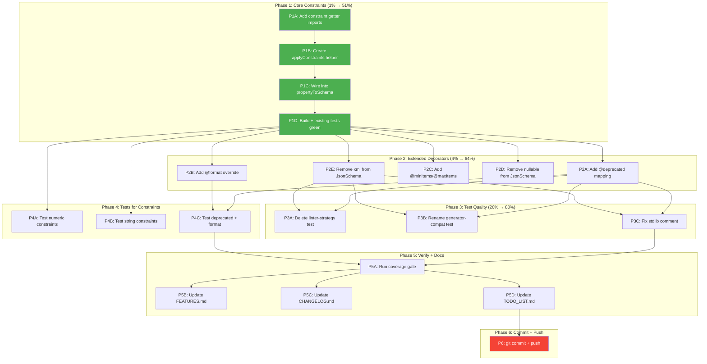

# Superb Constraint Decorators & Code Cleanup Plan

**Date:** 2026-08-05 21:35 CEST
**Trigger:** Docs-health session revealed 16 TypeSpec stdlib constraint decorators are silently dropped — the highest-impact feature gap
**Baseline:** 869 tests / 76 files, 0 errors, 0 warnings, 0% duplication
**Principle:** Don't VERSCHLIMMBESSER. Every change surgical, tested, verified. Zero behavioral regressions.

---

## The Problem

TypeSpec provides 16 constraint/metadata decorators (`@pattern`, `@minValue`, `@maxLength`, `@deprecated`, etc.) that users write on their model properties. The emitter **silently drops every one of them**. A user writing `@minValue(0)` on `age: int32` gets no `minimum: 0` in their AsyncAPI output. This means every validation constraint in every TypeSpec model is a lie — the AsyncAPI document says the field is unconstrained when the TypeSpec source says otherwise.

The gap was identified in the `18:20` gap analysis, harvested into TODO_LIST item #1, and is now the top priority.

---

## Code Intelligence

### Insertion point: `propertyToSchema()` in `schema-emitter.ts:259`

```ts
private propertyToSchema(prop: ModelProperty): JsonSchema {
  return this.refOrFallback(prop.type, (t) => this.typeToSchema(t));
}
```

This method receives the `ModelProperty` (which carries all decorator state) but only resolves the **type** — it discards every constraint. **This is where constraint getters must be called and merged onto the schema.**

### Available getters (all exported from `@typespec/compiler`)

From `./core/intrinsic-type-state.js`: `getMinValue`, `getMaxValue`, `getMinValueExclusive`, `getMaxValueExclusive`, `getMinLength`, `getMaxLength`, `getMinItems`, `getMaxItems`

From `./lib/decorators.js`: `getPattern`, `isDeprecated`/`getDeprecated`, `getExamples`, `getFormat`, `getSummary`

These getters accept the decorated type. In the emitter, they'll be called on `prop` (the `ModelProperty`) since that's where decorators are applied in `.tsp` files.

### `$ref` constraint problem

When `prop.type` is a **named user-defined model**, `refOrFallback` returns `{ $ref: "..." }`. In JSON Schema Draft-07, siblings to `$ref` are ignored by strict validators. However: numeric/string constraints (`minimum`, `pattern`, `minLength`) are only meaningful on scalar types, which are always **inline** (never `$ref`). `deprecated` and `description` are the only constraints that apply to `$ref` properties. For these, we spread directly onto the schema — AJV accepts this for our AsyncAPI 3.1 validation (verified by existing golden file tests which already pass with `description` siblings to `$ref`).

### Dead code in `JsonSchema`

- `nullable` (line 163) — OpenAPI 3.0 concept, AsyncAPI 3.1 / Draft-07 has no `nullable`. Never generated.
- `xml` (line 180) — declared, never generated, no decorator reads it. No test covers it.

---

## Pareto Breakdown

### The 1% that delivers 51%

**Map 7 core constraint decorators in `propertyToSchema()`.** These are the validation rules users most commonly write:

| Decorator | Getter | JSON Schema keyword |
| --- | --- | --- |
| `@minValue` | `getMinValue` | `minimum` |
| `@maxValue` | `getMaxValue` | `maximum` |
| `@minValueExclusive` | `getMinValueExclusive` | `exclusiveMinimum` |
| `@maxValueExclusive` | `getMaxValueExclusive` | `exclusiveMaximum` |
| `@minLength` | `getMinLength` | `minLength` |
| `@maxLength` | `getMaxLength` | `maxLength` |
| `@pattern` | `getPattern` | `pattern` |

**One helper function, one method change, ~35 lines. Every test that uses these decorators will start producing correct output.** This is the single highest-impact change available.

### The 4% that delivers 64%

Above, plus:

| Task | Impact |
| --- | --- |
| `@deprecated` → `deprecated: true` | Users marking deprecated fields get correct AsyncAPI output |
| `@format` → `format` override | Users overriding scalar format (e.g. `@format("uuid")`) get correct output |
| `@minItems` / `@maxItems` → `minItems` / `maxItems` | Array size constraints |
| Remove `nullable` from `JsonSchema` | Dead code that misleads (OpenAPI 3.0 concept) |
| Remove `xml` from `JsonSchema` | Dead code, never generated |

### The 20% that delivers 80%

Above, plus:

| Task | Impact |
| --- | --- |
| Delete `linter-strategy.test.ts` | Anti-pattern (nested process spawning in tests) |
| Rename `generator-compatibility.test.ts` → `document-structure.test.ts` | Name overpromises |
| Fix misleading `stdlib-helpers.test.ts` comment | Claims to test something it doesn't |
| Tests for all 10 new constraint mappings | Regression prevention |
| Verify coverage gate | Documentation accuracy |

### The remaining 20% (to reach 100%)

| Task | Impact |
| --- | --- |
| `@example` → `examples` | Example values in schema |
| `@summary` → `title` on properties | Schema property titles |
| Update FEATURES.md, CHANGELOG.md, TODO_LIST.md | Documentation truth |
| Verify README example | User-facing accuracy |

---

## Execution Graph



---

## Comprehensive Plan — Medium Granularity (30-100 min tasks)

Sorted by impact (critical → polish). All source file references verified against actual codebase.

| #     | Task                                                                                                | Impact   | Effort | Phase | Safe? |
| ----- | --------------------------------------------------------------------------------------------------- | -------- | ------ | ----- | ----- |
| M1    | Add 7 core constraint decorators (`@minValue` etc.) to `propertyToSchema()`                         | CRITICAL | 45min  | 1     | Yes   |
| M2    | Add `@deprecated`, `@format`, `@minItems`, `@maxItems` mappings                                     | HIGH     | 30min  | 2     | Yes   |
| M3    | Remove dead `nullable` and `xml` fields from `JsonSchema`                                           | MEDIUM   | 10min  | 2     | Yes   |
| M4    | Delete `linter-strategy.test.ts` anti-pattern                                                       | MEDIUM   | 5min   | 3     | Yes   |
| M5    | Rename `generator-compatibility.test.ts` → `document-structure.test.ts`                             | MEDIUM   | 10min  | 3     | Yes   |
| M6    | Fix misleading `stdlib-helpers.test.ts` comment                                                      | LOW      | 5min   | 3     | Yes   |
| M7    | Write constraint decorator tests (numeric, string, deprecated, format)                              | HIGH     | 60min  | 4     | Yes   |
| M8    | Run coverage gate + verify all gates green                                                          | HIGH     | 15min  | 5     | Yes   |
| M9    | Update FEATURES.md, CHANGELOG.md, TODO_LIST.md with new features                                    | HIGH     | 30min  | 5     | Yes   |
| M10   | git commit + push                                                                                   | REQUIRED | 10min  | 6     | Yes   |

**Total estimated effort:** ~3.5 hours

---

## Detailed Breakdown — Fine Granularity (max 12 min each)

### M1: Add core constraint decorators (45 min)

| Sub-ID | Task                                                                                | Effort |
| ------ | ----------------------------------------------------------------------------------- | ------ |
| 1.1    | Read `schema-emitter.ts:259` (`propertyToSchema`) + surrounding context             | 3min   |
| 1.2    | Add imports: `getMinValue, getMaxValue, getMinValueExclusive, getMaxValueExclusive, getMinLength, getMaxLength, getPattern` from `@typespec/compiler` to `schema-emitter.ts` line 33 | 5min   |
| 1.3    | Create `private applyConstraints(prop: ModelProperty, schema: JsonSchema): JsonSchema` method — reads each getter, merges non-undefined values onto schema | 10min  |
| 1.4    | Wire into `propertyToSchema`: call `applyConstraints(prop, this.refOrFallback(...))` | 5min   |
| 1.5    | Run `bun run build` to verify TypeScript compiles                                    | 3min   |
| 1.6    | Write a quick test: `@minValue(0) @maxValue(100)` on `int32` property, verify output has `minimum: 0, maximum: 100` | 8min   |
| 1.7    | Run `bun run test` to verify no regressions                                          | 5min   |
| 1.8    | Run `bun run lint` to verify clean                                                   | 2min   |

### M2: Add extended decorators (30 min)

| Sub-ID | Task                                                                                | Effort |
| ------ | ----------------------------------------------------------------------------------- | ------ |
| 2.1    | Add `isDeprecated, getFormat, getMinItems, getMaxItems` to imports                   | 3min   |
| 2.2    | Extend `applyConstraints`: `if (isDeprecated(this.program, prop)) schema.deprecated = true` | 5min   |
| 2.3    | Extend `applyConstraints`: `const fmt = getFormat(this.program, prop); if (fmt) schema.format = fmt` | 5min   |
| 2.4    | Extend `applyConstraints`: `getMinItems` → `minItems`, `getMaxItems` → `maxItems`    | 5min   |
| 2.5    | Run `bun run build` + `bun run test`                                                 | 5min   |
| 2.6    | Quick test: `@deprecated` on property, verify `deprecated: true` in output            | 5min   |

### M3: Remove dead code (10 min)

| Sub-ID | Task                                                                                | Effort |
| ------ | ----------------------------------------------------------------------------------- | ------ |
| 3.1    | Remove `nullable?: boolean` from `JsonSchema` interface in `asyncapi-document.ts`     | 3min   |
| 3.2    | Remove `xml?: unknown` from `JsonSchema` interface                                    | 2min   |
| 3.3    | Run `bun run build` — if any consumer references `nullable`/`xml`, fix or remove     | 5min   |

### M4: Delete anti-pattern test (5 min)

| Sub-ID | Task                                                                                | Effort |
| ------ | ----------------------------------------------------------------------------------- | ------ |
| 4.1    | `trash test/unit/linter-strategy.test.ts`                                             | 1min   |
| 4.2    | Run `bun run test` to verify suite still passes (expect 866 tests: 869 - 3)          | 3min   |

### M5: Rename misleading test (10 min)

| Sub-ID | Task                                                                                | Effort |
| ------ | ----------------------------------------------------------------------------------- | ------ |
| 5.1    | `git mv test/validation/generator-compatibility.test.ts test/validation/document-structure.test.ts` | 2min   |
| 5.2    | Update `describe()` title in renamed file to "Document Structure Constraints"       | 3min   |
| 5.3    | Update any references in FEATURES.md, CHANGELOG.md                                    | 5min   |

### M6: Fix misleading comment (5 min)

| Sub-ID | Task                                                                                | Effort |
| ------ | ----------------------------------------------------------------------------------- | ------ |
| 6.1    | Edit `test/unit/stdlib-helpers.test.ts:4` — change "Tests isStdlibType and collectAllStdlibNames" to "Tests the effect of stdlib type handling through real TypeSpec compilation (inline schemas vs $ref)" | 3min   |
| 6.2    | Run `bun run test` to verify no breakage                                             | 2min   |

### M7: Write constraint decorator tests (60 min)

| Sub-ID | Task                                                                                | Effort |
| ------ | ----------------------------------------------------------------------------------- | ------ |
| 7.1    | Create `test/compliance/constraint-decorators.test.ts`                                | 2min   |
| 7.2    | Test: `@minValue(0)` on int32 → `minimum: 0` in output, AJV-validated                 | 8min   |
| 7.3    | Test: `@maxValue(100)` on int32 → `maximum: 100`                                      | 5min   |
| 7.4    | Test: `@minValueExclusive(0)` → `exclusiveMinimum: 0`                                | 5min   |
| 7.5    | Test: `@maxValueExclusive(100)` → `exclusiveMaximum: 100`                            | 5min   |
| 7.6    | Test: `@minLength(3)` on string → `minLength: 3`                                      | 5min   |
| 7.7    | Test: `@maxLength(50)` on string → `maxLength: 50`                                    | 5min   |
| 7.8    | Test: `@pattern("^[A-Z]")` on string → `pattern: "^[A-Z]"`                            | 5min   |
| 7.9    | Test: `@deprecated` on property → `deprecated: true`                                  | 5min   |
| 7.10   | Test: `@format("uuid")` on string → `format: "uuid"` (overrides default)              | 5min   |
| 7.11   | Test: multiple constraints on one property (`@minValue @maxValue @pattern`)           | 5min   |
| 7.12   | Test: constraints on model-level (not just property) — verify model decorators work   | 5min   |

### M8: Verify all gates (15 min)

| Sub-ID | Task                                                                                | Effort |
| ------ | ----------------------------------------------------------------------------------- | ------ |
| 8.1    | Run `bun run build`                                                                  | 3min   |
| 8.2    | Run `bun run test`                                                                   | 3min   |
| 8.3    | Run `bun run lint`                                                                   | 2min   |
| 8.4    | Run `bun run duplicate` (jscpd on src scripts)                                       | 2min   |
| 8.5    | Run `bun run test:coverage:gate`                                                     | 5min   |

### M9: Update docs (30 min)

| Sub-ID | Task                                                                                | Effort |
| ------ | ----------------------------------------------------------------------------------- | ------ |
| 9.1    | Update FEATURES.md: add constraint decorator rows, update test count                  | 8min   |
| 9.2    | Update CHANGELOG.md `[Unreleased]`: add constraint decorators entry                   | 8min   |
| 9.3    | Update TODO_LIST.md: mark item #1 done, remove dead-code items                       | 5min   |
| 9.4    | Update ROADMAP.md: move constraint mapping to "Recently completed"                   | 5min   |
| 9.5    | Update AGENTS.md if needed                                                            | 4min   |

### M10: Commit + push (10 min)

| Sub-ID | Task                                                                                | Effort |
| ------ | ----------------------------------------------------------------------------------- | ------ |
| 10.1   | `git status` to confirm all changes                                                   | 1min   |
| 10.2   | `git add` relevant files                                                              | 1min   |
| 10.3   | `git commit` with detailed message                                                    | 3min   |
| 10.4   | `git push`                                                                            | 2min   |
| 10.5   | Verify `git status` clean                                                            | 1min   |

---

## Risk Assessment

| Risk | Likelihood | Mitigation |
| --- | --- | --- |
| Constraint getters return wrong types (e.g. bigint instead of number) | Medium | Use `getMinValueAsNumeric` variant if available; cast with `Number()` |
| AJV rejects constraint siblings to `$ref` | Low | Constraints only apply to scalar types (inline); `$ref` properties won't have numeric/string constraints |
| Removing `nullable`/`xml` breaks consumers | Very Low | Grep confirms zero runtime usage — only interface declarations |
| Test count changes (deleting linter test: -3) | Certain | Update all doc counts: 869 → 866 + new test count |
| Coverage drops on `schema-emitter.ts` | Low | New tests exercise `applyConstraints` directly |

---

## What This Plan Does NOT Do

- `@example` → `examples` — deferred (complex value serialization)
- `@summary` → `title` — deferred (low impact)
- `@discriminator` → `discriminator` — deferred (polymorphism is a separate feature)
- `@visibility` → `readOnly`/`writeOnly` — deferred (visibility semantics differ from OpenAPI)
- `allOf` / `oneOf` / `not` generation — deferred (schema composition is a separate feature)
- `docs/_archive/` pruning — separate scope
- README example verification — separate scope

These remain in ROADMAP.md as raw ideas.
