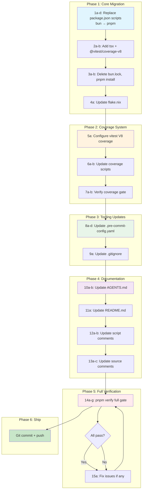

# SUPERB PARETO EXECUTION PLAN: Bun → pnpm Migration

**Date:** 2026-08-06
**Goal:** Migrate all tooling from Bun to pnpm without breaking anything
**Risk Level:** Medium (coverage system is the only architectural challenge)

---

## Context

The project uses Bun for three purposes:
1. **Package manager** — `bun install`, `bun.lock`
2. **Script runner** — `bun run <script>`, `bun x <cmd>` in package.json scripts
3. **Coverage instrumenter** — `bun test --coverage` (Bun's native test runner + V8 coverage)

The codebase uses **zero Bun-specific runtime APIs** — all imports are `node:fs`, `node:path`, etc. This makes the migration mechanically simple except for the coverage system.

### Key Insight: The Coverage Problem

`bun test --coverage` runs Bun's **native test runner** (not vitest) with V8 coverage. This captures `dist/src/*.js` files that the TypeSpec compiler loads dynamically — files that vitest's istanbul provider can't instrument. The tests work under both Bun's test runner and vitest because both provide Jest-compatible globals (`describe`, `it`, `expect`) and the tests use `globals: true` (no explicit imports).

**Solution:** Use vitest's built-in V8 coverage provider (`@vitest/coverage-v8`). V8 coverage captures all code the V8 engine executes, regardless of how it's loaded — same as Bun's approach. This produces `lcov.info` that `coverage-gate.ts` can parse without changes.

---

## Pareto Breakdown

### 20% that delivers 80% of the result

1. **Replace all bun/bunx in package.json scripts** — mechanical find-and-replace of ~20 script entries
2. **Add `tsx` devDependency** — needed to run `.ts` scripts directly (Bun does this natively)
3. **Delete `bun.lock`, run `pnpm install`** — generates `pnpm-lock.yaml`
4. **Update `flake.nix`** — `pkgs.bun` → `pkgs.pnpm`

### 4% that delivers 64% of the result

1. **package.json scripts replacement** — this IS the migration for daily use (`pnpm build`, `pnpm test`, `pnpm lint`)
2. **`pnpm install` + lockfile** — without this, nothing works

### 1% that delivers 51% of the result

1. **package.json scripts replacement** — if this is right, the 4 most-used commands (`build`, `test`, `lint`, `typecheck`) work

### The other 20% (to get to 100%)

- **Coverage system** — replace `bun test --coverage` with vitest V8 coverage provider
- **`.pre-commit-config.yaml`** — update all hooks from `bunx`/`bun test` to `pnpm exec`/`pnpm test`
- **Documentation** — AGENTS.md, README.md, script comments, source file comments
- **`.gitignore`** — update comment from "bun install" to "pnpm install"

---

## Phase Plan (Tasks 10–30 min each)

| # | Task | Phase | Impact | Effort | Priority |
|---|------|-------|--------|--------|----------|
| 1 | Replace all bun/bunx/bun x in package.json scripts with pnpm equivalents | Core | Critical | Low | P0 |
| 2 | Add `tsx` and `@vitest/coverage-v8` to devDependencies | Core | Critical | Low | P0 |
| 3 | Delete `bun.lock`, run `pnpm install`, verify resolution | Core | Critical | Low | P0 |
| 4 | Update `flake.nix` (pkgs.bun → pkgs.pnpm) | Core | High | Low | P1 |
| 5 | Configure vitest V8 coverage in `vitest.config.ts` | Coverage | Critical | Medium | P0 |
| 6 | Update `test:coverage` and `test:coverage:gate` scripts | Coverage | Critical | Low | P0 |
| 7 | Verify coverage gate produces lcov.info and passes | Coverage | Critical | Medium | P0 |
| 8 | Update `.pre-commit-config.yaml` (bunx → pnpm exec, bun test → pnpm test, bun.lockb → pnpm-lock.yaml) | Tooling | High | Low | P1 |
| 9 | Update `.gitignore` comment (bun install → pnpm install) | Tooling | Low | Low | P2 |
| 10 | Update `AGENTS.md` — quick start commands, constraints, coverage explanation | Docs | High | Low | P1 |
| 11 | Update `README.md` — install/usage instructions | Docs | Medium | Low | P1 |
| 12 | Update script comments (`generate-binding-specs.ts`, `coverage-gate.ts`) | Docs | Low | Low | P2 |
| 13 | Update source file comments (`generated-bindings.ts`, `binding-versions.ts`, `binding-field-validator.ts`) | Docs | Low | Low | P2 |
| 14 | Full verification: `pnpm verify` (build + lint + test + coverage:gate + duplicate) | Verify | Critical | Medium | P0 |
| 15 | Fix any issues found during verification | Verify | Critical | Unknown | P0 |

---

## Detailed Task Breakdown (Tasks max 12 min each)

| # | Task | Depends on | Est. |
|---|------|------------|------|
| 1a | Replace `bun run` → `pnpm` in package.json scripts (non-coverage scripts) | — | 5 min |
| 1b | Replace `bun x` → `pnpm exec` in package.json scripts | — | 3 min |
| 1c | Replace `bun audit`/`bun outdated`/`bun update` → `pnpm audit`/`pnpm outdated`/`pnpm update` | — | 3 min |
| 1d | Replace `bun run --watch` → `tsx watch` in `dev` script | — | 2 min |
| 2a | Add `tsx` to devDependencies in package.json | — | 2 min |
| 2b | Add `@vitest/coverage-v8` to devDependencies in package.json | — | 2 min |
| 3a | Delete `bun.lock` | — | 1 min |
| 3b | Run `pnpm install` and verify no errors | 3a | 5 min |
| 4a | Replace `pkgs.bun` with `pkgs.pnpm` in flake.nix (both devShells) | — | 3 min |
| 5a | Add coverage config to `vitest.config.ts` (provider: v8, reporter: lcov, reportsDirectory) | 2b | 5 min |
| 6a | Update `test:coverage` script: `bun test --coverage` → `vitest run --coverage` | 5a | 3 min |
| 6b | Update `test:coverage:gate` script: `bun run` → `pnpm run`, `bun run scripts/` → `tsx scripts/` | — | 3 min |
| 7a | Run `pnpm run test:coverage:gate` and verify lcov.info is generated | 6a, 6b | 8 min |
| 7b | Verify coverage numbers match expected (~97% average) | 7a | 5 min |
| 8a | Update `.pre-commit-config.yaml`: `bunx eslint` → `pnpm exec eslint` | — | 3 min |
| 8b | Update `.pre-commit-config.yaml`: `bunx tsc` → `pnpm exec tsc` | — | 2 min |
| 8c | Update `.pre-commit-config.yaml`: `bun test` → `pnpm test` | — | 2 min |
| 8d | Update `.pre-commit-config.yaml`: exclude patterns `bun.lockb` → `pnpm-lock.yaml` | — | 3 min |
| 9a | Update `.gitignore` comment | — | 1 min |
| 10a | Update AGENTS.md quick start section (bun → pnpm commands) | — | 5 min |
| 10b | Update AGENTS.md constraints section (bun/bunx policy, coverage explanation) | — | 8 min |
| 11a | Update README.md install/usage instructions | — | 5 min |
| 12a | Update `generate-binding-specs.ts` usage comment | — | 2 min |
| 12b | Update `coverage-gate.ts` comment and error message | — | 3 min |
| 13a | Update `generated-bindings.ts` header comment | — | 2 min |
| 13b | Update `binding-versions.ts` regeneration comment | — | 2 min |
| 13c | Update `binding-field-validator.ts` regeneration comment | — | 2 min |
| 14a | Run `pnpm install` (clean install) | 3b | 5 min |
| 14b | Run `pnpm run build` and verify 0 errors | 14a | 5 min |
| 14c | Run `pnpm run lint` and verify 0 errors | 14b | 5 min |
| 14d | Run `pnpm run test` and verify all tests pass | 14b | 8 min |
| 14e | Run `pnpm run test:coverage:gate` and verify pass | 14d | 8 min |
| 14f | Run `pnpm run duplicate` and verify 0 clones | 14b | 5 min |
| 14g | Run `pnpm run verify` (full gate) and verify pass | 14b–14f | 10 min |
| 15a | Fix any issues found during verification | 14g | variable |

---

## Execution Graph

---

## Script Replacement Reference

| Current (bun) | New (pnpm) |
|---|---|
| `bun run <script>` | `pnpm run <script>` (or just `pnpm <script>`) |
| `bun x tsc` | `pnpm exec tsc` |
| `bun run scripts/*.ts` | `tsx scripts/*.ts` |
| `bun run --watch src/index.ts` | `tsx watch src/index.ts` |
| `bun test --coverage` | `vitest run --coverage` (with V8 provider) |
| `bun audit` | `pnpm audit` |
| `bun outdated` | `pnpm outdated` |
| `bun update` | `pnpm update` |
| `bunx eslint` (pre-commit) | `pnpm exec eslint` |
| `bunx tsc` (pre-commit) | `pnpm exec tsc` |
| `bun test` (pre-commit) | `pnpm test` |

## Risk Assessment

| Risk | Probability | Impact | Mitigation |
|---|---|---|---|
| vitest V8 coverage doesn't capture `dist/*.js` | Low | High | Test early; fallback to `c8` wrapper |
| pnpm resolution issues (peer deps) | Low | Medium | Add `.npmrc` with `shamefully-hoist=true` if needed |
| `tsx` execution differences from `bun run` | Very Low | Low | Scripts use only `node:fs`/`node:path` — no Bun APIs |
| pre-commit hooks fail | Low | Low | Update all entries before testing |
| Coverage numbers change | Medium | Low | V8 coverage should be equivalent; gate threshold is 75% |
