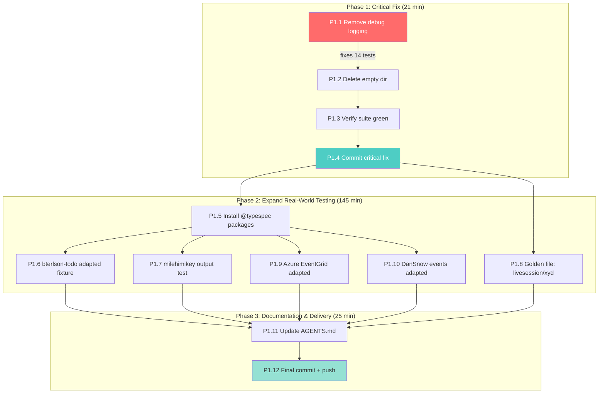

# Execution Plan: Fix Critical Bugs + Solidify Real-World Testing

**Created:** 2026-08-06 22:41
**Context:** 14 tests failing due to committed debug logging. Real-world GitHub testing is honest but incomplete. Working tree has formatting drift across 55+ files.

---

## Pareto Breakdown

### The 1% that delivers 51% of the result

| #   | Task                                                                                                         | Why                                                               |
| --- | ------------------------------------------------------------------------------------------------------------ | ----------------------------------------------------------------- |
| 1   | Remove debug `appendFileSync` + `console.error` from `src/minimal-decorators.ts` and `src/schema-emitter.ts` | Fixes 14 test failures instantly. This is a production crash bug. |

### The 4% that delivers 64% of the result

| #   | Task                                               | Why                                      |
| --- | -------------------------------------------------- | ---------------------------------------- |
| 1   | Remove debug logging (above)                       | 14 tests → green                         |
| 2   | Delete empty `test/realworld/fixtures/github/` dir | Dead artifact from deleted fake fixtures |
| 3   | Verify full suite passes                           | Confirm we're back to a clean state      |
| 4   | Commit and push everything                         | Lock in the honest testing + bug fix     |

### The 20% that delivers 80% of the result

| #   | Task                                                                                                 | Why                                                                                                                  |
| --- | ---------------------------------------------------------------------------------------------------- | -------------------------------------------------------------------------------------------------------------------- |
| 1-4 | Above                                                                                                | Foundation                                                                                                           |
| 5   | Install `@typespec/http`, `@typespec/rest`, `@typespec/openapi3`, `@typespec/json-schema` as devDeps | Unlocks compiling bterlson/typespec-todo (TypeSpec creator's sample) — currently 5 `import-not-found` errors         |
| 6   | Create adapted wrapper fixture for bterlson/typespec-todo with diff assertion                        | Most starred (10⭐) TypeSpec sample on GitHub. Tests bytes, union, @pattern, @minLength, model property refs         |
| 7   | Test milehimikey kafka-orders with adapted decorator syntax                                          | Only repo with actual `@channel` decorators. Verifies our emitter produces correct output for real AsyncAPI patterns |
| 8   | Golden file capture for livesession/xyd output                                                       | 724-line production codebase, 40+ schemas, already compiles cleanly. Lock it as verified-correct                     |

### The remaining 20% to reach 100%

| #   | Task                                                                                       | Why                                                                             |
| --- | ------------------------------------------------------------------------------------------ | ------------------------------------------------------------------------------- |
| 9   | Create adapted wrapper for Azure EventGrid models                                          | Enterprise-grade CloudEvents schema. Tests `unknown`, `bytes`, recursive models |
| 10  | Create adapted wrapper for DanSnow/typespec-events                                         | Tests nested models, int64 timestamps, arrays of named models                   |
| 11  | Update AGENTS.md with findings (decorator API differences, TypeSpec v1.14 breaking change) | Knowledge preservation                                                          |
| 12  | Commit and push all work                                                                   | Lock in                                                                         |

---

## Phase 1: Comprehensive Plan (30-100 min tasks)

| ID    | Task                                                                                                                             | Impact (1-5) | Effort (min) | Value                                                                          | Phase    |
| ----- | -------------------------------------------------------------------------------------------------------------------------------- | :----------: | :----------: | ------------------------------------------------------------------------------ | -------- |
| P1.1  | Remove debug logging from `src/minimal-decorators.ts` (lines 18, 88-91) and `src/schema-emitter.ts` (line 188)                   |      5       |      5       | Fixes 14 test failures                                                         | Critical |
| P1.2  | Delete empty `test/realworld/fixtures/github/` directory                                                                         |      1       |      1       | Cleanup dead artifact                                                          | Critical |
| P1.3  | Run full test suite — verify 14 failures are resolved                                                                            |      5       |      5       | Confirm green                                                                  | Critical |
| P1.4  | Stage and commit: debug fix + cleanup + status report + planning doc                                                             |      4       |      10      | Lock in critical fix                                                           | Critical |
| P1.5  | Install missing TypeSpec packages as devDeps (`@typespec/http`, `@typespec/rest`, `@typespec/openapi3`, `@typespec/json-schema`) |      4       |      10      | Unlocks 3 more repos                                                           | High     |
| P1.6  | Create adapted wrapper fixture for bterlson/typespec-todo with line-by-line diff assertion                                       |      4       |      45      | Tests bytes/union/pattern/visibility on real models                            | High     |
| P1.7  | Create cross-emitter output test: milehimikey kafka-orders with adapted decorator syntax, verify output correctness              |      5       |      45      | Only real AsyncAPI spec; validates full operation→channel→message→schema chain | High     |
| P1.8  | Golden file capture for livesession/xyd (724 lines, 40+ schemas)                                                                 |      3       |      30      | Locks verified-correct output as regression guard                              | High     |
| P1.9  | Create adapted wrapper for Azure EventGrid CloudEvent models                                                                     |      3       |      35      | Tests unknown/bytes/recursive models from enterprise spec                      | Medium   |
| P1.10 | Create adapted wrapper for DanSnow/typespec-events models                                                                        |      2       |      25      | Tests nested models, int64, arrays                                             | Medium   |
| P1.11 | Update AGENTS.md with real-world testing findings and TypeSpec v1.14 compatibility notes                                         |      3       |      15      | Knowledge preservation                                                         | Medium   |
| P1.12 | Final commit and push — all work locked in                                                                                       |      3       |      10      | Delivery                                                                       | Wrap-up  |

**Total estimated time:** ~235 min (~4 hours)

---

## Phase 2: Detailed Breakdown (max 12 min each)

### P1.1 — Remove debug logging (5 min → 3 tasks)

| Sub-ID | Task                                                                                                                                           | Min |
| ------ | ---------------------------------------------------------------------------------------------------------------------------------------------- | :-: |
| P1.1.a | Remove `import { appendFileSync } from "node:fs"` (line 18) and the `appendFileSync(...)` block (lines 88-91) from `src/minimal-decorators.ts` |  3  |
| P1.1.b | Remove `console.error("DEBUG programContext called")` from `src/schema-emitter.ts` line 188                                                    |  2  |
| P1.1.c | Verify `grep -rn 'appendFileSync\|console\.(log\|error)' src/` returns nothing                                                                 |  1  |

### P1.2 — Delete empty directory (1 min → 1 task)

| Sub-ID | Task                                                                            | Min |
| ------ | ------------------------------------------------------------------------------- | :-: |
| P1.2.a | `rm -rf test/realworld/fixtures/github/` (empty dir from deleted fake fixtures) |  1  |

### P1.3 — Verify test suite (5 min → 1 task)

| Sub-ID | Task                                                                                         | Min |
| ------ | -------------------------------------------------------------------------------------------- | :-: |
| P1.3.a | Run `pnpm run test` and verify 0 failures (was 14 failed / 1242 passed → should be 0 / 1256) |  5  |

### P1.4 — Commit critical fix (10 min → 2 tasks)

| Sub-ID | Task                                                                        | Min |
| ------ | --------------------------------------------------------------------------- | :-: |
| P1.4.a | `git add` the debug fix, cleanup, status report, and planning doc           |  3  |
| P1.4.b | Commit with detailed message describing the bug fix and honest testing work |  7  |

### P1.5 — Install missing packages (10 min → 2 tasks)

| Sub-ID | Task                                                                                 | Min |
| ------ | ------------------------------------------------------------------------------------ | :-: |
| P1.5.a | `pnpm add -D @typespec/http @typespec/rest @typespec/openapi3 @typespec/json-schema` |  5  |
| P1.5.b | Run `pnpm run test` to verify no regressions from new packages                       |  5  |

### P1.6 — bterlson/typespec-todo adapted fixture (45 min → 5 tasks)

| Sub-ID | Task                                                                                                                                                                                                | Min |
| ------ | --------------------------------------------------------------------------------------------------------------------------------------------------------------------------------------------------- | :-: |
| P1.6.a | Create `test/realworld/adapted/bterlson-todo-adapted.tsp`: import this emitter, wrap models in `@channel`/`@publish` ops, fix `@visibility` to enum syntax, document every change in header comment | 12  |
| P1.6.b | Create `test/realworld/adapted/bterlson-todo-adapted.test.ts`: diff assertion proving only documented lines changed, then compile + validate against AsyncAPI 3.1 schema                            | 12  |
| P1.6.c | Add pattern assertions: bytes→`{type:"string",format:"byte"}`, `@pattern` regex, `@minLength`/`@maxLength`, union `TodoLabels` → `anyOf`, inheritance `allOf`                                       | 12  |
| P1.6.d | Run the test, fix any fixture authoring errors                                                                                                                                                      |  6  |
| P1.6.e | Lint clean                                                                                                                                                                                          |  3  |

### P1.7 — milehimikey cross-emitter output test (45 min → 5 tasks)

| Sub-ID | Task                                                                                                                                                                | Min |
| ------ | ------------------------------------------------------------------------------------------------------------------------------------------------------------------- | :-: |
| P1.7.a | Create adapted version of kafka-orders with this emitter's decorator API: `@server(name, #{...})`, `@message(#{title:...})`, `@correlationId` on Model not property | 12  |
| P1.7.b | Create test file that compiles adapted version, validates against AsyncAPI 3.1 JSON Schema                                                                          | 10  |
| P1.7.c | Assert output structure: 3 channels, 5 operations (publish+subscribe pairs), OrderStatus enum, OrderItem[] arrays, $ref chains                                      | 12  |
| P1.7.d | Run and fix any errors                                                                                                                                              |  8  |
| P1.7.e | Lint clean                                                                                                                                                          |  3  |

### P1.8 — Golden file capture for livesession/xyd (30 min → 4 tasks)

| Sub-ID | Task                                                                                             | Min |
| ------ | ------------------------------------------------------------------------------------------------ | :-: |
| P1.8.a | Add livesession/xyd as a golden file source in `test/golden/` or create `test/realworld/golden/` |  8  |
| P1.8.b | Generate output JSON, manually verify key schemas (UsageRange, SdkTarget, RegistryEntry)         | 10  |
| P1.8.c | Write test that compares emitter output against golden file                                      |  8  |
| P1.8.d | Run and verify pass                                                                              |  4  |

### P1.9 — Azure EventGrid adapted fixture (35 min → 4 tasks)

| Sub-ID | Task                                                                                                                    | Min |
| ------ | ----------------------------------------------------------------------------------------------------------------------- | :-: |
| P1.9.a | Create adapted fixture: extract CloudEvent, BrokerProperties, ReceiveDetails, ErrorModel models, strip Azure decorators | 12  |
| P1.9.b | Create test: compile + validate + assert `unknown` type rendering, `bytes` for data_base64, recursive ErrorModel        | 12  |
| P1.9.c | Run and fix errors                                                                                                      |  8  |
| P1.9.d | Lint clean                                                                                                              |  3  |

### P1.10 — DanSnow typespec-events adapted fixture (25 min → 3 tasks)

| Sub-ID  | Task                                                                                                                                | Min |
| ------- | ----------------------------------------------------------------------------------------------------------------------------------- | :-: |
| P1.10.a | Create adapted fixture: extract UserSignedUpEvent, ProductViewedEvent, Address, CartItem, CartItemsAdded models, wrap in operations | 10  |
| P1.10.b | Create test: compile + validate + assert int64, nested $ref, array of named model                                                   | 10  |
| P1.10.c | Run, fix, lint                                                                                                                      |  5  |

### P1.11 — Update AGENTS.md (15 min → 2 tasks)

| Sub-ID  | Task                                                                               | Min |
| ------- | ---------------------------------------------------------------------------------- | :-: |
| P1.11.a | Add section on GitHub repo testing: repos tested, what compiles, what doesn't, why |  8  |
| P1.11.b | Add Gotcha: TypeSpec v1.14 `@visibility` requires enum member not string literal   |  7  |

### P1.12 — Final commit and push (10 min → 2 tasks)

| Sub-ID  | Task                                                       | Min |
| ------- | ---------------------------------------------------------- | :-: |
| P1.12.a | `git add` all new files, commit with comprehensive message |  5  |
| P1.12.b | `git push`                                                 |  5  |

---

## Execution Graph

---

## Risk Assessment

| Risk                                                | Likelihood | Impact | Mitigation                                                                         |
| --------------------------------------------------- | :--------: | :----: | ---------------------------------------------------------------------------------- |
| Installing @typespec packages breaks existing tests |    Low     | Medium | Run full suite immediately after install                                           |
| Adapted fixtures have authoring errors              |   Medium   |  Low   | Compile each individually before writing assertions (lesson from previous session) |
| Golden file capture reveals emitter bug             |    Low     |  High  | If found, document as finding rather than silently fixing                          |
| Lint failures on new test files                     |   Medium   |  Low   | Run `pnpm oxlint` on each file immediately after writing                           |
| Working tree formatting changes conflict            |    Low     |  Low   | These are Prettier reformats; safe to include in commit                            |
