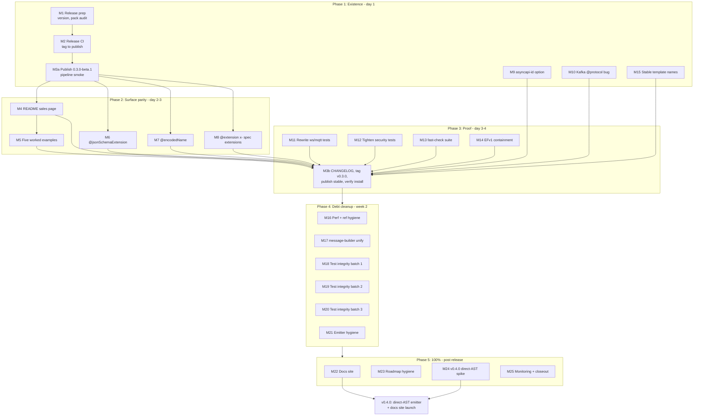

# v0.3.0 Clear-Winner Plan — Beat `tsp-asyncapi`

**Created:** 2026-08-21 09:04
**Goal:** Ship v0.3.0 so that `@lars-artmann/typespec-asyncapi` is _installable, provably deeper, and feature-parity_ on every axis a user can compare against [`tsp-asyncapi`](https://github.com/marvin-hsu/tsp-asyncapi) (npm, v0.2.1, ~426 dl/month, created 2026-08-11).
**Source inputs:** TODO_LIST.md (2026-08-14 review harvest), ROADMAP.md EFv1-containment research (2026-08-21), competitor analysis (this session), docs/reviews/2026-08-14_full-code-review.html.
**Standing rule:** after EVERY task run `pnpm run verify` (build + lint + test + coverage gate + duplication gate). No task is done until the gate is green. Nothing else may be changed in the same commit.

---

## 1. Strategic Frame

| Axis                   | Them (tsp-asyncapi)                                                                                              | Us (today)                                       | v0.3.0 target                                                                                    |
| ---------------------- | ---------------------------------------------------------------------------------------------------------------- | ------------------------------------------------ | ------------------------------------------------------------------------------------------------ |
| Install                | npm, stable                                                                                                      | **unpublished**                                  | npm stable + release CI                                                                          |
| Validation target      | AsyncAPI 3.0 schema                                                                                              | AsyncAPI 3.1 schema (AJV, 270+ compliance tests) | keep lead, advertise                                                                             |
| Protocols              | 13, hand-written decorators                                                                                      | 22, spec-generated binding validation            | keep lead, advertise                                                                             |
| Reusable components    | "will not do"                                                                                                    | 10 decorators, 7 components.\* slots             | keep lead, showcase example                                                                      |
| Multi-file output      | "will not do"                                                                                                    | `split-schemas`                                  | keep lead, showcase example                                                                      |
| `@typespec/versioning` | deferred                                                                                                         | integrated                                       | keep lead                                                                                        |
| DX escape hatches      | `@jsonSchemaExtension`, `@encodedName`, `asyncapi-id`, `@dynamicChannel`, `@replyAddress`, stable template names | **none of these**                                | ship 5 of 6 (all but dynamicChannel/replyAddress: verify coverage first, add only if gap proven) |
| `x-` spec extensions   | planned, not designed                                                                                            | none                                             | **ship first** (gap flip)                                                                        |
| Test story             | "test quality is our focus", 15 property tests                                                                   | 1286 tests but 2 fake-assertion files            | rewrite fakes + 15 fast-check properties                                                         |
| Architecture           | direct AST (no framework)                                                                                        | EFv1 (contained; documented exit plan)           | contain + publish the roadmap; rewrite is v0.4.0                                                 |
| Docs                   | VitePress site, bilingual                                                                                        | none                                             | README + 5 examples at release; site post-release                                                |

**Win condition:** every feature-based reason to choose them is gone; every rigor-based reason to choose us is provable from the npm page.

---

## 2. Pareto Breakdown

### The 1% that delivers 51% — EXIST ON NPM

Publishing converts 9 months of work (1286 tests, 3.1 compliance, 22 protocols, 7 reusable-component slots) into an installable, comparable product. Today we lose by default to anyone published. One afternoon. Tasks: M1, M2, M3.

### The 4% that delivers 64% — PUBLIC PROOF + TOP DX GAPS

The npm page IS the product page. A comparison-table README + 5 worked examples makes the superiority legible; `@jsonSchemaExtension`, `@encodedName`, `asyncapi-id`, `@extension("x-")` remove every "but it can't express X" objection. Tasks: M4-M9.

### The 20% that delivers 80% — CREDIBILITY + CORRECTNESS

They made test quality their headline. We cannot claim rigor while `protocol-websocket-mqtt.test.ts` (1515 lines, 50 tests, every assertion `=== "3.1.0"`) and the security-test clones exist. Fix the Kafka emission bug (contradicts our protocol pitch), add fast-check, contain EFv1, lock template names. Tasks: M10-M20.

### The other 80% to reach 100% — POLISH, DOCS SITE, NEXT HORIZON

Remaining emitter hygiene (M21), docs site (M22), roadmap hygiene (M23), v0.4.0 direct-AST spike (M24), monitoring (M25). Post-release; feeds 0.3.1/0.4.0.

---

## 3. Execution Graph

**Sequencing logic:** publish a beta immediately (reserves the name, proves the pipeline, forces packaging truth), land everything customer-visible, then tag stable 0.3.0 only when Phases 1-3 are green. Hygiene and site follow; they feed 0.3.1, not 0.3.0.

---

## 4. Comprehensive Plan — Medium Tasks (30-100 min each)

Sorted by importance / customer-value / impact. Effort in minutes. Tier: P1 = the 1%, P2 = the 4%, P3 = the 20%, P4 = the rest.

| #   | Task                                                                                                                                                  | Tier | Impact | Effort | Value rationale                                                          |
| --- | ----------------------------------------------------------------------------------------------------------------------------------------------------- | ---- | ------ | ------ | ------------------------------------------------------------------------ |
| M1  | Release prep: version 0.3.0-beta.1, package.json audit, `pnpm pack` tarball audit                                                                     | P1   | 10     | 45     | Unblocks installability; packaging bugs found now are cheap              |
| M2  | Release CI: tag-triggered npm publish workflow, SHA-pinned, verify-gated                                                                              | P1   | 10     | 45     | Releases become routine; pipeline is the product's front door            |
| M3a | Publish 0.3.0-beta.1 + fresh-install compile smoke                                                                                                    | P1   | 10     | 30     | The 51% moment: we become comparable                                     |
| M4  | README rewrite as sales page: quick start, competitor comparison table, feature matrix                                                                | P2   | 9      | 90     | npm page = landing page; comparison table does the selling               |
| M5  | Worked examples: 5 examples (streetlights MQTT, Kafka+security, WS chat, reusable components, split-schemas) with emitted output + CI check           | P2   | 9      | 100    | Their best marketing is 14 examples; 5 sharp ones beat it                |
| M6  | `@jsonSchemaExtension(key, value)` decorator, full vertical slice                                                                                     | P2   | 8      | 100    | Kills the entire "can't express keyword X" objection class               |
| M7  | `@encodedName` (stdlib) wire-format renaming in schema emitter                                                                                        | P2   | 7      | 60     | Their feature; expected by OpenAPI migrants                              |
| M8  | `@extension("x-...", value)` spec extensions on AsyncAPI objects                                                                                      | P2   | 8      | 90     | Neither emitter has it; shipping first flips a gap into a differentiator |
| M9  | `asyncapi-id` emitter option to top-level `id`                                                                                                        | P2   | 5      | 30     | Trivial parity item, 1 hour                                              |
| M10 | Fix Kafka `@protocol` fields stored but never emitted (partitions/replicationFactor/consumerGroup)                                                    | P3   | 8      | 45     | Output bug contradicting our headline claim                              |
| M11 | Rewrite `test/domain/protocol-websocket-mqtt.test.ts`: fixture table, real binding assertions                                                         | P3   | 8      | 100    | Biggest credibility hole; they attack on test quality                    |
| M12 | Tighten security-\* tests: assert `in`/`name`/`scheme`/flows, delete bearer clones                                                                    | P3   | 7      | 60     | Same credibility theme, smaller surface                                  |
| M13 | fast-check property suite (~7 properties incl. AJV-always-passes, $ref integrity, determinism)                                                        | P3   | 7      | 100    | Neutralizes their only testing advantage                                 |
| M14 | EFv1 containment: `generateSchemas()` sole seam + CI import guard                                                                                     | P3   | 6      | 30     | Makes v0.4.0 rewrite cheap; answers architecture objection               |
| M15 | Stable template-instantiation names: verify golden, lock or implement `PageString` naming + collision diagnostic                                      | P3   | 6      | 45     | Parity item; also pre-work for direct-AST rewrite                        |
| M16 | Perf + ref hygiene: O(n²) operation lookup, collapse 7 ref constructors, generalize pickOpt, kill `as never`                                          | P3   | 5      | 60     | TODO_LIST top correctness/quality items                                  |
| M17 | Unify `registerMessage` vs `mergeExplicitMessages` construction paths                                                                                 | P3   | 5      | 60     | Split-brain elimination in message building                              |
| M18 | Test integrity batch 1: delete schema-types dup, fix multi-protocol empty block, studio asserts, edgecase masks, fake CLI test                        | P3   | 5      | 60     | Five TODO_LIST items, one theme                                          |
| M19 | Test integrity batch 2: promote resolveRef/collectRefs (+`~1`/`~0` fix), dedupe compileAndGetDoc, real AJV at asyncapi-generation:679                 | P3   | 5      | 60     | Removes latent false passes                                              |
| M20 | Test integrity batch 3: round-trip beforeAll, compile-once examples, yaml ESM, LATEST_BINDING_VERSIONS imports, e-commerce protocol inspection        | P3   | 4      | 60     | Suite speed + honesty                                                    |
| M21 | Emitter hygiene batch: SCHEME_TYPE dual export, orphan comment, dead fallbacks, type-guards comment, tag-dedup docs, multi-namespace conflict warning | P4   | 4      | 90     | Remaining TODO_LIST emitter items                                        |
| M22 | Docs site v1 (stack decision: VitePress vs Astro/Starlight per website-launch pattern), deploy, port README content                                   | P4   | 6      | 100    | Match their distribution polish post-release                             |
| M23 | Roadmap hygiene: `SecurityScheme.description`, util extraction, docs-entropy CI guard, docs-health VERIFY pass                                        | P4   | 3      | 60     | Keeps living docs honest                                                 |
| M24 | v0.4.0 spike: direct-AST walker prototype + golden-corpus parity harness + go/no-go memo                                                              | P4   | 7      | 100    | De-risks the headline v0.4.0 feature before committing                   |
| M25 | Monitoring + closeout: openapi3 EFv2-migration watch procedure, benchmark dead option removal, TODO_LIST sync                                         | P4   | 2      | 30     | Makes the deferral active, not passive                                   |

**Totals:** 25 tasks, ~1,690 min (~28h focused). Phases 1-3 (v0.3.0 release): ~1,285 min. Phases 4-5: ~405 min + spike.

---

## 5. Fine-Grained Breakdown — max 12 min per task

Standing rules: run `pnpm run verify` after each medium task (not each fine task); one medium task = one commit; never widen scope inside a task.

### Phase 1 — Existence (day 1)

| #     | Task                                                                                                                                                               | Min | Depends on |
| ----- | ------------------------------------------------------------------------------------------------------------------------------------------------------------------ | --- | ---------- |
| F1.1  | Audit package.json: name/exports/`tspMain`/files/keywords/repository/funding fields                                                                                | 12  | -          |
| F1.2  | Bump version to 0.3.0-beta.1                                                                                                                                       | 6   | F1.1       |
| F1.3  | `pnpm pack` dry-run; audit tarball: only dist, lib, README, LICENSE, CHANGELOG inside                                                                              | 12  | F1.2       |
| F1.4  | Install packed tarball into temp TypeSpec project; compile a smoke spec                                                                                            | 12  | F1.3       |
| F1.5  | npm provenance/2FA dry-run: check `npm whoami`, publish `--dry-run` output                                                                                         | 6   | F1.4       |
| F2.1  | Create `.github/workflows/release.yml`: on tag `v*`, build, verify, publish (actions SHA-pinned)                                                                   | 12  | -          |
| F2.2  | Document NPM_TOKEN secret setup in workflow comments                                                                                                               | 6   | F2.1       |
| F2.3  | Gate publish on `pnpm run verify` job                                                                                                                              | 12  | F2.1       |
| F2.4  | Dry-run the workflow on a throwaway tag (workflow_dispatch or `-dryrun` suffix tag)                                                                                | 12  | F2.3       |
| F2.5  | Add CI/release badge + "Releasing" section to README dev notes                                                                                                     | 6   | F2.4       |
| F3.1  | Tag `v0.3.0-beta.1`, push tag, watch CI publish                                                                                                                    | 12  | M2 done    |
| F3.2  | Fresh `pnpm add @lars-artmann/typespec-asyncapi` in temp project; compile + emit smoke                                                                             | 12  | F3.1       |
| F3.3  | Record beta-publish notes (provenance present, files correct) in CHANGELOG unreleased section                                                                      | 6   | F3.2       |
| F9.1  | Add `asyncapi-id` to EmitterOptions model (lib/main.tsp) + TS options interface                                                                                    | 6   | -          |
| F9.2  | Set `document.id` in document-builder with explicit precedence (option wins)                                                                                       | 6   | F9.1       |
| F9.3  | Tests: set / unset / precedence vs other info fields                                                                                                               | 12  | F9.2       |
| F9.4  | README options table + AGENTS.md note                                                                                                                              | 6   | F9.3       |
| F10.1 | Reproduce: `@protocol(#{protocol: "kafka", partitions: 3, ...})` on channel; inspect output                                                                        | 12  | -          |
| F10.2 | Map fields per AsyncAPI 3.1 Kafka binding spec: `partitions`/`replicas`/`topicConfiguration` are CHANNEL binding fields, `groupId`/`clientId` are OPERATION fields | 12  | F10.1      |
| F10.3 | Emit in `buildProtocolBinding` (shared-utils.ts) with correct placement; delete unemittable leftovers                                                              | 6   | F10.2      |
| F10.4 | Tests: full Kafka field set across placements, validate vs AJV                                                                                                     | 12  | F10.3      |
| F10.5 | Close TODO_LIST item, CHANGELOG entry                                                                                                                              | 6   | F10.4      |
| F15.1 | Golden probe: `Page<string>`, `Page<int32>`, nested generics, two instantiations; record current names                                                             | 12  | -          |
| F15.2 | If names unstable/collision-prone: implement argument-derived naming (`PageString`) + collision diagnostic                                                         | 12  | F15.1      |
| F15.3 | Lock names in golden files; add regression test                                                                                                                    | 12  | F15.2      |
| F15.4 | Document naming rule in README schema-conversion section                                                                                                           | 6   | F15.3      |

### Phase 2 — Surface parity (day 2-3)

| #    | Task                                                                                                                            | Min | Depends on |
| ---- | ------------------------------------------------------------------------------------------------------------------------------- | --- | ---------- |
| F4.1 | Hero section: what/why/for-whom + 10-line quick start                                                                           | 12  | -          |
| F4.2 | Competitor comparison table (axes from section 1)                                                                               | 12  | F4.1       |
| F4.3 | Feature matrix: all 28+ decorators grouped by purpose                                                                           | 12  | F4.1       |
| F4.4 | Installation section: scoped package name, tspconfig.yaml snippet                                                               | 12  | F4.1       |
| F4.5 | Rigor callouts: AsyncAPI 3.1 AJV, 1286 tests, ~97% coverage, zero clones, 22 protocols                                          | 12  | F4.1       |
| F4.6 | Architecture honesty section: EFv1 containment + v0.4.0 direct-AST roadmap (answers their FUD with the researched facts)        | 12  | F4.1       |
| F4.7 | Prune stale sections, wire example links, dprint fmt                                                                            | 12  | F4.2-F4.6  |
| F4.8 | GitHub render + link check                                                                                                      | 6   | F4.7       |
| F5.1 | Example 1: Streetlights MQTT (canonical) .tsp + emitted JSON                                                                    | 12  | -          |
| F5.2 | Example 2: Kafka orders with bindings + scramSha512 security                                                                    | 12  | -          |
| F5.3 | Example 3: WebSocket chat with headers + correlationId                                                                          | 12  | -          |
| F5.4 | Example 4: reusable components (traits, parameters, bindings) — moat showcase                                                   | 12  | -          |
| F5.5 | Example 5: split-schemas multi-file output — moat showcase                                                                      | 12  | -          |
| F5.6 | examples/README.md index: what each example shows                                                                               | 12  | F5.1-F5.5  |
| F5.7 | CI job: every example compiles with 0 diagnostics + validates vs AsyncAPI 3.1 schema                                            | 12  | F5.6       |
| F5.8 | Link examples from main README quick start                                                                                      | 6   | F5.7       |
| F6.1 | Declare `@jsonSchemaExtension(key, value)` in lib/main.tsp; targets Model/ModelProperty/Union/Enum/Scalar                       | 12  | -          |
| F6.2 | Implement decorator + state writer + DiagnosticContext wiring                                                                   | 12  | F6.1       |
| F6.3 | Apply in constraint-mapper to inline schemas (before `$ref` skip decision)                                                      | 12  | F6.2       |
| F6.4 | Define `$ref`-sibling policy: extensions apply as siblings (mirror metadata policy); test AJV acceptance                        | 12  | F6.3       |
| F6.5 | Unit tests: all 5 targets, repeatable application (multiple keys)                                                               | 12  | F6.3       |
| F6.6 | Compliance test: output with extensions still passes AsyncAPI 3.1 AJV                                                           | 12  | F6.5       |
| F6.7 | Negative test: invalid key (empty, non-identifier-safe) diagnostic                                                              | 12  | F6.5       |
| F6.8 | README decorator table + AGENTS.md entry                                                                                        | 6   | F6.6       |
| F7.1 | Verify `@encodedName` API surface on compiler 1.13 (`getEncodedName(program, prop, "application/json")`)                        | 12  | -          |
| F7.2 | Apply wire name in `modelProperty` + `required` arrays in schema-emitter                                                        | 12  | F7.1       |
| F7.3 | Cover headers/message payload key renaming through message-builder                                                              | 12  | F7.2       |
| F7.4 | Golden-file diff; regenerate only if change is intended                                                                         | 6   | F7.3       |
| F7.5 | Tests: properties, required, nested models                                                                                      | 12  | F7.4       |
| F7.6 | README + AGENTS.md entry                                                                                                        | 6   | F7.5       |
| F8.1 | Design decision: mirror `@typespec/openapi` `@extension(name, value)` syntax; targets Namespace/Operation/Model/Interface-level | 12  | -          |
| F8.2 | Declare in lib/main.tsp + implement + state map                                                                                 | 12  | F8.1       |
| F8.3 | Apply in builders: server, channel, operation, message objects                                                                  | 12  | F8.2       |
| F8.4 | Guard: key must start `x-`, else diagnostic `invalid-extension-key`                                                             | 12  | F8.3       |
| F8.5 | Tests per target object incl. repeated application                                                                              | 12  | F8.4       |
| F8.6 | AJV pass-through check (x- keys ignored by schema)                                                                              | 6   | F8.5       |
| F8.7 | Docs + flip comparison-table row to "we ship it first"                                                                          | 12  | F8.6       |

### Phase 3 — Proof (day 3-4)

| #     | Task                                                                                         | Min | Depends on       |
| ----- | -------------------------------------------------------------------------------------------- | --- | ---------------- |
| F11.1 | Design fixture table: protocol x config x expected binding keys/values                       | 12  | -                |
| F11.2 | Assert `websocket -> ws` normalization per placement (server/channel/message)                | 12  | F11.1            |
| F11.3 | Assert `bindingVersion` auto-injection exact values                                          | 12  | F11.1            |
| F11.4 | Assert MQTT `qos`/`cleanSession`/`retained`/`keepAlive` fields                               | 12  | F11.1            |
| F11.5 | Assert server vs channel vs operation placement matrix                                       | 12  | F11.1            |
| F11.6 | Delete 1515-line file; keep ~50 real tests                                                   | 12  | F11.2-F11.5      |
| F11.7 | Full suite + coverage + duplication gate                                                     | 12  | F11.6            |
| F12.1 | apiKey: assert `in`/`name`                                                                   | 12  | -                |
| F12.2 | http/httpApiKey: assert `scheme`/`bearerFormat`                                              | 12  | -                |
| F12.3 | oauth2: assert `availableScopes` map + each flow object shape                                | 12  | -                |
| F12.4 | openIdConnect/scramSha\*/X509/plain: assert their distinguishing fields                      | 12  | -                |
| F12.5 | Delete AWS SigV4/MAC/Hawk bearer-clone fixtures                                              | 6   | F12.1-F12.4      |
| F12.6 | Full suite run                                                                               | 6   | F12.5            |
| F13.1 | Add fast-check devDep + property scaffold with seed pinning                                  | 12  | -                |
| F13.2 | P1: random model graphs always validate vs AsyncAPI 3.1 AJV                                  | 12  | F13.1            |
| F13.3 | P2: random constraint combos never contradict (min<=max, minLen<=maxLen, minItems<=maxItems) | 12  | F13.1            |
| F13.4 | P3: every emitted `$ref` resolves within the document (`~1`/`~0`-aware)                      | 12  | F13.1            |
| F13.5 | P4: enum/union/literal mapping always yields `type` or `const`/`enum`                        | 12  | F13.1            |
| F13.6 | P5: split-schemas rewriting preserves full ref graph                                         | 12  | F13.4            |
| F13.7 | P6: determinism — same input twice, byte-identical output                                    | 12  | F13.1            |
| F13.8 | CI integration + failure-seed reporting convention                                           | 12  | F13.2-F13.7      |
| F14.1 | Inventory asset-emitter imports; confirm only schema-gen files import it                     | 12  | -                |
| F14.2 | CI/lint guard: import ban outside `schema-*` files (eslint no-restricted-imports)            | 12  | F14.1            |
| F14.3 | ROADMAP check-off + AGENTS.md seam note                                                      | 6   | F14.2            |
| F3.4  | CHANGELOG 0.3.0 final; version bump stable; tag `v0.3.0`; push; watch CI                     | 12  | Phases 1-3 green |
| F3.5  | Post-publish verification: npm page renders, fresh install, compile, emit                    | 12  | F3.4             |
| F3.6  | Announce-ready summary: diff link, comparison table link, install command                    | 6   | F3.5             |

### Phase 4 — Debt cleanup (week 2, feeds 0.3.1)

| #     | Task                                                                                    | Min | Depends on  |
| ----- | --------------------------------------------------------------------------------------- | --- | ----------- |
| F16.1 | Precompute Set/Map for operation-type lookup in operation-builder.ts:37                 | 12  | -           |
| F16.2 | Collapse 7 `ref*` constructors in shared-utils.ts into one parameterized helper         | 12  | -           |
| F16.3 | Generalize `pickOpt<T, K>` to single generic helper                                     | 12  | -           |
| F16.4 | Replace `as never` casts in resolveOpName/returnModelTypes with honest types            | 12  | -           |
| F16.5 | Benchmark re-run + full verify                                                          | 12  | F16.1-F16.4 |
| F17.1 | Map both message construction paths; diff outputs on corpus                             | 12  | -           |
| F17.2 | Unify to single constructMessage path; mergeExplicitMessages becomes caller             | 12  | F17.1       |
| F17.3 | Tests green without modification                                                        | 12  | F17.2       |
| F17.4 | Duplication gate re-run                                                                 | 12  | F17.3       |
| F17.5 | Delete dead code                                                                        | 12  | F17.4       |
| F18.1 | Diff + delete `test/compliance/schema-types.test.ts` (dup of type-mapping-completeness) | 12  | -           |
| F18.2 | multi-protocol-comprehensive: real binding assertions; remove empty `if` block          | 12  | -           |
| F18.3 | studio-compatibility: assert bindings + reply actually emitted                          | 12  | -           |
| F18.4 | error-handling-edgecases: investigate the `<=1 error` masks; tighten to 0               | 12  | -           |
| F18.5 | cli-simple-emitter: delete fake CLI wrapper or convert to real CLI test                 | 12  | -           |
| F19.1 | Promote resolveRef/collectRefs to `test/utils/ref-utils.ts` with `~1`/`~0` unescaping   | 12  | -           |
| F19.2 | Replace 5 divergent copies; fix latent false-pass in generator-compatibility copy       | 12  | F19.1       |
| F19.3 | Dedupe compileAndGetDoc helpers onto compileAndValidateOrThrow                          | 12  | -           |
| F19.4 | schema-validation.test.ts: delegate to utils/schema-validator or delete                 | 12  | -           |
| F19.5 | asyncapi-generation.test.ts:679: replace 2-field stub with real AJV                     | 12  | -           |
| F20.1 | round-trip-verification: convert module-level `doc` to `beforeAll`                      | 12  | -           |
| F20.2 | all-examples-validation: compile once per fixture; delete real-world-examples.test.ts   | 12  | -           |
| F20.3 | Replace 7 `require("yaml")` with ESM imports in e2e/                                    | 12  | -           |
| F20.4 | Import LATEST_BINDING_VERSIONES across ~20 hardcoded sites                              | 12  | -           |
| F20.5 | realworld-ecommerce:336: inspect `servers[*].protocol` instead of substring search      | 12  | -           |
| F21.1 | Unify SCHEME_TYPE_LIST vs VALID_SCHEME_TYPES to one export                              | 12  | -           |
| F21.2 | Delete orphan comment above SECURITY_SCHEME_TYPES                                       | 6   | -           |
| F21.3 | Remove unreachable fallbacks in storeServerConfig                                       | 12  | -           |
| F21.4 | Fix ParsedAsyncAPIDocument comment/type contradiction in type-guards                    | 12  | -           |
| F21.5 | Document tag-dedup last-wins semantics in tag-builder                                   | 12  | -           |
| F21.6 | Warn on conflicting multi-namespace defaultContentType/apiVersion                       | 12  | -           |
| F21.7 | Full verify + TODO_LIST close-out                                                       | 12  | F21.1-F21.6 |

### Phase 5 — 100%: docs site + next horizon (post release)

| #     | Task                                                                                                             | Min | Depends on   |
| ----- | ---------------------------------------------------------------------------------------------------------------- | --- | ------------ |
| F22.1 | Stack decision: VitePress (competitor parity, speed) vs Astro/Starlight+Firebase (Lars pattern); decide + record | 12  | M3 stable    |
| F22.2 | Scaffold site + deploy pipeline (GitHub Pages or Firebase)                                                       | 12  | F22.1        |
| F22.3 | Pages: quick start, options, diagnostics reference                                                               | 12  | F22.2        |
| F22.4 | Port README comparison + FAQ content                                                                             | 12  | F22.2        |
| F22.5 | Examples gallery pages (one per example)                                                                         | 12  | F22.2        |
| F22.6 | Search + dark mode + logo                                                                                        | 12  | F22.3        |
| F22.7 | Landing-page demo hook (video placeholder; produce via hyperframes later)                                        | 12  | F22.5        |
| F22.8 | Custom domain wiring + DNS                                                                                       | 12  | F22.7        |
| F23.1 | Add `SecurityScheme.description` to document model                                                               | 12  | -            |
| F23.2 | Move applyOverrides/collectNamesInto to src/util/                                                                | 12  | -            |
| F23.3 | Docs-entropy CI guard: FEATURES test counts vs `vitest run` output                                               | 12  | -            |
| F23.4 | docs-health VERIFY pass across FEATURES/TODO_LIST/ROADMAP/CHANGELOG                                              | 12  | F23.3        |
| F23.5 | `./shared` vs `./asyncapi` subpath split evaluation memo                                                         | 12  | -            |
| F24.1 | Spike: direct recursive type-to-JsonSchema walker (branch, throwaway quality)                                    | 12  | M14          |
| F24.2 | Parity harness: walker vs current output across golden corpus + realworld fixtures                               | 12  | F24.1        |
| F24.3 | Gap list: template naming, circular refs, declaration dedup                                                      | 12  | F24.2        |
| F24.4 | Extension points review: what `src/shared/` consumers need                                                       | 12  | F24.2        |
| F24.5 | Go/no-go memo with effort estimate for v0.4.0 scope decision                                                     | 12  | F24.3, F24.4 |
| F25.1 | Add openapi3-watch procedure (exact package.json URL + quarterly cadence) to ROADMAP                             | 12  | -            |
| F25.2 | Remove dead `modelsPerChannel` benchmark option                                                                  | 12  | -            |
| F25.3 | Final TODO_LIST/CHANGELOG sync; mark plan executed                                                               | 12  | all          |

---

## 6. Explicit Non-Goals (do NOT verschlimmbessern)

- **No EFv2 adoption.** Wrong tool for data documents; openapi3 hasn't migrated; researched and closed (ROADMAP.md).
- **No direct-AST rewrite inside v0.3.0.** It is v0.4.0 headline work, gated by the M24 spike memo.
- **No `@dynamicChannel`/`@replyAddress` yet.** Our `{param}` addresses + `@parameter` + reply support likely cover the need; write 2 verification tests first (folded into F5.1-F5.3 example coverage), add decorators only if a real gap is proven.
- **No per-protocol typed decorators** (`@kafkaServer` etc.). Our generic `@bindings` + spec-generated validation is the stronger design; the comparison table must sell it that way, not copy theirs.
- **No test-count inflation.** F11/F12 intentionally delete fake tests. The number may go DOWN before it goes up. That is correct.
- **No renames, no restructuring, no new linters/formatters** beyond what tasks state.

## 7. Verification Protocol

1. Every medium task: `pnpm run verify` green before commit (build, eslint+oxlint, 1286+ tests, coverage gate 75%/file, jscpd 0 clones).
2. Release-blocking tasks (M1-M3, M6-M9, M10-M15): additionally compile every `examples/*.tsp` and validate output against the official AsyncAPI 3.1 JSON Schema via the existing `compileAndValidateOrThrow` harness.
3. The stable v0.3.0 tag ships only when Phase 1-3 columns above are all checked and the fresh-install smoke (F3.5) passes on a clean machine.
