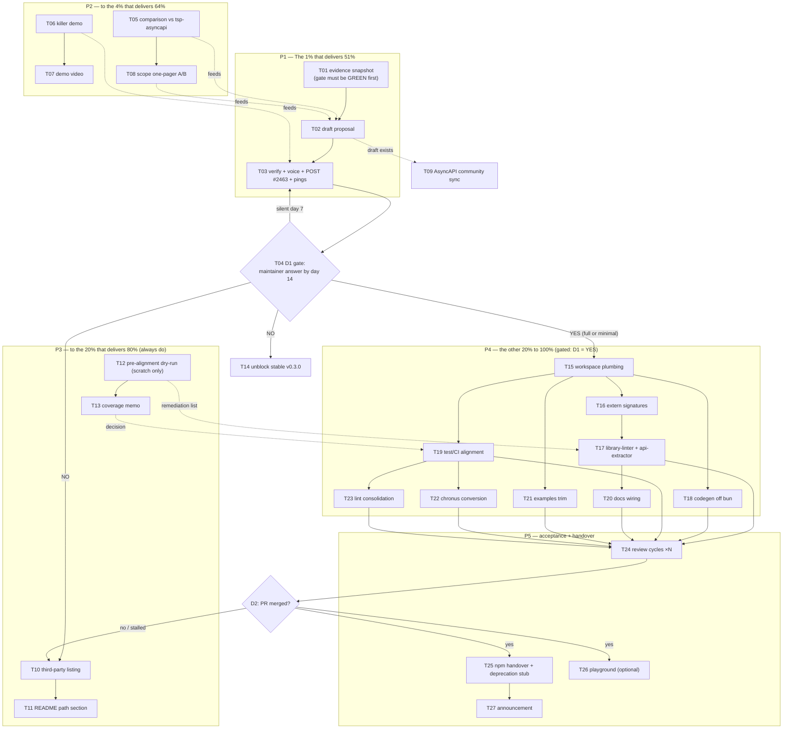

# SUPERB Plan: Upstream Adoption Path — `typespec-asyncapi` → `microsoft/typespec`

**Created:** 2026-09-13 13:48 (Sunday)
**Trigger:** Follow-up to the feasibility analysis `docs/analysis/upstream-merge-into-microsoft-typespec.md` (written 2026-09-13, all claims live-verified against `microsoft/typespec`).
**Goal:** Maximize the chance that this emitter becomes the canonical TypeSpec ↔ AsyncAPI solution — ideally first-party `@typespec/asyncapi`, fallback: officially recognized third-party — while spending near-zero migration effort before a maintainer signal.
**Inputs:** Issue [#2463](https://github.com/microsoft/typespec/issues/2463) (open since 2023-09-21, 33 comments, no first-party commitment, zero AsyncAPI PRs), `TODO_LIST.md` (release blockers), `ROADMAP.md` (current state), the analysis report.

**Success criteria (any one is a win):**
1. **D1 = YES(full/minimal):** Microsoft agrees to take the emitter first-party; migration executes to a merged PR.
2. **D1 = NO:** Within 14 days we know the answer, we are listed as the official third-party AsyncAPI emitter on typespec.io, and stable v0.3.0 ships unblocked.
3. Either way: our evidence (comparison, demo, tests) makes `@lars-artmann/typespec-asyncapi` the default community choice over `tsp-asyncapi` on merit.

---

## Ground rules (anti-VERSCHLIMMBESSER guardrails)

1. **Zero changes to `src/`** until D1 = yes. The only pre-D1 code activity is T12 on a scratch branch that is never merged.
2. **Nothing goes public unverified.** Every externally-posted claim passes the `verify-before-filing` skill gate; every GitHub text passes `github-voice`.
3. **The comparison is factual and respectful.** Every `tsp-asyncapi` claim verified against their npm/docs live; no disparagement, no marketing superlatives.
4. **`TODO_LIST.md` stays the living source.** This plan is a point-in-time snapshot; new tasks were added to TODO_LIST, future changes go there, this file is never rewritten.
5. **No force push, no history rewrite, no fighting the auto-git daemon.** Concurrent sessions' changes are read and judged, never clobbered (already relevant today: the 13:43 lint incident).
6. **Stable v0.3.0 stays blocked** while the upstream answer is pending (ties into TODO_LIST release item); T14 is the only task allowed to unblock it.

### Incident log (baseline)

- **2026-09-13 13:43:** `pnpm run verify` found RED — oxlint 11 errors (`no-conditional-expect`) + 5 warnings (`capitalized-comments`) in `test/property/emitter-properties.test.ts`, introduced by an auto-commit earlier today. Being fixed by a concurrent session (restructure to unconditional `toStrictEqual`/implication asserts, same semantics). **T01 must not start until the gate is green again.**
- Baseline numbers to re-verify at T01 (per ROADMAP 2026-08-21, possibly stale): 1259 tests / 102 files, 98.1% avg coverage, 0 lint findings, 0 duplication.

---

## Step 1: Pareto breakdown

### The 1% that delivers 51% — the decision-forcing question

A single, well-verified proposal comment on #2463 that makes it trivial for maintainers to say yes/no/minimal. Everything else (a full migration is 8–15 days) is worthless until this answer exists. **~3 h of work resolves the uncertainty gating 100% of the migration effort.**

### The 4% that delivers 64% — make "yes" the easy answer

The proposal + an evidence package a maintainer can check in 5 minutes: verified side-by-side vs `tsp-asyncapi`, one killer demo spec with annotated output, an explicit scope offer (A: everything / B: minimal 3.1 core), a maintenance commitment, and warm intro pings (bterlson, mikekistler, timotheeguerin; mario-guerra/fmvilas on the AsyncAPI side). **~7 h total.**

### The 20% that delivers 80% — de-risked fallback + cheap pre-alignment

All of the above PLUS: typespec.io third-party listing (the "no" outcome still wins), README path-to-first-party positioning, a scratch-branch dry-run of the monorepo build chain (know our true migration delta before promising numbers), coverage-strategy decision, and the stable-release interplay decision. **~5 h more.**

### The other 20% to reach 100% — gated execution

Only after D1 = yes: the migration itself (workspace plumbing, build chain swap, library-linter remediation, binding codegen off bun, test/CI alignment, docs wiring, examples trim, release conversion, lint consolidation) and post-acceptance handover (review cycles, npm deprecation stub, optional playground, announcement). **~14 h active + review-cycle variance (2–5 days).**

**Total active effort: ~29 h** (≈ 1,350 min of planned tasks below), spread over weeks of wall clock dominated by waiting on D1.

---

## Step 2: Comprehensive plan — medium tasks (30–100 min each)

Sorted by tier (P1 = do first), then impact desc, then effort asc. "Impact" = effect on the goal; "Value" = customer/community value.

| ID | Task | Tier | Impact | Effort | Value | Depends |
|----|------|------|--------|--------|-------|---------|
| T01 | Baseline evidence snapshot: green verify gate, test/coverage counts, pinned versions for citation | P1 | High | 36m | Proposal credibility | gate green (incident fix) |
| T02 | Draft #2463 decision-forcing proposal (evidence, differentiators, scope A/B, maintenance commitment, direct question) | P1 | **Critical** | 96m | Unblocks everything | T01 |
| T03 | Fact-check every claim (`verify-before-filing`) + `github-voice` pass + post + ping 5 people | P1 | **Critical** | 30m | Starts D1 clock | T02, T05, T08 |
| T04 | 14-day response watch + triage + day-7 follow-up + day-14 D1 verdict | P1 | High | 36m | Decision discipline | T03 |
| T05 | Verified feature comparison vs `tsp-asyncapi` (live install, same specs compiled in both, AJV both outputs) | P2 | High | 96m | Differentiation proof | — |
| T06 | Killer demo spec (kafka bindings + polymorphism + versioning + split-schemas) with annotated output + Studio render | P2 | High | 90m | 5-min maintainer check | — |
| T07 | 3–5 min demo video of the demo spec → 3.1 doc → Studio | P2 | Medium | 72m | Persuasion multiplier | T06 |
| T08 | Scope-negotiation one-pager: offer A (full 22 protocols) vs B (minimal 3.1 core), cut-list with cost/value per item | P2 | High | 60m | Makes yes easy | T05 |
| T09 | AsyncAPI community sync: mario-guerra / fmvilas (status, offer, endorsement ask) | P2 | Medium | 24m | Insider champion | T02 draft exists |
| T10 | typespec.io third-party emitters listing: find venue, verify criteria, PR/issue, track | P3 | Medium | 60m | The "no" fallback win | — |
| T11 | README "Path to first-party" section + comparison table + proposal link | P3 | Medium | 48m | Adopter confidence | T05 |
| T12 | Pre-alignment dry-run on scratch branch: `gen-extern-signature` over 30 decorators, `library-linter`, `api-extractor` deltas → remediation memo | P3 | Medium | 84m | True migration cost | — |
| T13 | Coverage-strategy memo: monorepo CI has no bun — vitest-v8 reality check on dist-loading tests, gate options | P3 | Medium | 30m | Honest migration plan | — |
| T14 | Stable v0.3.0 release interplay: map D1 outcomes → release path; unblock if "no" | P3 | Medium | 30m | Users get stable npm | T04 |
| T15 | Monorepo workspace plumbing: fork, `packages/asyncapi`, rename `@typespec/asyncapi`, catalog deps, node>=22, build green | P4 | High | 84m | Migration starts | D1=yes |
| T16 | Build chain 1: `gen-extern-signature` for 30 decorators, `tsconfig.build.json`, tsc clean | P4 | High | 60m | House build | T15 |
| T17 | Build chain 2: `library-linter` clean, `api-extractor` config + clean run | P4 | High | 96m | House build | T16 |
| T18 | Port binding-spec codegen off bun (node-runnable, byte-identical `generated-bindings.ts`, goldens green) | P4 | High | 48m | No bun in monorepo | T15 |
| T19 | Test/CI alignment: vitest config converge, junit, node 22, fast-check/ajv catalog, apply T13 decision | P4 | High | 72m | CI green in fork | T15, T13 |
| T20 | Docs/website wiring: house README, `regen-docs` target, website sidebar | P4 | Medium | 48m | First-class docs | T17 |
| T21 | Examples trim: 2–3 canonical examples under monorepo conventions | P4 | Low | 48m | Review scope small | T15 |
| T22 | Release conversion: chronus change file, delete husky/postversion, seed CHANGELOG | P4 | Medium | 30m | House releases | T19 |
| T23 | Lint consolidation: adopt house oxlint config; ESLint-strict layer retired from package | P4 | Low | 30m | House lint | T19 |
| T24 | Maintainer review cycles: triage, fix batch, respond point-by-point (repeatable block, budget 2–5 d) | P5 | High | 96m×N | The merge itself | T15–T23 |
| T25 | npm handover: `@typespec/asyncapi` first release coordination, deprecation stub on `@lars-artmann/*`, repo pointer | P5 | Medium | 30m | No dangling users | D2=merged |
| T26 | Playground integration (optional wow): register emitter in monorepo playground | P5 | Low | 48m | Live demo on typespec.io | D2=merged |
| T27 | Outcome announcement: #2463 close-out, README/community post | P5 | Medium | 24m | Adoption push | T24 outcome |

**27 tasks, ~1,350 min (~29 h) active effort** excluding waits and review variance.

---

## Step 3: Detailed breakdown — fine tasks (max 12 min each)

Sorted identically (tier, then impact, then effort). Parent IDs group them.

| ID | Subtask | Parent | Effort |
|----|---------|--------|--------|
| T01.1 | Re-run `pnpm run verify`, capture pass/fail + test + coverage numbers | T01 | 12m |
| T01.2 | Count tests/decorators/protocols via `rg` for exact citations | T01 | 6m |
| T01.3 | Pin versions (`npm view` both packages, `@typespec/compiler` current) | T01 | 6m |
| T01.4 | Write evidence block into proposal notes file | T01 | 12m |
| T02.1 | Outline proposal: problem, evidence, differentiators, scope A/B, maintenance, ask | T02 | 12m |
| T02.2 | Write "why first-party" rationale section | T02 | 12m |
| T02.3 | Write differentiators section with evidence links only | T02 | 12m |
| T02.4 | Write scope offer A (full) vs B (minimal core) section | T02 | 12m |
| T02.5 | Write maintenance commitment + CLA readiness | T02 | 12m |
| T02.6 | Write the direct question + proposed decision timeline | T02 | 12m |
| T02.7 | Self-review pass 1: cut fluff, ≤400-word body | T02 | 12m |
| T02.8 | Cold-read pass 2 as a Microsoft maintainer: would I say yes? | T02 | 12m |
| T03.1 | `verify-before-filing` checklist: every claim has a source link | T03 | 12m |
| T03.2 | `github-voice` final formatting pass | T03 | 12m |
| T03.3 | Post comment, ping bterlson/mikekistler/timotheeguerin + mario-guerra/fmvilas | T03 | 6m |
| T04.1 | Set issue watch + daily 10-min triage slot, days 1–7 | T04 | 12m |
| T04.2 | Log each response, classify: yes / yes-minimal / counter / no | T04 | 12m |
| T04.3 | Day 7: gentle follow-up if silent | T04 | 6m |
| T04.4 | Day 14: declare D1 outcome, route plan (P4 or P3-fallback) | T04 | 6m |
| T05.1 | Scratch dir: install `tsp-asyncapi`, record install/compile friction | T05 | 12m |
| T05.2 | Compile identical spec in both emitters | T05 | 12m |
| T05.3 | Diff outputs: schema fidelity, AsyncAPI version target, bindings | T05 | 12m |
| T05.4 | Exercise reusable components/traits in both | T05 | 12m |
| T05.5 | Exercise versioning + multi-file output in both | T05 | 12m |
| T05.6 | AJV-validate both outputs against AsyncAPI 3.1 schema | T05 | 12m |
| T05.7 | Write comparison table; verify their docs claims live | T05 | 12m |
| T05.8 | Neutral-tone review: factual only, no disparagement | T05 | 12m |
| T06.1 | Pick showcase features (kafka + polymorphism + versioning + split) | T06 | 6m |
| T06.2 | Write demo.tsp | T06 | 12m |
| T06.3 | Compile + AJV-validate output | T06 | 12m |
| T06.4 | Annotate output: spec line → doc fragment mapping | T06 | 12m |
| T06.5 | Add to `examples/`, `check-examples` green | T06 | 12m |
| T06.6 | Render in AsyncAPI Studio, capture screenshot | T06 | 12m |
| T06.7 | Package demo as linked repo section | T06 | 12m |
| T07.1 | Storyboard 3–5 min beats | T07 | 12m |
| T07.2 | Record: spec → compile → output | T07 | 12m |
| T07.3 | Record: Studio render segment | T07 | 12m |
| T07.4 | Captions/voiceover | T07 | 12m |
| T07.5 | Edit + export | T07 | 12m |
| T07.6 | Upload unlisted, link in proposal | T07 | 12m |
| T08.1 | List cut candidates (bindings subset, protocols, split-schemas, …) | T08 | 12m |
| T08.2 | Per candidate: migration cost saved vs value lost | T08 | 12m |
| T08.3 | Define minimal-core boundary (3.1 core only) | T08 | 12m |
| T08.4 | Write one-pager as proposal appendix | T08 | 12m |
| T08.5 | Sanity-check against repo AGENTS constraints | T08 | 12m |
| T09.1 | Find current contacts/channels for mario-guerra / fmvilas | T09 | 6m |
| T09.2 | Draft sync message (status, offer, endorsement ask) | T09 | 12m |
| T09.3 | Send | T09 | 6m |
| T10.1 | Locate typespec.io third-party emitters page + source | T10 | 12m |
| T10.2 | Verify listing criteria (maintenance, license, npm) | T10 | 12m |
| T10.3 | Prepare our listing entry | T10 | 12m |
| T10.4 | Open docs PR/issue | T10 | 12m |
| T10.5 | Track to merge | T10 | 12m |
| T11.1 | Draft section: status, path, proposal link | T11 | 12m |
| T11.2 | Insert T05 comparison table | T11 | 12m |
| T11.3 | Add quickstart pointer | T11 | 12m |
| T11.4 | Review README flow, commit | T11 | 12m |
| T12.1 | Shallow-clone microsoft/typespec, read json-schema build files | T12 | 12m |
| T12.2 | Scratch branch: run `tspd gen-extern-signature` on our lib | T12 | 12m |
| T12.3 | Run `library-linter`, capture violations | T12 | 12m |
| T12.4 | Run api-extractor dry, capture API surface deltas | T12 | 12m |
| T12.5 | Estimate remediation effort per finding | T12 | 12m |
| T12.6 | Write findings memo into analysis doc | T12 | 12m |
| T12.7 | Delete scratch branch, merge nothing | T12 | 12m |
| T13.1 | Test vitest coverage-v8 on dist-loading tests locally | T13 | 12m |
| T13.2 | Document options: gate drop vs test restructure | T13 | 12m |
| T13.3 | Decide + record in migration checklist | T13 | 6m |
| T14.1 | Map D1 outcomes → release path (yes/minimal/no) | T14 | 12m |
| T14.2 | If "no": unblock stable v0.3.0 per TODO_LIST item | T14 | 12m |
| T14.3 | Record decision | T14 | 6m |
| T15.1 | Fork microsoft/typespec, create branch | T15 | 12m |
| T15.2 | Skeleton `packages/asyncapi` from json-schema template | T15 | 12m |
| T15.3 | Copy `src/` + `lib/` + `test/` | T15 | 12m |
| T15.4 | package.json: name/author/exports/engines>=22 | T15 | 12m |
| T15.5 | Move deps to `catalog:` entries | T15 | 12m |
| T15.6 | Register in pnpm-workspace + root tsconfig refs | T15 | 12m |
| T15.7 | `pnpm install && build` green | T15 | 12m |
| T16.1 | Add `gen-extern-signature` script | T16 | 12m |
| T16.2 | Generate `generated-defs` for 30 decorators | T16 | 12m |
| T16.3 | Fix decorator signature mismatches (batch 1) | T16 | 12m |
| T16.4 | Fix decorator signature mismatches (batch 2) | T16 | 12m |
| T16.5 | `tsconfig.build.json` from house template | T16 | 12m |
| T17.1 | Run library-linter, list violations | T17 | 12m |
| T17.2 | Fix lib/main.tsp naming violations (batch 1) | T17 | 12m |
| T17.3 | Fix lib/main.tsp naming violations (batch 2) | T17 | 12m |
| T17.4 | Fix lib/main.tsp naming violations (batch 3) | T17 | 12m |
| T17.5 | api-extractor.json + first run | T17 | 12m |
| T17.6 | Resolve API surface warnings | T17 | 12m |
| T17.7 | `--warn-as-error` library-linter pass | T17 | 12m |
| T18.1 | Port `generate-binding-specs.ts` to node-runnable | T18 | 12m |
| T18.2 | Byte-diff `generated-bindings.ts` old vs new | T18 | 12m |
| T18.3 | Golden tests green | T18 | 12m |
| T18.4 | Wire into monorepo build chain | T18 | 12m |
| T19.1 | Converge vitest config + junit reporter | T19 | 12m |
| T19.2 | fast-check/ajv/@asyncapi deps into catalog | T19 | 12m |
| T19.3 | Full suite on node 22 | T19 | 12m |
| T19.4 | Apply T13 coverage decision | T19 | 12m |
| T19.5 | CI green in fork | T19 | 12m |
| T19.6 | Flaky hunt + fix | T19 | 12m |
| T20.1 | README to house style | T20 | 12m |
| T20.2 | `regen-docs` script + `tspd doc` run | T20 | 12m |
| T20.3 | Website sidebar entry | T20 | 12m |
| T20.4 | Docs render verification | T20 | 12m |
| T21.1 | Pick 2–3 canonical examples | T21 | 12m |
| T21.2 | Port under monorepo conventions | T21 | 12m |
| T21.3 | Examples compile + validate green | T21 | 12m |
| T21.4 | Drop the rest from PR scope | T21 | 12m |
| T22.1 | Read chronus config, `pnpm change add` | T22 | 12m |
| T22.2 | Delete husky/postversion scripts from package | T22 | 12m |
| T22.3 | Seed CHANGELOG.md/json | T22 | 6m |
| T23.1 | Adopt house oxlint config | T23 | 12m |
| T23.2 | Retire ESLint-strict layer from package | T23 | 12m |
| T23.3 | Lint green | T23 | 6m |
| T24.1 | Triage review comments, classify each | T24 | 12m |
| T24.2 | Fix code-review batch N (repeat per round) | T24 | 12m |
| T24.3 | Respond point-by-point | T24 | 12m |
| T24.4 | Re-run package tests + lint | T24 | 12m |
| T25.1 | Coordinate npm name + first-release timing with maintainers | T25 | 12m |
| T25.2 | Deprecate `@lars-artmann/typespec-asyncapi` with pointer | T25 | 6m |
| T25.3 | Repo README banner pointing upstream | T25 | 6m |
| T25.4 | Archive-or-keep policy decision | T25 | 6m |
| T26.1 | Read playground package integration points | T26 | 12m |
| T26.2 | Register emitter + lib in playground config | T26 | 12m |
| T26.3 | Sample spec renders output in playground | T26 | 12m |
| T26.4 | Include in PR or defer with rationale | T26 | 12m |
| T27.1 | Draft outcome comment | T27 | 12m |
| T27.2 | Post + update all referencing docs/README | T27 | 12m |

**135 fine tasks**, every one ≤ 12 min.

---

## Execution graph

---

## Verification checklist (per phase)

- **P1:** proposal posted with ≤400-word body, every claim has a source link, 5 pings sent, watch active. Gate D1 defined: yes-full / yes-minimal / no / silence→day-14-default-no.
- **P2:** comparison table has zero unverified cells; demo output AJV-valid; video renders; one-pager states B-boundary precisely.
- **P3:** listing PR open; README section live; dry-run memo states exact violation count + remediation hours; coverage decision recorded.
- **P4 (if gated open):** fork CI green on node 22; library-linter `--warn-as-error` clean; api-extractor clean; `generated-bindings.ts` byte-identical; full test suite passes.
- **P5 (if reached):** `@typespec/asyncapi` on npm; old package deprecated with pointer; #2463 closed with outcome.

## What we are deliberately NOT doing

- No `src/` refactors "to look good for Microsoft" before D1 (VERSCHLIMMBESSER bait).
- No npm package rename or early deprecation hints before D2.
- No engagement in tool-war rhetoric with `tsp-asyncapi`; the comparison table is the only artifact, and it is factual.
- No TODO_LIST items marked done from this plan without docs-health VERITY checks.
