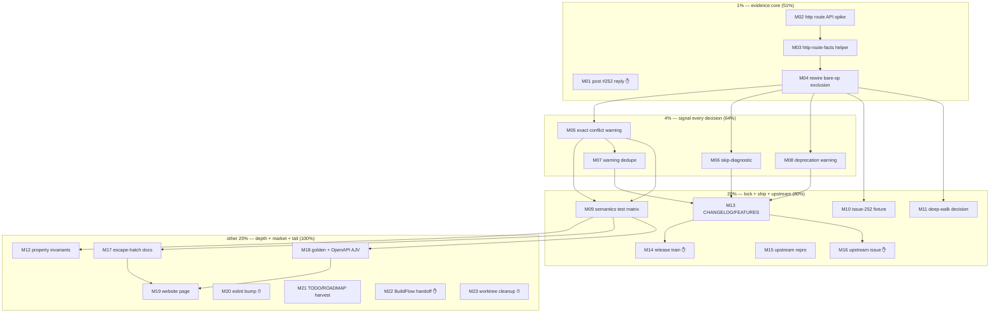

# SUPERB Plan — Mixed-Emitter Ownership: Evidence over Heuristics

> **EXECUTION STATUS (annotated 2026-10-03 ~14:00 UTC — plan text below is
> untouched):** M02–M13, M15+M16-prep, M17+F21, M18, M19, M21 DONE and
> gate-green (cache-cold buildflow full exit 0; verify 1275 tests; 0 clones;
> website builds 17 pages). Corrections made en route: diagnostic total is
> **36 codes (20 error + 16 warning)** — the pre-session count had also
> missed `protocol-model-fields-unplaced`. Still open: M01/M14/M16-post/M22
> (✋ Lars), M20 (⏰ after 20:08 UTC), M23 (⏰ after BuildFlow baseline).
> Full account: `docs/status/2026-10-03_13-27_mixed-emitter-ownership-execution.md`;
> harvested remaining work: `TODO_LIST.md` (Mixed-Emitter Ownership Track +
> Hygiene) and `ROADMAP.md` (Current State refresh, 2.0 strictness,
> upstream watch).

**Date:** 2026-10-03 11:53 CEST
**Source:** "How can we be smarter?" session (post-#252-fix), tiers defined in
conversation 2026-10-03; carried TODOs from `docs/status/2026-10-03_06-31_issue-252-mixed-emitter-support.md` §f
and `docs/status/2026-10-03_11-20_self-review-full-gate-recovery.md` §f.
**Scope:** everything needed to make mixed `@typespec/http` + AsyncAPI
ownership exact, well-signaled, locked, released, documented — plus the
release/train tail. Format: `.md` + mermaid per Lars's explicit demand
(override of the pareto-planning skill's HTML default — flagged, not propagated).

**Problem being solved:** operation ownership in mixed programs is currently
inferred from namespace geometry (`@service` containment). Three consequences:
(1) excluded bare ops vanish silently, (2) the conflict warning is heuristic,
(3) inference itself is the ambiguity. Fix: classify by `@typespec/http`'s
actual route table (evidence), signal every decision (diagnostics), deprecate
the guessing (path to 2.0), lock with tests/properties, ship + document.

**Verschlimmbessern guard:** route-facts classification REPLACES heuristics
only where the route table is readable; the current triple-gate stays as
fallback. No behavior change without a locking test. No speculative API
additions. Existing golden files must stay byte-identical unless a CHANGELOG
entry explains the delta.

---

## 1. Pareto Breakdown

### The 1% that delivers 51%

1. **Post the #252 reply** (draft is voice-checked and waiting) — the
   customer has been waiting since the issue was filed; zero engineering.
2. **Read http's route table and classify by it** (M02–M04): one mechanism
   turns both warnings into facts and closes the silent-drop hole. Everything
   else in this plan tests, documents, or ships THIS change.

### The 4% that delivers 64% (the 1% plus)

3. **Signal every ownership decision** (M05–M08): skip-diagnostic for
   excluded bare ops, exact conflict warning, warning dedupe per
   (service, namespace), deprecation warning for bare-op inference in mixed
   mode. Small deltas, complete UX.

### The 20% that delivers 80% (the 4% plus)

4. **Lock the semantics** (M09–M11): carried test matrix (suppression,
   @channel-only, nested @service, escape order, no-server residual,
   emit-ran assertions), the reporter's spec as realworld fixture,
   deep-namespace walk decision.
5. **Ship it** (M13–M14): CHANGELOG + FEATURES rows; version call
   (recommendation: **1.1.0** — new diagnostics + behavior refinement, not a
   patch), pre-tag frozen-lockfile ritual, tag, release watch.
6. **Upstream the root cause** (M15–M16): empirical repro of http's
   verb-less-GET fallback, prior-art search, issue to microsoft/typespec.

### The other 20% to reach 100%

7. **Depth & breadth locks**: property-based ownership invariants (M12),
   golden locks for the mixed example + OpenAPI-side AJV validation (M18).
8. **Feature-ify the escape hatch**: AsyncAPI-over-HTTP documented as a
   supported pattern, not a code secret (M17).
9. **Market it**: website "Mixing with OpenAPI" page + README FAQ (M19).
10. **Train tail**: eslint 10.12.0 bump after 20:08Z soak (M20),
    TODO_LIST/ROADMAP harvest (M21), BuildFlow findings handoff (M22, gated),
    worktree cleanup + main reinstall (M23, ⏰ after baseline WIP lands).

---

## 2. Comprehensive Plan (30–100 min granularity — ALL TODOs)

Sorted by importance → impact → effort → customer-value. `Gate` = blocked on
Lars; `⏰` = time-gated; durations are honest (some <30 min kept for
completeness per "include ALL TODOS").

| #   | Task                                                                                                                      | Tier | Impact    | Effort | Customer value                       | Gate                   | Depends on |
| --- | ------------------------------------------------------------------------------------------------------------------------- | ---- | --------- | ------ | ------------------------------------ | ---------------------- | ---------- |
| M01 | Post #252 reply (draft voice-checked; optionally refresh wording after M04/M05 land)                                      | 1%   | High      | 10m    | Unblocks waiting reporter            | ✋ Lars                | —          |
| M02 | Spike: @typespec/http route API (exports, HttpState, getRoutes, version pin) + guard pattern decision                     | 1%   | High      | 60m    | Foundation for everything            | —                      | —          |
| M03 | Implement `http-route-facts.ts` (guarded accessor, no hard dep) + unit tests                                              | 1%   | High      | 90m    | Exact ownership facts                | —                      | M02        |
| M04 | Rewire `discoverBareOps` exclusion to route facts (triple-gate as fallback) + tests                                       | 1%   | High      | 60m    | Silent-drop becomes correct+signaled | —                      | M03        |
| M05 | Upgrade conflict warning to exact routed-evidence + message cites route + regression test                                 | 4%   | High      | 60m    | Trustworthy warning                  | —                      | M03        |
| M06 | Skip-diagnostic `bare-op-assumed-rest` (lib.ts code + emit site + test)                                                   | 4%   | High      | 45m    | No silent vanish                     | —                      | M04        |
| M07 | Warning dedupe per (service, namespace) + "and N more" + tests                                                            | 4%   | Med       | 45m    | No warning spam                      | —                      | M05        |
| M08 | Deprecation warning: bare-op inference in mixed programs (removal 2.0) + README/AGENTS note                               | 4%   | Med       | 45m    | Explicit > implicit path             | —                      | M04        |
| M09 | Carried semantics tests: #suppress, @channel-only, nested @service, escape order, no-server residual, emit-ran assertions | 20%  | High      | 90m    | Semantics locked                     | —                      | M05        |
| M10 | `test/realworld/issue-252.tsp` fixture + both-docs/no-leak test                                                           | 20%  | Med       | 30m    | Regression on the real spec          | —                      | M04        |
| M11 | Deep-namespace bare-op walk: decide recursive vs documented limit + implement + test                                      | 20%  | Med       | 45m    | No discovery surprise                | —                      | M04        |
| M12 | Property-based ownership invariants (3 invariants, seed-pinned)                                                           | 80%  | Med       | 100m   | Adversarial confidence               | —                      | M09        |
| M13 | CHANGELOG + FEATURES.md rows for all new diagnostics/behavior                                                             | 20%  | High      | 30m    | Release notes honest                 | —                      | M06–M08    |
| M14 | Release train: version call (rec. 1.1.0) → ritual (lockfile-only → frozen → verify cache-cold) → tag → watch release.yml  | 20%  | Very high | 90m    | Ships the fix                        | ✋ Lars (version call) | M13        |
| M15 | Upstream prep: fresh-repo empirical repro of verb-less-GET fallback + prior-art issue search                              | 20%  | High      | 60m    | Root-cause evidence                  | —                      | —          |
| M16 | Draft + post microsoft/typespec issue (github-voice, verify-before-filing)                                                | 20%  | High      | 60m    | Ecosystem-wide fix                   | ✋ Lars (posting)      | M15        |
| M17 | AsyncAPI-over-HTTP escape hatch as feature: lib docs, README FAQ, locking test                                            | 80%  | Med       | 60m    | Documented webhook story             | —                      | M09        |
| M18 | Golden lock for mixed example outputs + AJV-validate OpenAPI doc in check-examples                                        | 80%  | Med       | 60m    | Both contracts locked                | —                      | M04        |
| M19 | Website "Mixing with OpenAPI" page + README link + nav entry                                                              | 80%  | High      | 100m   | The competitor's only lead           | —                      | M17        |
| M20 | eslint 10.12.0 bump + relock + frozen/lint proofs                                                                         | 80%  | Low       | 20m    | Latest, policy-clean                 | ⏰ after 20:08Z        | —          |
| M21 | Harvest TODO_LIST/ROADMAP from this plan + 11-20 report §f                                                                | 80%  | Med       | 60m    | No entombed tasks                    | —                      | —          |
| M22 | BuildFlow upstream findings handoff (4 findings → issue queue or owner session)                                           | 80%  | Med       | 45m    | Fleet fixes land                     | ✋ Lars (Q1)           | —          |
| M23 | Worktree cleanup + buildflow reinstall from main URL                                                                      | 80%  | Low       | 15m    | Clean end state                      | ⏰ baseline WIP lands  | —          |

---

## 3. Detailed Breakdown (≤12 min granularity — ALL TODOs)

Fine tasks reference their medium parent. Sorted by execution order within
importance order (same order as §2).

| #   | Parent | Task (each ≤12 min)                                                                 | Est | Gate |
| --- | ------ | ----------------------------------------------------------------------------------- | --- | ---- |
| F01 | M01    | Post the #252 reply via `gh issue comment 252` (draft in /tmp/issue-252-reply.md)   | 3m  | ✋   |
| F02 | M02    | Read @typespec/http exports in node_modules for route/state access surface          | 10m | —    |
| F03 | M02    | Scratch probe spec; dump HttpState/routes for verb-less/@get/@route ops             | 12m | —    |
| F04 | M02    | Record API facts + guard pattern (no hard dep) into AGENTS notes                    | 8m  | —    |
| F05 | M03    | Create `src/builders/http-route-facts.ts` skeleton + types                          | 10m | —    |
| F06 | M03    | Implement `routedOperations(program)` guarded accessor                              | 12m | —    |
| F07 | M03    | Unit test: http not loaded → accessor returns undefined                             | 10m | —    |
| F08 | M03    | Unit test: routed set correct for verb-less/@get/@route/mixed specs                 | 12m | —    |
| F09 | M04    | Switch `discoverBareOps` guard to route facts; keep triple-gate fallback            | 12m | —    |
| F10 | M04    | Tests: bare routed op excluded; bare unrouted op still emitted                      | 12m | —    |
| F11 | M04    | Run mixed test suite + `pnpm run verify` gate                                       | 10m | —    |
| F12 | M05    | Conflict check = "http routed AND decorated" (exact)                                | 12m | —    |
| F13 | M05    | Warning message cites the concrete route (e.g. `GET /api/v1`)                       | 10m | —    |
| F14 | M05    | Regression: reporter's spec warns exactly once per namespace                        | 12m | —    |
| F15 | M06    | Add `bare-op-assumed-rest` diagnostic code + docs in `src/lib.ts`                   | 8m  | —    |
| F16 | M06    | Emit at the exclusion site in `discoverBareOps`                                     | 10m | —    |
| F17 | M06    | Test: excluded bare op under @service yields the skip-diagnostic                    | 10m | —    |
| F18 | M07    | Group conflict candidates by (service, namespace)                                   | 10m | —    |
| F19 | M07    | "…and N more" suffix + dedupe tests                                                 | 10m | —    |
| F20 | M08    | Deprecation warning when bare-op inference runs with http loaded                    | 12m | —    |
| F21 | M08    | README + AGENTS deprecation note (removal target 2.0)                               | 10m | —    |
| F22 | M09    | Test: `#suppress` silences `event-op-in-service-namespace`                          | 12m | —    |
| F23 | M09    | Test: @channel-only op (1b path) gets the warning                                   | 12m | —    |
| F24 | M09    | Test: nested @service namespaces — innermost wins                                   | 12m | —    |
| F25 | M09    | Test: nearest-ancestor server escape order (wss root + http inner)                  | 12m | —    |
| F26 | M09    | Test: service with NO AsyncAPI server still warns (residual FP, documented)         | 12m | —    |
| F27 | M09    | Convention: negative tests assert emit ran (asyncapiDoc non-null)                   | 12m | —    |
| F28 | M10    | Copy reporter's spec verbatim → `test/realworld/issue-252.tsp`                      | 8m  | —    |
| F29 | M10    | Fixture test: both docs produced, no cross-leakage                                  | 12m | —    |
| F30 | M11    | Decide + implement recursive namespace walk for bare ops                            | 12m | —    |
| F31 | M11    | Test: bare op in grandchild namespace discovered (or documented limit)              | 10m | —    |
| F32 | M12    | fast-check generator for random mixed specs                                         | 12m | —    |
| F33 | M12    | Invariant 1: no op in both docs unless AsyncAPI-over-http server                    | 12m | —    |
| F34 | M12    | Invariant 2: every decorated op appears in AsyncAPI doc                             | 10m | —    |
| F35 | M12    | Invariant 3: bare op under @service excluded iff http loaded + decorated ops exist  | 10m | —    |
| F36 | M12    | FC_SEED pin + suite wiring + full run                                               | 8m  | —    |
| F37 | M13    | CHANGELOG Added/Changed entries (all new diagnostics + behavior)                    | 10m | —    |
| F38 | M13    | FEATURES.md: diagnostics count, mixed-emitter rows refresh                          | 10m | —    |
| F39 | M14    | Version decision note (recommendation 1.1.0 + rationale)                            | 5m  | ✋   |
| F40 | M14    | `pnpm version <ver>` bump                                                           | 5m  | ✋   |
| F41 | M14    | Pre-tag: `pnpm install --lockfile-only`                                             | 5m  | ✋   |
| F42 | M14    | Pre-tag: `pnpm install --frozen-lockfile` proof                                     | 5m  | ✋   |
| F43 | M14    | Pre-tag: full verify gate, cache-cold audit                                         | 12m | ✋   |
| F44 | M14    | Annotated tag `v<ver>` + push tag                                                   | 5m  | ✋   |
| F45 | M14    | Watch release.yml green + npm publish provenance check                              | 12m | ✋   |
| F46 | M15    | Fresh minimal repo: verb-less op under @service → confirm GET fallback              | 12m | —    |
| F47 | M15    | Variants: @route+verb, explicit verb, no @service — document matrix                 | 10m | —    |
| F48 | M15    | Search microsoft/typespec issues for prior art                                      | 10m | —    |
| F49 | M16    | Draft upstream issue (github-voice; every claim linked to F46–F48 evidence)         | 12m | —    |
| F50 | M16    | Post upstream issue                                                                 | 3m  | ✋   |
| F51 | M17    | Escape-hatch semantics in `lib/main.tsp` doc comments                               | 10m | —    |
| F52 | M17    | README FAQ: "AsyncAPI over HTTP" section                                            | 12m | —    |
| F53 | M17    | Locking test: http-protocol server exempts from warning                             | 12m | —    |
| F54 | M18    | Golden files for `examples/mixed-rest-events` (both documents)                      | 12m | —    |
| F55 | M18    | check-examples: AJV-validate the OpenAPI output too                                 | 12m | —    |
| F56 | M19    | Website page content: split pattern + example walkthrough                           | 12m | —    |
| F57 | M19    | Nav entry + README link + site build check                                          | 12m | —    |
| F58 | M20    | After 20:08Z: `pnpm -w update eslint@10.12.0`                                       | 8m  | ⏰   |
| F59 | M20    | Relock + frozen-lockfile + lint proof                                               | 10m | ⏰   |
| F60 | M21    | Harvest TODO_LIST.md from this plan + 11-20 §f                                      | 12m | —    |
| F61 | M21    | ROADMAP.md additions (2.0 strictness, upstream watch)                               | 10m | —    |
| F62 | M22    | Write up 4 BuildFlow findings (pnpm-update ×2, cache green-over-red, profile no-op) | 12m | ✋   |
| F63 | M23    | After baseline lands: reinstall from main URL, remove worktree, verify version      | 12m | ⏰   |
| F64 | —      | Full gates (buildflow cache-cold + verify + flake check) + AGENTS annotate plan     | 12m | —    |

---

## 4. Execution Graph

✋ = gated on Lars · ⏰ = time-gated · unmarked = executable autonomously.

---

## 5. Sequencing & Guards

1. **Reply timing:** post M01 immediately (current draft is accurate for
   shipped behavior); M05's "cites the route" polish does not change the
   reply's claims. Alternative: hold the reply until M04/M06 land and cite the
   skip-diagnostic — acceptable, but the reporter has waited long enough.
2. **Release cut:** M14 after M13; include M04–M08 (behavior + diagnostics)
   but do NOT block the release on M12/M18/M19 (locks and docs can follow).
3. **Semver:** all changes are warnings/bugfix refinements within the frozen
   1.x surface; goldens for pure specs must stay byte-identical (F11/F43
   verify). Bare-op inference REMOVAL is 2.0-only; M08 only warns.
4. **Verschlimmbessern tripwires:** route-facts accessor may NEVER hard-depend
   on @typespec/http (guarded dynamic access only, fallback = current
   triple-gate); no new config options; no warning without a suppression
   path test (F22).
5. **Gate registry:** ✋ M01 (post reply), M14 (version call — recommendation
   1.1.0), M16/F50 (upstream posting), M22 (BuildFlow queue ownership);
   ⏰ M20 (after 20:08Z today), M23 (after BuildFlow baseline WIP lands).

## 6. Living-doc routing

After execution: M21 harvests this plan + the 11-20 report §f into
`TODO_LIST.md` (actionable) and `ROADMAP.md` (2.0 strictness, upstream watch).
This file is a point-in-time snapshot — ANNOTATE, never rewrite.
