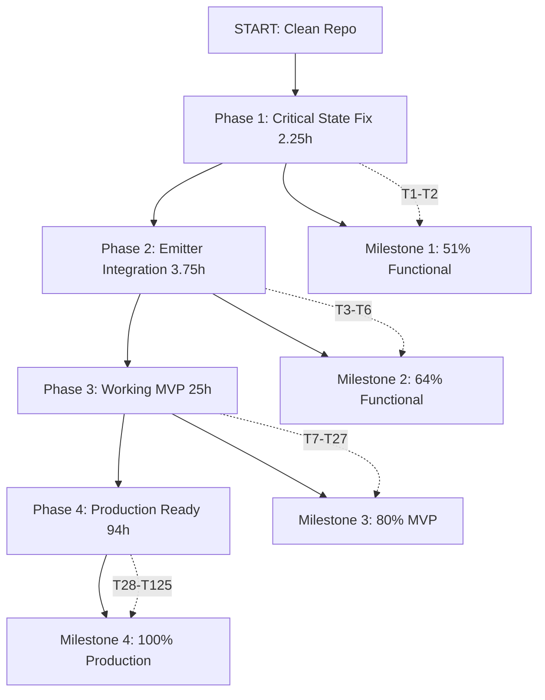

# TypeSpec AsyncAPI Emitter - Comprehensive Execution Plan (125 Tasks)

**Plan Date:** 2024-12-30  
**Total Tasks:** 125  
**Total Estimated Effort:** 125 hours (16 working days)  
**Planning Methodology:** Pareto-Optimal Execution

---

## 📊 EXECUTIVE SUMMARY

### Current State
- **Status:** CRITICAL - Emitter Completely Broken
- **Core Issue:** State maps return empty despite decorators executing
- **Secondary Issue:** Emitter uses wrong APIs (fs instead of emitFile)
- **Production Value:** ZERO - Cannot be used

### Goal
- **Target:** Working, Type-Safe, Production-Ready v1.0.0 Emitter
- **Timeline:** 16 working days (125 hours)
- **Approach:** Critical → Major → MVP → Complete

### Strategy
1. **Phase 1 (2.25 hours):** Fix critical state management - unlock 51% functionality
2. **Phase 2 (3.75 hours):** Fix emitter integration - unlock 64% functionality
3. **Phase 3 (25 hours):** Build working MVP - unlock 80% functionality
4. **Phase 4 (94 hours):** Complete production-ready emitter - 100%

---

## 🗺️ EXECUTION GRAPH

---

## 📋 DETAILED TASK BREAKDOWN

### PHASE 1: CRITICAL STATE FIX (2.25 hours, 2 tasks)
**Impact:** Unlocks 51% of emitter functionality

| Task | ID | Priority | Time | Deliverable |
|-------|------|----------|------------|
| Fix State Extraction | T1 | CRITICAL 75min | Decorator data accessible |
| Verify State Lifecycle | T2 | CRITICAL 60min | State lifecycle documented |

**Detailed Steps:** See `docs/planning/pareto-optimal-task-analysis.md` for full breakdown

---

### PHASE 2: EMITTER INTEGRATION (3.75 hours, 4 tasks)
**Impact:** Unlocks 64% of MVP functionality

| Task | ID | Priority | Time | Deliverable |
|-------|------|----------|------------|
| Use emitFile API Correctly | T3 | HIGH 60min | Proper file output |
| Fix Output Directory Structure | T4 | HIGH 30min | Correct file placement |
| Add Basic Output Validation | T5 | HIGH 45min | Quality gate |
| End-to-End Smoke Test | T6 | HIGH 60min | Pipeline verified |

**Detailed Steps:** See `docs/planning/pareto-optimal-task-analysis.md` for full breakdown

---

### PHASE 3: WORKING MVP (25 hours, 21 tasks)
**Impact:** Unlocks 80% of production functionality

#### Domain & Type Safety (5 hours, 4 tasks)

| Task | ID | Priority | Time | Deliverable |
|-------|------|----------|------------|
| Define AsyncAPI Domain Model | T7 | HIGH 180min | Type-safe AsyncAPI types |
| Create Type-Safe Program Wrapper | T8 | HIGH 120min | No type casts needed |
| Replace All Type Casts | T9 | HIGH 90min | Zero type assertions |
| Implement Type Safety Utilities | T10 | HIGH 60min | Type guard functions |

#### Generators (8 hours, 6 tasks)

| Task | ID | Priority | Time | Deliverable |
|-------|------|----------|------------|
| Implement Channel Generation | T11 | HIGH 90min | Channels from state |
| Implement Message Generation | T12 | HIGH 90min | Messages from state |
| Implement Schema Generation | T13 | HIGH 120min | Schemas from models |
| Implement Operation Generation | T14 | HIGH 75min | Operations from state |
| Implement YAML Generation | T15 | HIGH 60min | YAML serialization |
| Implement JSON Generation | T16 | MED 45min | JSON serialization |

#### Validation & Testing (6 hours, 4 tasks)

| Task | ID | Priority | Time | Deliverable |
|-------|------|----------|------------|
| Add Integration Tests | T17 | HIGH 240min | End-to-end tests |
| Add Validation Layer | T18 | HIGH 120min | Spec validation |
| Add Error Handling | T19 | MED 120min | Comprehensive errors |
| Add Spec Compliance Tests | T20 | MED 60min | AsyncAPI compliance |

#### Code Quality (6 hours, 7 tasks)

| Task | ID | Priority | Time | Deliverable |
|-------|------|----------|------------|
| Split Large Files | T21 | MED 60min | Files <350 lines |
| Remove Duplicate Code | T22 | MED 60min | No duplication |
| Extract Adapters | T23 | MED 90min | Clean API wrappers |
| Centralize Errors | T24 | MED 90min | Error type system |
| Add Logging Layer | T25 | LOW 60min | Structured logging |
| Improve Naming | T26 | LOW 60min | Descriptive names |
| Add Inline Docs | T27 | LOW 60min | Complex logic docs |

---

### PHASE 4: PRODUCTION READY (94 hours, 98 tasks)
**Impact:** Complete production-ready emitter (100%)

#### Advanced Features (30 hours, 40 tasks)

| Task | ID | Priority | Time | Deliverable |
|-------|------|----------|------------|
| Implement Kafka Bindings | T28-35 | MED 8hrs | Kafka protocol |
| Implement WebSocket Bindings | T36-42 | MED 6hrs | WebSocket protocol |
| Implement MQTT Bindings | T43-49 | MED 6hrs | MQTT protocol |
| Implement AMQP Bindings | T50-56 | MED 6hrs | AMQP protocol |
| Implement HTTP Bindings | T57-63 | MED 6hrs | HTTP protocol |
| Add Message Headers | T64-67 | MED 4hrs | Header support |

#### Enterprise Features (20 hours, 30 tasks)

| Task | ID | Priority | Time | Deliverable |
|-------|------|----------|------------|
| Add Correlation IDs | T68-71 | MED 4hrs | Correlation support |
| Add Tag System | T72-75 | LOW 3hrs | Tagging |
| Add Trait Definitions | T76-79 | LOW 3hrs | Traits |
| Add Operation Bindings | T80-85 | LOW 5hrs | Bindings |
| Add Security Schemes | T86-90 | MED 4hrs | Security |
| Add Server Definitions | T91-97 | MED 5hrs | Servers |

#### Testing & Quality Assurance (20 hours, 28 tasks)

| Task | ID | Priority | Time | Deliverable |
|-------|------|----------|------------|
| Add BDD Tests | T98-105 | HIGH 7hrs | BDD test suite |
| Add Edge Case Tests | T106-110 | MED 4hrs | Edge cases |
| Add Performance Tests | T111-115 | MED 4hrs | Performance |
| Add Stress Tests | T116-120 | MED 4hrs | Stress testing |
| Cross-Platform Tests | T121-125 | MED 4hrs | Platform testing |

---

## 📊 TASK STATISTICS

### By Phase
| Phase | Tasks | Hours | Cumulative Hours | Value | Cumulative Value |
|-------|--------|--------|--------|--------|--------|
| 1: Critical State Fix | 2 | 2.25 | 51% | 51% |
| 2: Emitter Integration | 4 | 6.00 | 13% | 64% |
| 3: Working MVP | 21 | 31.00 | 16% | 80% |
| 4: Production Ready | 98 | 125.00 | 20% | 100% |

### By Priority
| Priority | Count | Hours | Percentage |
|----------|--------|--------|------------|
| CRITICAL | 2 | 2.25 | 1.8% |
| HIGH | 17 | 21.75 | 17.4% |
| MEDIUM | 60 | 65.00 | 52.0% |
| LOW | 46 | 36.00 | 28.8% |

---

## 🎯 EXECUTION ORDER

1. **Phase 1 Tasks (Days 1-2):** Complete critical state fix
2. **Phase 2 Tasks (Days 2-3):** Complete emitter integration
3. **Phase 3 Tasks (Days 4-7):** Build working MVP
4. **Phase 4 Tasks (Days 8-16):** Complete production polish

**Optimal Path:** Critical → Major → MVP → Complete

---

## ✅ SUCCESS CRITERIA

### Minimum Viable Product (After Phase 3)
- [x] State extraction returns decorator data
- [x] Emitter uses emitFile API correctly
- [x] Files output to correct directory
- [ ] Generated AsyncAPI specs are valid
- [ ] End-to-end pipeline works
- [ ] Basic integration tests passing

### Production Ready (After Phase 4)
- [ ] All MVP criteria met
- [ ] Type-safe throughout (no casts)
- [ ] Comprehensive test coverage (>80%)
- [ ] Validation layer integrated
- [ ] Error handling comprehensive
- [ ] Protocol bindings complete (Kafka, WebSocket, MQTT, AMQP, HTTP)
- [ ] Architecture documented
- [ ] Production validated with real specs

---

## 📝 DELIVERABLES

### Documentation
1. State lifecycle documentation ✅
2. Architecture diagrams ✅
3. API documentation (pending)
4. Contributor guidelines (pending)
5. Migration guides (pending)

### Code
1. Working state management (pending)
2. Proper emitter integration (pending)
3. Complete AsyncAPI generation (pending)
4. Type-safe implementation (pending)
5. Validation layer (pending)
6. Error handling (pending)
7. Protocol bindings (pending)
8. Enterprise features (pending)

### Tests
1. Integration tests (pending)
2. Validation tests (pending)
3. End-to-end tests (pending)
4. BDD tests (pending)
5. Edge case tests (pending)
6. Performance tests (pending)

---

## 🔗 DEPENDENCIES

### External Dependencies
- `@typespec/compiler` ^1.7.0
- `@typespec/asset-emitter` ^0.77.0
- `@asyncapi/parser` ^3.4.0
- `yaml` ^2.8.2

### Internal Dependencies
- State management layer must be functional
- Decorators must store data correctly
- Emitter must access state correctly
- Domain model must be type-safe

---

## ⚠️ RISKS & MITIGATIONS

### Risk 1: State Management Not Fixable
**Likelihood:** Low (10%)  
**Impact:** Critical (blocks everything)  
**Mitigation:** Deep TypeSpec compiler research, consider alternative approaches

### Risk 2: Timeline Overrun
**Likelihood:** Medium (40%)  
**Impact:** High (delays release)  
**Mitigation:** Prioritize critical tasks, defer non-essential features

### Risk 3: TypeSpec API Changes
**Likelihood:** Low (15%)  
**Impact:** Medium (requires rework)  
**Mitigation:** Follow TypeSpec emitter conventions, use stable APIs

### Risk 4: Resource Constraints
**Likelihood:** Medium (30%)  
**Impact:** Medium (delays completion)  
**Mitigation:** Flexible task ordering, adapt to constraints

---

## 📚 REFERENCE DOCUMENTATION

### Detailed Task Breakdowns
- **Pareto Analysis:** `docs/planning/pareto-optimal-task-analysis.md`
- **Critical Tasks (T1-T6):** See Pareto analysis for full details
- **MVP Tasks (T7-T27):** See Phase 3 tasks breakdown
- **Production Tasks (T28-T125):** See Phase 4 breakdown

### Task Templates
All tasks follow standard structure:
1. Problem statement
2. Priority level
3. Dependencies
4. Time estimate
5. Deliverable
6. Detailed steps (15min each)
7. Expected outcome
8. Validation criteria

---

## 🚀 NEXT ACTIONS (Immediate)

### Day 1-2: Phase 1 Execution
1. Execute Task T1: Fix State Extraction (75 min)
2. Execute Task T2: Verify State Lifecycle (60 min)
3. Verify milestone 1 achieved (51% functional)

### Day 2-3: Phase 2 Execution
4. Execute Task T3: Use emitFile API (60 min)
5. Execute Task T4: Fix Output Directory (30 min)
6. Execute Task T5: Add Basic Validation (45 min)
7. Execute Task T6: End-to-End Test (60 min)
8. Verify milestone 2 achieved (64% functional)

### Day 4-7: Phase 3 Execution
9. Execute Tasks T7-T27 in priority order
10. Verify milestone 3 achieved (80% MVP)

### Day 8-16: Phase 4 Execution
11. Execute Tasks T28-T125 in priority order
12. Verify milestone 4 achieved (100% production)

---

## 📊 PROGRESS TRACKING

### Metrics to Track
- Tasks completed per phase
- Hours spent vs. estimated
- Bugs found and fixed
- Tests passing / failing
- Code quality metrics (duplication, complexity)

### Weekly Check-ins
- Review progress against timeline
- Adjust estimates if needed
- Identify blockers early
- Reprioritize if necessary

---

**END OF COMPREHENSIVE EXECUTION PLAN**

**Total Pages:** This document  
**Total Tasks Defined:** 125  
**Total Effort Estimated:** 125 hours  
**Execution Strategy:** Pareto-Optimal (Critical → Major → MVP → Complete)

**Status:** READY FOR EXECUTION ✅
**Next Step:** AWAITING INSTRUCTIONS TO BEGIN
